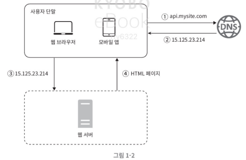

# 1장

issue : master가 원본이고 slave가 사본이면 백업개념인가 ?

# 단일서버

서버가 한 대에서의 실행되는 시스템  

## 단일서버에서의 실행순서

1. 사용자는 도메인 이름(~~~.com 형태)를 이용하여 웹사이트에 접속
2. 접속과정에서 DNS(Domain Name Service) 조회 결과로 IP주소가 반환
3. 해당 IP주소로 HTTP 요청이 전달
4. 요청을 받은뒤 HTML 페이지, JSON(JavaScript Object Notaion) 형태의 응답 반환 

# 데이터베이스 DB

사용자의 증가 → 여러대의 서버가 필요함. 

웹/앱 트래픽 처리 서버(웹 계층)와 데이터베이스 서버(데이터 계층)를 분리해서 독립적으로 확장

## 데이터베이스의 종류

- 관계형 데이터베이스 RDBS : 자료를 열, 칼럼으로 표현 JOIN 지원
- 비관계형 데이터베이스 NoSQL : 키-값 저장소, 그래프 저장소, 칼럼 저장소, 문서 저장소 JOIN 지원 X
    - 아주 낮은 응답 지연시간 요구
    - 다루는 데이터가 비정형이라 관계형 데이터가 아님
    - 데이터(JSON, YAML,XML)를 직렬화, 역직렬화 할 수 있기만 하면 됨
    - 아주 많은 양의 데이터를 저장해야함

## 데이터베이스 확장 방법

- 수직적 확장 Scale Up : 더 좋은 컴퓨터로 바꾸기
    - 무한대로 좋아질 수 없음 → 한게 존재
    - 자동복구, 다중화 방안 제시 X
    - 서버 장애 발생시 웹사이트 앱은 완전히 중단
- 수평적 확장 Scale Out : 컴퓨터를 더 사기
    - 대규모 어플리 케이션에 유리함.

## 로드벨런서

부하 분산 역할 수행 

- 사용자는 로드벨러서의 공개 IP 주소 접속(88.88.88.1) 이 과정에서 웹 서버는 클라이언트의 접속을 직접 처리하지 않음
- 서버간 통신에서는 사설 IP 주소(인터넷으로 접속은 불가함)가 이용된다.

### 로드밸런서가 적용된 환경에서의 예시

1. 서버 1이 다운 되면 → 모든 트래픽을 서버 2로 이동 / 새로운 서버 추가 가능
2. 웹사이트 트래픽 가파르게 증가하면 서버 추가할 시 로드밸러서가 자동적으로 트래픽 분산
- 현재까지 웹 계층의 문제는 어느정도 해결 했으나 DB 서버는 1개이고 자동복구 다중화는 지원하지 않음.

## 데이터베이스 다중화

데이터베이스를 Master-Slave관계로 한다.

- Master : 데이터의 원본 / 쓰기 연산 수행
- Slave : 데이터의 사본 / 읽기 연산만 수행 / 보통 Master보다 많음.

### 다중화의 장점

- 더 나은 성능 : 병렬로 처리될 수 있는 질의(query)가 늘어나므로 성능이 좋아진다.
- 안정성 : 서버중 일부가 파괴되어도 데이터는 보존 / 지역적으로 먼 곳에도 데이터를 다중화 가능
- 가용성 : 여러지역에 데이터를 복제함 → 하나의 서버가 망가져도 다른 서버에 잇는 데이터 가져와 계속 서비스 가능

### 다중화가가 적용된 환경에서의 예시

1. Slave서버 1대 다운시
    - Slave 서버가 1대일 경우 → 읽기 연산은 한시적으로 Master서버로 전달 → 새로운 Slave 서버가 장애서버 대체
    - Slave 서버가 여러대일 경우  → 다른 Slave 서버 들로 읽기 연산 분산 → 새로운 Slave 서버가 장애서버 대체
2. Master서버 다운시
    - Slave 서버가 1대일 경우 → 해당 Slave 서버가 Master 서버가 됨 → 일시적으로 모든 데이터베이스 연산은 Master에서 수행 → 새로운 Slave서버 추가

1. 사용자는 DNS로부터 로드밸런서의 공개 IP 주소를 받습니다.
2. 사용자는 해당 IP 주소를 사용해 로드밸런서에 접속합니다.
3. HTTP 요청은 서버 1이나 서버 2로 전송됩니다.
4. 웹 서버는 사용자의 데이터를 부 데이터베이스 서버에서 읽습니다.
5. 웹 서버는 데이터 변경 연산은 주 데이터베이스로 전달합니다

# 캐시

값비산 연산 결과 또는 자주 참죄되는 데이터를 메모리 안에 두고 뒤 이은 요청이 보다 빠르게 처리할 수 있도록 하는 저장소 / 어플리캐이션 성능은 데이터베이스 호출을 얼마나 자주하나에 따라 좌우되는데 해당 문제 완화 가능 

## 캐시 계층

데이터가 잠시 보관되는 곳으로 DB보다 훨씬 빠름 (Redis)

1. 요청 받은 웹 서버는 캐시에 응답이 있는지 확인
    - 있다면 클라이언트에 즉시 반환
    - 없다면 쿼리를 통해 데이터 찾아 캐시 저장 후 반환

## 캐시 사용시 주의할 점

- 캐시는 갱신은 자주 일어나지 않지만 참조는 빈번하게 일어날 경우
- 영속적으로 보관할 데이터는 적합하지 않음.
- 만료된 데이터는 캐시에서 삭제
- 데이터 저장소의 원본과 캐시 내의 사본 일관성을 확인
- 캐시 서버를 한 대만 두는 경우 해당 서버는 `단일 장애 지점(SPOF)`이 되어 버릴 수 있음.
- 캐시 메모리 크기는 너무 크지도 작지도 않게 적절하게 잡아야 함.
- 캐시가 꽉 차버리면 LRU, LFU, FIFO 같은 정책들을 사용해서 사용해야 함.

# 콘텐츠 전송 네트워크 CDN

정적 콘텐츠를 전송하는데 쓰이는 지리적으로 분산된 서버의 네트워크 

AWS S3 접근할 때 CDN을 활용한 경우 

1. 사용자 A가 이미지 URL을 이용해 `image.png`에 접근
2. CDN 서버의 캐시에 해당 이미지가 없는 경우, 서버는 원본 서버에 요청하여 파일을 가져옴
3. 원본 서버가 파일을 CDN 서버에 반환
4. CDN 서버는 파일을 캐시하고 사용자 A에게 반환
5. 사용자 B가 같은 이미지에 대한 요청을 CDN 서버에 전송
6. 만료되지 않은 이미지에 대한 요청은 캐시를 통해 처리

# 무상태 웹 계층

상태정보를 RDBS, NoSQL같은 지속성 저장소에 보관하고 필요할때만 가져오는 것 

## 상태 정보 의존적인 아키텍쳐

상태 정보를 보관하는 서버는 클라이언트 정보(상태)를 유지하여요청 사이에 공유되도록한다. 

- 사용자 A 인증 위해 HTTP 요청은 반드시 서버 1로 전송되야함. 2로 전송되면 실패
- 같은 클라이언트로 부터 요청은 항상 같은 서버로 전송되어야함.

## 무상태 아키텍쳐

해당 구조에서는 HTTP요청은 어떤 웹 서버로도 전달될 수 있음. 상태정보가 필요할 경우 공유저장소로 데이터를 가져옴 → 상태정보는 웹 서버로 부터 물리적으로 분리된 형태 

## 무상태 웹계층 포함된 아키텍쳐

# 데이터 센터

장애 상황에 대비하기 위해 지리적으로 떨어진 데이터 센터에 서버를 위치시키는 것이 중요 → 장애가 없는 상황에서 사용자의 요청은 가장 가까운 데이터 센터로 향험.(geoDNS-routing, geo-routing)

- geoDNS → 어떤 IP 주소로 변환할지 결정할 수 있도록 해주는 DNS 서비스
    
    
    

데이터센터2(US-West)에 장애가 발생하여 모든 트래픽이 데이터센터1(US-East)로 전송된다.

**다중 데이터 센터 아키텍처를 만들기 위한 조건** 

- 트래픽 우회: 장애 상황에서 정상적인 데이터 센터로 트래픽을 효율적으로 보내야 함.
- 데이터 동기화: 데이터 센터마다 데이터베이스가 있을 시 장애로 인해 데이터 센터1 지역을 사용하지 못한다면, 다른 데이터센터로 트래픽을 우회한다고 하더라도 데이터 센터1에서만 사용자가 원하는 데이터가 존재하기 때문에 데이터가 없을 수 있음.
- 테스트와 배포: 웹 사이트 또는 애플리케이션을 여러 위치에서 테스트할 수 있어야 함. 또한, 자동화된 배포 도구를 이용하여 모든 데이터 센터에 배포할 수 있어야 함

# 메세지 큐

메시지의 무손실을 보장하고 비동기 통신을 지원하는 컴포넌트

- 서버간의 결합을 느슨하게 함 → 규모 확장성이 보장 → 안정적인 어플리케이션 구성 용이
- 아키텍쳐 구성
    1. 생산자, 발행자 : 메시지를 만듬
    2. 메시지 큐 : 생산자가 만든 메시지를 저장하는 곳
    3. 소비자, 고독자 : 메시지 큐로부터 메시지를 전달받아 동작 수행

# 로그, 메트릭 그리고 자동화

작은 서버에서 실해오디는 소규모 웹 사이트를 만들 때는 로그나 메트릭 자동화 같은 것은 것을 하면 좋을 뿐 필요없는 경우가 많다. 

- 로그 : 에러로그 모니텅링 하는 것 중요
- 메트릭 :
    - 호스트 단위 메트릭 : CPU, 메모리, 디스크
    - 종합 메트릭 : 데이터베이스 계층의 성능, 캐시 계층의 성능
    - 핵심 비즈니스 메트릭 : 일별 능동 사용자, 수익, 재방문
- 자동화 :
    - 지속적 통합 CI
    - 개발자가 만드는 코드가 검증 절차를 자동으로 거치도록 할 수 있어 쉽게 문제 감지 가능.

# 데이터베이스의 규모 확장

- 애플리케이션 서버와 같이 Scale Up, Scale Out이 존재한다.
    
    
    
- Scale Up (수직적 확장)
    - 데이터베이스 서버 하드웨어의 한계 → 무한 증설 X
    - SPOF로 인한 위험성이
    - 비용이 많이 든다. 고성능 서버로 갈 수록 가격이 올라감
- Scale Out 샤딩 (수평적 확장)
    
    
    
    - 샤딩은 대규모 데이터 베이스를 샤드라고 부르는 작은 단위로 분할하는 기술
    - 같은 스키마 사용하지만 데이터의 중복은 X
    
    ## 샤딩 키
    
    샤딩 전략 구현시 중요한 역할을 담당하며 키에 따라서 한 곳으로만 부하가 집중될 수 있고 여러 곳으로 적절히 잘 분산되게 함. 
    
    - 고려사항
        - 데이터의 재 샤딩
            - 데이터가 너무 많아져서 하나의 샤드로는 더 이상 감당하기 어려울 때
            - 샤드 간 데이터 분포가 균등하지 못하여 어떤 샤드에 할당된 공간 소모가 다른 샤드에 비해 빨리 진행될 때
        - 유명 인사 (스팟 키 문제)
            - 특정 샤드에 쿼리가 집중되어 서버에 과부하가 걸리는 문제
        - 조인과 비정규화
            - 일단 하나의 데이터베이스를 여러 샤드 서버로 쪼개고 나면, 여러 샤드에 걸친 데이터를 조인하기가 힘들어진다. 이를 해결하는 한 가지 방법은 데이터베이스를 비정규화하여 하나의 테이블에서 쿼리가 수행될 수 있도록 하는 것

