# 사용자 수에 따른 규모 확장성

## 목차

1. [단일 서버](#단일-서버)
   - [Case 1. 데이터베이스를 포함한 단일 서버](#case-1-데이터베이스를-포함한-단일-서버)
2. [데이터베이스 서버](#데이터베이스-서버)
   - [Case 2. 데이터베이스 서버 도입](#case-2-데이터베이스-서버-도입)
3. [Case 3. 서버 확장](#case-3-서버-확장)
4. [Case 4. 응답시간 개선의 필요성](#case-4-응답시간-개선의-필요성)
5. [Case 5. 무상태(Stateless) 웹 계층의 필요성](#case-5-무상태stateless-웹-계층의-필요성)
6. [Case 6. 데이터 센터](#case-6-데이터-센터)
7. [Case 7. 메시지 큐](#case-7-메시지-큐)
8. [Case 8. 로그, 메트릭, 자동화 - 운영 복잡성 문제](#case-8-로그-메트릭-자동화---운영-복잡성-문제)
9. [Case 9. 데이터베이스의 규모 확장](#case-9-데이터베이스의-규모-확장)
10. [결론](#결론)

---

### 용어 정리
- **웹 브라우저**: 인터넷에서 웹 페이지 표시하는 클라이언트 소프트웨어
- **모바일 앱**: 스마트폰이나 태블릿에서 실행되는 애플리케이션 소프트웨어
- **DNS**: Domain Name Server, Domain 이름을 IP 주소로 변경한다.
- **웹 서버**: 클라이언트의 요청을 받아 웹 페이지나 데이터를 응답하는 소프트웨어

## 단일 서버

### Case 1. 데이터베이스를 포함한 단일 서버

아래는 기본적으로 동작하는, 외부 접속이 가능한 프로젝트의 최소 구조이다.

<div align="center">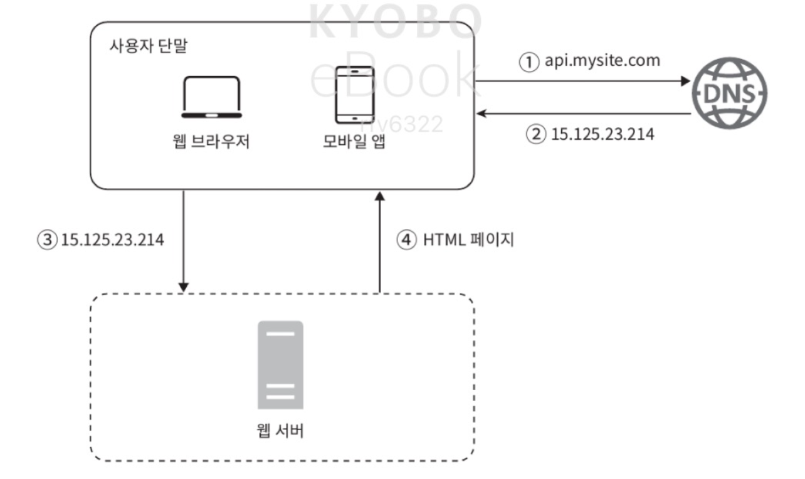</div>

### 동작 과정

1. **도메인 접속**: 사용자는 도메인 이름(api.mysite.com)을 이용하여 웹사이트에 접속
   - 도메인 이름을 DNS(Domain Name Service)에 질의하여 IP 주소로 변환
   - DNS는 보통 제3사업자가 제공하는 유료 서비스

2. **IP 주소 반환**: DNS 조회 결과로 IP 주소 반환 (예: 15.125.23.214)

3. **HTTP 요청**: 해당 IP 주소로 HTTP 요청 전달

4. **응답 반환**: 웹 서버가 HTML 페이지나 JSON 형태의 응답 반환

<br />

#### IF. 개발한 웹사이트가 인기를 끌면서 사용자가 급증하는 경우

```
초기: 사용자 100명 → 응답시간 0.2초 ✅
1개월 후: 사용자 5,000명 → 응답시간 2초 ⚠️
3개월 후: 사용자 50,000명 → 응답시간 10초, 간헐적 서버 다운 ❌
```

**문제 상황 분석**
- 웹서버와 데이터베이스가 같은 CPU/메모리를 공유하여 **성능 병목 발생**
- 사용자 주문 데이터, 상품 정보가 늘어날수록 DB 조회 속도 급격히 저하
- 서버 하나가 다운되면 전체 서비스 중단

**해결책**
- 웹서버와 데이터베이스를 분리하여 각각 **독립적으로** 확장 가능하도록 구조 개선

<br />

## 데이터베이스 서버
### Case 2. 데이터베이스 서버 도입

앞서 발생한 성능 병목 문제를 해결하기 위해 웹서버와 데이터베이스를 분리합니다.

<div align="center">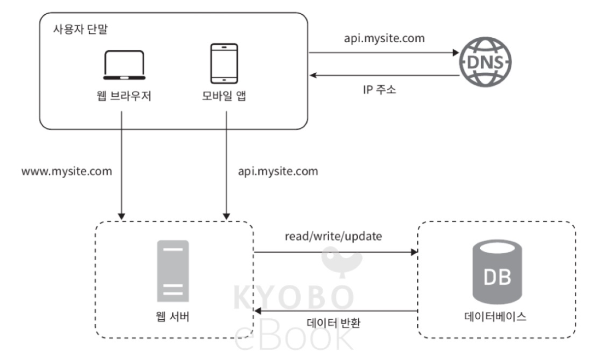</div>

**개선 효과**
- 웹서버는 HTTP 요청 처리에만 집중
- 데이터베이스 서버는 데이터 저장/조회에만 집중  
- 각 계층을 독립적으로 확장 가능 (웹서버 스펙 ↑, DB서버 스펙 ↑)

### 🤔 어떤 데이터베이스를 선택할까?

### 관계형 데이터베이스 (RDBMS)

**예시**: MySQL, Oracle Database, PostgreSQL

**특징**:
- 자료를 테이블과 행, 열로 표현
- SQL을 사용하여 여러 테이블의 데이터를 조인하여 합칠 수 있음

### 비관계형 데이터베이스 (NoSQL)

**예시**: CouchDB, Neo4j, Cassandra, HBase, Amazon DynamoDB

**분류**
1. **키-값 저장소** (key-value store)
2. **그래프 저장소** (graph store)  
3. **칼럼 저장소** (column store)
4. **문서 저장소** (document store)

**특징**
- 조인(join) 연산을 지원하지 않음

### NoSQL 선택 기준
- 아주 낮은 응답 지연시간이 요구됨
- 다루는 데이터가 비정형이라 관계형 데이터가 아님
- 데이터(JSON, YAML, XML 등)를 직렬화/역직렬화만 하면 됨
- 아주 많은 양의 데이터를 저장할 필요가 있음

<br />


## Case 3. 서버 확장

데이터베이스를 분리했지만, 웹서버가 여전히 단일 서버라서 트래픽 집중과 장애에 취약한 경우

**상황**
```
평상시: 사용자 10,000명 → 정상 동작 ✅
세일 이벤트: 사용자 100,000명 동시 접속 → 웹서버 과부하 ❌
서버 장애: 웹서버 다운 → 전체 서비스 중단 ❌
```

**서버 확장의 필요성 !!!**

### 수직적 규모 확장 (Scale Up)

서버에 고사양 자원(더 좋은 CPU, 더 많은 RAM 등)을 추가하는 방법

**장점**
- 서버 스펙만 변경하면 되므로 단순함
- 관리해야 하는 서버가 하나뿐
- 트래픽이 적을 때 좋은 선택

**단점**
- CPU나 메모리를 무한대로 증설할 수 없음
- 장애 복구나 다중화 방안이 없음 (서버 장애 시 서비스 중단)
- 대규모 애플리케이션에 부적합

### 수평적 규모 확장 (Scale Out)

더 많은 서버를 추가하여 성능을 개선하는 방법

**장점**
- 대규모 애플리케이션에 적합
- 장애 자동복구(failover) 가능
- 웹 계층의 가용성 향상

**단점**
- 복잡한 구성 및 관리 필요


<br />

### 웹 계층 서버 확장 - 로드밸런서

로드밸런서는 부하 분산 집합에 속한 웹 서버들에게 트래픽 부하를 고르게 분산하는 역할을 한다.

<div align="center">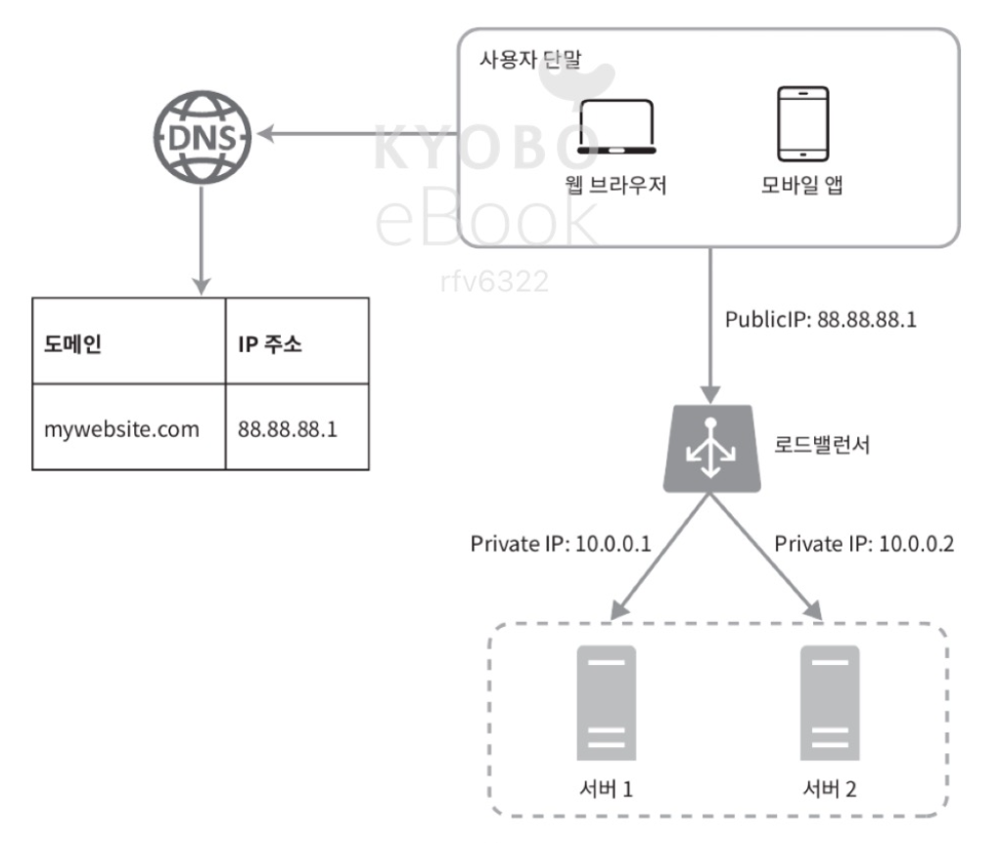</div>

**동작 과정**
1. 사용자는 로드밸런서의 공개 IP 주소로 접속
2. 로드밸런서는 웹 서버의 사설 IP 주소로 통신
3. 트래픽이 증가하면 웹 서버를 추가하여 자동으로 분산 처리

### 데이터 계층 서버 확장 - 데이터베이스 다중화

<div align="center">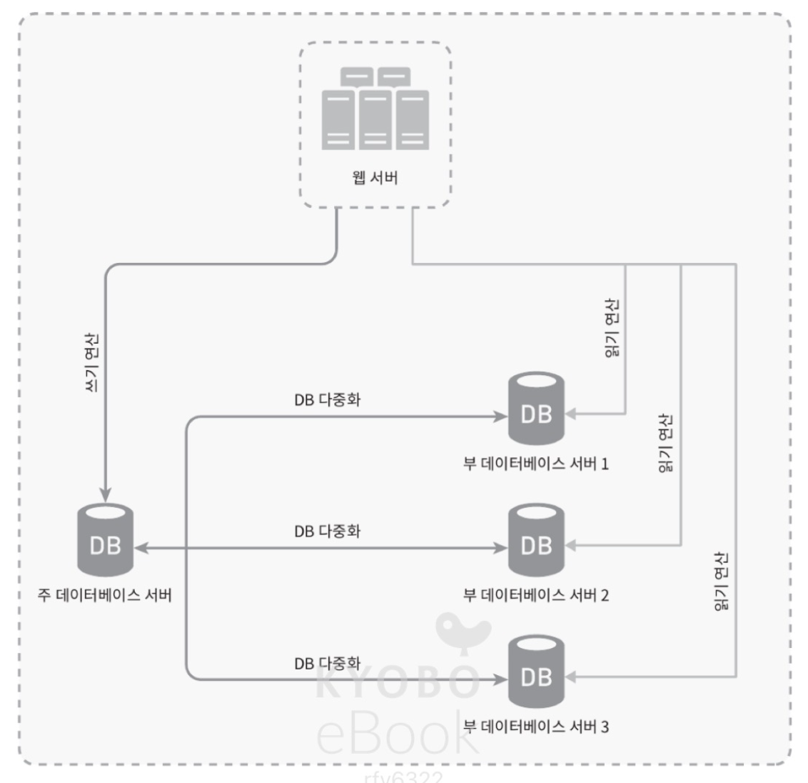</div>

데이터 계층의 장애 복구와 다중화는 **마스터-슬레이브(master-slave) 복제** 방식으로 해결할 수 있다.

#### 마스터-슬레이브 구조

- **마스터 서버**: 쓰기 연산(CUD - Create, Update, Delete)만 처리
- **슬레이브 서버**: 읽기 연산(Read)만 처리, 마스터로부터 데이터 복제

대부분의 애플리케이션은 **`읽기>쓰기`** 이므로, 슬레이브 서버 수가 마스터보다 많다.

#### 장점

- **성능 개선**: 읽기 연산이 여러 슬레이브로 분산되어 병렬 처리 가능
- **안정성**: 데이터를 여러 장소에 복제하여 자연재해 등에 대비
- **가용성**: 하나의 서버 장애 시에도 다른 서버로 서비스 지속

#### 장애 상황별 대응

| 상황 | 대응 방안 |
|------|-----------|
| 슬레이브 1대 다운 | 읽기 연산을 마스터로 임시 전달, 새 슬레이브 추가 |
| 슬레이브 여러 대 중 1대 다운 | 다른 슬레이브들로 분산, 새 슬레이브 추가 |
| 마스터 다운 | 슬레이브를 새 마스터로 승격, 새 슬레이브 추가 |
| 데이터 불일치 | 복구 스크립트 실행 또는 다중 마스터 방식 도입 |

### 로드밸런서 & 데이터베이스 다중화 적용 구성도

로드밸런서와 데이터베이스 다중화를 적용한 최종 구성도입니다.

<div align="center">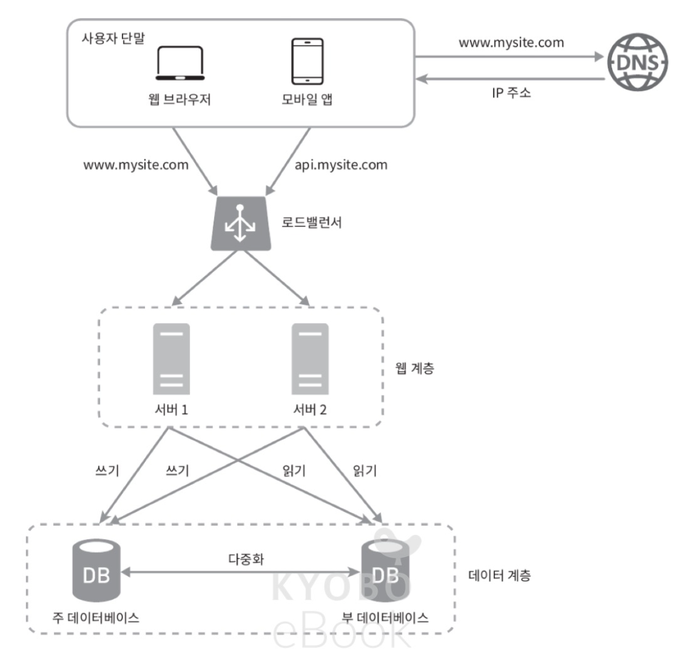</div>

**동작 흐름**
1. 사용자가 DNS로부터 로드밸런서의 공개 IP 주소를 받음
2. 사용자가 해당 IP 주소로 로드밸런서에 접속
3. HTTP 요청이 서버 1 또는 서버 2로 전달됨
4. 웹 서버가 슬레이브 데이터베이스에서 데이터를 읽음
5. 웹 서버가 데이터 변경 연산을 마스터 데이터베이스로 전달

<br />

## Case 4. 응답시간 개선의 필요성

**문제 상황**
```
사용자 불만 접수: "페이지 로딩이 너무 느려요!" 😤
모니터링 결과: 데이터베이스 조회가 전체 응답시간의 80% 차지
특히 상품 목록 페이지: 3초 → 사용자 이탈률 급증
```

**근본 원인**
- 웹서버가 매번 데이터베이스에 동일한 데이터를 반복 요청
- 인기 상품 정보를 수천 번 중복 조회
- 데이터베이스가 병목지점이 됨

### 캐시 (Cache)

캐시는 값비싼 연산 결과나 자주 참조되는 데이터를 메모리에 저장하여 후속 요청을 빠르게 처리하는 저장소

#### 캐시 계층

<div align="center">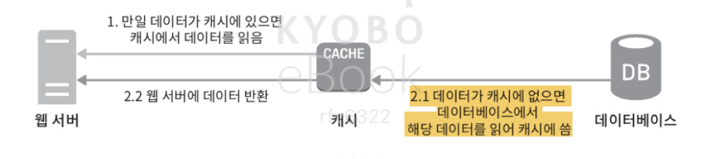</div>

**동작 과정** (읽기 주도형 캐시 전략)
1. 웹 서버가 캐시에 응답이 저장되어 있는지 확인
2. 저장되어 있다면 해당 데이터를 클라이언트에 반환
3. 없는 경우 데이터베이스에서 데이터를 가져와 캐시에 저장 후 클라이언트에 반환

#### 캐시 사용 시 고려사항

**적합한 경우**
- 데이터 갱신은 드물지만 참조는 자주 발생
- 영속적 보관이 불필요한 단기 저장 데이터

**주요 고려사항**

1. **만료 정책**: 너무 짧으면 DB 호출 증가, 너무 길면 데이터 불일치 발생
2. **일관성 유지**: 원본 갱신과 캐시 갱신을 단일 트랜잭션으로 처리
3. **단일 장애 지점 방지**: 여러 지역에 캐시 서버 분산
4. **메모리 크기**: 과할당으로 데이터 방출(eviction) 최소화
5. **방출 정책**:
   - **LRU** (Least Recently Used): 가장 오래된 데이터 제거
   - **LFU** (Least Frequently Used): 사용 빈도가 낮은 데이터 제거
   - **FIFO** (First In First Out): 먼저 들어온 데이터 먼저 제거

유명한 캐시는 코드 API를 제공한다.

**캐시 API 예시** (ex. Memcached):
```javascript
SECONDS = 1
cache.set('myKey', 'hi there', 3600 * SECONDS)
cache.get('myKey')
```

### 콘텐츠 전송 네트워크 (CDN)

CDN은 정적 콘텐츠를 전송하는 데 사용되는 지리적으로 분산된 서버 네트워크이다.
이미지, 비디오, CSS, JavaScript 파일 등을 캐시할 수 있다.

<div align="center">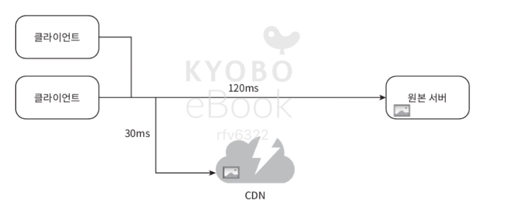</div>
<div align="center">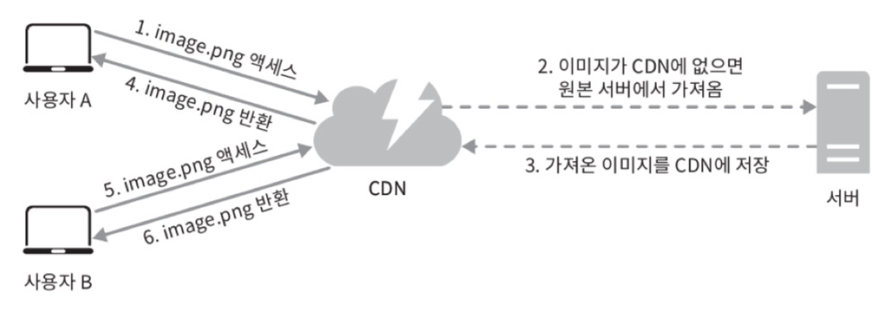</div>

#### 동작 과정

1. **첫 번째 요청**: 사용자 A가 가장 가까운 CDN 서버에서 정적 콘텐츠를 받음
2. **캐시 미스**: CDN 서버에 해당 이미지가 없으면 원본 서버에 요청
3. **파일 전송**: 원본 서버가 TTL(Time-To-Live) 정보와 함께 파일을 CDN에 전송
4. **캐시 저장**: CDN 서버가 파일을 캐시하고 사용자 A에게 반환
5. **캐시 히트**: 사용자 B의 동일한 요청은 캐시된 파일로 빠르게 처리

#### 고려사항

| 항목 | 설명 |
|------|------|
| **비용** | 데이터 전송량에 따른 요금, 자주 사용되는 콘텐츠만 캐싱 권장 |
| **만료 시한** | 시의성이 중요한 콘텐츠의 적절한 만료 시점 설정 |
| **장애 복구** | CDN 장애 시 원본 서버로 직접 요청하는 방안 |
| **콘텐츠 무효화** | API를 통한 무효화 또는 버전 관리 (예: image.png?v=2) |

### 최종 캐시 성능 개선 구성도

1. **CDN**: 웹사이트 로딩 속도 개선
2. **캐시**: 데이터베이스 호출 속도 개선

<div align="center">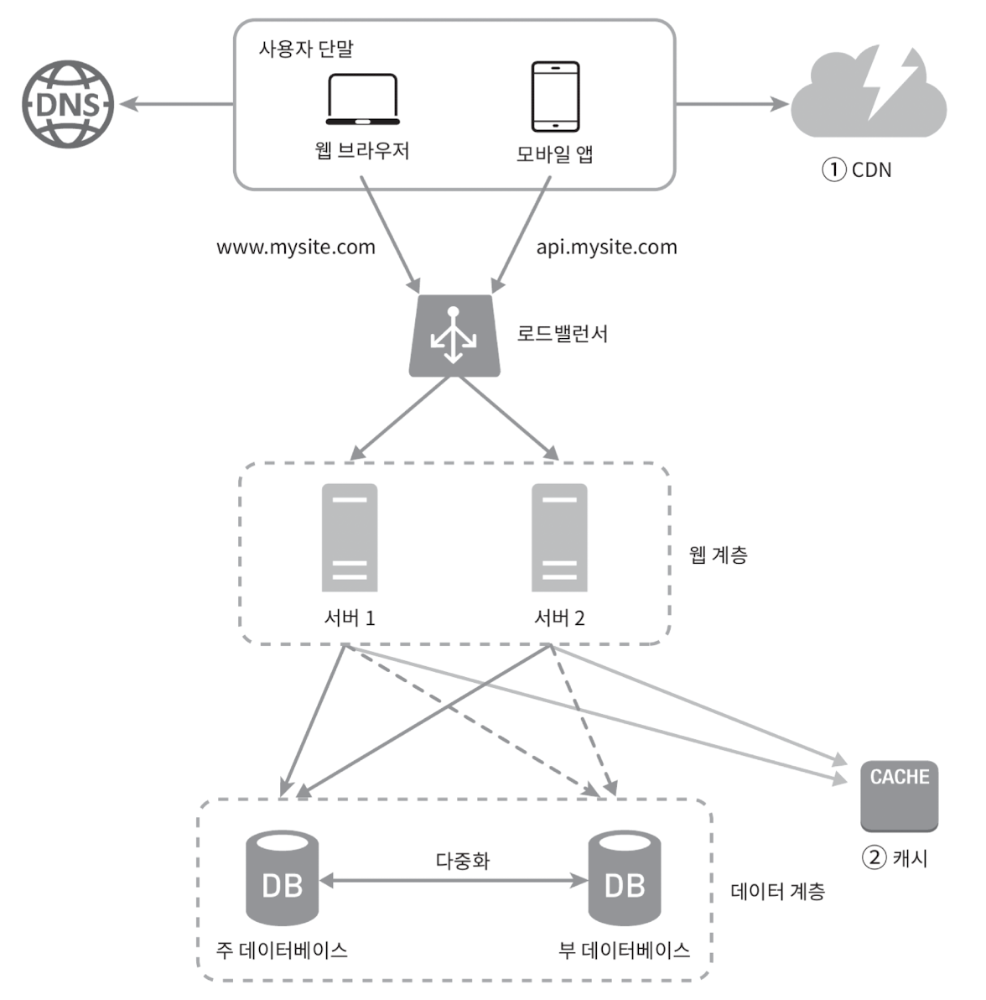</div>

---

> **단일 장애 지점(SPOF)**: 특정 지점의 장애가 전체 시스템 동작을 중단시킬 수 있는 경우를 의미합니다.


<br />

## Case 5. 무상태(Stateless) 웹 계층의 필요성

**문제 상황**:
```
문제 발생: 사용자 A가 로그인 후 새로고침하면 로그아웃됨
원인 파악: 로그인 정보가 서버1에 저장되었는데, 새로고침 시 서버2로 요청이 감
결과: 서버2에는 사용자 A의 로그인 정보가 없어서 인증 실패
```

### 상태 정보 의존적인 아키텍처의 문제점

<div align="center">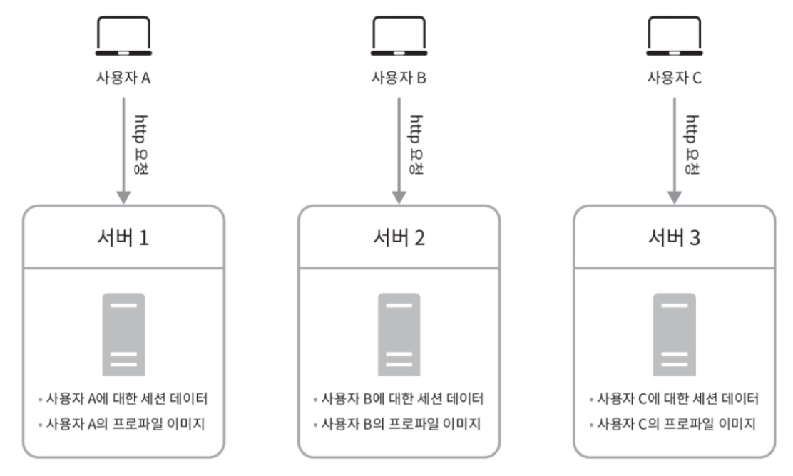</div>

**원인 분석**:
- 사용자 A의 세션 정보가 서버 1에만 저장됨
- 사용자 A의 요청은 반드시 서버 1로만 전송되어야 함
- 다른 서버로 요청이 가면 인증 실패 발생

로드밸런서의 고정 세션(sticky session) 기능을 사용할 수 있지만, 이 경우 로드밸런서에 부담이 증가하고 서버 추가/제거가 복잡해짐

### 무상태 아키텍처

<div align="center">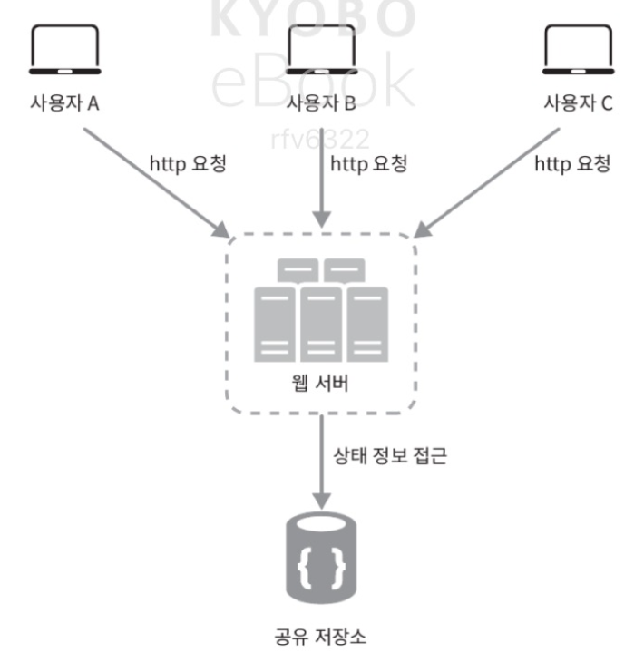</div>

**장점**
- HTTP 요청이 어떤 웹 서버로도 전달 가능
- 웹 서버가 필요시 공유 저장소에서 상태 정보를 가져옴
- 상태 정보가 웹 서버로부터 물리적으로 분리됨
- 단순하고 안정적이며 규모 확장이 쉬움

### 무상태 웹 계층 적용 설계

<div align="center">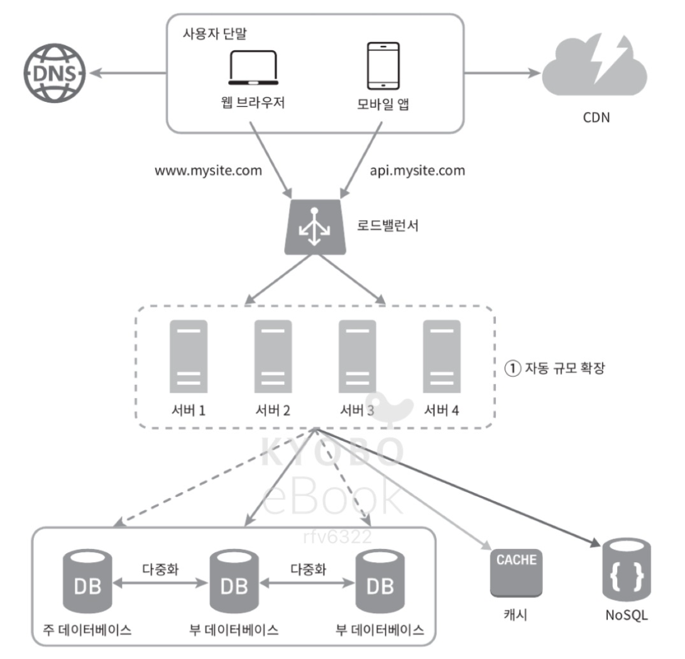</div>

**주요 변경사항**
- 세션 데이터를 웹 계층에서 분리하여 지속성 저장소에 보관
- 공유 저장소로 NoSQL 사용 (규모 확장이 간편)
- **자동 규모 확장**: 트래픽에 따라 웹 서버를 자동으로 추가/삭제

<br />

## Case 6. 데이터 센터

서비스가 성공하여 해외 진출을 시작했지만, 예상치 못한 문제가 발생함

**문제 상황**:
```
한국 사용자: 응답시간 0.5초 ✅
미국 사용자: 응답시간 3초 ⚠️
유럽 사용자: 응답시간 4초 ❌
```

**원인 분석**
- 서버가 한국에만 있어서 물리적 거리로 인한 네트워크 지연 발생
- 해외 사용자의 요청이 지구 반바퀴를 돌아서 처리됨
- 시차로 인한 트래픽 패턴 차이 (한국 밤 = 미국 낮)

**추가 위험 요소**
- 한국 데이터센터 장애 시 전 세계 서비스 중단
- 자연재해, 정전 등으로 인한 서비스 리스크

### 다중 데이터 센터 구성

전 세계 여러 지역에 데이터센터를 구축하여 사용자와 가까운 곳에서 서비스 제공한다.

<div align="center">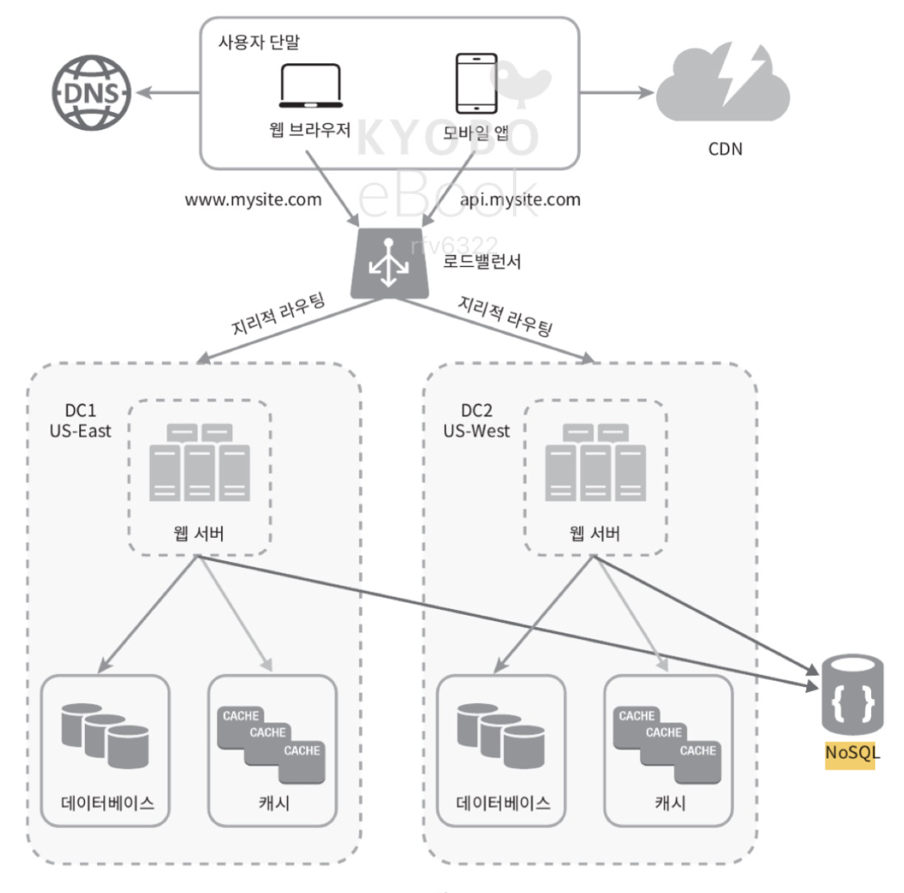</div>

**지리적 라우팅(GeoDNS)**
- 사용자 위치에 따라 도메인 이름을 적절한 IP 주소로 변환
- 가장 가까운 데이터 센터로 사용자를 안내
- 예시: x% 사용자는 US-East, (100-x)% 사용자는 US-West로 분산

### 데이터 센터 장애 대응

<div align="center">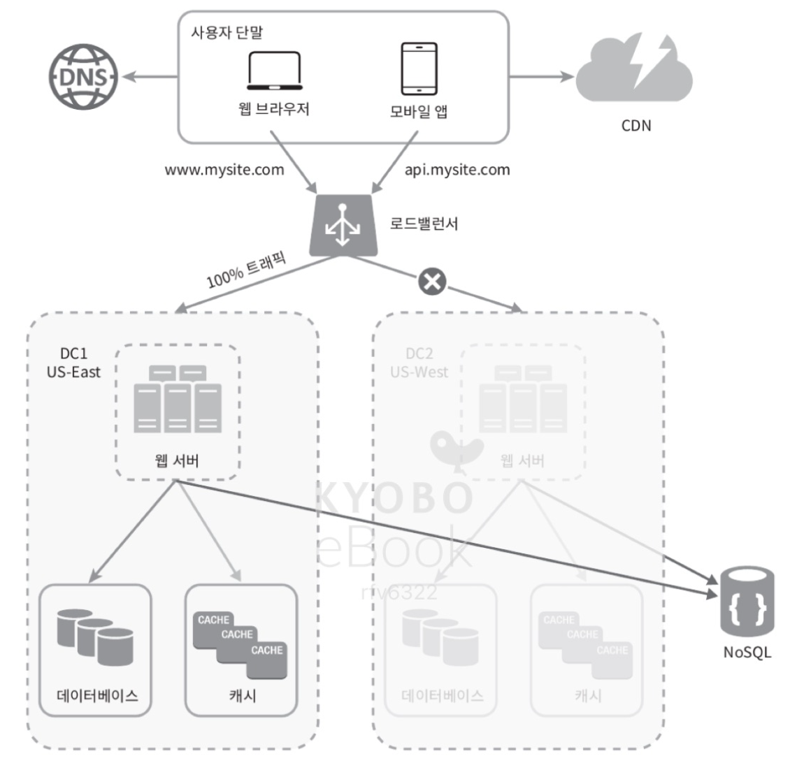</div>

**장애 발생 시**
- 장애가 발생한 데이터 센터의 모든 트래픽을 정상 데이터 센터로 우회
- 예시: US-West 장애 시 모든 트래픽이 US-East로 전송

### 다중 데이터 센터 구축 시 고려사항

| 항목 | 설명 |
|------|------|
| **트래픽 우회** | GeoDNS를 통해 가장 가까운 데이터 센터로 트래픽 전송 |
| **데이터 동기화** | 여러 데이터 센터에 걸쳐 데이터를 다중화하여 장애 복구 대비 |
| **테스트와 배포** | 여러 위치에서 테스트 수행, 자동화된 배포 도구로 동일한 서비스 설치 |

<br />

## Case 7. 메시지 큐

**문제 상황**:
```
새 기능 추가: 이미지 리사이징 서비스
문제 발생: 이미지 업로드 시 리사이징을 처리하는 데 5초 이상 걸려서, 웹서버가 5초간 멈춘 것처럼 보임
사용자 경험: "사진 올리는데 왜 이렇게 오래 걸려요?"
```

**원인 분석**
- 웹서버가 이미지 처리 완료까지 기다림 (동기 처리)
- 이미지 처리 중 다른 사용자 요청 처리 불가
- 이미지 처리 서버 장애 시 웹서버도 영향 받음
- 각 컴포넌트가 강하게 결합되어 독립적 확장 어려움

**추가 문제**
- 트래픽 급증 시 이미지 처리 서버만 확장하고 싶지만 불가능
- 한 서비스 장애가 전체 시스템에 연쇄 영향

### 메시지 큐의 특징

메시지의 무손실을 보장하는 비동기 통신을 지원하는 컴포넌트
시스템 컴포넌트를 분리하여 각각 독립적으로 확장할 수 있도록 한다.

<div align="center">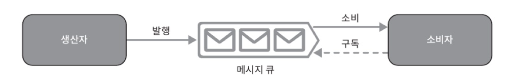</div>

**구성 요소**
- **생산자(Producer)**: 메시지를 만들어 큐에 발행
- **소비자(Consumer)**: 메시지를 받아 해당 동작을 수행
- **메시지 큐**: 메시지의 버퍼 역할

**장점**
- 서비스 간 결합이 느슨해짐
- 규모 확장성이 보장되는 안정적 애플리케이션 구성 가능
- 생산자와 소비자가 독립적으로 동작 가능

### 메시지 큐 사용 예시

<div align="center">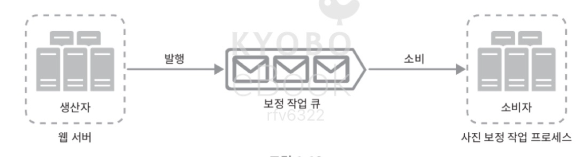</div>

**동작 흐름**
1. 웹 서버가 사진 보정 작업을 메시지 큐에 발행
2. 사진 보정 작업 프로세스들이 작업을 큐에서 가져와 비동기 처리
3. 생산자와 소비자 서비스의 규모를 각각 독립적으로 확장 가능

<br />

## Case 8. 로그, 메트릭, 자동화 - 운영 복잡성 문제

**문제 상황**:
```
새벽 3시 장애 발생: 서비스 응답 없음
개발팀 긴급 소집: "어디서 문제가 생겼지?"
문제 파악까지 2시간: 로그가 여러 서버에 흩어져 있음
고객 불만 폭주: "왜 이렇게 자주 문제가 생겨요?"
```

**원인 분석**
- **로그 부재**: 에러 발생 시 원인 파악이 어려움
- **모니터링 부족**: 시스템 상태를 실시간으로 파악 불가
- **수동 배포**: 배포 과정에서 인적 오류 발생
- **성능 지표 부족**: 어느 부분이 병목인지 알 수 없음

**구체적 문제들**
- 서버 10대 각각에서 로그 확인해야 함
- CPU 사용률 90% 넘어도 알림 없음
- 배포할 때마다 개발자가 수동으로 진행
- 사용자 증가 추이를 데이터로 파악 불가

### 개선 방안

**로그**
- 에러 로그 모니터링으로 시스템 오류와 문제점 파악
- 로그를 단일 서비스로 모아주는 도구 활용 권장

**메트릭**
- **호스트 단위**: CPU, 메모리, 디스크 I/O
- **종합 메트릭**: 데이터베이스 계층 성능, 캐시 계층 성능
- **핵심 비즈니스**: 일별 능동 사용자, 수익, 재방문율

**자동화**
- 지속적 통합(CI) 도구로 코드 검증 절차 자동화
- 빌드, 테스트, 배포 절차 자동화로 개발 생산성 향상

### 최종 설계안 (메시지 큐, 로그, 메트릭, 자동화 적용)

<div align="center">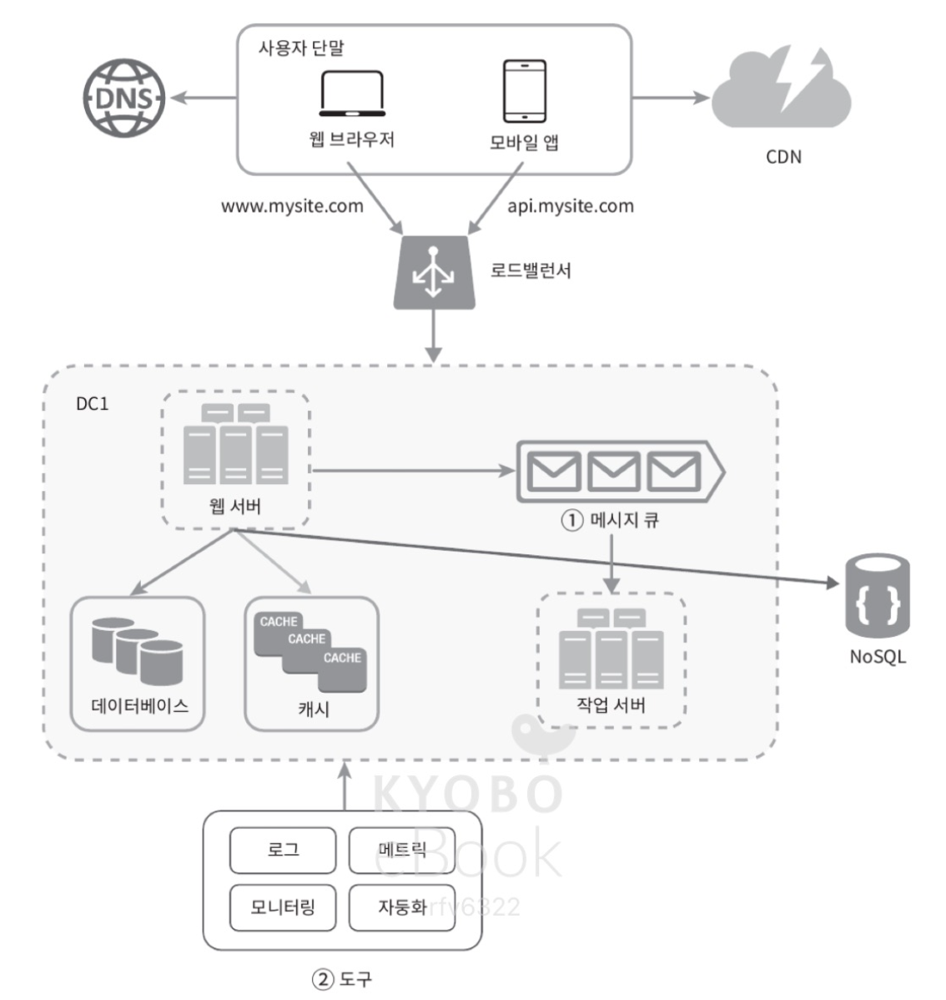</div>

**개선사항**
1. 메시지 큐로 컴포넌트 간 느슨한 결합 및 결함 내성 향상
2. 로그, 모니터링, 메트릭, 자동화 지원 장치 추가

## Case 9. 데이터베이스의 규모 확장

**문제 상황**
```
데이터 급증: 사용자 1,000만명, 주문 데이터 1억건
성능 급락: 상품 검색 시간 0.1초 → 5초
저장 공간 부족: 디스크 사용률 95% 도달
백업 시간: 8시간 소요 (서비스 영향)
```

**원인 분석**
- 단일 데이터베이스 서버의 물리적 한계 도달
- 데이터량 증가로 인한 쿼리 성능 급격한 저하
- 인덱스 크기 증가로 메모리 부족 현상
- 백업/복구 시간이 서비스 운영에 지장

**구체적 문제들**
- 상품 테이블: 1억 개 레코드로 SELECT 쿼리 느려짐
- 주문 테이블: 매일 100만 건씩 증가하여 저장 공간 부족
- 사용자 테이블: 조인 쿼리 시 메모리 부족으로 서버 다운

### 데이터베이스 서버의 수직적 확장 (Scale Up)

기존 서버에 더 많은 고성능 자원을 증설하는 방법

**장점**
- 구현이 단순함

**단점**
- 하드웨어 한계 존재
- 단일 장애 지점(SPOF) 위험
- 높은 비용

### 데이터베이스 서버의 수평적 확장 (샤딩, Sharding)

<div align="center">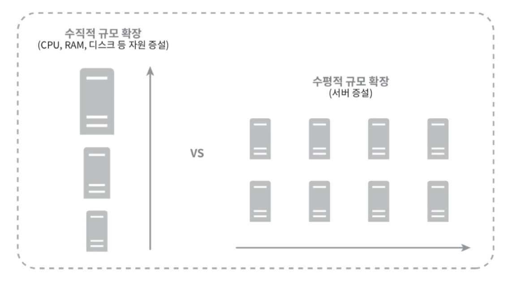</div>

대규모 데이터베이스를 샤드라는 작은 단위로 분할하는 기술

### 샤딩 구현

<div align="center">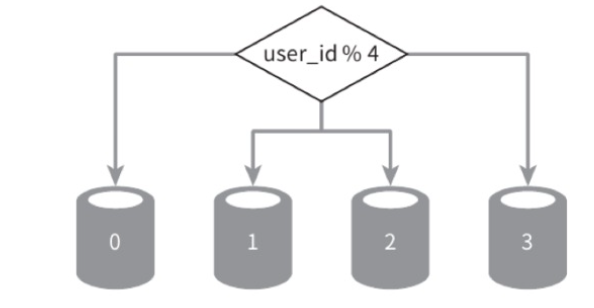</div>

**특징**
- 모든 샤드는 같은 스키마 사용
- 샤드 간 데이터 중복 없음
- 샤딩 키(파티션 키)로 데이터 분산 결정

**예시**: `user_id % 4`를 해시 함수로 사용하여 샤드 결정

<div align="center">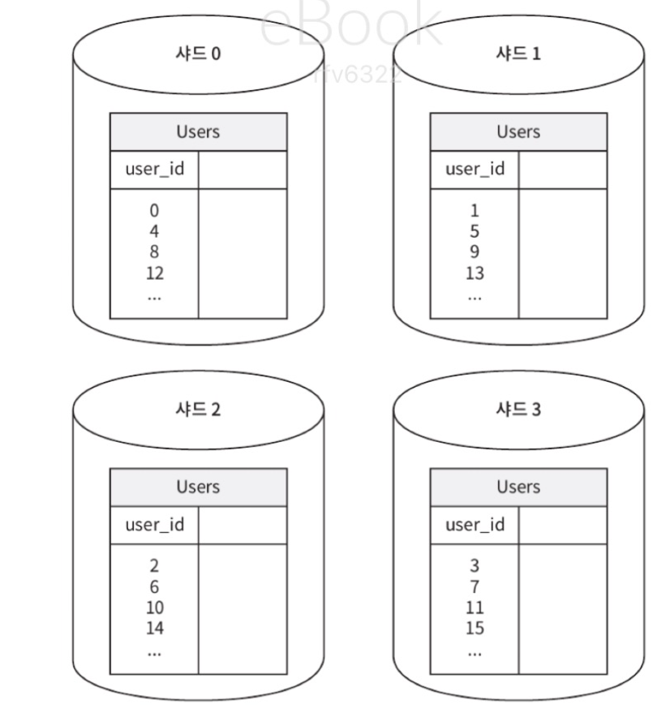</div>

### 샤딩 시 고려사항

**샤딩 키 선택**
- 데이터를 고르게 분할할 수 있도록 하는 것이 가장 중요
- 올바른 데이터베이스에 질의를 보내어 효율성 향상

**주요 문제점**

1. **데이터 재샤딩**
   - 데이터가 너무 많아져서 하나의 샤드로 감당 어려울 때
   - 샤드 간 데이터 분포가 불균등할 때 (샤드 소진)
   - 해결: 안정 해시(consistent hashing) 기법 활용

2. **유명인사 문제 (핫스팟 키)**
   - 특정 샤드에 질의가 집중되어 과부하 발생
   - 해결: 유명인사별로 개별 샤드 할당 또는 더 세분화

3. **조인과 비정규화**
   - 여러 샤드에 걸친 데이터 조인이 어려워짐
   - 해결: 데이터베이스 비정규화로 하나의 테이블에서 질의 수행

### 샤딩 적용 최종 구성도

<div align="center">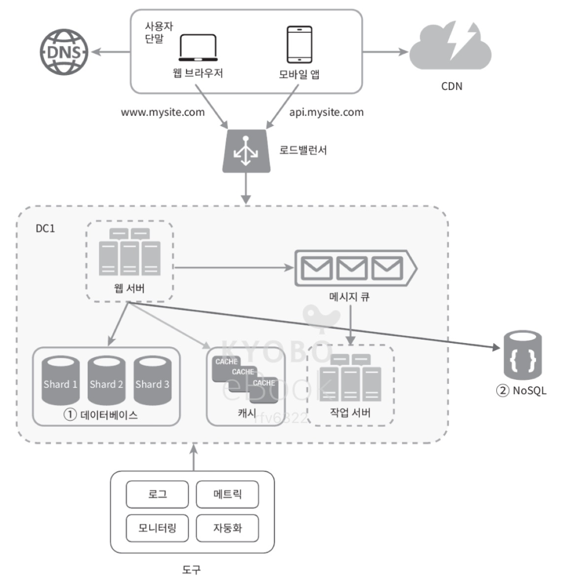</div>

**주요 변경사항**
1. 데이터베이스를 여러 샤드로 분할
2. 관계형 데이터베이스가 불필요한 기능들을 NoSQL로 이전

<br />

## 결론
- **웹 계층은 무상태 계층으로**
- **모든 계층에 다중화 도입**
- **가능한 한 많은 데이터를 캐시할 것**
- **여러 데이터 센터를 지원할 것**
- **정적 콘텐츠는 CDN을 통해 서비스할 것**
- **데이터 계층은 샤딩을 통해 규모를 확장할 것**
- **각 계층은 독립적 서비스로 분할할 것**
- **시스템을 지속적으로 모니터링하고 자동화 도구들을 활용할 것**