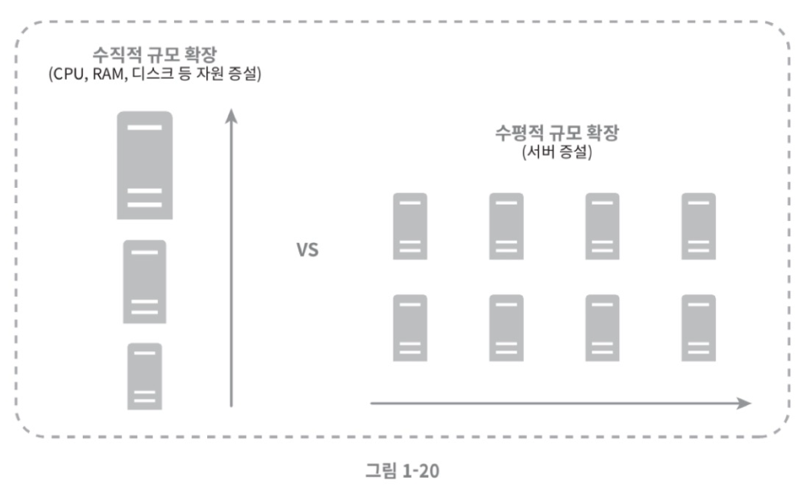

# 1장 사용자 수에 따른 규모 확장성

## 단일 서버

모든 컴포넌트가 단 한대의 서버에서 실행되는 간단한 시스템 설계

> v1 기본 구조   > 

1. 사용자가 도메인 이름을 DNS에 질의하여 IP 주소로 변환
2. DNS 조회 결과로 IP 주소 반환
3. 해당 IP 주소로 HTTP 요청 전달
4. 요청을 받은 웹 서버는 HTML 페이지나 JSON 형태의 응답을 반환

## 데이터베이스

> v2 DB 추가   > 

### 어떤 데이터베이스를 사용할 것인가?

- 관계형 데이터베이스(RDBMS)
  - MySQL, 오라클, PostgreSQL 등
  - 테이블과 열, 칼럼으로 표현
  - 데이터를 관계에 따라 조인(join)하여 합치기 가능
- 비-관계형 데이터베이스(NoSQL)
  - CouchDB, Neo4j, Cassandra, Hbase, Amazon DynamoDB 등
  - 네 부류로 나눌 수 있다
    - 키-값 저장소
    - 그래프 저장소
    - 칼럼 저장소
    - 문서 저장소
  - 조인 연산 지원 x

대부분의 개발자에게는 관계형 데이터베이스가 최선일 것 이다. 하지만 아래와 같은 경우에는 비-관계형 데이터베이스가 바람직한 선택일 수 있다.

- 아주 낮은 응답 지연시간이 요구됨
- 다루는 데이터가 비정형이라 관계형 데이터가 아님
- 데이터를 직렬화하거나 역질렬화 할 수 있기만 하면 됨
- 아주 많은 양의 데이터를 저장할 필요가 없음

## 수직적 규모 확장 vs 수평정 규모 확장

- scale up = 수직적 규모 확장
  - 고사양 자원 추가(CPU, RAM 등)
- scale out = 수평적 규모 확장
  - 더 많은 서버 추가

> 그렇다면 어떤 방법을 선택해야 할까?

서버로 유입되는 트래픽의 양이 적을 때는 수직정 확장이 좋은 선택이다. 하지만 아래와 같은 심각한 단점들로 인해 대규모 어플리케이션을 지원하는 데는 **수평적 규모 확장법**이 보다 적절하다.

- 수직적 규모 확장에는 한계가 있다. 한 대의 서버에 CPU나 메모리를 무한대로 증설할 방법은 없다.
- 수직적 규모 확장법은 장애에 대한 자동복구 방안이나 다중화 방안을 제시하지 않는다. 서버에 장애가 발행하면 완전히 중단된다.

> 따라서 너무 많은 사용자가 접속하여 웹서버가 느려지거나 접속이 불가능해지면 로드밸런서를 도입하는 것이 최선이다.

### 로드밸런서

부하 분산 집합에 속한 웹 서버들에게 트래픽 부하를 고르게 분산하는 역할

> v3 로드밸런서 적용   > 

동작방법

- 로드밸런서의 공개 IP 주소로 접속
- 로드밸런서는 웹 서버와 통신하기 위해 사설 주소를 이용
  - 사설 주소는 같은 네트워크에 속한 서버 사이의 통신에만 쓰인다
- 서버 1이 다운되면 모든 트래픽은 서버 2로 전송
- 웹 서버 계층에 더 많은 서버 추가 가능

> 이제 웹 계층은 괜찮아 보이는데, 그렇다면 데이터 계층은 어떤가?

### 데이터베이스 다중화

- 많은 데이터베이스 관리 시스템이 다중화를 지원한다.
- 보통은 서버 사이에 주(master)-부(slave) 관계를 설정한다.

  - 원본은 주 서버에 저장
  - 사본은 부 서버에 저장

- 쓰기 연산은 마스터에서만 지원
- 부 데이터베이스는 사본은 마스터에서 전달받아 읽기 연산만을 지원
- 데이터베이스를 변경하는 명령어들은 주 데이터베이스로만 전달
- 대부분 읽기 연산의 비중이 쓰기 연산보다 훨씬 높다.
- 따라서 부 데이터베이스의 수가 더 많다.

  
이렇게 데이터베이스를 다중화하면 다음과 같은 이득이 있다.

- 더 나은 성능
- 안정성
- 가용성

> v4 로드밸런서와 데이터베이스 다중화를 고려한 설계안   > 

- 사용자는 DNS로부터 로드밸런서 공개 IP 주소를 받는다.
- 사용자는 해당 IP 주소를 사용해 로드밸런서에 접속한다.
- HTTP 요청은 서버 1이나 서버 2로 전달된다.
- 웹 서버는 사용자의 데이터를 부 데이터베이스 서버에서 읽는다.
- 웹 서버는 데이터 변경 연산은 주 데이터베이스로 전달한다.

> 이제 웹 계층과 데이터 계층에 대해 충분히 이해하게 되었으니, 응답시간을 개선해 볼 순서다.

## 캐시

값비싼 연산 결과 또는 자주 참조되는 데이터를 메모리 안에 두고, 뒤이은 요청이 보다 빨리 처리될 수 있도록 하는 저장

### 캐시 계층

데이터가 잠시 보관되는 곳  

- 그림과 같은 캐시 전략을 읽기 주도형 캐시 전략이라고 부른다.
- 대부분의 캐시 서버는 API를 제공한다.

### 캐시 사용 시 유의할 점

- 어떤 상황에 바람직한가?
  - 데이터 갱신은 자주 일어나지 않지만 참조는 빈번하게 일어나는 상황
- 어떤 데이터를 캐시에 두어야 하는가?
  - 영속적으로 보관할 데이터는 x
- 캐시에 보관할 데이터는 어떻게 만료되는가?
  - 만료된 데이터는 캐시에서 삭제되어야 하기 때문에 정책 마련 필요
- 일관선은 어떻게 유지되는가?
  - 일관성:데이터 저장소의 원본과 캐시 내의 사본이 같은지 여부
- 장애에는 어떻게 대처할 것인가?
  - SPOF를 피하려면 여러 지역에 걸쳐 캐시 서버를 분산시켜야 한다.
    
- 캐시 메모리는 얼마나 크게 잡을 것인가?
  - 방법은 캐시 메모리를 과할당 하는 것
- 데이터 방출 정책은 무엇인가?
  - LRU - 마지막으로 사용된 시점이 가장 오래된 데이터를 내보내는 정책
  - FIFO - 가장 먼저 캐시에 들어온 데이터를 가장 먼저 내보내는 정책

### 콘텐츠 전송 네트워크(CDN)

지리적으로 분산된 서버의 네트워크  

CDN 동장 방법  

> v5 CDN과 캐시가 추가된 설계   > 

변화된 부분

1. 정적 콘텐츠는 더 이상 웹 서버를 통해 서비스하지 않으며, CDN을 통해 제공
2. 캐시가 데이터베이스 부하를 줄여준다.

## 무상태(stateless) 웹 계층

> 이제 웹 계층을 수평적으로 확장하는 방법을 고민해 볼 순서다.

- 이를 위해서는 상태 정보(사용자 세션 데이터와 같은)를 웹 계층에서 제거
- 상태 정보를 관계형 데이터베이스나 NoSQL 같은 지속성 저장소에 보관하고, 필요할 때 가져오도록 하는 것
- 이렇게 구성된 웹 계층을 **무상태 웹 계층**이라 부른다.

### 상태 정보 의존적인 아키텍처

  

- 문제는 같은 클라이언트로부터의 요청은 항상 같은 서버로 전송되어야 한다는 것이다.
- 이는 로드밸런서에 부담을 주고 장애 처리도 복잡해진다.

### 무상태 아키텍처

  

- 이 구조는 상태 정보 의존적인 아키텍처와 가르게 사용자의 HTTP 요청은 어떤 웹 서버로도 전달될 수 있다.
- 상태 정보가 필요할 경우 공유 저장소로부터 데이터를 가져온다.
- 따라서 상태 정보는 웹 서버로부터 물리적으로 분리되어 있다.
- 이 구조는 단순하고, 안정적이며, 규모 확장이 쉽다.

> v6 무상태 웹 계층 추가   > 

- 세션 데이터를 웹 계층에서 분리하고 DB에 저장
  - 그림에서는 규모 확장이 간편한 NoSQL 선택

## 데이터 센터

- 장애가 없는 상황에서 사용자는 가자 가까운 데이터 센터로 안내되는데, 이를 **지리적 라우팅(geoDNS-routing)**이라고 부른다.
- 지리적 라우팅에서의 geoDNS는 사용자의 위치에 따라 도메인 이름을 알면 어떤 IP 주소로 변환할 지 결정할 수 있도록 해 주는 DNS 서비스다.
  > v7 두 개의 데이터 센터 이용   > 

## 메시지 큐

## 로그, 매트릭 그리고 자동화 등을 반영하여 수정한 설계안

> v8 메시지 큐, 로그, 메트릭, 자동화 등을 반여앟여 수정한 설계안   > 

### 메시지 큐, 로그, 메트릭, 자동화 등을 반영하여 수정한 설계안

## 데이터베이스의 규모 확장

### 수직적 확장

### 수평적 확장

> v9 데이터베이스 샤딩을 적용한 아키텍처
> 

## 백만 사용자, 그리고 그 이상
