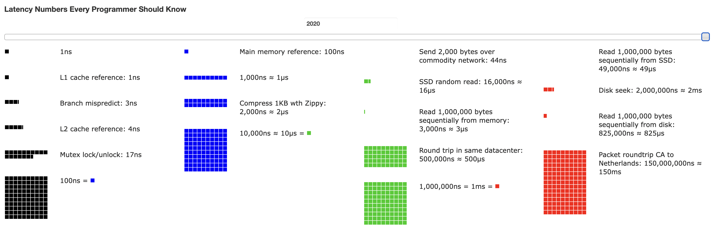

# 개략적인 규모 추정

## 목차

1. [개략적인 규모 추정](#개략적인-규모-추정)
   - [2의 제곱 수](#2의-제곱-수)
   - [응답 지연(latency) 값](#응답-지연latency-값)
   - [가용성](#가용성)
     - [SLA (Service Level Agreement)](#sla-service-level-agreement)
     - [Ex. 트위터 QPS와 저장소 요구량 추정](#ex-트위터-qps와-저장소-요구량-추정)
   - [2020 latency numbers](#2020-latency-numbers)

2. [시스템 설계 면접 준비](#시스템-설계-면접-준비)
   - [시스템 설계 면접 유의할 점](#시스템-설계-면접-유의할-점)
     - [시스템 설계 면접의 긍정적 신호](#시스템-설계-면접의-긍정적-신호)
     - [시스템 설계 면접의 부정적 신호](#시스템-설계-면접의-부정적-신호)
   - [면접 팁](#면접-팁)
     - [해야할 것](#해야할-것)
     - [하지 말아야 할 것](#하지-말아야-할-것)
   - [면접 예제](#면접-예제)
     - [개략적 규모 추장](#개략적-규모-추장)

3. [효과적 면접을 위한 4단계 접근법](#효과적-면접을-위한-4단계-접근법)
   - [1. 문제 이해 및 설계 범위 확정](#1-문제-이해-및-설계-범위-확정)
   - [2. 개략적인 설계안 제시 및 동의 구하기](#2-개략적인-설계안-제시-및-동의-구하기)
   - [3. 상세 설계](#3-상세-설계)
   - [4. 마무리](#4-마무리)
   - [기타. 시간 배분](#기타-시간-배분)

### 목표
시스템 설계 면접을 볼 때, **시스템 용량**이나 **성능 요구사항**을 개략적으로 추정해보자.

보편적으로 통용되는 성능 수치상에서 사고 실험(thought experiments)을 행하여 추정치를 계산하는 행위로서, 어떤 설계가 요구사항에 부합할 것인지 보기 위한 것이다.

 

## 2의 제곱 수

컴퓨터 과학에서 2의 제곱수는 흔히 사용된다. 예를 들어, 메모리 크기, 네트워크 대역폭, 디스크 공간 등이 2의 제곱수로 표현되는 경우가 많다. 이는 컴퓨터 시스템이 이진수 기반으로 작동하기 때문이다.
그렇기 때문에, 분산 시스템에서 다루는 데이터 양을 계산하기 위해서는 데이터 볼륨의 단위를 2의 제곱수로 표현하면 어떻게 되는지를 알아야 한다.

아래 표는 흔히 쓰이는 데이터 볼륨 단위들이다.
1 byte는 8bit이고, ASCII 문자 하나가 처리하는 메모리 크기도 1 byte이다.

| 2의 x 제곱 | 근사치 | 이름 | 축약형 |
|-------------|---------|------|--------|
| 10          | 1천(thousand)    | 킬로바이트(Kilibyte) | 1KB     |
| 20          | 100만(million)   | 메가바이트(Megabyte) | 1MB     |
| 30          | 10억(billion)    | 기가바이트(Gigabyte) | 1GB     |
| 40          | 1조(trillion)     | 테라바이트(Terabyte) | 1TB     |
| 50          | 1천조(quadrillion)   | 페타바이트(Petebyte) | 1PB     |

_*1byte는 데이터 볼륨의 최소단위_

 

## 응답 지연(latency) 값

시스템 설계에서 응답 지연(latency)은 **시스템이 요청을 처리하고 응답을 반환하는 데 걸리는 시간**을 의미한다. 일반적으로 밀리초(ms) 단위로 측정된다.

아래 표는 **2010년** 구글의 제프 딘이 공개한 통상적인 컴퓨터의 구현된 연산들의 응답 지연 값이다.

`단위 표`

ns = nanosecond (나노초), us = microsecond (마이크로초), ms = millisecond (밀리초)
- 1 nanosecond = 10^9 초
- 1 microsecond = 10^6 초 = 1,000 nanosecond
- 1 millisecond = 10^3 초 = 1,000,000 nanosecond

| 연산명 | 시간 |
|-------------|---------|
| L1 캐시 참조 | 0.5ns |
| 분기 예측 오류 (branch mispredict) | 5ns |
| L2 캐시 참조 | 7ns |
| 뮤텍스 (mutex) 락 / 언락 | 100ns |
| 주 메모리 참조 | 100ns |
| Zippy로 1KB 압축 | 10,000ns = 10us |
| 1Gbps 네트워크로 2KB 전송 | 20,000ns = 20us |
| 메모리에서 1MB 순차적으로 read | 250,000ns = 250us |
| 같은 데이터 센터 내에서의 메시지 왕복 지연 시간 | 500,000ns = 500us |
| 디스크 탐색 (seek) | 10,000,000ns = 10ms |
| 네트워크에서 1MB 순차적으로 read | 10,000,000ns = 10ms |
| 디스크에서 1MB 순차적으로 read | 30,000,000ns = 30ms |
| 한 패킷의 CA (캘리포니아)로부터 네덜란드까지의 왕복 지연 시간 | 150,000,000ns = 150ms |

이들 가운데 몇몇은 더 빠른 컴퓨터가 등장하면서 유효하지 않기도 하다.
연도별 latency의 결과물은 아래 사이트에서 확인해볼 수 있다.

---

<u> [github](https://github.com/colin-scott/interactive_latencies) </u>

<u> [website](https://colin-scott.github.io/personal_website/research/interactive_latency.html) </u>

---

구체적인 분석은 이 목차에서 확인이 가능하다. [2020 latency numbers](#2020-latency-numbers)

위 그림에서 제시된 **수치들을 분석한 결론**은 다음과 같다.
- 메모리는 빠르지만 디스크는 아직도 느리다.
- 디스크 탐색(seek)은 가능한 한 피하라.
- 단순한 압축 알고리즘은 빠르다.
- 데이터를 인터넷으로 전송하기 전에 가능하면 압축하라.
- 데이터 센터는 보통 여러 지역(region)에 분산되어 있고, 센터들 간에 데이터를 주고받는 데 시간이 걸린다.

 
 

## 가용성

고가용성(high availability)는 시스템이 오랜 시간 동안 지속적으로 **중단 없이 운영될 수 있는 능력**을 지칭하는 용어이다.

<u>퍼센트(percent)</u>로 표현하며, 대부분의 서비스는 99%에서 100% 사이의 값을 갖는다.

> ### SLA (Service Level Agreement)
> SLA(Service Level Agreement)는 서비스 사업자(service provider)가  보편적으로 사용하는 용어로, 서비스 사업자와 곡개 사이의 맺어진 합의를 의미한다.

이 합의로, 서비스 사업자가 제공하는 서비스의 가용시간(uptime)이 공식적으로 기술 되어있다.

아래 표는 가용성 수치와 연간 중단 시간(downtime)을 정리한 것이다.

| 가용률 | 하루당 장애시간 | 주당 장애시간 | 개월당 장애시간 | 연간 장애시간 |
|--------|------------------|----------------|------------------|----------------|
| 99%    | 14.40분          | 1.68시간 | 7.31 시간 | 3.65일 |
| 99.9%  | 1.44분           | 10.08분        | 43.83분          | 8.77시간       |
| 99.99% | 8.64초           | 1.01분 | 4.38분 | 52.60분 |
| 99.999%| 864.00밀리초     | 6.05초 | 31.56초 | 5.26분 |
| 99.9999%| 86.40밀리초    | 604.80밀리초 | 2.63초 | 31.56초 |

 

### Ex. 트위터 QPS와 저장소 요구량 추정

> **가정**
- 월간 능동 사용자(monthly active user)는 3억(300 million)명이다
- 50%의 사용자가 트위터를 매일 사용한다
- 평균적으로 각 사용자는 매일 2건의 트윗을 올린다
- 미디어를 포함하는 트윗은 10% 정도다
- 데이터는 5년간 보관된다

> **추정**

`QPS(Query Per Second) 추정치`
- 일간 능동 사용자(Daily Active User, DAU) = 3억 × 50% = 1.5억(150 million)
- QPS = 1.5억 × 2트윗/24시간/3600초 = 약 3500
- 최대 QPS(Peak QPS) = 2 × QPS = 약 7000

`미디어 저장을 위한 저장소 요구량`
- 평균 트윗 크기:
  - tweet_id: 64바이트
  - 텍스트: 140바이트
  - 미디어: 1MB
- 미디어 저장소 요구량: 1.5억 × 2 × 10% × 1MB = 30TB/일
- 5년간 미디어를 보관하기 위한 저장소 요구량: 30TB × 365 × 5 = 약 55PB

 

### 2020 latency numbers

_*가장 최신 버전인 2020의 latency 그림_

`단위 표`

ns = nanosecond (나노초), us = microsecond (마이크로초), ms = millisecond (밀리초)
- 1 nanosecond = 10^9 초
- 1 microsecond = 10^6 초 = 1,000 nanosecond
- 1 millisecond = 10^3 초 = 1,000,000 nanosecond

`범주별 색상`
1. **검정색 (ns 단위)**
- L1 캐시 접근 (L1 cache reference), 분기 예측 오류 (Branch mispredict), L2 캐시 접근 (L2 cache reference), 뮤텍스 락/언락 (Mutex lock/unlock)

2. **파란색 (100 ns ~ us)**
- 메인 메모리 접근 (Main memory reference:DRAM 접근), 1KB 압축 알고리즘 (Compress 1KB with Zippy), SSD 랜덤 읽기 (SSD random read)

3. **초록색 (us ~ sub-ms)**
- 메모리에서 1MB 순차 읽기 (Read 1MB sequentially from memory), 데이터센터 내부 왕복 지연 (Round trip in same datacenter)

4. **빨강색 (ms 이상)**
- SSD에서 1MB 순차 읽기 (Read 1MB sequentially from SSD), 디스크 탐색 (Disk seek), 디스크에서 1MB 순차 읽기 (Read 1MB sequentially from disk), 대륙 간 네트워크 패킷 왕복 (Packet roundtrip CA ↔ Netherlands)

 
 

# 시스템 설계 면접 준비

시스템 설계 면접은 두 명의 동료가 모호한 문제를 풀기 위해 협력하여 그 해결책을 찾아내는 과정에 대한 시뮬레이션이다.
이 문제는 정해진 결말도 없고, 정답도 없다. 

## 시스템 설계 면접 유의할 점

### 시스템 설계 면접의 긍정적 신호
- 협력에 적합한 사람인가 ?
- 압박이 심한 상황도 잘 헤쳐 나갈 수 있는가 ?
- 모호한 문제를 건설적으로 해결할 능력이 있는가 ?

### 시스템 설계 면접의 부정적 신호
- 설계의 순수성(purity)에 집착한 나머지 타협적 결정(trandeoff)를 도의시하고 과도한 엔지니어링(over-engineering)을 하는 것
- 완고함, 편협합과 같은 비 협조적 태도

## 면접 팁

### 해야할 것

1. 근사치를 활용한 계산(rounding and approximation)의 경우, 면접장에서 복잡한 계산을 하는 것은 어려운 일이다. 예를 들어, "99987/9.1"의 계산 결과가 무엇인가?"의 경우, 정확함을 평가하는 것이 아니기 때문에 "100,000/10"와 같이 **적절한 근사치를 활용하여 시간을 절약하자.**
2. 요구사항에 대한 가정(assumption)을 기록해놓고 살펴보자.
3. 모든 숫자에는 올바른 단위(unit)를 붙여 모호함을 없애라.
4. 질문을 통해 확인해라. 스스로 내린 가정이 옳다 믿고 진행하지 마라.
5. 문제의 요구사항을 이해하라.
6. 정답이나 최선의 답안은 없다는 점을 명심해라. 요구사항을 정확하게 이해했는지 다시 확인하라.
7. 면접관이 내 사고 흐름을 이해할 수 있도록 해라. 면접관과 소통 해라.
8. 가능하다면 여러 해법을 함께 제시하라.
9. 개략적 설계에 면접관이 동의하는 경우, 각 컴포넌트의 세부사항을 설명하기 시작해라. 가장 중요한 컴포넌트부터 진행하라.
10. 면접관의 아이디어를 이끌어 내라. 좋은 면접관은 같은 팀원처럼 협력한다.
11. 포기하지 마라.

### 하지 말아야 할 것
1. 전형적인 면접 문제들에도 대비하지 않은 상태에서 면접장에 가지 마라.
2. 요구사항이나 가정들을 분명히 하지 않은 상태에서 설계를 제시하지 마라.
3. 처음부터 특정 컴포넌트의 세부사항을 너무 깊이 설명하지 말라. 개략적 설계를 마친 뒤 세부사항으로 나아가라.
4. 진행 중에 막혔다면, 힌트를 청하기를 주저하지 마라.
5. 소통을 주저 하지 마라. 침묵 XXX
6. 설계안을 내놓는 순간 면접이 끝났다고 생각하지 마라. 면접관이 끝났다고 말하기 전까지는 끝난 것이 아니다. 의견을 일찍, 그리고 자주 구하라.

 

## 면접 예제

### 개략적 규모 추장
1. QPS 문제 : 최대 QPS
2. 저장소 요구량
3. 캐시 요구량
4. 서버 수

 

## 효과적 면접을 위한 4단계 접근법

### 1. 문제 이해 및 설계 범위 확정

- 깊이 생각하고 질문하여 요구사항과 가정들을 분명히 하라.
- 올바른 질문을 하고, 적절한 가정을 하고, 시스템 구축에 필요한 정보를 모아야 한다.
    - 구체적으로 어떤 기능들을 만들어야 하나 ?
    - 제품 사용자 수는 얼마나 되나 ?
    - 회사의 규모는 얼마나 빨리 커지리라 예상하나 ? 석 달, 여섯 달, 일년 뒤의 규모는 얼마가 되리라 예상하는가 ?
    - 회사가 주로 사용하는 기술 스택(technology stack)은 무엇인가 ? 설계를 단순화 하기 위해 활용할 수 있는 기존 서비스로는 어떤 것들이 있는가 ?

### 2. 개략적인 설계안 제시 및 동의 구하기

- 설계안에 대한 최초 청사진을 제시하고 의견을 구하라. 이 과정은 면접관과 협력하며 진행하면 좋다.
- 화이트보드나 종이에 핵심 컴포넌트를 포함하는 다이어그램을 그려라. (클라이언트(모바일/웹), API, 웹 서버, 데이터 저장소, 캐시, CDN, 메시지 큐 등)
- 최초 설계안이 시스템 규모에 관계된 제약사항들을 만족하는 지를 개략적으로 계산하고, 계산 과정을 소리 내어 설명해라. 아울러, 이런 개략적 추정이 필요한지는 면접관에게 미리 물어보라.
- 가능하다면 시스템의 구체적 사용 사례도 몇 가지 살펴보라. 미처 고려하지 못한 edge case를 발견하는 데도 도움이 된다.
- 이 단계에서 API endpoint나 데이터베이스 스키마도 보영 하는가 ? 규모의 크기 등 질문에 따라 다르니, 면접관의 의견을 물어보라. 

### 3. 상세 설계

이 단계에서는 면접관과 다음 목표를 달성한 상태여야 한다.

- 시스템에서 전반적으로 달성해야 할 목표와 기능 범위 확인
- 전체 설계의 개략적 청사진 마련
- 해당 청사진에 대한 면접관의 의견 청취
- 상세 설계에서 집중해야 할 영역들 확인

이제 설계 대상 컴포넌트 사이의 우선순위를 정하고, **특정 시스템 컴포넌트들의 세부사항을 깊이 있게 설명해야 한다.** 
어떨 때는 면접관이 집중했을면 하는 영역을 알려주기도, 어떨 때는 시스템 성능 특성에 대한 질문을 던져 힌트를 줄 수도 있다.
예를 들어, 시스템의 병목 구간이나 자원 요구량 추정치 등이다.

### 4. 마무리

이 단계에서 면접관은 설계 결과물에 관련된 몇 가지 후속 질문을 던질 수도 있고, 스스로 추가 논의를 진행하도록 할 수도 있다.
다음의 몇 가지 지침을 잘 활용하도록 하자.

- 면접관이 시스템 병목구간, 혹은 좀 더 개선 가능한 지점을 찾아내라 주문하는 경우, 설계가 완벽하다거나 개선할 부분이 없다는 답은 하지 않도록 한다. 이 질문으로 **비판적 사고 능력**을 보이도록 한다.
- 최종적으로 만든 설계를 다시 한 번 요약하기, 긴 면접 세션이 끝난 뒤에 면접관의 기억을 환기시켜주는 효과가 있다.
- 오류가 발생하면 무슨 일이 생기는지 (서버 오류, 네트워크 장애 등)
- 로그, 메트릭 수집 방법, 모니터링 방법, 시스템 배포 방법 등 운영 이슈 논의
- 미래에 닥칠 규모 확장 요구에 대한 대처 방법
    - 현재 감당 가능한 사용자의 수를 개략적으로 추정하고, 2-10배 증가 했을 때도 감당하려면 어떻게 해야할지
- 시간이 충분한 경우, 필요하지만 다루지 못 했던 세부적 개선사항들

### 기타. 시간 배분

1단계 - 문제 이해 및 설계 범위 확정 : 3분 ~ 10분
2단계 - 개략적 설계안 제시 및 동의 구하기 : 10분 ~ 15분
3단계 - 상세 설계 : 10분 ~ 25분
4단계 - 마무리 : 3분 ~ 5분