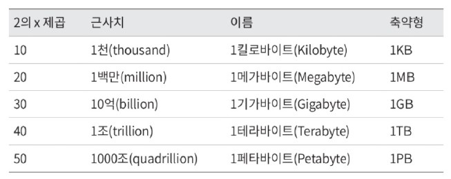
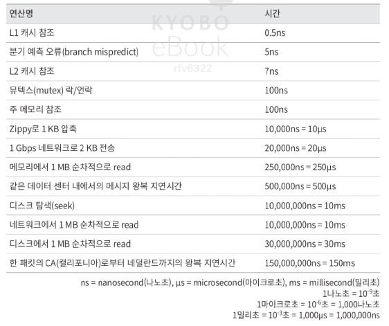
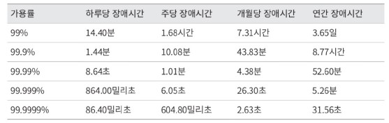
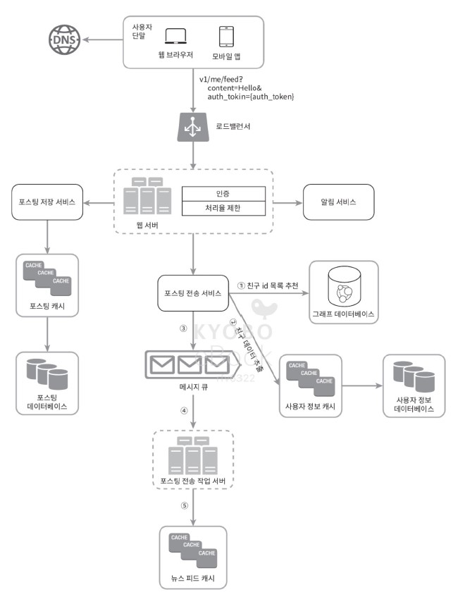
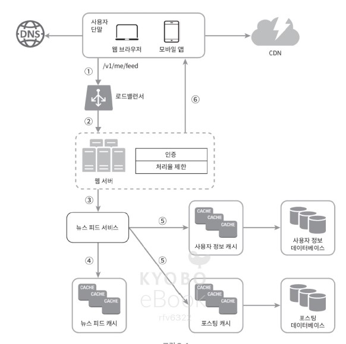

# 02. 개략적인 규모 추정

보편적으로 통용되는 성능 수치상에서 사고실험을 행하여 추정치를 계산하는 것
어떤 설계가 요구사항에 부합할 것인지 보기 위한 것

규모 확장성을 표현하는 데 필요한 기본기
- 2의 제곱수
- 응답 지연(latency) 값
- 가용성

## 2의 제곱수
데이터 볼륨의 단위를 2의 제곱수로 표현하면 어떻게 되는지를 알아야 함
최소 단위: 1바이트(8bit) (= ASCII 문자 하나가 차지하는 메모리 크기)

## 응답 지연
2010년에 공개된 통상적인 컴퓨터에서 구현된 연산들의 응답지연 값

이를 분석하여 얻을 수 있는 결론
- 메모리는 빠르지만 디스크는 아직 느림
- 디스크 탐색은 가능한 한 피할것
- 단순한 압축 알고리즘은 빠르다
- 데이터를 인터넷으로 전송하기 전에 가능하면 압축할 것
- 데이터 센터는 보통 여러 지역(region)에 분산되어 있고, 센터들 간에 데이터를 주고받는 데는 시간이 걸린다.

## 가용성
고가용성이란
- 시스템이 오랫동안 지속적으로 중단 없이 운영될 수 있는 능력
- 퍼센트로 표현
  - 100%: 시스템이 단 한 번도 중단된 적이 없었음을 의미
  - 대부분의 서비스가 99~100 사이의 값을 가짐
- SLA(Service Level Aggrement)
    - 서비스 사업자와 고객 사이에 맺어진 합의를 의미함
  - 서비스 사업자가 제공하는 서비스의 가용시간(uptime)이 공식적으로 기술됨
  
  
### 예제: 트위터 QPS와 저장소 요구량 추정
가정
- 월간 능동 사용자(monthly active user)는 3억명
- 50%의 사용자가 트위터를 매일 사용
- 평균적으로 각 사용자는 매일 2건의 트윗을 올림
- 미디어를 포함하는 트윗은 10%정도
- 데이터는 5년간 보관됨

추정
- QPS(Query Per Second) 추정치
  - 일단 능동 사용자(Daily Active User, DAU) = 3억x50% = 1.5억
  - QPS = 1.5억x2트윗/24시간/3600초 = 약 3500
  - 최대 QPS(Peek QPS) = 2xQPS = 약 7000
  
- 미디어 저장을 위한 저장소 요구량
  - 평균 트윗 크기: tweet_id에 64byete, 텍스트에 140byte, 미디어 1MB
  - 미디어 저장소 요구량: 1.5억 x 2 x 10% x 1MB = 30TB/일
  - 5년간 미디어를 보관하기 위한 저장소 요구량: 30TBx365x5 = 약 55PB

### 추가적인 이야기
결과를 내는 것보다 올바른 절차를 밟는 것이 중요함. 문제 해결 능력이 중요!
- 근사치를 활용한 계산(ex: 99987/9.1을 100000/10으로 계산)
- 과정에서 정한 가정들은 적어둘 것
- 단위를 붙여 적을것
- 많이 출제되는 개략적 규모 추정 문제: QPS, 최대 QPS, 저장소 요구량, 캐시 요구량, 서버수 등을 측정하는 것 (미리 연습해두기)

# 03. 시스템 설계 면접 공략법
## 시스템 설계 면접
- 두 명의 동료가 모호한 문제를 풀기 위해 협력하여 그 해결책을 찾아내는 과정에 대한 시뮬레이션
- 정답이 없음
- 최종 설계안보다 설계 과정을 보는 자리
- 설계 기술 시연
- 설계 과정에서 내린 결정들에 대한 방어
- 면접들관의 피드백을 처리

주요 목적
- 지원자가 협력에 적합한 사람인지
- 압박이 심한 상황에서도 잘 헤쳐 나갈 자질이 있는지
- 모호한 문제를 건설적으로 해결할 능력이 있는지
- 좋은 질문을 던질 능력이 있는지

를 확인하기 위함

부정적 신호(red flag, 피할 것)
- 과도한 엔지니어링
- 완고함
- 편협함

## 효과적 면접을 위한 4단계 접근법
### 1. 문제 이해 및 설계 범위 확정
- 요구사항을 완전히 이해하고 답을 내놓기
- 답을 내놓기 전, 질문하여 요구사항과 가정을 분명히 할 것
    - 올바른 질문하기
      - 구체적으로 어떤 기능을 만들어야 하는가?
      - 제품 사용자 수는 얼마나 되는가?
      - 회사의 규모 예상 성장 속도?
      - 회사가 주로 사용하는 기술 스택?
       - 설계를 단순화하기 위해 활용할 수 있는 기존 서비스?
    - 적절한 가정하기
    - 시스템 구축에 필요한 정보를 모으기

### 2. 개략적인 설계안 제시 및 동의 구하기
1. 설계안에 대한 최초 청사진 제시 및 의견 구하기 (면접관을 팀원처럼!)
2. 화이트보드나 종이에 핵심 컴포넌트를 포함하는 다이어그램 그리기 (클라이언트, API, 웹 서버, 데이터 저장소, 캐시, CDN, 메세지 큐 등)
3. 최초 설계안이 시스템 규모에 관계된 제약사항들을 만족하는 지를 계산해볼 것
4. 시스템의 구체적 사용 사례또 살펴보면, 에지 케이스 파악에 도움이 될 수 있음

아래 사진은 특정 예제에서 만든 개략적인 설계안 예시이다.

### 3. 상세 설계
- 설계 대상 컴포넌트 사이의 우선순위를 정하는 것
    - 면접마다 중요하게 요구하는 영역이 다를 수 있음. (시스템의 성능 특성, 특정 시스템 컴포넌트들의 세부사항을 깊이 있게 설명하는 것 등) -> 면접관과의 소통을 통해 정하는 것이 관건
- 시간 관리
   - 사소한 세부 사항을 설명하느라 자신의 능력을 입증하는 데 사용할 시간을 낭비하지 말것

아래 사진은, 위의 예제 아키텍처에서 상세 설계를 더한 사진이다.

### 4. 마무리
면접관이 결과물에 대한 후속 질문을 던지거나 나 스스로 추가 논의를 할 수 있는 지점

- 면접관의 질문: 시스템 병목구간, 혹은 개선 가능한 지점을 찾아내라
  - 개선할 점을 찾아내서 비판적 사고 능력을 보일 것
- 내 설계를 다시 한번 요약해주기: 면접관에게 기억 환기 효과
- 운영 이슈에 관한 논의
  - 메트릭 수집 방법?
  - 모니터링 방법?
  - 로그?
  - 시스템 배포 방법?
- 규모 확장 요구에 관한 논의
- 필요하지만 다루지 못했던 세부적 개선사항

### 면접에서 해야할 것
- 질문을 통해 확인할것: 스스로 내린 가정이 옳다 믿고 진행하지 말 것
- 문제의 요구사항 이해하기
- 정답, 최선의 답안은 없다. 요구사항을 기반으로 최선의 해결책을 제시했는 지 확인할 것
- 면접관이 나의 사고 흐름을 이해할 수 있도록 할 것
- 여러 해법을 함께 제시할 것
- 개략적 설계에 면접관이 동의하면, 각 컴포넌트의 세부사항을 설명하기 시작할 것. 가장 중요한 컴포넌트부터 진행
- 면접관의 아이디어를 이끌어낼 것 (면접관을 팀원처럼)
- 포기하지 말 것

### 하지 말아야 할 것
- 전형적인 면접 문제들에도 대비하지 않은 상태에서 면접장에 가지 말것
- 요구사항이나 가정을 분명히 하지 않은 상태에서 설계를 제시하지 말 것
- 처음부터 특정 컴포넌트의 세부사항을 너무 깊게 설명하지 말 것. 개략적 설계를 마친 뒤 세부사항을 설명할 것
- 진행 중에 막혔다면 힌트 청하기를 주저하지 말 것
- 소통을 주저하지 말 것
- 설계안을 내놓는 순간 면접이 끝난 것이라고 생각하지 말 것

### 시간 배분
45분 기준, 각 단계에 어느 정도 시간을 쓰는 것이 좋을 지 생각해보자
1. 문제 이해 및 설계 범위 확정: 3~10분
2. 개략적 설계안 제시 및 동의 구하기: 10~15분
3. 상세 설계: 10분~25분
4. 마무리: 3~5분