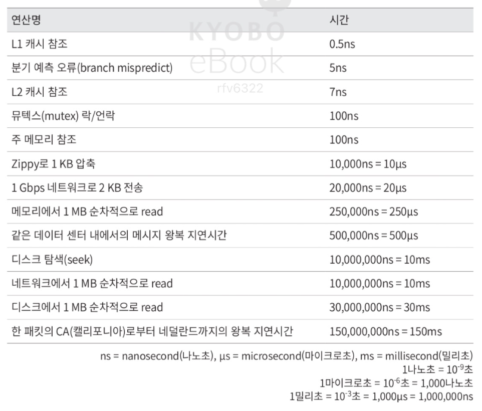

# 개 략 적 인 규 모 추 정

## 2의 제곱수
- 1바이트 = 8비트
- 아스키 문자 하나가 차지하는 메모리 크기 = 1바이트

**흔히 쓰이는 데이터 볼륨 단위들**

## 모든 프로그래머가 알아야 하는 응답 지연 값

**통상적인 컴퓨터에서 구현된 연산들의 응답지연 값**

**응답 지연 값 시각화**

**결론**
- 메모리는 빠르지만 디스크는 아직도 느리다.
- 디스크 탐색은 가능 한 피하라.
- 단순한 압축 알고리즘은 빠르다.
- 데이터를 인터넷으로 전송하기 전에 가능하면 압축하라.
- 데이터 센터는 보통 여러 지역에 분산되어 있고, 센터들 간에 데이터를 주고받는 데는 시간이 걸린다.

### 가용성에 관계된 수치들

**고가용성**
- 시스템이 오랜 시간동안 지속적으로 중단 없이 운영될 수 있는 능력
- 퍼센트로 표현. 100%는 단 한 번도 중단된 적이 없음을 의미
- 대부분의 서비스는 99%에서 100% 사이의 값을 가짐

### 예제: 트위터 QPS와 저장소 요구량 측정

**가정**
- 월간 능동 사용자는 3억명이다.
- 50%의 사용자가 트위터를 매일 사용한다.
- 평균적으로 각 사용자는 매일 2건의 트윗을 올린다.
- 미디어를 포함하는 트윗은 10% 정도다.
- 데이터는 5년간 보관된다.

**추정**

QPS(Query Per Second) 추정치
- 일간 능동 사용자 = `3억 x 50% = 1.5억`
- QPS = `1.5억 x 2트윗/24시간/3600초 = 약 3500`
- 최대 QPS = `2 x QPS = 약 7000`

미디어 저장을 위한 저장소 요구량
- 평균 트윗 크기
  - tweet_id에 64바이트
  - 텍스트에 140바이트
  - 미디어에 1MB
- 미디어 저장소 요구량: `1.5억 x 2 x 10% x 1MB = 30TB/일`
- 5년간 미디어를 보관하기 위한 저장소 요구량: `30TB x 365 x 5 = 약 55PB`

### 팁
- 개략적인 규모 추정과 관계된 면접에서 가장 중요한 것은 문제를 풀어 나가는 절차이다.
- `99987 / 9.1` 같은 수식은 `100,000 / 10` 같이 근사치로 간소화 가능
- 가정들은 적어 두라.
- 단위를 붙이라.
- 많이 출제되는 개략적 규모 추정 문제는 QPS, 최대 QPS, 저장소 요구량, 캐시 요구량, 서버 수 등을 추정하는 것이다.

# 시 스 템 설 계 면 접 공 략 법

## 효과적 면접을 위한 4단계 접근법

### 1단계 문제 이해 및 설계 범위 확정

**올바른 질문**

- 구체적으로 어떤 기능들을 만들어야 하나?
- 제품 사용자 수는 얼마나 되나?
- 회사의 규모는 얼마나 빨리 커지리라 예상하나? 석 달, 여섯 달, 일년 뒤의 규모는 얼마가 되리라 예상하는가?
- 회사가 주로 사용하는 기술 스택은 무엇인가? 설계를 단순화하기 위해 활용할 수 있는 기존 서비스로는 어떤 것들이 있는가?

**예제**
> 뉴스 피드 시스템을 설계하라는 요구를 받았다고 가정
- 지원자: 모바일 앱과 웹 중 어느쪽을 지원하는지?
- 면접관: 둘 다 지원
- 지원자: 가장 중요한 기능은?
- 면접관: 새로운 포스트를 올리고, 다른 친구의 뉴스 피드를 볼 수 있도록 하는 기능
- 지원자: 뉴스 피드의 정렬 기준은 무엇인지? 피드에 올라갈 포스트마다 다른 가중치가 부여되어야 하는지 알고 싶기 때문.
- 면접관: 문제를 단순하게 만들기 위해, 시간 역순으로 정렬한다고 가정
- 지원자: 한 사용자는 최대 몇 명의 사용자와 친구를 맺을 수 있는지?
- 면접관: 5000명
- 지원자: 사이트로 오는 트래픽 규모는?
- 면접관: 일단 능동 사용자(DAU)는 천만 명
- 지원자: 피드에 이미지나 비디오도 올릴 수 있는지?
- 면접관: 이미지나 비디오 같은 미디어 파일도 포스트 가능

**가장 중요한 것은 요구 사항을 이해하고 모호함을 없애는 것 이다.**

### 2단계 개략적인 설계안 제시 및 동의 구하기

- 설계안에 대한 최초 청사진을 제시하고 의견 구하기
- 핵심 컴포넌트를 포함하는 다이어그램 그리기(클라이언트, API, 웹 서버, 캐시 등)
- 최초 설계안이 시스템 규모에 관계된 제약사항들을 만족하는지를 개략적으로 계산하기

**예제**
> 뉴스 피드 시스템에서 개략적 설계
- 피드 발행: 사용자가 포스트를 올리면 관련된 데이터가 캐시/데이터베이스에 기록되고, 해당 사용자의 친구 뉴스 피드에 뜨게 된다.
- 피드 생성: 어떤 사용자의 뉴스 피드는 해당 사용자 친구들의 포스트를 시간 역순으로 정렬하여 만든다.

위 두 가지에 대한 플로우

*동작에 대한 상세한 내용은 11장에서 설명*

### 3단계 상세 설계

**지금까지 달성한 목표**
- 시스템에서 전반적으로 달성해야 할 목표와 기능 범위 확인
- 전체 설계의 개략적 청사진 마련
- 해당 청사진에 대한 면접관의 의견 청취
- 상세 설계에서 집중해야 할 영역을 확인

**이후에 중요한 점**
- 설계 대상 컴포넌트 사이의 우선순위를 정하는 것
- 시간 관리에 특별히 주의를 기울일 것

**예제**
> 뉴스 피드 시스템의 개략적 설계를 마쳤고, 면접관도 그 설계에 만족하고 있다고 가정

깊이 탐구해야 할 것
1. 피드 발행
2. 뉴스 피드 가져오기

위 두 가지에 대한 상세 설계

### 4단계 마무리
> 후속 질문이나 추가 논의를 진행할 때 활용할 지침들을 보자

- 면접관에게 여러분의 설계가 완벽하다거나 개선할 부분이 없다는 답은 하지 말기. 비판적 사고 능력을 보일 기회
- 만든 설계를 한번 다시 요약하기. 환기 효과
- 오류가 발생하면 무슨 일이 생기는지 따져보기
- 운영 이슈 논의하기. 메트릭, 로그, 모니터링, 배포 등
- 미래에 닥칠 규모 확장 요구에 어떻게 대처할 것인지
- 시간이 좀 남았다면, 필요하지만 다루지 못했던 세부적 개선사항들 제안하기

**해야 할 것**
- 스스로 내린 가정이 옳다고 믿지 말고 질문을 통해 확인하기
- 문제의 요구사항 이해하기
- 정답이나 최선의 답안 같은 것은 없다는 점 명시하기
- 면접관이 여러분의 사고 흐름을 이해하기
- 가능하다면 여러 해법을 함께 제시하기
- 개략적 설계에 면접관이 동의하면, 가장 중요한 컴포넌트부터 세부사항 설명하기
- 면접관의 아이디어를 이끌어 내기
- 포기하지 말기

**하지 말아야 할 것**
- 전형적인 면접 문제들도 대비하지 않은 상태로 면접보지 말기
- 요구사항이나 가정들을 분명히 하지 않은 상태에서 설계하지 말기
- 처음부터 특정 컴포넌트의 세부사항을 너무 깊게 설명하지 말기
- 진행 중에 막혔다면, 힌트 청하기를 주저하지 말기
- 소통 주저하지 말기
- 설게안을 내놓는 순간 면접이 끝난다고 생각하지 말고 의견을 일찍, 그리고 자주 구하기 

### 시간 배분
> 45분의 시간이 주어진다고 가정

1. 문제 이해 및 설계 범위 확장: 3분 ~ 10분
2. 개략적 설계안 제시 및 동의 구하기: 10분 ~ 15분
3. 상세 설계: 10분 ~ 25분
4. 마무리: 3분 ~ 5분
