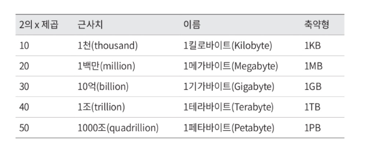
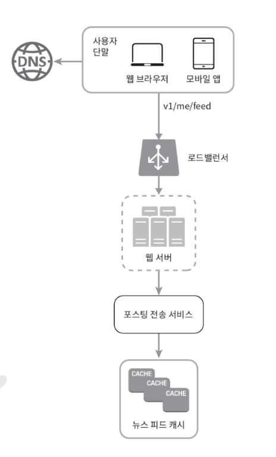

# 2장 개략적인 규모 추정
- 보편적으로 통용되는 성능 수치상에서 사고 실험을 행하여 추정치를 계산하는 행위
- 어떤 설계가 요구사항에 부합할 것인지 보기 위한 것

## 2의 제곱수
- 제대로 된 계산 결과를 얻기 위해서 -> 데이터 볼륨의 단위를 2의 제곱수로 표현 가능해야함
- 최소 단위 : 1바이트(8비트)


## 응답지연 값

- 최근에는 이 수들을 시간화해주는 도구 등장
### 수치들의 의미
- 메모리는 빠르지만 디스크는 아직도 느리다.
- 디스크 탐색은 가능한 한 피해야 한다
- 단순한 압축 알고리즘은 빠르다.
- 데이터를 인터넷으로 전송하기 전에 가능하면 압축하는 게 좋다.
- 데이터 센터는 보통 여러 지역에 분산되어 있고,센터들 간에 데이터를 주고받는 데는 시간이 걸린다.

## 가용성 수치들
- 고가용성 : 오랜 시간 동안 지속적으로 중단 없이 운영될 수 있는 능력
    -  대부분 99% ~ 100%
- SLA : 서비스 사업자와 고객 사이에 맺어진 합의
    - 서비스 사업자가 제공하는 서비스의 가용시간이 기술
- 가용시간 : 시스템이나 서비스가 실제로 사용자에게 정상적으로 제공되는 시간 
    - 숫자 9가 많을 수록 좋은 수치
    - 9의 개수와 시스템 장애 시간 사이의 관계
    

## 예제 : 수치 계산
- 트위터 QPS와 저장소 요구량 측정
### 가정
- 월간 능동 사용자는 3억 명이다.
- 50% 의 사용자가 트위터를 매일 사용한다.
- 평균적으로 각 사용자는 매일 2 건의 트윗을 올린다
- 미디어를 포함하는 트윗은 10% 정도다.
- 데이터는 5 년간 보관된다.
### 추정
- 주어진 가정을 이용해 이 값들을 계산해야된다
- QPS(Query Per Second) 추정치
    - 일간 능동 사용자 = 3 억 X 50%= 1.5 억 
    - QPS=1.5억 x 2 트윗 / 24 시간 / 3600 초 = 약 3500
    - 최대 QPS=2XQPS=약 7000
- 미디어 저장을 위한 저장소 요구량
    - 평균 트윗 크기
        - tweet_id 에 64 바이트
        - 텍스트에 140 바이트
        - 미디어에 1MB
    - 미디어 저장소 요구량 : 1.5 억 X 2X 10% X 1 MB=30TB/ 일
    - 5 년간 미디어를 보관하기 위한 저장소 요구량 : 30TB X 365×5=약 55PB
## 💡 팁
1. 정확한 계산보다는 적절한 근사치의 활용으로 시간 절약
2. 가정은 메모
3. 단위 반드시 적기
4. 출제 빈도수 높은 문제들은 미리 연습하기
<br><br><br>

# 3장 시스템 설계 면접 공략법
## 알아두어야 할 점들
- 정해진 답은 없다
- 설계 과정에서 내린 결정들에 대한 방어 능력을 보이는 자리이며 ,
면접관의 피드백을 건설적인 방식으로 처리할 자질이 있음을 보이는 자리인
것이다.
- 설계의 순수성에 집착한 나머지 다른 것들을 놓치는 것을 부정적 신호로 받아들인다

## 효과적 면접을 위한 4단계 접근법
### 1단계 : 문제 이해 및 설계 범위 확정
- 빠른 대답보다는 요구사항과 가정들을 분명히 하는 것이 중요하다
- 올바른 질문을 하는것, 적절한 가정을 하는 것, 시스템 구축에 필요한 정보를 모으는 것

### 2단계 : 개략적인 설계안 제시 및 동의 구하기
- 설계안에 대한 최초 청사진 제시
- 면접관이 팀원인 것처럼 의견 구하기
- 핵심 컴포넌트를 포함하는 다이어그램 그리기
- 제약사항들을 만족하는지 개략적으로 계산하기
- 면접의 규모에 따라 API 엔드포인트나 데이터베이스 스키마도 보여야 할 수 있음
### 3단계 : 상세 설계
- 설계 대상 컴포너트 사이의 우선순위 정하기
- 특정 시스템 컴포너트들의 세부사항을 깊이 있게 설명하는 것을 원함
- 면접관에게 어필하기 좋은 중요한 내용들을 설명하는데 시간 쓰기 (시간 관리)

### 4단계 : 마무리
마무리 단계에서 후속 질문에 답하거나 추가적으로 답변할 수 있는 것들
- 개선할 지점 답변을 통해 비판적 사고 능력 어필
- 마지막으로 만든 설계를 다시 한번 요약
- 오류 발생시 무슨 일이 생기는지 살펴보기
- 운영 이슈 논의
- 규모 확장에 대한 대처 방법
- 세부적 개선사항들
---

## 실전 예제
- 4단계 접근법을 적용한 예시
- 가정 : 뉴스 피드 시스템을 설계하라는 면접
### 1단계
- 요구사항을 분명히 하기 위한 질문 필요
- 적절한 질문 예시
    - 중요한 기능은 어떤건지
    - 웹? 앱? 중 어떤것을 지원
    - 뉴스 피드 정렬 방식
    - 최대 친구 수
    - 트래픽 규모
    - 포스트 형식
- 이 질문들을 통해서 얻을 수 있는 것 : 요구사항을 이해하고 모호함을 없애기
### 2단계
- 두가지 처리 플로 나눌 수 있음 : 피드발행, 피드생성
- 피드 발행 : 사용자가 포스트를 올리면 관련된 데이터가 캐시 / 데이터베이스
에 기록되고, 해당 사용자의 친구 뉴스 피드에 뜨게 된다. 
    - 피드 발행 플로
    
- 피드 생성 : 어떤 사용자의 뉴스 피드는 해당 사용자 친구들의 포스트를 시간
역순으로 ( 최신 포스트부터 오래된 포스트 순으로 ) 정렬하여 만든다. <br>
    - 피드 생성 플로
    

### 3단계
- 각 플로에 대한 상세 설계
- 피드 발행

- 피드 생성


## 💡 면접 꿀팁들
```
핵심 포인트 리마인드
```
### 해야 할 것
- 질문을 통해 가정 확인하기
- 요구사항 이해하기
- 정답이 없음을 이해하기
- 면접관이 사고흐름을 이해할 수 있도록 하기
- 다양한 해법 제시하기
- 개략적 설계가 끝나면 중요한 컴포넌트부터 설명하기
- 면접관과 협력하기
- 포기하지말기
### 하지 말아야 할 것
- 전형적인 면접 문제들도 대비하지 않고 면접 가기
- 요구사항이나 가정들을 분명히 하지 않고 설계 제시하지 말기
- 처음부터 특정 컴포넌트의 세부사항을 깊이 설명하지 말기
- 진행중에 막혔다면 힌트를 청하기를 주저하지 말기
- 소통을 주저하지 말기
- 면접관이 끝났다고 말하기전까지 방심하지 말기
### 시간 배분
- 바람직한 시간 배분
    - 1 단계 - 문제 이해 및 설계 범위 확정 : 3 분에서 10 분
    - 2 단계 - 개략적 설계안 제시 및 동의 구하기 : 10 분에서 15 분
    - 3 단계 - 상세 설계 : 10 분에서 25분
    - 4 단계 - 마무리 : 3 분에서 5 분
- 대략적인 추정치일 뿐 상황에 따라 변경될 수 있음