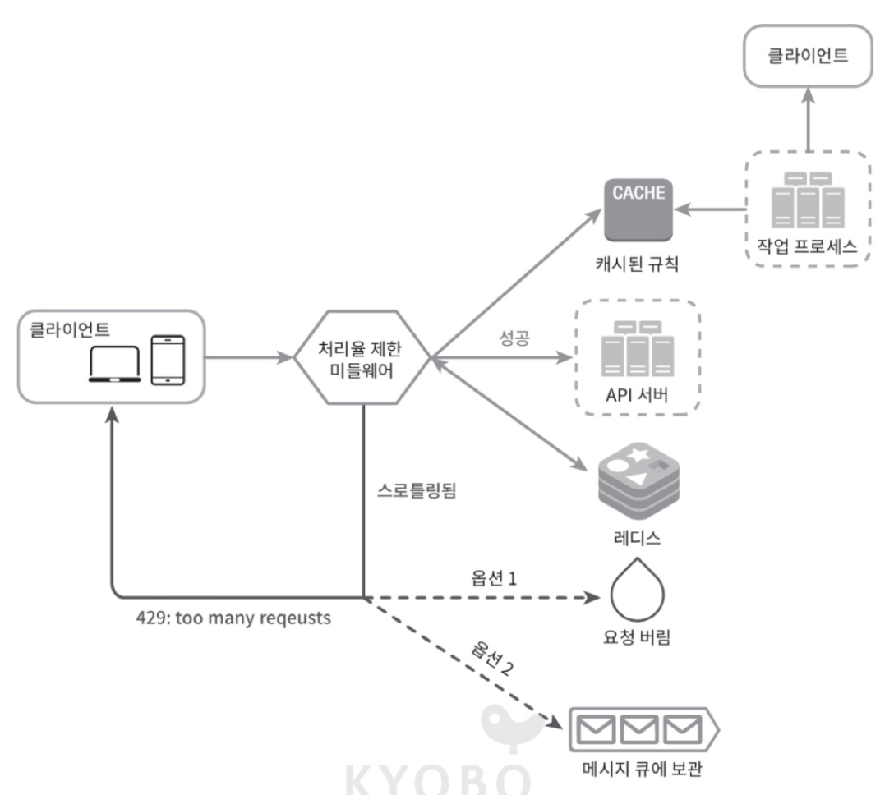

# 처리율 제한 장치의 설계

## 처리율 제한 장치
처리율 제한 장치 (rate limiter)란 **클라이언트 또는 서비스가 보내는 트래픽의 처리율(rate)를 제어하기 위한 장치**이다.

클라이언트의 API 요청 횟수가 제한 장치에 정의된 임계치(threshold)를 넘어서면 추가로 도달한 모든 호출은 처리가 중단(block) 된다.
### 사용 예시
- 사용자는 초당 2회 이상 새 글을 올릴 수 없다.
- 같은 IP 주소로는 하루에 10개 이상의 계정을 생성할 수 없다.
- 같은 디바이스로는 주당 5회 이상 리우드(reward)를 요청할 수 없다.

### 좋은 점
- DoS(Denial of Service) 공격에 의한 **자원 고갈(resource starvation)을 방지할 수 있다.**
- 제3자(third-parth) API에 사용료를 지불하고 있는 회사들의 경우, **비용을 절감할 수 있다.**
- 봇에서 오는 트래픽이나 사용자의 잘못된 이용 패턴으로 유발된 트래픽을 걸러내어 **서버 과부하를 막는다.**

## 1단계) 문제 이해 및 설계 범위 확정
### 요구사항 정의
1. 클라이언트, 서버 중 어떤 종류의 처리율 제한 장치인가 ? 
2. 어떤 기준을 사용해서 API 호출을 제어해야 하는가 ? (IP 주소 혹은 사용자 ID)
3. 시스템 규모는 어느정도 인가 ? (스타트업 정도 혹은 사용자가 많은 큰 기업)
4. 시스템이 분산 환경에서 동작해야 하는가 ?
5. 처리율 제한 장치는 독립된 서비스인가 혹은 애플리케이션 코드에 포함될 수도 있는가 ?
6. 사용자의 요청이 처리율 제한 장치에 의해 걸러진 경우 사용자에게 그 사실을 알려야 하는가 ?

### 요구사항 요약
1. 설정된 처리율을 초과하는 **요청은 정확하게 제한**한다.
2. **낮은 응답 시간** : 이 처리율 제한 장치는 HTTP 응답시간에 나쁜 영향을 주어서는 곤란하다.
3. 가능한 한 **적은 메모리**를 써야한다.
4. **분산형 처리율 제한(distributed rate limiting)**: 하나의 처리율 제한 장치를 여러 서버나 프로세스에서 공유할 수 있어야 한다.
5. **예외 처리 :** 요청이 제한되었을 때는 그 사실을 사용자에게 분명하게 보여주어야 한다.
6. **높은 결합 감내성(fault tolerance)** : 제한 장치에 장애가 생기더라도 전체 시스템에 영향을 주어서는 안 된다.

## 2단계) 개략적 설계안 제시 및 동의 구하기
### 1. 처리율 제한 장치는 어디에 둘 것인가 ?
1. **클라이언트 측에 두는 경우**
- 클라이언트의 요청은 쉽게 위변조가 가능하기 때문에 불안정적이다.
- 모든 클라이언트의 구현을 통제하는 것이 어려울 수 있다.

2. **서버 측에 두는 경우**
처리율 제한 장치를 API 서버에 둘 수 있다.


- 처리율 제한 장치를 미들웨어(middleware)로 만들어 요청을 통제할 수 있다.


- API 서버의 처리율이 초당 2개인 경우 예상도


Cloud MicroService의 경우, 처리율 제한 장치는 보통 API 게이트웨이 컴포넌트에 구현된다.
> API 게이트웨이
처리율 제한, SSL termination, authentication, IP 허용 목록(whitelist) 관리 등을 지원하는 완전 위탁관리형 서비스이다.

2.1. 처리율 제한 장치를 서버에 두는 경우
- 프로그래밍 언어, 캐시 서비스 등 현재 사용 중인 기술 스택이 서버 측 구현을 지원하기에 충분할 정도로 효율이 높은지 확인하라.
- 사업 필요에 맞는 처리율 제한 알고리즘을 찾아라. 서버 측에서 모든 것을 구현하기로 했다면, 알고리즘을 자유롭게 선택할 수 있다. 하지만 게이트웨이를 사용하기로 했다면 선택지는 제한될 수도 있다.

2.2. 처리율 제한 장치를 API 게이트웨이에 두는 경우
- API 게이트웨이를 이미 도입하고 있는 경우, 처리율 제한 기능을 게이트웨이로 포함시켜야 할 수도 있다.
- 처리율 제한 장치를 구현할 충분한 인력이 없다면 상용 API 게이트웨이를 쓰는 것이 바람직하다.

## 2. 처리율 제한 알고리즘

- 토큰 버킷(token bucket)
- 누출 버킷(leaky bucket)
- 고정 윈도 카운터(fixed window counter)
- 이동 윈도 로그(sliding window log)
- 이동 윈도 카운터(sliding window counter)

### 1. 토큰 버킷 알고리즘
토큰 버킷 알고리즘은 처리율 제한에 폭넓게 이용되고 있다. 
간단하고, 알고리즘에 대한 세간의 이해도도 높아 인터넷 기업들이 보편적으로 사용하고 있다. (ex. AWS와 스트라이프)

> 동작 원리


```
// token_max_size : 버킷에 담을 수 있는 토큰의 최대 개수
// refill_rate : 초당 몇 개의 토큰이 버킷에 공급되는가
func token_bucket(int token_max_size, float refill_rate) {
    tokens := token_max_size
    last_refill_time := current_time()
    
    // 토큰 리필 함수
    func refill_tokens() {
        now := current_time()
        time_passed := now - last_refill_time
        tokens_to_add := time_passed * refill_rate
        
        // refiller : 이 버킷에 매초 refill_rate만큼의 토큰을 추가한다.
        tokens = min(tokens + tokens_to_add, token_max_size) // overflow : 추가 공급된 토큰은 버려진다.
        last_refill_time = now
    }
    
    // 요청 처리
    if request {
        refill_tokens()
        
        if tokens >= 1 {
            send_to_system(request)
            tokens--
        } else {
            throw rate_limit_exceeded_error // dropped : 충분한 토큰이 없는 경우, 해당 요청은 버려진다.
        }
    }
}
```

> 버킷은 몇 개나 있어야 할까 ? 공급 제한 규칙에 따라 달라진다.
- 통상적으로, API 엔드포인트(endpoint)마다 별도의 버킷을 둔다. (Ex. 사용자마다 하루에 한 번만 포스팅 할 수도 있고, 친구는 150명까지 추가할 수 있다.)
- IP 주소별로 처리율 제한을 적용해야 한다면, IP 주소마다 버킷을 하나씩 할당 해야한다.
- 시스템의 처리율을 초당 10,000개 요청으로 제한하고 싶다면, 모든 요청이 하나의 버킷을 공유하도록 해야할 것이다.

> 장점
- 구현이 쉽다.
- 메모리 사용 측면에서도 효율적이다.
- 짧은 시간에 검증되는 트래픽(burst of traffic)도 처리 가능하다. 버킷에 남은 토큰이 있기만 하면 요청은 시스템에 전달될 것이다.

> 단점
- 이 알고리즘은 버킷 크기와 토큰 공급률이라는 두 개 인자를 가지고 있는데, 이 값을 적절하게 튜닝하는 것은 까다로운 일이 될 것이다.

### 2. 누출 버킷 알고리즘
토큰 버킷 알고리즘과 비슷하지만, 요청 처리율이 고정되어 있다는 점이 다르다. 누출 버킷 알고리즘은 보통 FIFO(First In First Out) 큐로 구현한다.
전자상거래 기업인 쇼피파이(Shopify)가 이 알고리즘을 사용하여 처리율 제한을 구현하고 있다.

> 동작 원리


```
// bucket_size : 버킷에 담을 수 있는 요청의 최대 개수
// outflow rate : 지정된 시간당 몇 개의 항목을 처리할 지 지정하는 값이다. 보통 초 단위로 표현한다.
func leaky_bucket(int bucket_size, float outflow_rate) {
    queue := new Queue()
    last_outflow_time := current_time()
    
    // 누출 함수
    func leak() {
        now := current_time()
        time_passed := now - last_outflow_time
        requests_to_process := time_passed * outflow_rate
        
        for i := 0; i < requests_to_process; i++ {
            if !queue.is_empty() {
                request := queue.dequeue()
                send_to_system(request)
            }
        }
        last_outflow_time = now
    }
    
    // 요청 처리
    if request {
        leak()
        
        if queue.size() < bucket_size {
            queue.enqueue(request)
        } else {
            throw rate_limit_exceeded_error // dropped : 버킷이 가득 찬 경우, 해당 요청은 버려진다.
        }
    }
}
```

> 장점
- 큐의 크기가 제한되어 있어 메모리 사용량 측면에서 효율적이다.
- 고정된 처리율을 갖고 있기 때문에 안정적 출력(stable outflow rate)가 필요한 경우에 적합하다.

> 단점
- 단시간에 많은 트래픽이 몰리는 경우 큐에는 오래된 요청들이 쌓이게 되고, 그 요청들을 제때 처리 못 하면 최신 요청들은 버려지게 된다.
- 두 개 인자를 갖고 있는데, 이들을 올바르게 튜닝하기가 까다로울 수 있다.

### 3. 고정 윈도 카운터 알고리즘

1. 타임라인(timeline)을 고정된 간격의 윈도(window)로 나누고, 각 윈도마다 카운터(counter)를 붙인다.
2. 요청이 접수될 때마다 이 카운터의 값은 1씩 증가한다.
3. 이 카운터의 값이 사전에 설정된 임계치(threshold)에 도달하면 새로운 요청은 새 윈도가 열릴 때까지 버려진다.

```
// window_size : 윈도의 크기 (예: 1분, 1시간)
// max_requests : 윈도 당 최대 요청 수
func fixed_window_counter(int window_size, int max_requests) {
    current_window_start := current_time() // 현재 윈도의 시작 시점
    request_count := 0 // 현재 윈도의 요청 수
    
    // 요청 처리
    if request {
        now := current_time()
        
        // 새로운 윈도가 시작된 경우
        if now >= current_window_start + window_size {
            current_window_start = now
            request_count = 0 // 카운터 초기화
        }
        
        if request_count < max_requests {
            send_to_system(request)
            request_count++
        } else {
            throw rate_limit_exceeded_error // dropped : 윈도 당 최대 요청 수를 초과한 경우, 해당 요청은 버려진다.
        }
    }
}
```

> 동작 원리


> 장점
- 메모리 효율이 좋다.
이해하기 쉽다.
윈도가 닫히는 시점에 카운터를 초기화 하는 방식은 특정한 트래픽 패턴을 처리하기에 적합하다.

> 단점
- 윈도의 경계 부근에 순간적으로 많은 트래픽이 집중될 경우, 윈도에 할당된 양보다 더 많은 요청이 처리될 수 있다.


### 4. 이동 윈도 로깅 알고리즘
앞서 이야기한 윈도 경계 부근에 트래픽이 집중되는 경우 시스템에 설정된 한도보다 많은 요청을 처리하게 된다. 이동 윈도 로깅 알고리즘은 이 문제를 해결한다.

1. 요청의 타임스탬프(timestamp)를 추적한다. 타임스탬프 데이터는 보통 Redis의 Sorted Set과 같은 캐시에 보관한다.
2. 새 요청이 오면 만료된 타임스탬프는 제거한다. 만료된 타임스탬프는 그 값이 현재 윈도의 시작 시점보다 오래된 타임스탬프를 말한다.
3. 새 요청의 타임스탬프를 로그(log)에 추가한다.
4. 로그의 크기가 허용치보다 같거나 작으면 요청을 시스템에 전달한다. 그렇지 않은 경우에는 처리를 거부한다.

```
// window_size : 윈도의 크기 (예: 1분, 1시간)
// max_requests : 윈도 당 최대 요청 수
func sliding_window_log(int window_size, int max_requests) {
    log := new SortedSet() // 타임스탬프를 저장하는 정렬된 집합
    
    // 요청 처리
    if request {
        now := current_time()
        window_start := now - window_size
        
        // 만료된 타임스탬프 제거
        log.remove_if(timestamp < window_start)
        
        // 새 요청의 타임스탬프 추가
        log.add(now)
        
        if log.size() <= max_requests {
            send_to_system(request)
        } else {
            throw rate_limit_exceeded_error // dropped : 윈도 당 최대 요청 수를 초과한 경우, 해당 요청은 버려진다.
        }
    }
}
```

> 동작 원리


예제의 처리율 제한기는 분당 최대 2회의 요청만을 처리하도록 설정 되었다.
1. 1:00:01에 첫 번째 요청이 도착) 로그는 비어 있는 상태다. 따라서 이 요청은 정상적으로 허용되었다.
2. 1:00:30에 두 번째 요청이 도착) 해당 타임스탬프가 로그에 추가되었고, 추가 직후 로그의 크기는 2였다. 이는 허용 한도를 초과하지 않기 때문에 요청은 시스템에 전달되었다.
3. 1:00:50에 세 번째 요청이 도착) 로그에 타임스탬프가 추가되면서 크기는 3이 되었고, 이는 허용 한도를 초과하는 값이었다. 따라서 타임스탬프는 로그에 남지만, 해당 요청은 거부되었다.
4. 1:01:40에 새로운 요청이 도착) 이때 1:00:40~1:01:40 범위 안에 있는 요청만 1분 윈도우 내 유효 요청으로 간주된다. 따라서 1:00:40 이전에 기록된 타임스탬프(1:00:01, 1:00:30)는 모두 만료되어 로그에서 삭제된다. 삭제 이후 로그 크기는 2가 되었고, 이에 따라 1:01:40의 신규 요청은 정상적으로 시스템에 전달되었다.

> 장점
- 이 알고리즘으 구현하는 처리율 제한 메커니즘은 아주 정교하다. 어느 순간의 윈도를 보더라도, 허용되는 요청의 개수는 시스템의 처리율 한도를 넘지 않는다.

> 단점
- 이 알고리즘은 다량의 메모리를 사용하는데, 거부된 요청의 타임스탬프도 보관하기 때문이다.

### 5. 이동 윈도 카운터 알고리즘
고정 윈도 카운터 알고리즘과 이동 윈도 로깅 알고리즘을 결합한 것이다.
이 알고리즘은 두 가지 접근법이 사용될 수 있다.

1. 

> 동작 원리
```
// window_size : 윈도의 크기 (예: 1분, 1시간)
// max_requests : 윈도 당 최대 요청 수
func sliding_window_counter(int window_size, int max_requests) {
    current_window_start := current_time() // 현재 윈도의 시작 시점
    request_count := 0 // 현재 윈도의 요청 수
    previous_window_start := current_window_start - window_size // 이전 윈도의 시작 시점
    previous_request_count := 0 // 이전 윈도의 요청 수
    
    // 요청 처리
    if request {
        now := current_time()
        
        // 새로운 윈도가 시작된 경우
        if now >= current_window_start + window_size {
            previous_window_start = current_window_start
            previous_request_count = request_count
            current_window_start = now
            request_count = 0 // 카운터 초기화
        }
        
        // 이동 윈도 계산
        time_passed := now - current_window_start
        weight := float(window_size - time_passed) / float(window_size)
        effective_request_count := request_count + int(float(previous_request_count) * weight)
        
        if effective_request_count < max_requests {
            send_to_system(request)
            request_count++
        } else {
            throw rate_limit_exceeded_error // dropped : 윈도 당 최대 요청 수를 초과한 경우, 해당 요청은 버려진다.
        }
    }
}
```


- 현재 1분간의 요청수 + 직전 1분간의 요청수 X 이동 윈도와 직전 1분이 겹치는 비율
- 위 예제에 따르면 현재 윈도에 들어있는 요청은 3 + 5 X 70% = 6.5개이다. 반올림해서 쓸 수도 있고 내림하여 
쓸 수도 있는데, 본 예제에서는 내림하여 값을 6으로 정의한다.
- 위 예제의 경우 처리율 제한 한도가 분당 7개 요청이라고 했으므로, 현재 1분의 30% 시점에 도착한 신규 요청은 시스템으로 전달될 것이다. 하지만 직후에는 한도에 도달 하였으므로 더 이상의 요청은 받을 수 없을 것이다.

> 장점
- 이전 시간대의 평균 처리율에 따라 현재 윈도의 상태를 계산하므로 짧은 시간에 몰리는 트래픽에도 잘 대응한다.
- 메모리 효율이 좋다.

> 단점
- 직전 시간대에 도착한 요청이 균등하게 분포되어 있다고 가정한 상태에서 추정치를 계산하기 때문에 다소 느슨하다. 하지만 이 문제는 생각만큼 심각한 것은 아닌데, 클라우드플레어(Cloudflare)가 실시했던 실험에 따르면 40억 개의 요청 가운데 시스템의 실제 상태와 맞지 않게 허용되거나 버려진 요청은 0.003%에 불과했다.

## 처리율 보관 데이터베이스

처리율 제한에 사용되는 카운터는 어디에 보관할 것인가 ?
데이터베이스는 디스크 접근 때문에 느리니까 메모리상에서 동작하는 캐시가 바람직하다. 빠른데다 시간에 기반한 만료 정책을 지원하기 때문이다. 
일례로 Redis는 처리율 제한 장치를 구현할 때 자주 사용되는 메모리 기반 저장장치로서, INCR과 EXPIRE의 두 가지 명령어를 지원한다.

- INCR : 지정된 키(key)의 값을 1씩 증가시킨다. 키가 존재하지 않으면 0으로 초기화한 후 1로 증가시킨다.
- EXPIRE : 지정된 키가 일정 시간이 지나면 만료되도록 설정한다.

> 처리율 제한 장치의 개략적 구조


1. 클라이언트가 처리율 제한 미들웨어에게 요청을 보낸다.
2. 처리율 제한 미들웨어는 Redis의 지정 버킷에서 카운터를 가져와서 한도에 도달했는지 아닌지를 검사한다.
- 한도에 도달했다면 요청은 거부된다.
- 한도에 도달하지 않았다면 요청은 API 서버로 전달된다. 한편 미들웨어는 카운터의 값을 증가시킨 후 다시 Redis에 저장한다.


개략적 설계만 봐서는 다음과 같은 사항을 알 수가 없다.
1. 처리율 제한 규칙은 어떻게 만들어지고 어디에 저장되는가 ?
- 처리율 제한 규칙은 오픈소스를 사용할 수 있다.
- 처리율 제한 규칙은 보통 설정 파일(configuration file) 형태로 디스크에 저장된다.

2. 처리가 제한된 요청들은 어떻게 처리되는가 ?
경우에 따라서는 한도 제한에 걸린 메시지를 나중에 처리하기 위해 큐에 보관할 수도 있다.
클라이언트는 자기 요청이 처리율 제한에 걸리고 있는지(throttle), 자기 요청이 처리율 제한에 걸리기까지 HTTP 응답 헤더(response header)에 있다.
- X-Ratelimit-Remaining : 윈도 내에 남은 처리 가능 요청의 수
- X-Ratelimit-Limit : 매 윈도마다 클라이언트가 전송할 수 있는 요청의 수
- X-Ratelimit-Retry-After : 한도 제한에 걸리지 않으려면 몇 초 뒤에 요청을 다시 보내야 하는지 알림

사용자가 너무 많은 요청을 보내면 429 too many requests 오류를 X-Ratelimit-Retry-After 헤더와 함께 반환하도록 한다.

> 처리율 제한 장치의 상세 설계


1. 클라이언트가 요청을 서버에 보내면 요청은 먼저 처리율 제한 미들웨어에 도달하낟.
2. 처리율 제한 미들웨어는 제한 규칙을 캐시에서 가져온다. 아울러 카운터 및 마지막 요청의 타임스탬프를 Redis 캐시에서 가져온다. 가져온 값들에 근거하여 해당 미들웨어는 다음과 같은 결정을 내린다.
- 해당 요청이 처리율 제한에 걸리지 않은 경우에는 API 서버로 보낸다.
- 해당 요청이 처리율 제한에 걸렸다면 429 too many reqeusts 에러를 클라이언트에 보낸다. 한편, 해당 요청은 그대로 버릴 수도 있고 메시지 큐에 보관할 수도 있다.

## 분산 환경에서의 처리율 제한 장치의 구현

여러 대의 서버와 병렬 스레드를 지원하도록 시스템을 확장하는 경우 다음 두 가지 문제가 발생할 수 있다.
1. 경쟁 조건(race condition)
2. 동기화(synchronization)

앞서 살펴본 대로, 처리율 제한 장치는 대략 다음과 같이 동작한다.

1. Redis에서 카운터의 값을 읽는다.
2. counter + 1의 값이 임계치를 넘는지 본다.
3. 넘지 않는다면 Redis에 보관된 카운터 값을 1만큼 증가시킨다.

