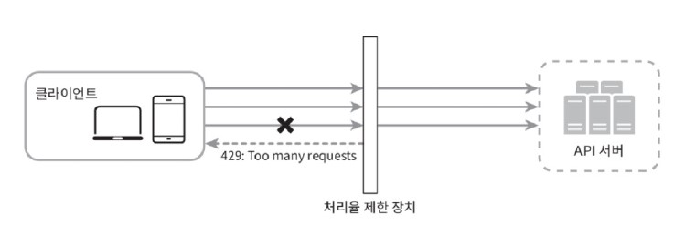

# 04. 처리율 제한 장치의 설계

- 처리율 제한 장치
    - 클라이언트 또는 서비스가 보내느 트래픽의 처리율을 제어하기 위한 장치
    - 예시: Http에서, 특정 기간 내 전송되는 클라이언트의 요청 횟수 제한
    - API 요청 횟수가 제한 장치에 정의된 임계치를 넘어서면, 추가로 도달한 모든 호출은 처리가 block됨

처리율 제한 사례
- 사용자는 초당 2회 이상 새 글을 올릴 수 없다.
- 같은 IP 주소로는 하루에 10개 이상의 계정을 생성할 수 없다.
- 같은 디바이스로는 주당 5회 이상 리워드를 요청할 수 없다.

- API에 처리율 제한 장치를 두면 좋은 점
  - DoS 공격에 의한 자원 고갈을 방지할 수 있다. 
    - 추가 요청에 대해서는 처리를 중단하기 때문
  - 비용 절감
    - 추가 요청에 대한 처리를 제한하기 때문에
        - 서버를 많이 두지 않아도 됨
        - 우선순위가 더 높은 API에 더 많은 자원을 할당할 수 있다
        - 제3자(third party) API에 사용료를 지불하고 있는 경우, 그 API를 호출하는 횟수에 제한을 두는 것은 비용 절감에 도움이 됨 
  - 서버 과부하 방지
    - 봇에서 오는 트래픽이나 사용자의 잘못된 이용으로 유발된 트래픽을 걸러내는 데 처리율 제한 장치를 활용할 수 있다.

## 1. 문제 이해 및 설계 범위 확정
면접관과 소통해서 어떤 제한 장치를 구현해야 하는지를 분명히 하고, 그 목적에 맞는 알고리즘을 선택

- 면접관과의 질문 예시
  - 클라이언트 측 제한 장치인지, 서버 측 제한 장치인지
  - API 호출 제어 기준? IP 주소, 사용자 ID 등
  - 시스템 규모
  - 분산 환경 동작 여부
  - 독립된 서비스인지 아니면 애플리케이션 코드에 포함되는지
  - 사용자의 요청이 처리율 제한 장치에 의해 걸러진 경우 사용자에게 그 사실을 알려야 하는지?

- 시스템 요구사항
  - 설정된 처리율을 초과하는 요청은 정확하게 제한
  - 낮은 응답시간: 처리율 제한 장치는 HTTP 응답시간에 나쁜 영향을 주어서는 안된다.
  - 가능한 한 적은 메모리 사용하기
  - 분산형 처리율 제한: 하나의 처리율 제한 장치를, 여러 서버나 프로세스에서 공유할 수 있어야 한다.
  - 예외 처리: 요청이 제한되었을 때는 그 사실을 사용자에게 보여주어야 한다.
  - 제한 장치에 장애가 생기더라도 전체 시스템에 영향을 주어서는 안된다.

## 2. 개략적 설계안 제시 및 동의 구하기
클라이언트-서버 통신 모델 예시로 생각

### 처리율 제한 장치는 어디에 둘 것인가?
  - 클라이언트 측에 둔다면
    - 클라이언트 요청은 쉽게 위변조가 가능하고, 모든 클라이언트의 구현을 통제하는 것이 어렵기 때문에, 클라이언트는 일반적으로 처리율 제한을 안정적으로 걸 수 있는 장소는 아님
  - 서버 측에 둔다면
    
  - 처리율 제한 미들웨어를 만들어 해당 미들웨어가 API로 가는 요청을 통제하도록 하기
    
    - 미들웨어에서 처리율을 넘어가는 요청이 왔을 경우 그 요청은 API 서버로 넘기지 않고, 클라이언트에게 HTTP 상태코드 429(Too many requests)을 반환
        
    - 보통 API 게이트웨이라는 컴포넌트에 구현됨
      - 처리율 제한, SSL 종단, 사용자 인증, IP 허용 목록 관리 등을 지원하는 완전 위탁관리형 서비스
      - 클라우드 업체가 유지보수를 담당하는 서비스

  - 그렇다면 처리율 제한 장치를 서버에 둬야 하냐 아니면 게이트웨이에 두어야 하냐? 고려사항들
    - 현재 사용하고 있는 프로그래밍 언어, 캐시 서비스 등이 서버 측 구현을 지원하기 충분할 정도로 효율이 높은지 확인
    - 나의 필요성에 맞는 처리율 제한 알고리즘을 찾기
      - 서버측에서 구현한다면 알고리즘 자유롭게 선택 가능
      - 제3사업자가 제공하는 게이트웨이를 사용한다면 알고리즘 선택지는 제한됨
    - 설계가 마이크로서비스에 기반하고 있고, 사용자 인증이나 IP 허용목록 관리 등을 처리하기 위해 API 게이트웨이를 이미 설계에 포함시켰다면, 처리율 제한 기능도 게이트웨이에 포함시키는 게 좋을 수 있음
    - 처리율 제한 서비스를 직접 만드는 데 충분한 시간, 인력이 없다면 상용 API를 쓰는 것이 바람직할 수 있음.
  
### 처리율 제한 알고리즘
  - 토큰 버킷 알고리즘
    - 토큰 버킷: 지정된 용량을 갖는 컨테이너로, 사전 설정된 양의 토큰이 주기적으로 채워짐. 토큰이 꽉 찬 버킷에는 더이상의 토큰이 추가되지 않음 (overflow)
    - 각 요청이 처리될 때마다 하나의 토큰을 사용
      - 요청이 도착하면 버킷에 충분한 토큰이 있는지 검사
      - 충분한 토큰이 있다면, 버킷에서 토큰 하나를 꺼낸 후 요청을 시스템에 전달
      - 충분한 토큰이 없다면, 해당 요청은 버려짐
        
    - 토큰 버킷, 공급, 처리 제한 작동 로직
        
    - 파라미터
      - 버킷 크기: 버킷에 담을 수 있는 토큰의 최대 개수
      - 토큰 공급률: 초당 몇 개의 토큰이 버킷에 공급되는가
    - 장점
      - 구현이 쉬움
      - 메모리 사용 측면에서 효율적
      - 짧은 시간에 집중되는 트래픽도 처리 가능. 버킷에 남은 토큰이 있기만 하면 요청은 시스템에 전달될 것
    - 단점
      - 버킷 크기와 토큰 공급률이라는 두 개 인자를 가지고 있는데, 이 값을 적절하게 튜닝하는 것이 까다로움
         
- 누출 버킷 알고리즘
    - 동작 원리
      - 요청이 도착하면 큐가 가득 차 있는지 봄. 빈자리가 있는 경우에는 큐에 요청을 추가함
      - 큐가 가득 차 있는 경우에는 새 요청은 버림
      - 지정된 시간마다 큐에서 요청을 꺼내어 처리
         
    - 파라미터
      - 버킷 크기: 큐 사이즈와 같은 값. 큐에는 처리될 항목이 저장됨
      - 처리율: 지정된 시간당 몇 개의 항목을 처리할지 지정하는 값으로, 보통 초 단위로 표현
    - 장점
      - 큐의 크기가 제한됨: 메모리 사용량 측면에서 효율적
      - 고정된 처리율: 안정전 출력이 필요한 경우에 적합
    - 단점
      - 단시간에 많은 트래픽이 몰리는 경우, 큐에는 오래된 요청들이 쌓이고, 그 요청들을 제때 처리 못하면 최신 요청들은 버려짐
      - 두 개 인자를 갖고 있는데, 이들을 올바르게 튜닝하기가 까다로울 수 있다
- 고정 윈도 카운터 알고리즘
  - 동작
    - 타임라인을 고정된 간격의 윈도로 나누고, 각 윈도마다 카운터를 붙임
    - 요청이 접수될 때마다 이 카운터의 값이 1씩 증가
    - 이 카운터의 값이 사전에 설정된 임계치에 도달하면 새로운 요청은 새 윈도가 열릴 때까지 버려짐
          
  - 장점
    - 메모리 효율이 좋음
    - 이해하기 쉬움
    - 윈도가 닫히는 시점에 카운터를 초기화하는 방식: 특정한 트래픽 패턴을 처리하기에 적합
   - 단점
     - 윈도 경계 부근에 순간적으로 많은 트래픽이 집중될 경우 윈도에 할당된 양보다(기대했던 시스템의 처리 한도보다) 더 많은 요청이 처리될 수 있음
- 이동 윈도 로깅 알고리즘
  - 동작
    - 요청의 타임스탬프를 추적. 타임스탬프 데이터는 레디으š 정렬 집합 같은 캐시에 보관함
    - 새 요청이 오면 만료된 타임스탬프는 제거. 만료된 타임스탬프는 그 값이 현재 윈도의 시작 지점보다 오래된 타임프탬프를 말함.
    - 새 요청의 타임스탬프를 로그에 추가
    - 로그의 크기가 허용치보다 같거나 작으면 요청을 시스템에 전달함. 그렇지 않으면 처리를 거부
     
  - 장점
    - 이 알고리즘의 처리율 제한 메커니즘은 아주 정교해서, 어느 순간의 윈도를 보더라도 허용되는 요청의 개수는 시스템의 처리율 한도를 넘지 않음
  - 단점
    - 다량의 메모리 사용: 거부된 요청의 타임스탬프도 보관하기 때문
- 이동 윈도 카운터 알고리즘
  - 고정 윈도 카운터 알고리즘 + 이동 윈도 로깅 알고리즘
     
    - 위의 예시 그림을 기준으로 동작 계산
    - 현재 1분간의 요청 수 + 직전 1분간의 요청 수 x 이동 윈도와 직전 1분이 겹치는 비율 (3 + 5 x 70% = 6.5. 반올림 또는 반내림하여 사용)
  - 장점
    - 이전 시간대의 평균 처리율에 따라 현재 윈도의 상태를 계산: 짧은 시간에 몰리는 트래픽에도 잘 대응
    - 메모리 효율이 좋음
  - 단점
    - 직전 시간대에 도착한 요청이 균등하게 분포되어 있다고 가정한 상태에서 추정치를 계산하기 때문에 다소 느슨 (실제 수치 상으로 큰 문제는 아님)

### 개략적인 아키텍처
접수된 요청 개수를 추적할 수 있는 카운터를 추적 대상별로 두고(사용자/IP 주소/ API 엔드포인트나 서비스 단위 별로?) , 이카운터의 값이 한도를 넘어서면 그 한도를 넘어 도착한 요청은 거부
카운터 보관 위치
- 캐시: 빠름, 시간에 기반한 만료 정책 지원
 
1. 클라이언트가 처리율 제한 미들웨어에 요청을 보냄
2. 처리율 제한 미들웨어는 레디스의 지정 버킷에서 카운터를 가져와, 한도에 도달했는지 여부를 검사
   1. 도달했다면 해당 요청은 거부
   2. 도달하지 않았다면 요청을 API 서버로 전달. 미들웨어는 카운터의 값을 증가시킨 후 다시 레디스에 저장
  
## 3. 상세 설계
### 처리율 제한 규칙
 
예시: 시스템이 처리할 수 있는 마케팅 메세지 최대치를 하루 5개로 제한
### 처리율 한도 초과 트래픽 처리
요청이 한도 제한에 걸리면, API는 HTTP 429 응답을 클라이언트에게 보냄
한도 제한에 걸린 메세지를 큐에 보내, 나중에 처리할 수도 있음
- 처리율 제한 장치가 사용하는 HTTP 헤더
  - 클라이언트에서 자기 요청이 처리율 제한에 걸린 것을, HTTP 응답 헤더를 통해 확인함
  - X-Ratelimit-Remaining: 윈도 내에 남은 처리 가능 요청의 수
  - X-Ratelimit-Limit: 매 윈도마다 클라이언트가 전송할 수 있는 요청의 수
  - X-Ratelimit-Retry-After: 한도 제한에 걸리지 않으려면 몇 초 뒤에 요청을 다시 보내야 하는지 알림
- 상세 설계
  - 처리율 제한 규칙은 디스크에 보관하고, 작업 프로세스가 수시로 규칙을 디스크에서 읽어 캐시에 저장함
     
1. 클라가 요청을 서버에 보내면, 요청은 처리율 제한 미들웨어에 먼저 도달
2. 처리율 제한 미들웨어는 제한 규칙, 카운터, 마지막 요청의 타임스탬프를 캐시에서 가져옴.
3. 가져온 값들을 근거로, 미들웨어는 다음 결정을 내림
   - 해당 요청이 처리율 제한에 걸리지 않은 경우: API 서버로 보냄
   - 해당 요청이 처리율 제한에 걸렸다면, 429 too many requests 에러를 클라이언트에 보냄. 한편 해당 요청은 그대로 버릴 수도 있고 메세지 큐에 보관할 수도 있음
 - 분산 환경에서 처리율 제한 장치 구현하기
   - 여러 대의 서버와 병렬 스레드를 지원하도록 시스템을 확장하려면 경쟁 조건과 동기화라는 문제를 풀어야 한다...
   - 경쟁 조건
     
    - 처리율 제한 장치가, 레디스에서 카운터의 값을 읽어와, 임계치에 해당하지 않는다고 판단하여 counter+1를 하는 상황에서, 위 그림의 각 스레드가 동작한다면, 두개의 스레드에서 요청을 처리했음에도 counter의 값이 1밖에 더해지지 않는 문제가 발생할 수 있음
    - 락을 사용하면 경쟁 조건 문제를 해결할 수 있지만 락은 시스템의 성능을 많이 떨어트림
    - 락 대신 해결책: 루아 스크립트, 정렬 집합
- 동기화
  - 처리율 제한 장치 서버가 여러 대인 환경이라면 동기화가 필요함
    
  웹 계층은 stateless이기 때문에, 위 그림처럼 하나의 클라이언트가 요청을 매번 같은 제한 장치로 보내게 되지 않을 수 있음. 동기화를 하지 않는다면 제한 장치 1은 클라 2에 대해 모르기 때문에 처리율 제한을 올바르게 수행할 수 없다.
  - 해결: 고정 세션을 활용하여 같은 클라이언트의 요청은 항상 같은 처리율 제한 장치로 보낼 수 있도록 하는것
    - 하지만 이 방법은 확장가능하지도, 유연하지도 않음
  - 해결: 레디스와 같은 중앙 집중형 데이터 저장소를 사용
    
- 성능 최적화
  - 여러 데이터 센터 지원
    - 데이터 센터에서 멀리 떨어진 사용자를 지원할 때 생기는 latency를 줄이기 위해, 에지 서버를 설치하고 사용자의 트래픽을 가장 가까운 에지 서버로 전달하여 지연시간을 줄일 수 있음
  - 제한 장치 간 데이터를 동기화할 때 최종 일관성 모델을 사용하기
- 모니터링
  - 채택된 처리율 제한 알고리즘이 효과적인지 점검
  - 정의한 처리율 제한 규칙이 효과적인지 점검
## 4. 마무리
더 언급하면 좋은 것
- 경성(hard) 또는 연성(soft) 처리율 제한
  - 경성 처리율 제한: 요청의 개수는 임계치를 절대 넘어설 수 없다
  - 연성 처리율 제한: 요청 개수는 잠시 동안은 임계치를 넘어설 수 있다.
- 다양한 계층에서의 처리율 제한
  - 지금까지 공부한 것은 application layer에서의 처리율 제한에 대한 것.
  - 다른 계층에서의 처리율 제한을 공부해볼 것
- 처리율 제한을 회피하는 방법. 클라이언트를 어떻게 설계하는 것이 최성닌가?
  - 클라이언트 측 캐시를 사용하여 API 호출 횟수를 줄인다.
  - 처리율 제한의 임계치를 이해하고, 짧은 시간 동안 너무 많은 메세지를 보내지 않도록 한다.
  - 예외나 에러를 처리하는 코드를 도입하여 클라이언트가 예외적 상황으로부터 복구될 수 있도록 한다.
  - 재시도 로직을 구현할 때는 충분한 백오프 시간을 둔다.
