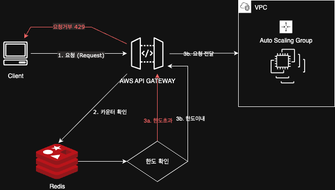
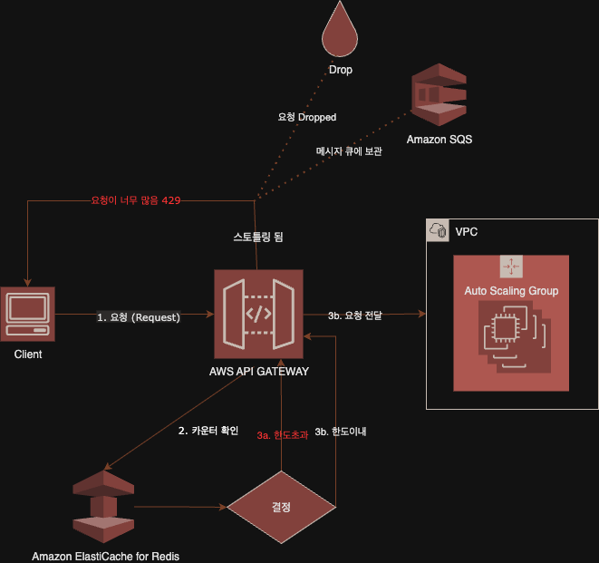
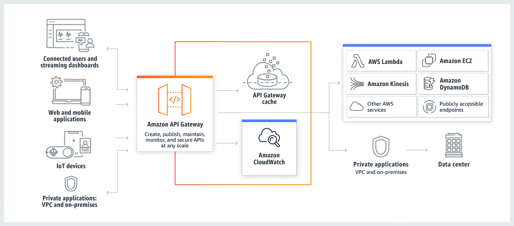

# [3주차] 4장 처리율 제한 장치의 설계_고동현

# 처리율 제한 장치의 설계

네트워크 시스템에서 처리율 제한 장치는 클라이언트 서비스가 보내는 트래픽의 처리율을 제어하기 위한 장치이다. API요청 횟수가 제한 장치에 정의된 임계치(threshold)를 넘어서면 추가로 도달한 모든 호출은 중단 처리 된다. 

- 사용자는 초당 2회 이상 새 글을 올릴 수 있다.
- 같은 IP 주소로는 하루에 10개 이상의 계정을 생성할 수 없다.
- 같은 디바이스로는 주당 5회 이상 리워드를 요청할 수 없다.

## API에 처리율 제한 장치를 둘때의 장점

- DOS 공격에 의한 자원 고갈을 방지할 수 있다.
    - 트위터 : 3시간 동안 300개의 트윗만 올리도록 제한
    - 구글독스 : 사용자당 분당 300회의 read요청만 허용
- 비용을 절감한다.
    - 추가 요청에 대한 처리를 제한하면 서버를 많이 두지 않아도 되고 우선순위가 높은 API
- 서버 과부하를 막는다.
    - 봇에서 오는 트래픽이나 사용자의 잘못 이용 패턴으로 유발된 트래픽을 걸러 내는데 사용가능

## 문제 이해 및 설계 범위 확정

### **요구사항**

- 설정된 처리율을 초과하는 요청은 정확하게 제한
- 낮은 응답시간 보장
- 가능한 최소 메모리 사용
- 분산형 처리율 제한
- 요청이 제한 되었을 때 그 사실을 사용자에게 분명하게 보여줄 예외처리
- 제한 장치에 장애가 생겨도 시스템 전체에 영향이 안가도록 높은 결함 감내성

---

## 처리율 제한 장치는 어디에 둬야 하는가?

크게 클라이언트 측과 서버 측에 두는 것으로 나뉜다.

- 클라이언트는 처리율 제한을 한정적으로 걸 수 있는 장소로 적합하지 않다. 클라이언트 요청은 쉽게 위변조가 가능하고 모든 클라이언트의 구현을 통제하는것도 어렵다.
- 서버측에 두는 경우
    - API 서버 내에 두는 경우
        
        
        
    - API 서버에 두는 대신 처리율 제한 미들웨어(Gateway)를 만들어 API 서버로 가능 요청을 통제하는 경우
        
        
        
        - 처리율이 초당 2개의 요청으로 제한된 상황 → 클라이언트가 3번째 요청을 앞의 두 요청과 같은 초 범위 내에서 전송하였다면?
            
            
            
            → 2개의 요청은 허용 하지만 3번째 요청은 처리율 제한 미들웨어에 의해 가로 막히고 클라이언트로 HTTPS 429(Too many Request)가 반환된다. 
            
    
    ### 처리율 제한 장치를 둘 곳에 대한 지침
    
    - 프로그래밍 언어, 캐시 서비스 등 현재 사용중인 기술 스택을 점검하고 서버 측 구현을 지원하기 충분할 정도로 효율이 높은지 확인하라
    - 사업 필요에 맞는 처리율 제한 알고맂믕르 찾아라 **서버 측에서 모든 것을 구현하기로 했다면 알고리즘을 자유롭게 선택할 수 있다.** 하지만 제 3사업자가 제공하는 게이트웨이를 사용하기로 했다면 선택지는 제한 될 수도 있다.
    - 설계가 마이크로서비스에 기반하고 있고 사용자 인증이나 IP 허용 관리 목록 관리 등을 처리하기 위해 API 게이트웨이를 이미 설계에 포함 시켰다면 처리율 제한 기능 또한 게이트웨이에 포함 시켜야할 수도 있다.

## 처리율 제한 알고리즘

처리율 제한 알고리즘은 아래의 것들 이외에도 여러가지가 있다.

- 토큰 버킷 → Amazon Default
- 누출 버킷
- 고정 윈도 카운터
- 이동 윈도 로그
- 이동 윈도 카운터

### 📌 토큰 버킷

- 인자 종류
    - 버킷 크기 : 버킷에 담을 수 잇는 토큰의 최대 개수
    - 토큰 공급률 : 초당 버킷에 공급되는 토큰의 개수
- 장점
    - 구현이 쉽다.
    - 메모리 사용 측면에서 효율적이다
    - 짧은 시간에 집중되는 트래픽도 처리 가능하다. 버킷에 남은 토큰이 있기만 하면 요청은 시스템에 전달된다
- 단점
    - 2개의 파라미터를 적절하게 튜닝하는 것이 까다롭다.

가장 폭 넓게 이용되는 처리율 제한 알고리즘. 간단하고 이해가 쉬워 보편적으로 사용된다. 아마존, 스트라이프도 API 요청을 통제하기 위해 해당 알고리즘 채택

- 토큰 버킷은 지정된 용량을 갖는 컨테이너이고 이 버킷에는 사전 설정된 양의 토큰이 주기적으로 채워진다. 토큰이 꽉찬 버킷에는 더이상의 토큰은 추가되지 않는다.
- 토큰 공급기(refiler)는 매초 2개의 토큰을 추가하고 버킷이 가득 차면 추가로 공급된 토큰은 버려진다. (overflow)
    
    
    
- 각 요청은 처리 될 때 마다 하나의 토큰을 사용한다. 요청이 도착하면 버킷에 충분한 토큰이 있는 지 검사한다.
    - 충분한 토큰이 있을 경우 : 토큰 하나를 꺼내 요청을 시스템에 전달
    - 충분한 토큰이 없을 경우 : 해당 요청은 버려짐 (dropped)
    
    
    

### 📌 누출 버킷

- 인자 종류
    - 버킷 크기 : 큐 사이즈와 같은 값
    - 처리율 : 지정된 시간당 몇 개의 항목을 처리할 지 지정하는 값 (초단위)
- 장점
    - 큐의 크기가 제한되어 있어서 메모리 측면에서 효율적이다.
    - 고정된 처리율을 갖고 있어 안정적 출력이 필요한 경우 적합하다
- 단점
    - 단시간에 많은 트래픽이 몰리는 경우에는 큐에 요청이 쌓여 제때 처리 못하면 최신 요청들은 버려진다.
    - 2개의 파라미터를 적절하게 튜닝하는 것이 까다롭다.

토큰 버킷 알고리즘과 비슷하지만 요청 처리율이 고정되어 있다. 보편적으로 FIFO 큐로 구현한다.

- 요청이 돡하면 큐가 가득 차 있는지 확인 후 빈자리가 있다면 큐에 요청을 추가한다
- 큐가 가득 차있는 경우에는 새 요청을 버린다.
- 지정된 시간마다 큐에서 요청을 꺼내서 처리한다.

### 📌 고정 윈도 카운터 알고리즘

- 장점
    - 메모리 효율이 좋다.
    - 이해하기 쉽다.
    - 윈도가 닫히는 시점에 카운터를 초기화하는 방식은 특정한 트래픽 패턴을 처리하기에 적합하다.
- 단점
    - 윈도 경계 부근에서 일시적으로 많은 트래픽이 몰려드는 경우, 기대했던 시스템의 처리 한도보다 많은 양의 요청을 처리하게 된다.

- 타임라인을 고정된 간격의 윈도로 나누고 각 윈도마다 카운터를 붙인다.
- 요청이 접수될 때마다 이 카운터의 값은 1씩 증가한다.
- 이 카운터의 값이 사전에 설정된 임계치(threshold)에 도달하면 새로운 요청은 새 윈도가 열릴 때까지 버려진다.
    
    
    
- 순간적으로 트래픽이 집중될 경우 윈도에 할당된 양보다 더 많은 요청이 처리 될 수 있다.
- **윈도 경계 문제** → 최대 2배까지 처리될 수 있다.
    - 분당 5개 제한일 때, 00:59에 5개, 01:00에 5개가 들어오면 실제로는 1초 사이에 10개 요청을 처리한다.

### 📌 이동 윈도 로깅 알고리즘

- 장점
    - 매우 정교하여 어떤 시점의 윈도를 봐도 한도를 넘지 않음. (고정 윈도의 경계 문제 해결)
- 단점
    - 거부된 요청의 타임스탬프까지 모두 저장하므로 **다량의 메모리를 사용한다.**
    
    ****

- 요청의 타임스탬프를 추적한다. 타임스탬프 데이터는 Redis의 정렬집합 같은 캐시에 보관한다.
- 새 요청이 오면 만료된 타임스탬프는 제거한다. 만료된 타임 스탬프는 그 값이 현재 윈도의 시작 시점 보다 오랜된 타임스탬프를 말한다.
- 새 요청의 타임스탬프를 로그에 추가한다
- 로그의 크기가 허용치보다 같거나 작으면 요청을 시스템에 전달한다. 그렇지 않은 경우에는 처리를 거부한다.

### 📌 이동 윈도 카운터 알고리즘

고정 윈도 카운터와 이동 윈도 로깅을 절충한 방식으로 현재 윈도의 요청 수와 이전 윈도의 요청 수를 가중 평균하여 현재 요청 허용 여부를 판단한다.

- 장점
    - 짧은 시간에 몰리는 트래픽에 잘 대응함
    - 메모리 효율이 좋음
- 단점
    - 이전 윈도의 트래픽이 균등하게 분포했다고 가정하므로, **100% 정확하지는 않습니다.** (하지만 Cloudflare 실험 결과, 오류율은 0.003%로 매우 낮음)

`현재 윈도 내 요청 수 = (현재 1분간의 요청 수) + (직전 1분간의 요청 수) × (겹치는 비율)`

- 3 + 5 x 70% = 6.5개
- 예제에선 처리율 제한 한도가 분당 7개 요청이라고 했으므로, 현재 1분
의 30% 시점에 도착한 신규 요청은 시스템으로 전달될 것이다. 하지만 그 직후에는 한도에 도달하였으므로 더 이상의 요청은 받을 수 없을 수 없을 것이다

---

## 개략적 아키텍처 요약

처리율 제한 장치는 **카운터**를 사용하여 요청 수를 추적하는 것으로 카운터 아래의 것들을 기준하여 설정한다.

- 사용자
- IP 주소
- API 엔드포인트 etc..

### **핵심 구성 요소 : Redis**

- 시간 기반 만료 정책을 지원하는 레디스(Redis)와 같은 빠른 인메모리 캐시를 사용한다.
    - **INCR**: 카운터 값을 1 증가시킵니다.
    - **EXPIRE**: 설정된 시간이 지나면 카운터를 자동으로 삭제(초기화)합니다.

### **동작 원리**

1. **요청 발생**: 클라이언트가 서버에 요청을 보낸다.
2. **미들웨어 검사**: 요청은 API 서버에 도달하기 전, 먼저 처리율 제한 미들웨어(Rate Limiting Middleware)를 통과한다.
3. **카운터 확인**: 미들웨어는 레디스에서 해당 요청에 대한 카운터를 가져와 한도에 도달했는지 확인합니다.
    - **한도 초과**: 요청 **거부**
    - **한도 이내**: 요청이 **API 서버로 전달.** 동시에 미들웨어는 레디스의 카운터 값을 1만큼 증가

## 상세 설계

- **처리율 제한 규칙**:
    - YAML, JSON 등 파일 형태로 규칙을 설정하여 디스크에 저장하고, 서버 실행 시 캐시에 적재하여 빠르게 읽는다.
- **한도 초과 트래픽 처리**
    - `HTTP 429 Too Many Requests` 상태 코드를 즉시 반환
    - 나중에 처리하기 위해 메시지 큐(Message Queue)에 보관
- **클라이언트에게 정보 제공 (HTTP 헤더)**
    - `X-Ratelimit-Limit`: 윈도당 최대 요청 수
    - `X-Ratelimit-Remaining`: 현재 윈도에 남은 요청 수
    - `X-Ratelimit-Retry-After`: 한도 초과 시, 몇 초 후에 다시 시도해야 하는지 알림

1. 클라이언트의 서버 요청 
2. AWS Gateway에 도달 (AWS의 Fully Managed 방식으로 규칙 설정 불필요)
3. 마지막 요청의 timestamp를 ElastiCache for Redis 에서 가져옴
    - 요청이 처리율 제한에 걸리지 않는 경우에는 API 서버로 보낸다
    - 요청이 처리율 제한에 걸렸다면 429 error, SQS, Drop 중 하나를 선택한다.

## 분산 환경에서의 처리율 제한 장치의 구현

여러대의 서버와 병렬 스레드를 지원하도록 시스템을 확장하기 위한 2가지 문제

### 1. 경쟁 조건 (Race Condition)

- 여러 서버(쓰레드)가 동시에 Redis의 카운터를 읽고, 값을 증가시키고, 다시 쓰는 과정에서 값이 누락될 수 있다. (Read-Modify-Write 문제)
    
    
    
- **해결책**:
    - **Lock**: 성능 저하가 크다.
    - **Lua Script**: Redis에서 원자적(Atomic) 연산을 보장하는 스크립트를 사용
    - **Sorted Set :** Redis의 원자적 명령어를 활용

### 2. 동기화 (Synchronization)

- 여러 대의 처리율 제한 장치 서버가 있을 때, 같은 클라이언트의 요청이 다른 서버로 분산되면 제한을 정확히 적용할 수 없다.
    
    
    
- 요청 5회 제한 예시
    - 클라이언트 1에 요청 5회후 클라이언트에게 요청 5회시 가능한 문제가 발생한다.

- **해결책**:
    - **Sticky Session**: 특정 클라이언트를 항상 같은 서버로 보내는 방식. 확장성이 떨어져 추천하지 않음
        
        
        
    - **중앙 집중형 데이터 저장소 (Redis)**: 모든 처리율 제한 서버가 하나의 중앙 Redis를 바라보며 데이터를 동기화한다.

---

### **성능 최적화**

데이터센터를 지원하는 문제는 처리율 제한 장치에 매우 중요한 문제

- **Edge Server 활용**: 사용자와 가까운 에지 서버에 Rate Limiter를 배치하여 지연 시간 감.
- **최종 일관성 모델**: 여러 데이터센터 간 데이터 동기화 시, 약간의 지연을 허용하는 모델을 사용해 성능을 높일 수 있다. → 지연과 성능이 동시에 존재한다고 ? 제미니한테 물어보기

### **모니터링**

설정한 알고리즘과 규칙이 효과적인지 지속적으로 모니터링하여 규칙을 완화하거나 알고리즘을 변경해야 한다.

- **클라이언트 측 회피 전략**:
    - **Caching**: 클라이언트 측 캐시를 사용해 불필요한 API 호출을 줄입니다.
    - **Back-off**: 재시도 로직을 구현할 때 충분한 시간 간격을 둡니다.

---

## 모니터링 시나리오 예시

- **수많은 IP에서 조금씩 요청이 들어와 전체 서비스가 느려졌다.**
    
    
    
    1. 분산 공격이 시작 : IP에서 10번 제한 중 6번씩 요청
    2. 이상 징후 탐지 : CloudWatch가 Latency 급증 감지
    3. 즉시 경보 발생 : 자동 알림 및 Lambda 트리거
    4. 지능형 분석 :  Lambda로 공격 IP 패턴 실시간 분석 (평균보다 50% 이상의 요청을 보내면 위험 IP로)
    5. 동적 차단 : WAF 규칙 즉시 강화 
    6. 관리자에게 알림 : SNS를 통해 보안 담당자에게 알림이 가도록 설계