# 처리율 제한 장치의 설계

> **🤔 처리율 제한 장치란?**
>
> 네트워크 시스템에서 클라이언트 또는 서비스가 보내는 트래픽의 처리율(rate)을 제어하기 위한 장치

**API에 처리율 제한 장치를 두면 좋은 점**

- DoS 공격에 의한 자원 고갈 방지
- 서버를 많이 두지 않아도 되어서 비용 절감
- 서버 과부하 방지

## 1단계: 문제 이해 및 설계 범위 확정

처리율 제한 장치를 구현하는 데는 여러가지 알고리즘을 사용할 수 있는데, 면접관과 소통하면 어떤 제한 장치를 구현해야 하는지 분명히 할 수 있다.

**요구사항 예시**

- 설정된 처리율을 초과하는 요청은 정확하게 제한
- 낮은 응답시간
- 가능한 한 적은 메모리 사용
- 분산형 처리율 제한
- 예외 처리
- 높은 결함 감내성

## 2단계: 개략적 설계안 제시 및 동의 구하기

### 처리율 제한 장치는 어디에 둘 것인가?

**클라이언트 측에 둔다면**
클라이언트 요청은 쉽게 위변조가 가능해서 부적합. 모든 클라이언트의 구현을 통제하는 것도 어려울 수 있음

**서버 측에 둔다면**

- 처리율 제한 장치 API 서버를 따로 두는 방식
  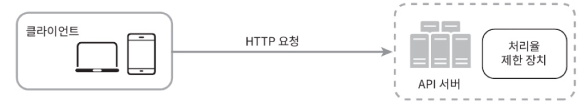

- 처리율 제한 미들웨어를 만들어 API 서버로 가는 요청 통제하는 방식
  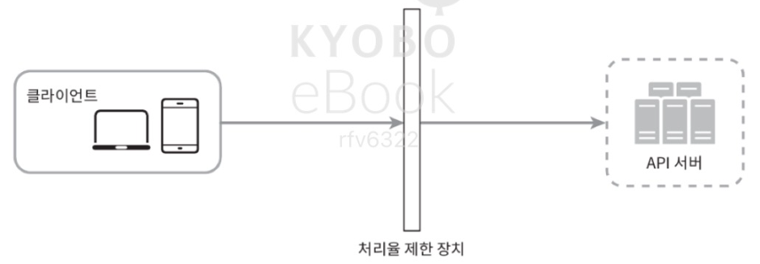
  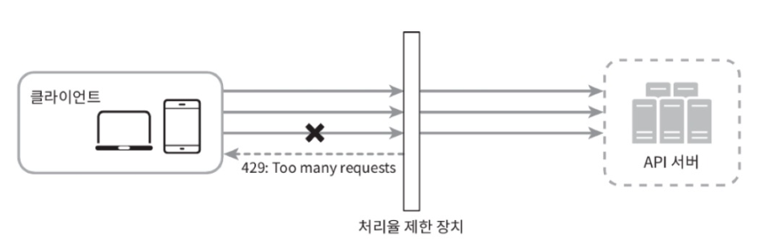

> **API 게이트 웨이란?**
>
> - 클라우드 마이크로서비스의 경우, 처리율 제한 장치는 보통 API 게이트웨이라 불리는 컴포넌트에 구현된다.
> - 이는 처리율 제한, SSL 종단, 사용자 인증, IP 허용 목록 관리 등을 지원하는 완전 위탁관리형 서비스이다.
> - 하지만 일단은 API 게이트웨이가 **처리율 제한을 지원하는 미들웨어**라는 점만 기억하도록 하자.

**처리율 제한 기능을 설계할 때 어디 두어야 하는지 일반적으로 적용될 수 있는 몇 가지 지침**

- 현재 사용하고 있는 기술 스택이 서버 측 구현을 지원하기 충분할 정도로 효율이 높은지 확인하라.
- 사업 필요에 맞는 처리율 제한 알고리즘을 찾아라.
- 마이크로서비스에 기반하고 있고, API 게이트웨이를 이미 설계에 포함시켰다면 처리율 제한 기능 또한 게이트웨이에 포함시켜야 할 수도 있다.
- 처리율 제한 서비스를 직접 만드는 데는 시간이 들기 때문에 충분한 인력이 없다면 상용 API 게이트웨이를 쓰는 것이 바람직한 방법이다.

### 처리율 제한 알고리즘

- 토큰 버킷(token bucket)
- 누출 버킷(leaky bucket)
- 고정 윈도 카운터(fixed window counter)
- 이동 윈도 로그(sliding window log)
- 이동 윈도 카운터(sliding window counter)

**토큰 버킷 알고리즘**

> - 보편적으로 사용하고 있는 알고리즘이다.
> - 아마존과 스트라이프가 API 요청을 통제하기 위해 이 알고리즘을 사용한다.

- 버킷에 토큰이 주기적으로 채워진다.
- 버킷이 꽉 차면 추가로 공급된 토큰은 버려진다. (overflow)

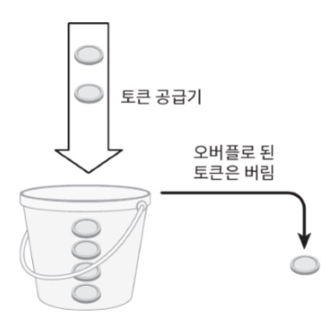

- 요청이 들어오면 하나의 토큰을 사용한다.
- 충분한 토큰이 있으면, 토큰 하나를 꺼낸 후 요청을 시스템에 전달한다.
- 충분한 토큰이 없는 경우, 해당 요청은 버려진다. (dropped)

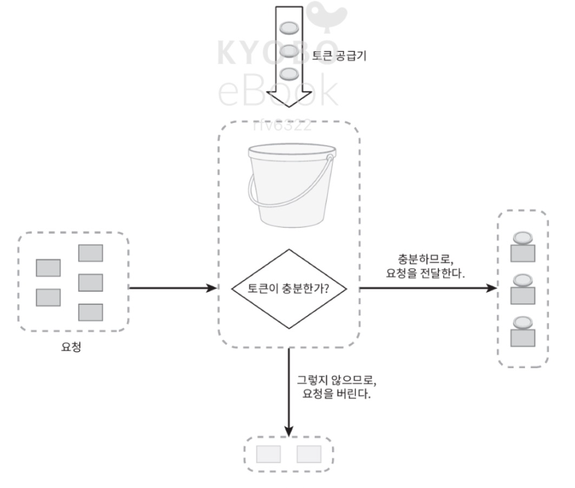

- 이 예에서 토큰 버킷의 크기는 4이다.
- 토큰 공급률(refill rate)은 분당 4이다.

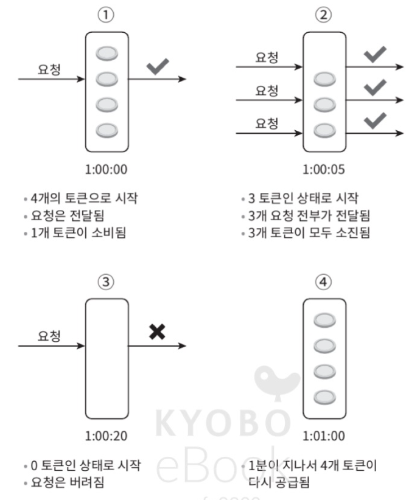

- 토큰 버킷 알고리즘은 2개 인자(parameter)를 받는다.

  - 버킷 크기: 버킷에 담을 수 있는 토큰의 최대 개수
  - 토큰 공급률(refill rate): 초당 몇 개의 토큰이 버킷에 공급되는가

- 버킷을 몇 개나 사용해야 하는지는 공급 제한 규칙에 따라 달라진다.
  - 통상적으로, API 엔드포인트마다 별도의 버킷을 둔다.
  - IP 주소별로 처리율 제한을 적용해야 한다면 주소마다 바킷을 하나식 할당해야 한다.
  - 시스템의 처리율을 초당 10,000개의 요청으로 제한하고 싶다면, 모든 요청이 하나의 버킷을 공유하도록 해야 할 것이다.

> **장점:**
>
> - 구현이 쉽다.
> - 메모리 사용 측면에서도 효율ㅈㄱ이다.
> - 짧은 시간에 집중되는 트래픽(burst of traffic)도 처리 가능하다.

> **단점:**
>
> - 버킷 크기와 토큰 공급률이라는 두 개의 인자를 적절하게 튜닝하는 것이 까다롭다.

**누출 버킷 알고리즘**

> - 토큰 버킷 알고리즘과 비슷하지만 요청 처리율이 고정되어 있다는 점이 다르다.
> - 보통 FIFO(First-In-First-Out) 큐로 구현한다.
> - 쇼피파이(Shopify)가 이 알고리즘을 사용한다.

- 요청이 도착하면 큐가 가득 차 있는지 본 후, 빈자리가 있는 경우에는 큐에 요청을 추가한다.
- 큐가 가득 차 있으면 새 요청은 버린다.
- 지정된 시간마다 큐에서 요청을 꺼내어 처리한다.

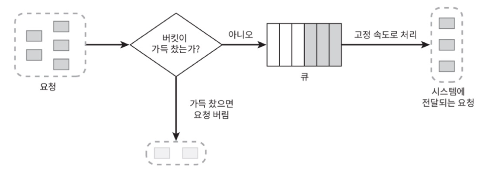

- 누출 버킷 알고리즘은 다음의 두 인자를 사용한다.
  - 버킷 크기: 큐 사이즈와 같은 값이다. 큐에는 처리될 항목들이 보관된다.
  - 처리율(outflow rate): 지정된 시간당 몇 개의 항목을 처리할지 지정하는 값이다. 보통 초 단위로 표현된다.

> **장점:**
>
> - 큐의 크기가 제한되어 있어 메모리 사용량 측면에서 효율적이다.
> - 고정된 처리율을 갖고 있기 때문에 안정적 출력(stable outflow rate)이 필요한 경우에 적합하다.

> **단점:**
>
> - 단 시간에 많은 트래픽이 몰리는 경우 큐에는 오래된 요청들이 쌓이게 되고, 그 요청들을 제때 처리 못하면 최신 요청들은 버려지게 된다.
>   두 개의 인자를 갖고 있는데, 이들을 올바르게 튜닝하기 까다롭다.

**고정 윈도 알고리즘**

- 타임라인을 고정된 간격의 윈도로 나누고, 각 윈도마다 카운터를 붙인다.
- 요청이 접수될 때마다 이 카운터의 값은 1씩 증가한다.
- 이 카운터의 값이 사전에 설정된 임계치(threshold)에 도달하면 새로운 요청은 새 윈도가 열릴 때까지 버려진다.

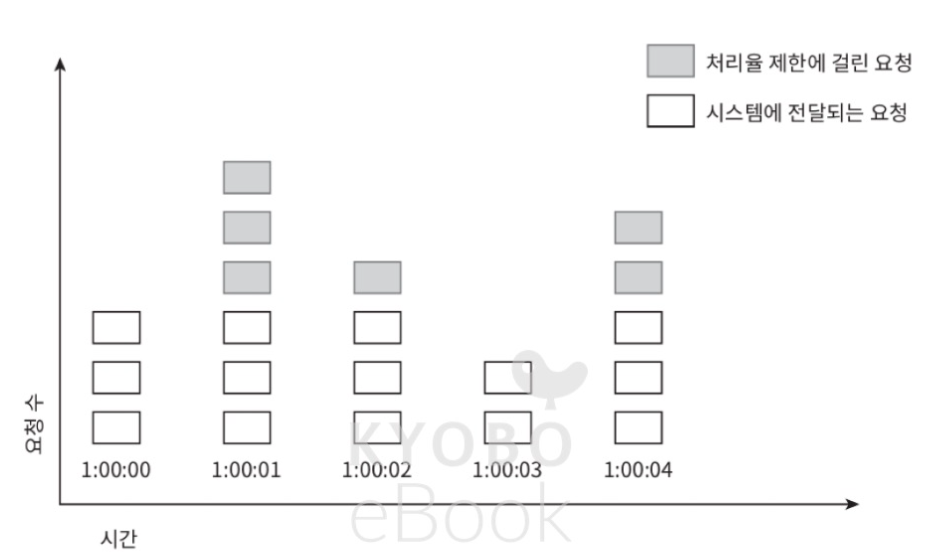
- 위 그림에서 타임라인 시간단위는 1초다. 
- 시스템은 초당 3개까지의 요청만을 허용한다.
- 매초마다 열리는 윈도에 3개 이상의 요청이 밀려오면 초과분은 위 그림처럼 버려진다.
- 이 알고리즘의 가장 큰 문제는 윈도의 경계 부근에 순간적으로 많은 트래픽이 집중될 경우 윈도에 할당된 양보다 더 많은 요청이 처리될 수 있다는 것이다.

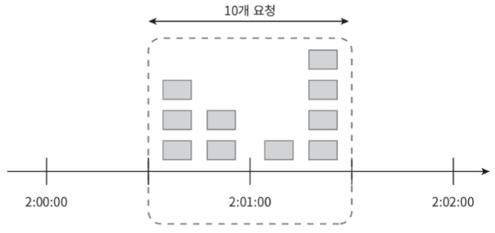
- 위 그림은 분당 5개의 요청만을 허용하는 시스템이다. 카운터는 매분마다 초기화된다.
- 0-1분 사이에 5개의 요청이 들어왔고 1-2분 사이에도 5개의 요청이 들어왔다.
- 하지만 1분을 중심으로 두고 윈도를 자르면 0.5분에서 1.5분동안 10개의 요청이 들어왔다.
- 이는 허용 한도의 2배다.

> **장점:**
>
> - 메모리 효율이 좋다.
> - 이해하기 쉽다.
> - 윈도가 닫히는 시점에 카운터를 초기화하는 방식은 특정한 트래픽 패턴을 처리하기에 적합하다.

> **단점:**
>
> - 윈도 경계 부근에 일시적으로 트래픽이 몰리면, 기대했던 시스템의 처리 한도보다 많은 요청을 처리하게 된다.

**이동 윈도 로깅 알고리즘**

> 고정 윈도 카운터 알고리즘의 문제를 해결한다.

- 이 알고리즘은 요청의 타임스탬프(timestamp)를 추적한다. 이는 보통 **redis의 정렬 집합(sorted set)** 같은 캐시에 보관한다.
- 새 요청이 오면 만료된 타임스탬프는 제거한다. 이는 현재 윈도 시작 시점보다 오래된 것을 말한다.
- 새 요청의 타임스탬프를 로그(log)에 추가한다.
- 로그의 크기가 허용치보다 같거나 작으면 요청을 시스템에 전달한다. 그렇지 않으면 처리를 거부한다.

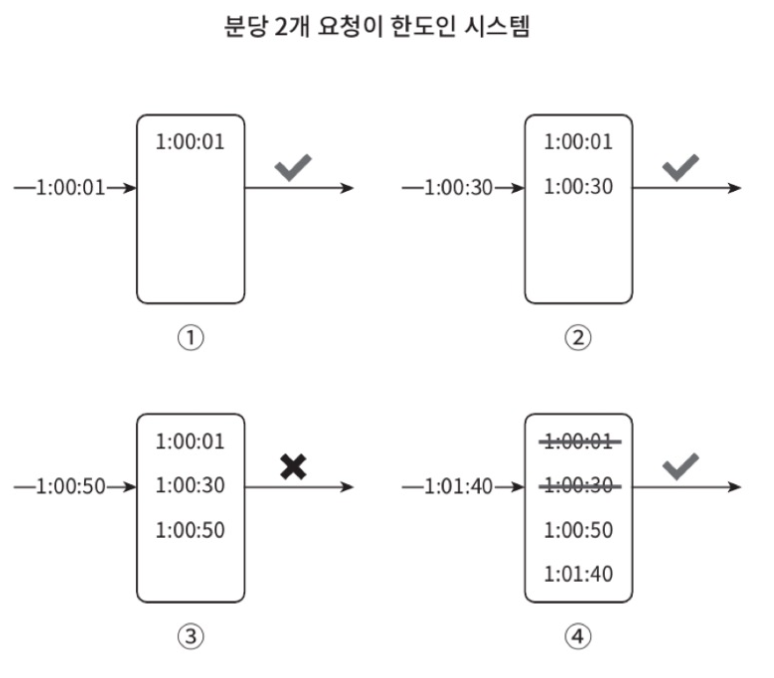

- 이 예제는 분당 최대 2회의 요청만을 처리한다.
- `1:00:50`에 도착한 요청은 로그를 남기지만 로그의 크기가 3으로 허용값보다 크다. 따라서 로그는 남지만 요청은 거부한다.
- `[1:00:40, 1:01:40]` 범위 안에 있는 요청은 1분 윈도 안에 있는 요청이다.
- `1:00:01`과 `1:00:30` 요청은 만료됐기에 로그에서 삭제한다. 따라서 `1:01:40`에 도착한 신규 요청은 시스템에 전달된다.

> **장점:**
>
> - 아주 정교하다. 어느 순간의 윈도를 보더라도, 허용되는 요청의 개수는 시스템의 처리율 한도를 넘지 않는다.

> **단점:**
>
> - 거부된 요청의 타임스탬프로 보관하기 때문에 다량의 메모리를 사용한다.

**이동 윈도 카운터 알고리즘**

> 고정 윈도 카운터 알고리즘 + 이동 윈도 로깅 알고리즘

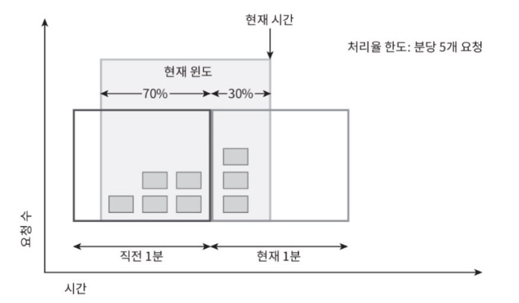
- 이전 1분 동안 5개의 요청, 현재 1분동안 3개의 요청
- 분당 처리율 제한 한도 = 7개
- 현재 1분의 30% 시점에 도착한 새 요청의 경우, 현재 윈도에 몇 개의 요청이 온 것으로 보고 처리해야 할까?
- `현재 1분간의 요청 수 + 직전 1분간의 요청 수 x 이동 윈도와 직전 1분이 겹치는 비율`
- 이 공식에 따르면 위 그림에서 현재 윈도에 들어 있는 요청은 `3 + 5 x 70% = 6.5`개다. 이 예제에서는 내림해서 쓰면 6이다.
- 이 경우 분당 처리 한도가 7이라고 했으므로 현재 들어오는 요청은 시스템으로 전달되지만, 더 이상 요청을 받을 수 없다.
- *지면 제약상 이동 윈도 카운터 알고리즘의 또 한가지 구현법은 따로 찾아보기*

> **장점:**
> 짧은 시간에 몰리는 트래픽에도 잘 대응한다.
> 메모리 효율이 좋다.

> **단점:**
> 다소 느슨하다.

### 개략적인 아키텍처

- 알고리즘의 기본 아이디어는 얼마나 많은 요청이 접수되었는지를 추적할 수 있는 카운터를 추적 대상별로 두고, 이 카운터의 값이 어떤 한도를 넘어서면 한도를 넘어 도착한 요청은 거부하는 것이다.
  - 추적 대상은 사용자별로 or IP 주소별로 or API 엔트포인트나 서비스 단위로
- 이 카운터는 어디에 보관할 것인가?
  - 데이터베이스는 디스크 접근 때문에 느리니까 안됨.
  - 메모리상에서 동작하는 캐시가 바람직.
  - Redis가 자주 사용되는 메모리 기반 저장장치로서, INCR과 EXPIPE의 두가지 명령어 지원
    - INCR: 메모리에 저장된 카운터의 값을 1만큼 증가
    - EXPIPE: 카운터에 타임아웃 값 설정. 설정된 시간 지나면 자동 삭제

**개략적 구조**

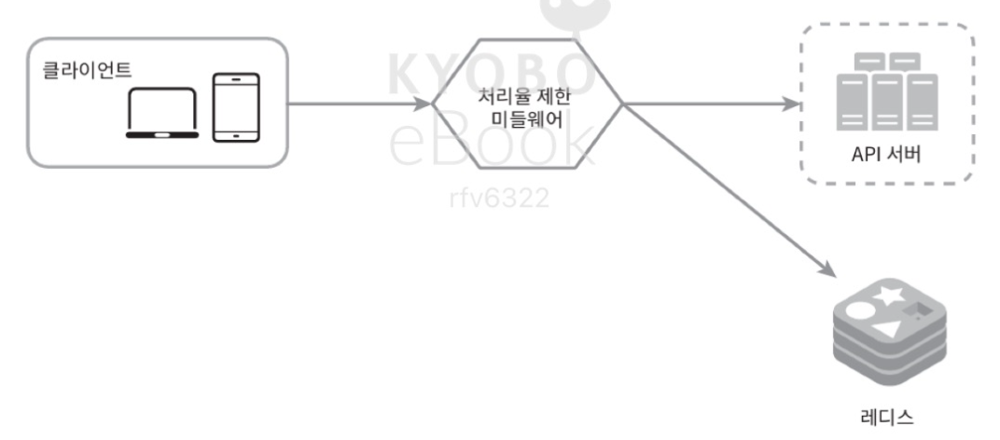

**동작원리**

- 클라이언트가 처리율 제한 미들웨어에 요청을 보낸다.
- 미들웨어는 레디스의 지정 버킷에서 카운터를 가져와서 한도에 도달했는지 아닌지를 검사한다.
  - 한도에 도달했다면 요청은 거부된다.
  - 한도에 도달하지 않았다면 요청은 API 서버로 전달된다. 미들웨어는 카운터의 값을 증가시킨 후 다시 레디스에 저장한다.

## 3단계: 상세 설계

> - 처리율 제한 규칙은 어떻게 만들어지고 어디에 저장되는가?
> - 처리가 제한된 요청들은 어떻게 처리되는가?

**처리율 제한 규칙**

- 리프트(Lyft)는 처리율 제한에 오픈 소스를 사용하고 있다.
- 이런 규칙들은 보통 설정 파일(configuration file) 형태로 디스크에 저장된다.

### 처리율 한도 초과 트래픽의 처리

- 요청이 한도 제한에 걸리면 API는 HTTP 429 응답(too many requests)을 클라이언트에 보낸다.

**처리율 제한 장치가 사용하는 HTTP 헤더**

- 처리율 제한 장치는 다음의 HTTP 헤더를 클라이언트에게 보낸다.
  - XRatelimit-Remaining: 윈도 내에 남은 처리 가능 요청의 수.
  - X-Ratelimit-Limit: 매 윈도마다 클라이언트가 전송할 수 있는 요청의 수
  - X-Ratelimil-Retry-After: 한도 제한에 걸리지 않으려면 몇 초 뒤에 요청을 다시 보내야 하는지 알림.
    - 사용자가 너무 많은 요청을 보내면 429 too many requests 오류를 이 헤더와 함께 반환

### 상세 설계

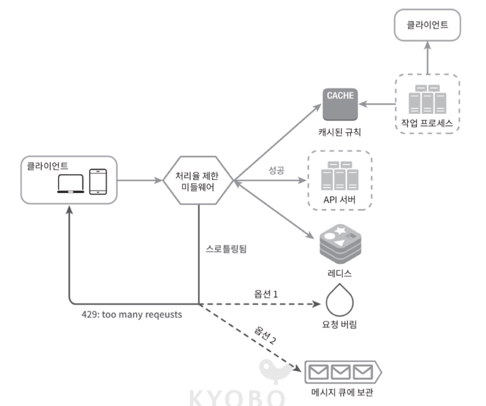
- 처리율 제한 규칙은 디스크에 보관. 작업 프로세스는 수시로 규칙을 디스크에서 읽어 캐시에 저장.
- 클라이언트가 요청을 보내면 먼저 미들웨어에 도달
- 미들웨어는 캐시에서 제한 규칙을 가져온다. 아울러 카운터 및 마지막 요청을 타임스탬프를 레디스 캐시에서 가져온다.
  - 해당 요청이 처리율 제한에 걸리지 않은 경우에는 API 서버로 
  - 해당 요청이 처리율 제한에 걸렸다면 429 too mant request 에러를 클라이언트로. 버릴 수도 있고 메시지 큐에 보관할 수도.

### 분산 환경에서의 처리율 제한 장치의 구현

> 여러 대의 서버와 병렬 스레드를 지원하도록 시스템을 확장하는 것은 또 다른 문제다. 다음 두 가지 문제를 풀어야 한다.
>
> - 경쟁 조건
> - 동기화

**경쟁 조건**

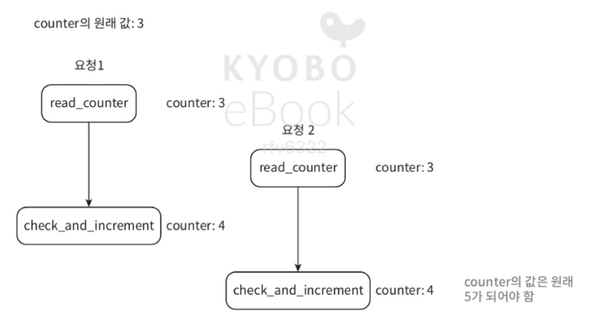
- 가장 널리 알려진 해결책은 락(lock)이지만, 시스템의 성능을 상당히 떨어뜨린다는 문제가 있다.
- 락 대신 쓸 수 있는 해결책
  - 루아 스크립트(Lua script)
  - 정렬 집합(sorted set)

**동기화 이슈**

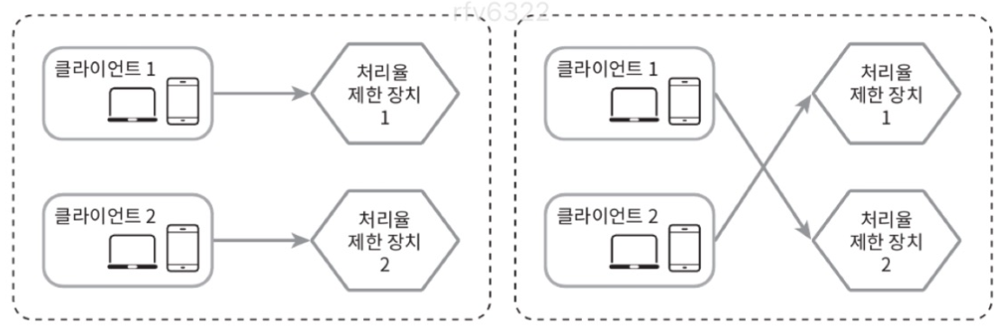

- 고정 세션

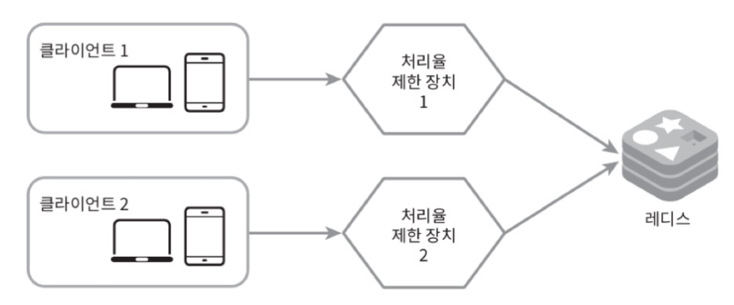

**성능 최적화**

- 데이터센터 지원 문제

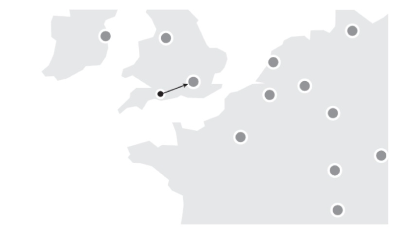

- 최종 일관성 모델 사용

**모니터링**

- 체택된 처리율 제한 알고리즘이 효과적인지
- 정의한 처리율 제한 규칙이 효과적인지
