# 05. 안정 해시 설계

수평적 규모 확장성 달성을 위해, 요청 또는 데이터를 서버에 균등하게 나눠야 함. 이 목표를 달성하기 위해 안정 해시 기술을 사용함.

## 해시 키 재배치(rehash) 문제
N개의 캐시 서버가 있을 때, 부하를 균등하게 나누는 방법으로 보통 해시 함수(serverIndex = hash(key) % N, N은 서버의 개수)를 사용함.

N=4일때, 위의 해시 함수를 이용했을 때 해당 해시 키들이 분산되는 형태
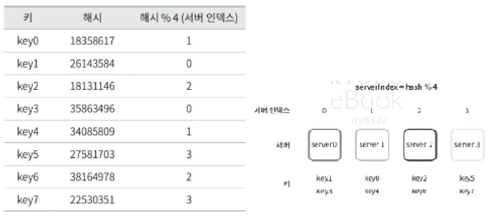

이 방법은 서버 풀의 크기가 고정되어 있을 때, 데이터 분포가 균등할 때는 잘 작동함

하지만 서버가 추가되거나 기존 서버가 삭제되어 서버 풀의 크기가 변하게 되는 경우에는 문제가 발생함

서버가 하나 삭제되어 N = 3이 된 경우
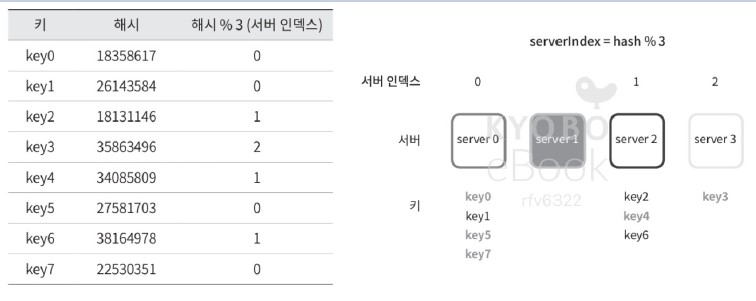
장애가 발생한 1번 서버의 키 뿐만 아니라 대부분의 키가 재분배된다. 1번 서버가 죽으면 대부분의 캐시 클라이언트가 데이터가 없는 엉뚱한 서버에 접속하게 된다: 대규모 캐시 미스(cache miss) 발생

# 안정 해시
안정 해시로 위의 문제를 해결한다.
- 해시 테이블 크기가 조정될 때 평균적으로 오직 k/n개의 키만 재배치하는 해시 기술. (k: 키의 개수, n: 슬롯의 개수)

## 해시 공간과 해시 링
안정 해시의 동작 원리
해시함수 f로 SHA-1을 사용한다고 하고, 이 함수의 출력 값 범위를 x0, x1, ... xn이라 가정

SHA-1의 해시 공간 범위: 0~2^160-1, x0=0, xn=2^160-1, 나머지 x1~xn-1까지는 그 사이의 값을 갖게 될 것임

아래 그림의 x0~xn까지의 해시 공간을, 양쪽을 구부려 접어 아래와 같은 해시 링이 만들어짐
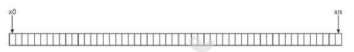
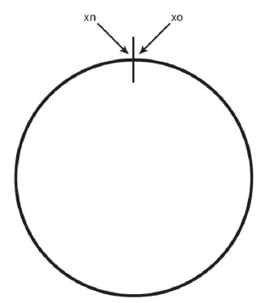

## 해시 서버
해시 함수 f를 사용해서, 서버 IP나 이름을 아래와 같이 링 위의 어떤 위치에 대응시킬 수 있다. 
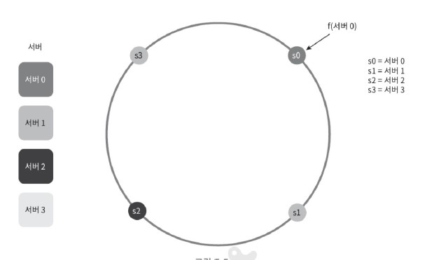

## 해시 키
아래와 같이 캐시할 키도 링 위의 어느 지점에 배치할 수 있다.
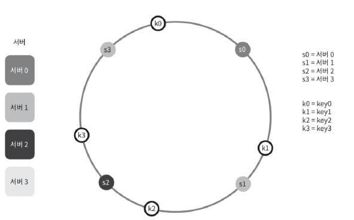

## 서버 조회
어떤 키가 저장되는 서버는, 해당 키의 위치로부터 시계 방향으로 링을 탐색해 나가면서 만나는 첫 번째 서버임.
key0은 서버 0에 저장되고, key1은 서버 1, key2는 서버2, key3은 서버 3에 저장됨

## 서버 추가
서버를 추가하더라도 키 중 일부만 재배치하면 됨

아래의 왼쪽 그림: 새로운 서버 4가 추가된 뒤, key0만 재배치됨. 나머지 키에는 영향 x

## 서버 제거
서버가 제거되면 키 중 일부만 재배치하면 됨

아래의 오른쪽 그림: 서버 1이 삭제되었을 때 key1만 서버 2로 재배치됨. 나머지 키에는 영향 x
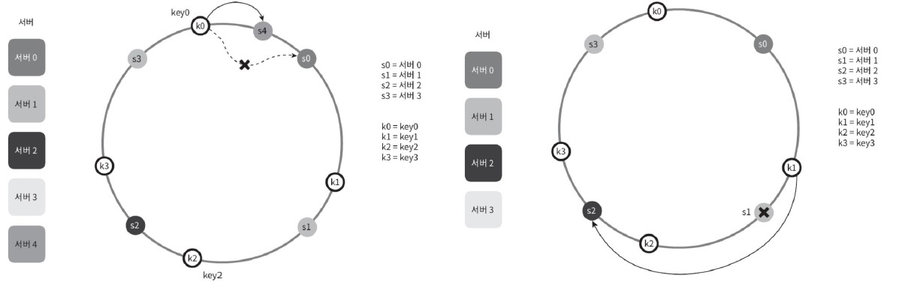

## 기본 구현법의 두 가지 문제
안정 해시 알고리즘의 두 가지 절차
- 서버와 키를 균등 분포 해시 함수를 사용해 해시 링에 배치한다.
- 키의 위치에서의 링을 시계 방향으로 탐색하다 만나는 최초의 서버가 키가 저장될 서버이다.

이 접근법에는 두 가지 문제가 있다. 
1. 서버가 추가되거나 삭제되는 상황을 생각하면 파티션의 크기를 균등하게 유지하는 게 불가능하다는 것
    * 파티션: 인접한 서버 사이의 해시 공간
    * -> 어떤 서버는 엄청 큰 해시 공간을, 어떤 서버는 엄청 작은 해시 공간을 할당받게 될 수도 있다는 것 (아래의 왼쪽 그림)
2. 키의 균등 분포를 달성하기가 어렵다는 것
    * 아래의 그림을 참조했을 때, 서버 1과 서버 3은 아무 데이터고 갖지 않는 반면, 대부분의 키가 서버 2에 보관됨
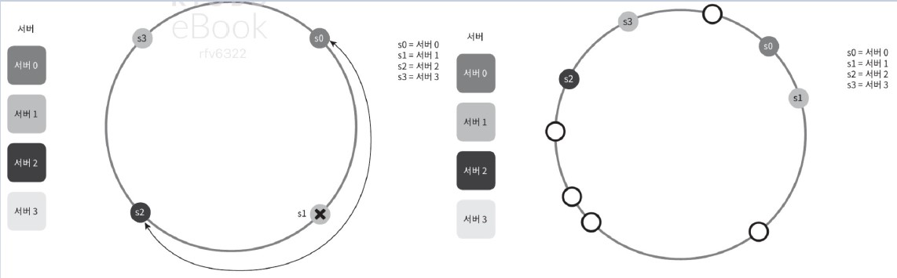

이를 해결하기 위해 가상 노드 또는 복제(replica)라 부르는 기법이 제안됨

## 가상 노드
- 실제 노드 또는 서버를 가리키는 노드
- 하나의 서버는 링 위에 여러 개의 가상 노드를 가질 수 있음
않는 반면, 대부분의 키가 서버 2에 보관됨
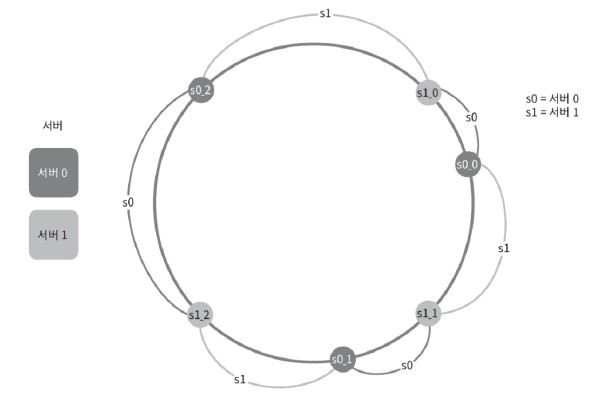
위 그림을 보면, 서버0과 서버1은 각각 세개의 가상 노드를 가짐

s0: s0_0 s0_1 s0_2, s1: s1_0 s1_1 s1_2
위 그림에서 s0으로 표시된 파티션은 s0이, s1으로 표시된 파티션은 s1이 관리하는 파티션임

특정 위치에 키가 추가되면, 그로부터 링을 시계방향으로 탐색하다 만나는 최초의 가상 노드가 나타내는 서버가 그 키가 저장되는 서버임.

가상노드의 개수를 늘리면 키의 분포가 점점 더 균등해짐
표준편차가 작아져서 데이터가 고르게 분포되기 때문
* 표준편차: 데이터가 어떻게 퍼져 나갔는지를 보이는 척도
가상노드의 개수를 늘리면 표준편차 값은 더 떨어짐

하지만 가상 노드 데이터를 저장할 공간은 더 많이 필요하게 될 것임

-> 시스템 요구사항에 맞도록 가상 노드 개수를 적절히 조정하는 타협적 결정(tradeoff)가 필요

## 재배치할 키 결정
서버가 추가되거나 제거되면 데이터 일부를 재배치해야 함. 어느 범위의 키를 재배치해야 할지 예시 기반으로 생각해보자
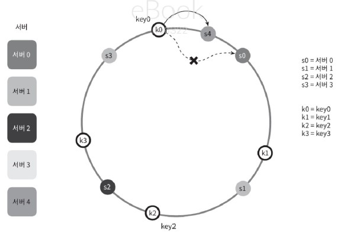
위 그림처럼 서버 4가 추가되었다면, 이에 영향 받은 범위는 새로 추가된 s4로부터 그 반시계 방향에 있는 첫 번째 서버 s3까지임. s3~s4 사이의 키들을 s4로 재배치해야 함

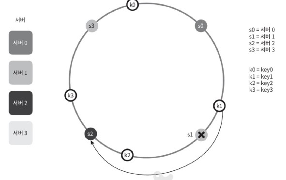
위 그림처럼 서버 s1이 삭제되면 삭제된 s1부터 그 반시계 방향에 있는 최초 서버 s0 사이에 있는 키들이 s2로 재배치되어야 함

### 마무리
안정 해시의 이점
- 서버가 추가되거나 삭제될 때 재배치되는 키의 수가 최소화된다.
- 데이터가 보다 균등하게 분포하게 되므로, 수평적 규모 확장성을 달성하기 쉽다.
- 핫스팟 키 문제를 줄인다. 특정한 샤드(shard)에 대한 접근이 지나치게 빈번하면 서버 과부하 문제가 생길 수 있다. 안정 해시는 좀 더 균등하게 데이터를 분배하므로 이런 문제가 생길 가능성을 줄인다.

안정 해시를 이용하는 예시
- 아마존 다이나모 데이터베이스(DynamoDB)의 파티셔닝 관련 컴포넌트
- 아파치 카산드라 클러스터에서의 데이터 파티셔닝
- 디스코드 채팅 어플리케이션
- 아카마이 CDN
- a매그레프 네트워크 부하 분산기