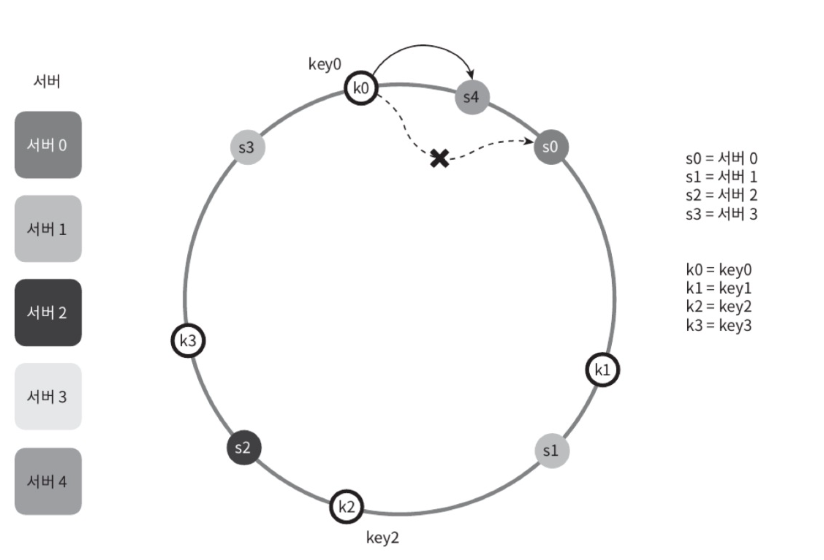

# 5장 안정 해시 설계
## 이전 챕터 정리
- 데이터베이스의 수평적 확장은 샤딩 이라고도 부르는데, 더 많은 서버를 추가함으로써 성능을 향상시킬 수 있도록 한다. [1장]
- 핫스팟 키 문제는 특정 샤드에 질의가 집중되어 서버에 과부하가 걸리는 문제다. [1장]

## 챕터 개요
- 목표 : 수평적 규모 확장성 달성 
    - 요청 또는 데이터를 서버에 균등하게 나누는 것이 중요
```
 안정 해시 : 이 목표를 달성하기 위해 보편적으로 사용하는 기술
 ```

## 해시 키 재배치 문제
- N개의 서버가 있다고 가정
- serverIndex=hash(key) % N (N 은 서버의 개수) 
- 이 해시 함수를 사용하는 것이 서버들에 부하를 균등하게 나누는 보편적 원리 
### 동작 예시
- 총 4대의 서버 사용
-  각각의 키에 대해 해시 값과 서버 인덱스를 계산 <br>
     <br>
- 특정한 키가 보관된 서버를 알아내기 위해서는 나머지 연산을 적용 <br> 
- 서버 풀의 크기가 고정되어 있을 때, 데이터 분표가 균등할 때 잘 동작
- 문제 : 서버가 추가되거나 기존 서버가 삭제
- 기존 서버가 삭제되는 예시
    - 1번 서버가 장애를 일으켜 동작 중단
    - 서버 풀의 크기가 3으로 변함
    - 키에 대한 해시 값은 변하지 않지만 나머지 (%) 연산을 적용하여 계산한 서버 인덱스 값은 달라질 것이다. 
    - 장애가 발생한 1 번 서버에 보관되어 있는 키 뿐만 아닌 대부분의 키가 재분배
-  1 번 서버가 죽으면 대부분 캐시 클라이언트가 데이터가 없는 엉뚱한 서버에 접속하게 됨 -> 그 결과로 대규모 캐시미스가 발생

## 안정 해시
```
 안정 해시 : 해시 테이블 크기가 조정될 때 평균적으로 오직 k/n 개의 키만 재배치하는 해시 기술 (k는 키의 개수, n은 슬롯의 개수)
 ```
- 슬롯의 수가 바뀌면 거의 대부분 키를 재배치하는 전통적 해시 테이블과의 차이점

### 동작원리
**기본 정의**
- 해시 함수 :  SHA1 을 사용
- 출력 값 범위 : x0, x1, x2, x3, ~xn
- 해시 공간 범위는 0부터 2^160 - 1 <br>  -> 
- 서버를 해시 링 위에 배치
    - 해시 함수를 사용하면 어떤 위치던지 대응시킬 수 있음
- 캐시할 키 링 위에 배치
    - 어떤 위치던지 대응시킬 수 있음<br> 

<br>

**서버 조회**
- 어떤 키가 저장되는 서버는, 해당 키의 위치로부터 시계 방향으로 링을 탐색해
나가면서 만나는 첫 번째 서버다. <br> <br>

**서버 추가**
- 서버 추가하더라도 키 일부만 재배치
- 예시
    - s4가 추가됨
    - s4랑 s3사이에 있는 k0만 s4로 재배치
    <br> <br>

**서버 제거**
- 서버 제거 되더라도 키 일부만 재배치
- 예시
    - s1 제거
    - s1의 키였던 k1만 s2로 재배치
    - <br> <br>

### 문제점
1. 서버가 추가되거나 삭제되는 상황을 감안
하면 파티션의 크기를 균등하게 유지하는 게 불가능
<br> <br>
2. 키의 균등 분포를 달성하기가 어려움
<br> <br>

-> 해결 방법 : 가상노드(복제) 기법

### 가상 노드
**동작원리**
- 하나의 서버는 링 위에 여러 개의 가상 노드를 가질 수 있다. 
- 각 서버는 하나가 아닌 여러 개 파티션을 관리해야 한다. 
- 키의 위치로부터 시계방향으로 링을 탐색하다 만나는 최초의 가상 노드가 해
당 키가 저장될 서버가 된다. 
<br> <br>

**문제점 해결**
- 가상 노드의 개수를 늘리면 키의 분포는 점 더 균등해진다. 
- 가상 노드 데이터를 저장할 공간은 더 많이 필요 -> 타협적 결정 필요   
    - 관리해야 할 메타데이터 공간 ↑
    - 해시 탐색 시 연산량 ↑
    - 네트워크로 노드 정보 갱신할 때 부하 ↑

**재배치할 키 결정**
- 서버 추가/제거 시 영향 받는 범위의 키들을 재배치하여야 한다. 

## 마무리
### 안정 해시의 이점
- 서버가 추가되거나 삭제될 때 재배치되는 키의 수가 최소화된다.
- 데이터가 보다 균등하게 분포하게 되므로 수평적 규모 확장성을 달성하기 쉽다.
- 핫스팟 키 문제를 줄인다. 특정한 샤드에 대한 접근이 지나
치게 빈번하면 서버 과부하 문제가 생길 수 있다.
### 안정 해시가 쓰이는 예시
- 아마존 다이나모 데이터베이스 (DynamoDB) 의 파티셔닝 관련 컴포넌트 
- 아파치 카산드라 (Apache Cassandra) 클러스터에서의 데이터 파티셔닝 (4)
- 디스코드 (Discord) 채팅 어플리케이션
- 아카마이 (Akamai) CDNS
- 매그레프 (Meglev) 네트워크 부하 분산기기


