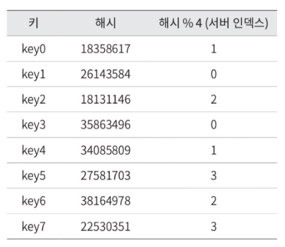
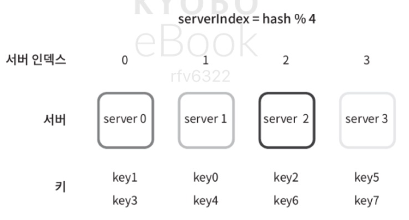
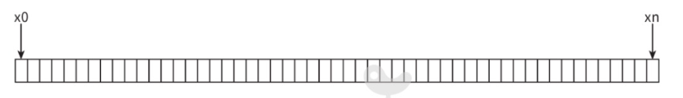
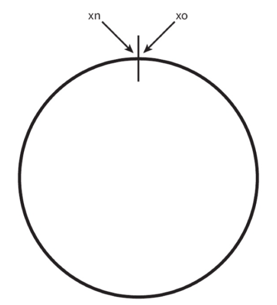
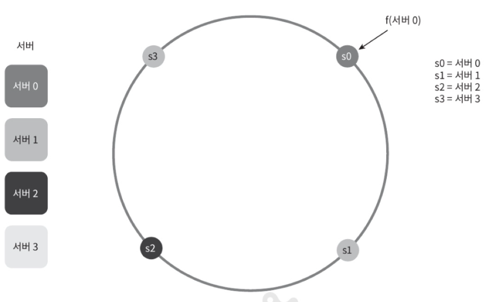
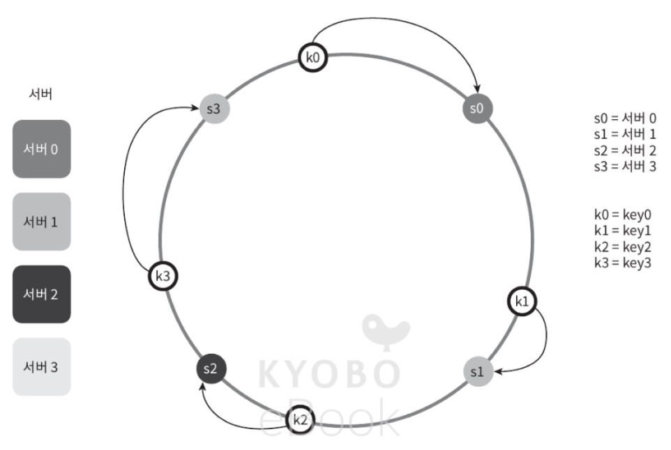
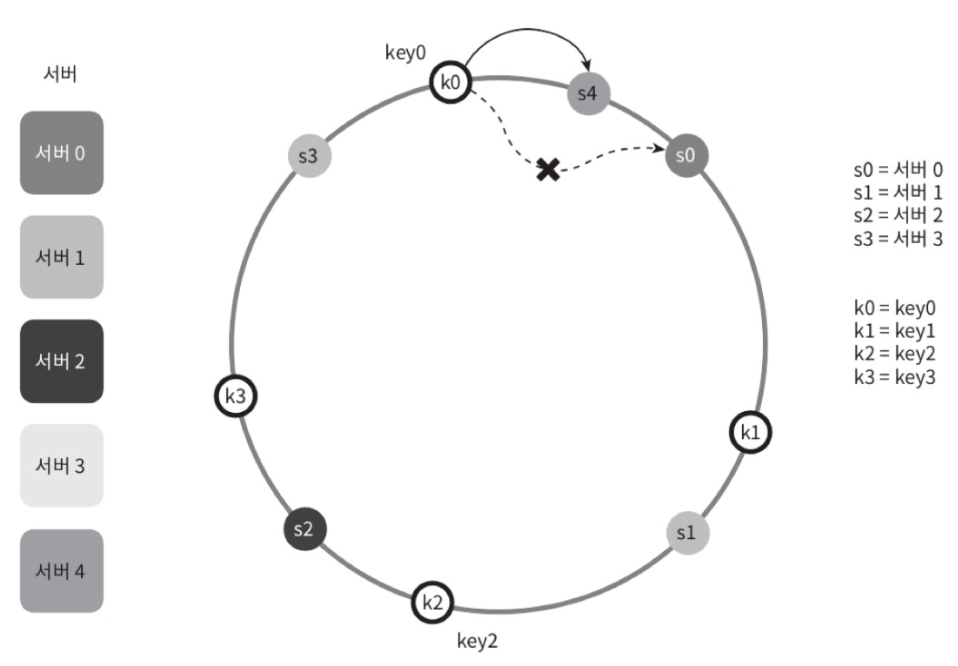
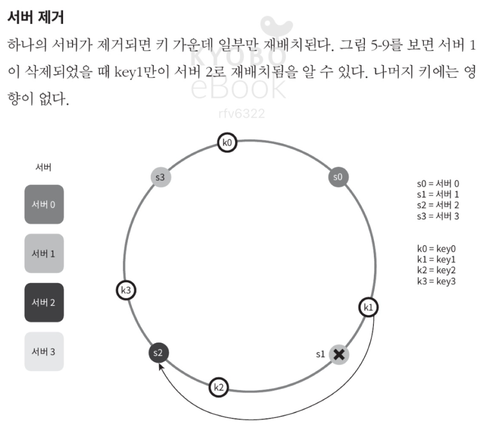
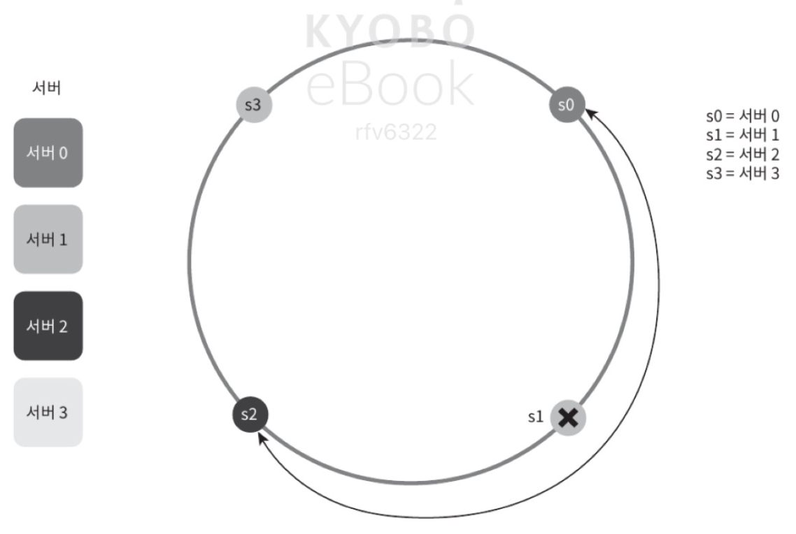
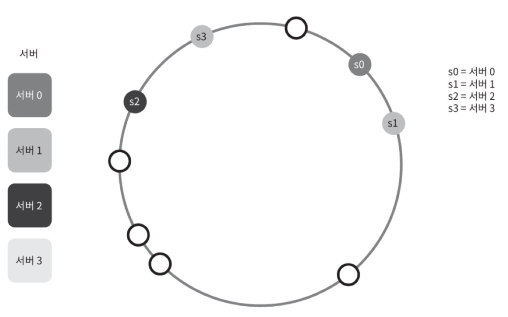

# 안정 해시 설계

> 🤔 안정 해시란?  
> 수평적 규모 확장성을 달성하기 위해 요청 또는 데이터를 서버에 균든하게 나누는 것에 사용하는 기술

해시 기술이 풀려고 하는 문제?

## 해시 키 재배치(refresh) 문제

서버들에 부하를 균등하게 나누는 보편적인 해시 함수

- `serverIndex = hash(key) % N` (N은서버의개수이다)

### 상황

총 4대의 서버를 사용한다고 가정했을 때 주어진 각각의 키에 대해서 해시 값과 서버 인덱스를 계산한 예제

- 서버 인덱스 값에 따라 해당하는 서버로 분배

### 문제점

- 만약 1번 서버가 죽으면?
- 대부분 캐시 클라이언트가 데이터가 없는 엉뚱한 서버로 접속

> 이러한 문제를 효과적으로 해결하는 기술이 안정 해시이다.

## 안정 해시

### 해시 공간과 해시 링

- 해시 함수 f로 SHA-1 사용
- 함수의 출력 값 범위는 x0 ~ xn
- 해시 공간 범위는 0 ~ 2^160-1

- 이 해시 공간의 양쪽을 구부려 접으면 해시 링이 만들어 진다.

### 해시 서버

- 해시 함수 f를 사용하면 서버 IP나 이름을 링 위에 어떤 위치에 대응시킬 수 있다.

### 해시 키

- 여기 사용한 해시 함수는 "해시 키 재배치 문제"에 언급된 함수와 다르다.
- 나머지 연산 %는 사용하지 않고 있다.
- 캐시할 키 또한 해시 링 위의 어느 지점에 배치할 수 있다.

### 서버 조회

- 어떤 키가 저장되는 서버는, 해당 키의 위치로부터 시계 방향으로 링을 탐색해 나가면서 만나는 첫 번째 서버다.

### 서버 추가

- 서버를 추가하더라고 키 가운데 일부만 재배치하면 된다.

### 서버 제거

- 하나의 서버가 제거되면 키 가운데 일부만 재배치된다.

### 기본 구현법의 두 가지 문제

1. 서버가 추가되거나 삭제되는 상황을 감안하면 파티션의 크기를 균등하게 유지하는 게 불가능하다.

2. 키의 균등 분포를 달성하기가 어렵다는 것이다.

