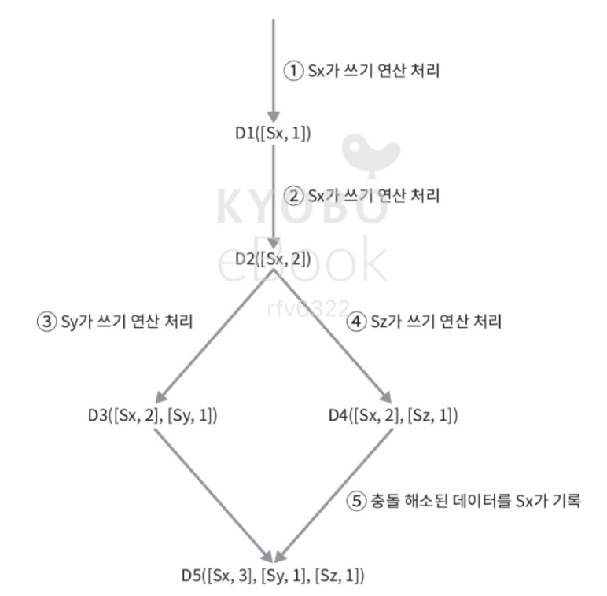
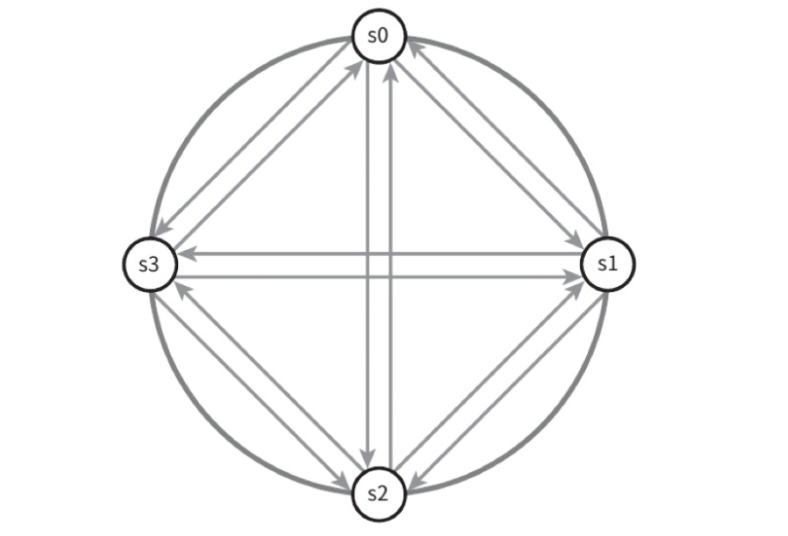

# 안정 해시 설계

## 목차
1. [해시 키 재배치(refresh) 문제](#해시-키-재배치refresh-문제)
2. [안정 해시 기본 구현법](#안정-해시-기본-구현법)
3. [안정 해시 기본 구현법의 문제](#안정-해시-기본-구현법의-문제)
4. [가상 노드](#가상-노드)
5. [안정 해시의 이점](#안정-해시의-이점)
6. [안정 해시의 유명한 예시](#안정-해시의-유명한-예시)

수평적 규모 확장성을 달성하기 위해 서버에 균등하게 트래픽을 나누는 방법은 해시 함수를 사용하는 것이다.

<br />
<br />

## 해시 키 재배치(refresh) 문제

> 상황: N개의 캐시 서버가 있다. 이 서버들에 부하를 균등하게 나누려 한다.

보편적 방법은 아래의 해시 함수를 사용하는 것이다.
N은 서버 개수이다.

```python
serverIndex=hash(key) % N
```

이 해시 함수에 대한 결과물이다.


hash(key0) % 4 = 1이면, 클라이언트는 캐시에 보관된 데이터를 가져오기 위해 서버 1에 접속해야 한다.

이 방법은 server pool의 크기가 고정되어 있을 때, 그리고 데이터 분포가 균등할 때는 잘 동작한다. 하지만 서버가 추가되거나 기존 서버가 삭제되면 문제가 생긴다.

예를 들어 1번 서버가 장애를 일으켜 동작을 중단하면 server pool의 크기는 3으로 변하고, 그 결과로 **키에 대한 해시 값은 변하지 않지만, mod 연산을 적용한 서버 인덱스 값이 달라진다.**

아래 표와 같이, 장애가 발생한 1번 서버의 키 뿐만 아니라 대부분의 키가 재분배 되었다. 즉, 1번 서버가 죽으면 대부분의 캐시 클라이언트가 데이터가 없는 엉뚱한 서버에 접속하게 된다.
그 결과로 대규모 캐시 미스(cache miss)가 발생하게 될 것이다.

| Before | After |
|--------|-------|
|  |  |

안정 해시는 이 문제를 효과적으로 해결하는 기술이다.

<br />
<br />

## 안정 해시 기본 구현법

consistent hash는 해시 테이블 크기가 조정 될 때 평균적으로 오직 k/n개의 키만 재배치하는 해시 기술이다.
여기서 k는 전체 키의 개수, n은 서버의 개수이다.

대부분의 전통적 해시 테이블은 슬롯의 수가 바뀌면 거의 대부분 키를 재배치한다.

<br />

### 해시 공간과 해시 링
해시 함수로 SHA-1을 사용한다고 하고, 함수의 출력 값 범위는 x0, x1, x2, x3, ... xn과 같다고 하자.
SHA-1의 해시 공간(hash space)의 범위는 0부터 2^100-1까지라면, x0은 0, xn은 2^100-1이며, 나머지 x1부터 xn-1까지는 그 사이의 값을 갖게 될 것이다.

이 해시 공간의 양쪽을 구부려 접으면 그림 5-4와 같은 해시 링(hash ring)이 만들어진다.


이 해시 함수 f를 사용하면 서버 IP나 이름을 이 링의 어떤 위치에 대응시킬 수 있다.


여기서 사용된 해시 함수는 **해시 키 재배치 문제**에 언급된 함수와는 다르며, mod 연산 %는 사용하지 않고 있음에 유의하자.
아래 그림과 같이 캐시할 키 key0, key1, key2, key3 또한 해시 링 위의 어느 지점에 배치할 수 있다.


<br />

### 서버 조회

어떤 키가 저장되는 서버는 해당 키의 위치로부터 시계 방향으로 링을 탐색해 나가면서 만나는 첫 번째 서버이다. 
흐름은 아래 그림과 같다.


<br />

### 서버 추가

방금 설명한 내용에 따르면, 서버를 추가하더라도 키 가운데 일부만 재배치하면 된다.
서버 4가 추가되는 경우, k1, k2, k3은 같은 서버에 남고 k0만 서버 0에서 서버 4를 바라보게 된다.
즉, s3부터 s4 사이의 key들만 재배치의 영향을 받는다.



<br />

### 서버 제거

하나의 서버가 제거되면 키 가운데 일부만 재배치된다.
아래 그림을 통해 서버 1이 삭제되는 경우 key1만이 서버 2로 재배치 되었음을 알 수 있다.



<br />
<br />

## 안정 해시 기본 구현법의 문제

안정 해시 알고리즘은 MIT에서 처음 제안되었다.
그 기본 절차는 다음과 같다.

1. 서버와 키를 균등 분포(uniform distribution) 해시 함수를 사용해 해시 링에 배치한다.
2. 키의 위치에서 링을 시계 방향으로 탐색하다 만나는 최초의 서버가 키가 저장될 서버다.

이 접근법에는 두 가지 **문제**가 있다.

<br />

### 파티션 크기 균등의 문제

서버가 추가되거나 삭제되는 상황을 감안하면 파티션(partition)의 크기를 균등하게 유지하는 게 불가능하다.
- 파티션은 인접한 서버 사이의 해시 공간이다.
- 아래 그림에서, 서버 1이 삭제되는 경우 서버 0과 서버 2 사이의 해시 공간이 다른 서버들 간 해시 공간보다 2배로 커지는 상황을 보여준다.


<br />

### 키의 균등 분포 문제

해시 값을 지정할 수 없기 때문에 아래 그림과 같이, 서버 1과 서버 3은 아무 데이터도 갖지 않는 반면, 대부분의 키는 서버 2의 보관될 것이다.


<br />
<br />

## 가상 노드

위 두 가지 문제를 해결하기 위해 가상 노드(virtual node)라는 실제 노드 또는 서버를 가리키는 노드로서, 하나의 서버는 링 위에 여러 개의 가상 노드를 가질 수 있다.

아래는 서버 0, 1이 각각 3개의 가상 노드를 가진 상황이다.
- 3은 사용자가 지정하는 값이다.
- s0으로 표시된 파티션은 서버 0이 관리하는 파티션이고, s1로 표시된 파티션은 서버 1이 관리하는 파티션이다.


키의 위치로부터 링을 탐색하다 만나는 최초의 가상 노드가 해당 키의 저장될 서버가 된다.


가상 노드의 개수를 늘리면 키의 분포는 점점 더 균등해진다. 표준 편자가 작아져서 데이터가 고르게 분포되기 때문이다.
[출처](https://tom-e-white.com/2007/11/consistent-hashing)에 따르면 100-200개의 가상 노드를 사용했을 경우 표준 편차 값은 평균의 5% (가상 노드가 200개인 경우)에서 10%(가상 노드가 100개인 경우) 사이다.

가상 노드의 개수를 늘리면 표준 편차의 값은 더 떨어진다. 그러나, 가상 노드 데이터를 저장할 공간은 더 많이 필요하게 될 것이다. 타협적 결정(tradeoff)이 필요하다는 뜻이다.

<br />

### 재배치할 키 결정

서버가 추가, 제거 되는 경우 재배치 노드는 시계 방향 중 가장 가까운 노드이다.

| 추가 | 제거 |
|--------|-------|
|  |  |

<br />
<br />

## 안정 해시의 이점

- 서버가 추가되거나 삭제될 때 재배치되는 키의 수가 최소화된다.
- 데이터가 보다 균등하게 분포하게 되므로, 수평적 규모 확장성을 달성하기 쉽다.
- 핫스팟(hotspot) 키 문제를 줄인다. 특정한 샤드에 대한 접근이 지나치게 빈번하면 과부하 문제가 생길 수 있는 문제이다.

<br />
<br />

## 안정 해시의 유명한 예시

- [Apache Cassandra 클러스터에서의 데이터 파티셔닝](https://dl.acm.org/doi/10.1145/1294261.1294281)
- [Discord 채팅 애플리케이션](https://blog.discord.com/scaling-elixir-f9b8ele7c29b)
- [Akamai CDN](https://www.akamai.com/us/en/multimedia/documents/technical-publication/consistent-hashing-and-random-trees-distributed-caching-protocols-for-relieving-hot-spots-on-the-world-wide-web-technical-publication.pdf)
- [Maglev 네트워크 부하 분산기](https://static.googleusercontent.com/media/research.google.com/en//pubs/archive/44824.pdf)