# 06. 키-값 저장소 설계
키-값 저장소(키-값 데이터베이스)
- 비관계형 데이터베이스
- 이 저장소에 저장되는 값은 고유 식별자를 키로 가져야 하며, 키와 값 사이에 이런 고유식별자-값쌍을 "키-값"쌍(pair)라고 지칭한다.
- 키-값 쌍에서 키는 유일해야 함
- 해당 키에 매달린 값은 키를 통해서만 접근 가능
- 키는 일반 텍스트일수도, 해시 값일수도 있음
  - 일반 텍스트 키: "last_logged_in_at"
  - 해시 키: "253DDEC4"
- 키는 짧수을수록 좋다
- 값은 문자열, 리스트, 객체 그 어떤 것이든 상관이 없다.
- 키-값 저장소로 널리 알려진 것으로는 아마존 다이나모, memchached, 레디스 등이 있다.
- 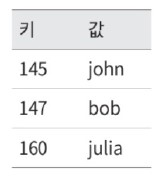
- 키 값 저장소에 보관된 데이터의 사례

### 다음 연산을 지원하는 키-값 저장소 설계하기.
- put(key, value): 키-값 쌍을 저장소에 저장한다.
- get(key): 인자로 주어진 키에 매달린 값을 꺼낸다.

## 문제 이해 및 설계 범위 확정
- 완벽한 설계를 하려 하지 않고, 문제를 명확히 정의하여 균형을 잡아가며 타협적 결정을 내린 설계를 할 것

다음과 같은 특성을 갖는 키-값 저장소를 설계해보자.
- 키-값 쌍의 크기는 10KB 이하
- 큰 데이터를 저장할 수 있어야 함
- 높은 가용성 제공: 장애가 있어도 빠른 응답
- 높은 규모 확장성: 트래픽 양에 따라 자동적으로 서버 증설/삭제
- 데이터 일관성 수준 조정 가능
- 응답 지연 시간이 짧아야 함

## 단일 서버 키-값 저장소
- 직관적으로, 키-값 쌍 전부를 메모리에 해시 테이블로 저장
- 빠른 속도를 보장
- 모든 데이터를 메모리 안에 두는 것이 불가능할 수도 있다는 약점이 있다.
- 개선안
  - 데이터 압축
  - 자주 쓰이는 데이터만 메모리에 두고 나머지는 디스크에 저장
- 많은 데이터를 저장하기 위해서는 분산 키-값 저장소를 만들어야 함

## 분산 키-값 저장소
- 분산 해시 테이블이라고도 함
- 키-값 쌍을 여러 서버에 분산시키는 것
### CAP 정리
- 일관성(Cosistency), 가용성(Availability), 파티션 감내 (Partition tolerance)라는 세 가지 요구사항을 동시에 만족하는 분산 시스템을 설계하는 것은 불가능하다는 정리
- 데이터 일관성
  - 분산 시스템에 접속하는 모든 클라이언트는 어떤 노드에 접속했느냐에 관계 없이 언제나 같은 데이터를 보게 되어야 한다.
- 가용성
  - 분산 시스템에 접속하는 클라이언트는 일부 노드에 장애가 발생하더라도 항상 응답을 받을 수 있어야 한다.
- 파티션 감내
  - 파티션: 두 노드 사이의 통신 장애 발생을 의미
  - 네트워크에 파티션이 생기더라도 시스템은 계속 동작해야 한다는 뜻
- 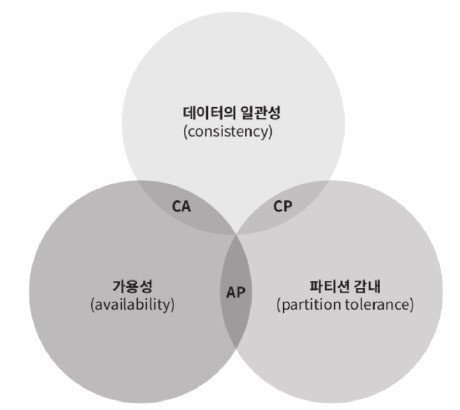

- 위 그림과 같이, C, A, P 중 어떤 두 가지를 충족하려면 나머지 하나는 반드시 희생되어야 함. (모두 만족할 순 없음)
- 키-값 저장소는 이 중 어느 두 가지를 만족하느냐에 따라 다음과 같이 분류한다.
  - CP 시스템: 일관성과 파티션 감내를 지원하는 키-값 저장소, 가용성을 희생
  - AP 시스템: 가용성과 파티션 감내를 지원하는 키-값 저장소, 데이터 일관성을 희생
  - CA 시스템: 일관성과 가용성을 지원하는 키-값 저장소, 파티션 감내는 지원하지 않는다. 하지만 네트워크 장애는 불가피하므로 분산 시스템은 항상 파티션 문제를 감내할 수 있도록 설계되어야 함. 따라서 실세계에 CA 시스템은 존재하지 않는다.

### 예시를 들어 사례를 이해해보자
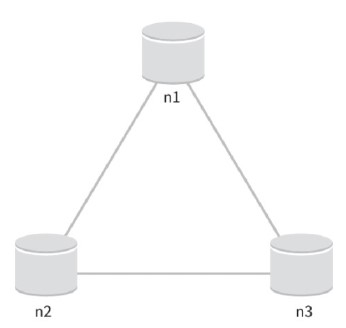

분산 시스템에서 데이터는 보통 여러 노드에 복제되어 보관된다. 위 그림에서 세 대의 복제 노드 n1, n2, n3에 데이터를 복제하여 보관하는 상황이라고 가정

- 이상적 환경이라면, 네트워크가 파티션 되는 상황은 일어나지 않을 것이므로, n1에 기록된 데이터는 자동적으로 n2, n3에 복제됨. -> C, A, P 모두 만족
- 하지만 실세계의 분산 시스템은 파티션 문제를 피할 수 없고, 파티션 문제가 발생하면 우리는 일관성과 가용성 사이에서 하나를 택해야 한다.
- 위 그림에서 n3에 장애가 발생하여 n1과 n2와 통신이 불가능한 상황이라면,
  - 클라이언트가 n1이나 n2에 기록한 데이터는 n3에 전달되지 않음. 
  - n3에 기록되었으나 아직 n1이나 n2로 전달되지 않은 데이터가 있다면 n1과 n2는 과거의 사본을 갖고 있을 것
  - CP 시스템: 가용성 희생, 일관성 선택
    - 세 서버 사이에 생길 수 있는 데이터 불일치 문제를 피하기 위해 n1과 n2에 대해 쓰기 연산 중단-> 가용성 깨짐
    - 예) 온라인 뱅킹 시스템
    - 네트워크 파티션 때문에 일관성이 깨질 수 있는 상황이 발생하면, 상황이 해결될 때까지 오류를 반환해야 함
  - AP 시스템: 일관성 희생, 가용성 선택
    - 낡은 데이터를 반환할 위험이 있더라도 계속 읽기 연산을 허용해야 함.
    - n1, n2에서는 계속 쓰기 연산을 허용하고, 파티션 문제 해결 이후 그 데이터들을 n3에 전송할 것이다.
  
분산 키-값 저장소를 만들 때는 요구사항에 맞게 CAP 정리를 적용해야 함. 면접관과 이야기를 통해 요구사항을 파악하고 결론에 따라 시스템 설계를 해야함

### 시스템 컴포넌트
키-값 저장소 구현에 사용될 핵심 컴포넌트 및 기술
- 데이터 파티션
- 데이터 다중화
- 일관성
- 일관성 불일치 해소
- 장애 처리
- 시스템 아키텍처 다이어그램
- 쓰기 경로
- 읽기 경로

### 데이터 파티션
대규모 애플리케이션의 경우 전체 데이터를 한 대 서버에 욱여넣는 것은 불가능하기 때문에 데이터를 작은 파티션들로 분할한 뒤 여러 대의 서버에 저장하는 등의 방식으로 해결해야한다. 이때 데이터를 파티션 단위로 나눌 때는 다음의 두 문제를 고려해야 한다.
- 데이터를 여러 서버에 고르게 분산할 수 있는지
- 노드가 추가되거나 삭제될 때 데이터의 이동을 최소화할 수 있는지

5장의 안정 해시는 이 두 문제를 푸는 데 적합한 기술이다.
- 안정 해시의 동작 원리
  - 서버, 키를 같은 해시 링에 배치하여, 키 지점으로부터 링을 시계 방향으로 순회하다 만나는 첫 번째 서버가 해당 키-값을 저장할 서버임.
  - 아래 그림에서 key0는 s1에 저장될 것
  - 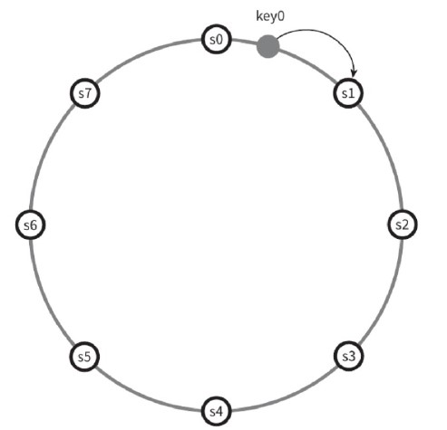
- 안정 해시를 사용하여 데이터를 파티션 했을 때의 장점
  - 규모 확장 자동화: 시스템 부하에 따라 서버가 자동으로 추가되거나 삭제되도록 만들 수 있다.
  - 다양성: 각 서버의 용량에 맞게 가상 노드의 수를 조정할 수 있다. 즉, 고성능 서버는 더 많은 가상 노드를 갖도록 설정할 수 있다. (서버마다 가상 노드의 개수를 다르게)

### 데이터 다중화
- 높은 가용성과 안정성을 확보하기 위해 데이터를 N개 서버에 비동기적으로 다중화해야 함. 
- N: 어떤 키를 링 위에 배치한 후, 그 지점으로부터 시계 방향으로 링을 순회하면서 만나는 첫 N개 서버에 데이터 사본을 보관하는 것
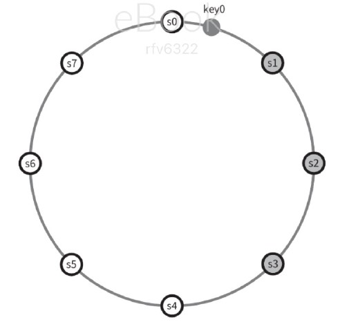
- 위 그림에서, N=3으로 설정한 예제에서 key0은 s1, s2, s3에 저장됨
- 가상 노드를 이용한다면 위와 같이 선택한 N개의 노드가 대응될 실제 물리 서버의 개수가, N보다 작아질 수 있다. 이 문제를 피하려면 같은 물리 서버를 중복 선택하지 않도록 해야함
- 같은 데이터 센터에 속한 노드는 정전, 네트워크 이슈, 자연재해 등의 문제를 동시에 겪을 수도 있음. 따라서 안정성을 담보하기 위해 데이터의 사본은 다른 센터의 서버에 보관하고, 센터들을 고속 네트워크로 연결하는 방법이 있다.

### 데이터 일관성
여러 노드에 다중화된 데이터를 동기화하기 위해 정족수 합의 프로토콜을 사용
- N=사본 개수
- W=쓰기 연산에 대한 정족수. 쓰기 연산이 성공한 것으로 간주되려면 적어도 W개의 서버로부터 쓰기 연산이 성공했다는 응답을 받아야 한다는 뜻
- R=읽기 연산에 대한 정족수. 읽기 연산이 성공한 것으로 간주되려면 적어도 R개의 서버로부터 응답을 받아야 한다는 뜻
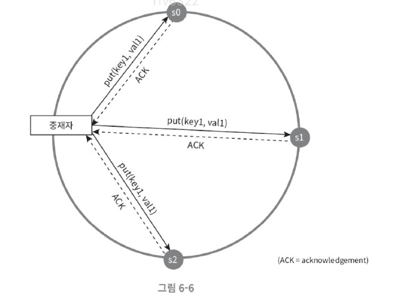
- 데이터가 s0, s1, s2에 다중화된 상황.
- W=1: 쓰기 연산이 성공했다고 판단하기 위해 중재자는 최소 한 대 서버로부터 쓰기 성공 응답을 받아야 한다는 뜻. 위 예제에서 s1로부터 성공 응답을 받았다면 s0, s2로부터의 응답은 기다릴 필요가 없다
- 중재자는 클라이언트와 노드 사이에서 프록시 역할을 한다
- 응답 지연과 데이터 일관성 사이의 타협점을 찾아 W, R, N의 값을 정해야 함
- W=1 또는 R=1인 구성의 경우, 중재자는 한 대 서버로부터의 응답만 받으면 됨: 응답속도 빠름
- W>1이거나 R>1인 경우, 시스템이 보여주는 데이터 일관성의 수준은 향상될 테지만 중재자의 응답 속도는 가장 느린 서버로부터의 응답을 기자려야 하므로 느려질 것
- W+R>N인 경우에는 강환 일관성이 보장됨. 일관성을 보증할 최신 데이터를 가진 노드가 최소 하나는 겹칠 것이기 때문
- 예시 구성
  - R=1, W=N: 빠른 읽기 연산에 최적화된 시스템
  - W=1, R=N: 빠른 쓰기 연산에 최적화된 시스템
  - W+R>N: 강한 일관성이 보장됨(보통 N=3, W=R=2)
  - W+R<=N: 강한 일관성이 보장되지 않음

### 일관성 모델
- 일관성 모델은 데이터 일관성의 수준을 결정함
- 강한 일관성(strong consistency): 모든 읽기 연산은 가장 최근에 갱신된 결과를 반환한다. 즉, 클라이언트는 절대로 낡은 데이터를 보지 못한다.
- 약한 일관성(weak consistency): 읽기 연산은 가장 최근에 갱신된 결과를 반환하지 못할 수 있다.
- 최종 일관성(eventual consitstecy): 약한 일관성의 한 형태로, 갱신 결과가 결국에는 모든 사본에 반영(동기화)되는 모델
- 강한 일관성을 달성하는 일반적인 방법은, 모든 사본에 현재 쓰기 연산의 결과가 반영될 때까지 해당 데이터에 대한 읽기/쓰기를 금지하는 것
  - 새로운 요청의 처리가 중단되기 때문에, 고가용성 시스템에는 적합하지 않다.
- 다이나모, 카산드라같은 저장소는 최종 일관성 모델을 택하고 있다.
- 최종 일관성 모델을 따를 경우 쓰기 연산이 병렬적으로 발생하면 시스템에 저장된 값의 일관성이 깨질 수 있는데, 이 문제는 클라이언트가 해결한다.

### 비 일관성 해소 기법
데이터 다중화: 가용성은 높아지지만 사본간 일관성이 깨질 가능성이 높아짐. 버저닝과 벡터 시계라는 기술을 사용하여 문제를 해결함.
- 버저닝: 데이터를 변경할 때마다 해당 데이터의 새로운 버전을 만드는 것
  - 각 버전의 데이터는 변경 불가능
- 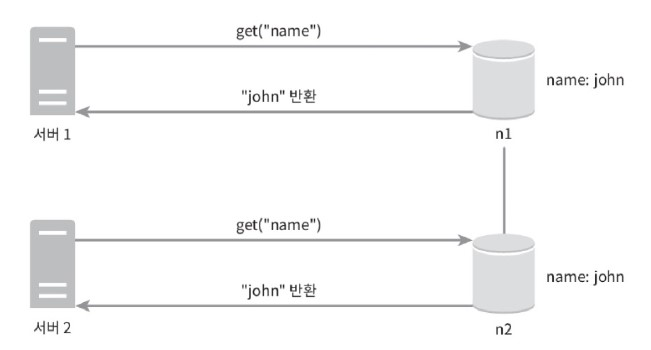
- 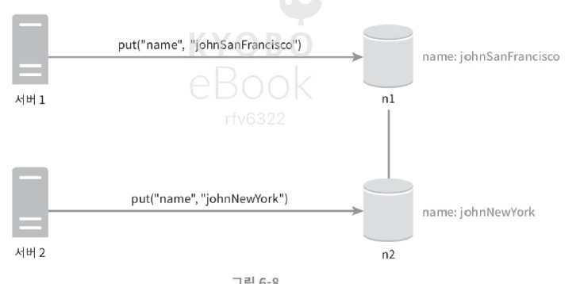
  - 위와 같이, 원래 "name"이라는 키가 "john"이라는 값과 매핑되어 있었다고 하자. 이때 서버 1은 name에 매달린 값을 johnSanFrancisco로 바꾸고(v1), 동시에 서버2는 johnNewYork으로 바꾼다고 하면(v2), 충돌하는 두 값을 갖게 됨.
  - 이 v1, v2와의 충돌을 해결하려면, 충돌을 발견하고 자동으로 해결해 낼 버저닝 시스템이 필요: 여기서는 벡터 시계를 사용
- 벡터 시계
  - 벡터 시계는 [서버], [버전]의 순서쌍을 데이터에 매단 것.
  - 어떤 버전이 선행 버전인지, 후행 버전인지, 아니면 다른 버전과 충돌이 있는 지 판별하는 데 쓰임
  - D([S1, v1], [S2, v2], ... [Sn, vn])과 같이 표현한다고 가정 (D: 데이터, vi: 버전 카운터, Si: 서버 번호)
  - 데이터 D를 서버 Si에 기록하면, 시스템은 아래 작업 중 하나를 수행해햐 함.
    - [Si, vi]가 있으면 vi를 증가시킨다.
    - 그렇지 않으면 새 항목 [Si, 1]를 만든다.
- 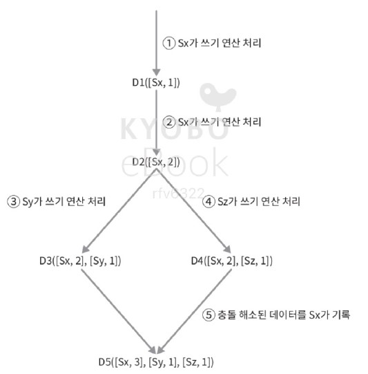
  1. 클라이언트가 데이터 D1을 시스템에 기록한다. 이 쓰기 연산을 처리한 서버를 Sx. 벡터 시계: D1[(Sx, 1)]
  2. 다른 클라이언트가 데이터 D1을 읽고 D2로 업데이트한 다음 기록한다. 이 쓰기 연산을 처리한 서버는 같은 서버 Sx. 벡터 시계: D2([Sx, 2])
  3. 다른 클라이언트가 D2를 읽어 D3로 갱신한 다음 기록한다. 이 쓰기 연산은 Sy가 처리. 벡터 시계: D3([Sx, 2], [Sy, 1])
  4. 또 다른 클라이언트가 D2를 읽고 D4로 갱신한 다음 기록. 이때 쓰기 연산은 Sz가 처리. 벡터 시계는 D4([Sx, 2], [Sz, 1])
  5. 어떤 클라이언트가 D3과 D4를 읽으면, 데이터 간 충돌이 있다는 것을 알게 된다. D2를 Sy와 Sz 각기 다른 값으로 바꾸었기 때문이다. 이 충돌을 클라이언트가 해소한 후에 서버에 기록한다. 이 쓰기 연산을 처리한 서버는 Sx였다고 하면, 벡터 시계는 D5([Sx, 3], [Sy, 1], [Sz, 1])로 바뀐다. 
  - 벡터 시계를 이용하면 어떤 버전 X가 버전 Y의 이전 버전인지(즉 충돌이 없는지) 판단할 수 있다: 버전 Y에 포함된 모든 구성요소의 값이 X에 포함된 모든 구성요소보다 같거나 큰지 보면 됨.
    - 모두 같거나 크다면 충돌은 없다
    - 버전 X와 Y 사이에 충돌이 있는지 보려면, Y의 벡터 시계 구성요소 가운데 X의 벡터 시계 동일 서버 구성 요소보다 작은 값을 갖는 것이 있는지를 보면 됨.
    - 예) D([s0, 1], [s1, 2])와 D([s0, 2], [s1, 1])는 서로 충돌
    - 위의 경우에서는, D3와 D4를 비교하려했는데 Sy는 D4에 없고, Sz는 D3에 없기 때문에 비교 불가: 충돌로 간주
- 벡터 시계를 사용한 충돌 감지 및 해소의 단점
  - 충돌 감지 및 해소 로직이 클라이언트에 들어가야 하므로, 클라이언트 구현이 복잡해진다.
  - [서버: 버전]의 순서쌍 개수가 아주 빠르게 늘어난다.
    - 길이에 임계치를 설정하고, 임계치 이상으로 길어지면 오래된 순서쌍을 벡터 시계에서 제거해야 한다. : 버전 간 선후 관계가 정확하게 결정될 수 없기 때문에 충돌 해소 과정의 효율성이 낮아진다.
      - 하지만 아마존에 따르면, 실제 서비스에서 그런 문제가 벌어지는 것을 발견한 적이 없다고 한다..
### 장애 감지
- 분산 시스템에서는 두 대 이상의 서버가 똑같이 서버 A의 장애를 보고해야 해당 서버에 실제로 장애가 발생했다고 간주한다.
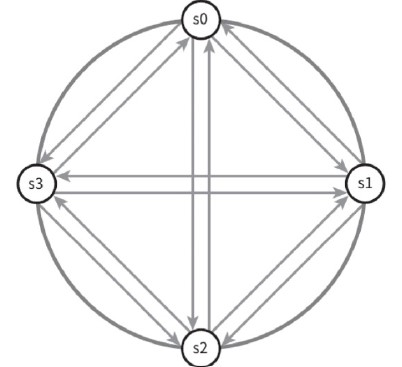
- 이처럼 모든 노드 사이에 멀티캐스팅 채널을 구축하는 것이 서버 장애를 감지하는 가장 손쉬운 방법이지만, 서버가 많을 때는 비효율적이다.
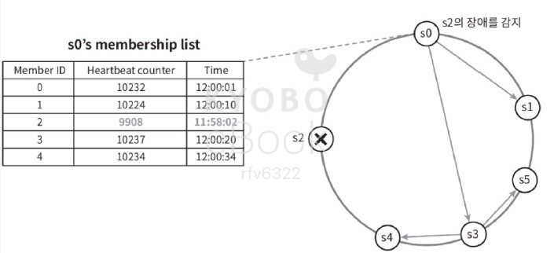
- 가십 프로토콜 (분산형 장애 감지 솔루션)
- 각 노드는 멤버십 목록을 유지한다. 멤버십 목록은 각 멤버 ID와 그 박동 카운터 쌍의 목록이다.
- 각 노드는 주기적으로 자신의 박동 카운터를 증가시킨다.
- 각 노드는 무작위로 선정된 노드들에게 주기적으로 자기 박동 카운터 목록을 보낸다.
- 박동 카운터 목록을 받은 노드는 멤버십 목록을 최신 값으로 갱신한다.
- 어떤 멤버의 박동 카운터 값이 지정된 시간 동안 갱신되지 않으면 해당 멤버는 장애 상태인 것으로 간주한다.

### 일시적 장애 처리
- 가용성을 보장하기 위해, 장애 감지 후 조치를 취해야 한다.
- 엄격한 정족수 접근법: 읽기와 쓰기 연산을 금지
- 느슨한 정족수 접근법: 조건을 완화하여 가용성을 높인다. 정족수 요구사항을 강제하는 대신, 쓰기 연산을 수행할 W개의 건강한 서버와 읽기 연산을 수행할 R개의 건강한 서버를 해시 링에서 고른다. (장애 상태 서버는 무시)
- 네트워크나 서버 문제로 장애 상태인 서버로 가는 요청은 다른 서버가 맡아 처리
- 그동안 발생한 변경사항은 해당 서버가 복구되었을 때 일괄 반영하여 데이터 일관성 보존
- 이를 위해, 임시로 쓰기 연산을 처리한 서버에는 그에 관한 단서(hint)를 남겨둔다. (단서 후 임시 위탁 기법)
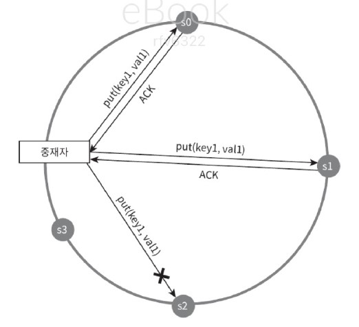
- 장애 상태인 노드 s2에 대한 읽기 및 쓰기 연산은 일시적으로 노드 s3가 처리한다. s2가 복구되면, s3는 갱신된 데이터를 s2로 인계할 것
### 영구 장애 처리
- 반-엔트로피 프로토콜을 구현하여 사본들을 동기화할 것
- 반-엔트로피 프로토콜은, 사본들을 비교하여 최신 버전으로 갱신하는 과정을 포함함. 
- 사본간의 일관성이 망가진 상태를 탐지하고 전송 데이터의 양을 줄이기 위해서는 머클 트리를 사용
- 머클 트리: 각 노드에, 그 자식 노드들에 보관된 값의 해시(자식 노드가 종단 leaf 노드인 경우), 또는 자식 노드들의 레이블로부터 계산된 해시 값을 레이블로 붙여두는 트리다. 해시 트리를 사용하면 대규모 자료구조의 내용을 효과적이고 안전한 방법으로 검증할 수 있다.
- 키 공간이 1~1까지일 때 머클 트리를 만드는 예제. (일관성이 망가진 데이터가 위치한 상자는 다른 색으로 표시)
- 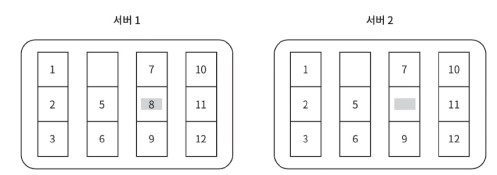
1. 키 공간을 위 그림과 같이 버킷으로 나눈다. 
- 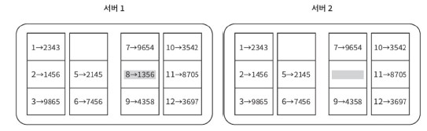
2. 버킷에 포함된 각각의 키에 균등 분포 해시 함수를 적용하여 해시 값을 계산한다.
- 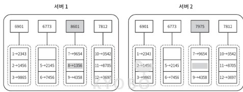
3. 버킷별로 해시값을 계산한 후, 해당 해시 값을 레이블로 갖는 노드를 만든다.
- 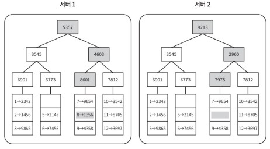
4. 자식 노드의 레이블로부터 새로운 해시 값을 계산하여, 이진 트리를 상향식으로 구성해 나간다.
- 이렇게 생성한 두 머클 트리의 비교는 루트 노드의 해시 값을 비교하는 것으로 시작. 루트 노드 해시 값이 일치한다면 두 서버는 같은 데이터를 갖는 것
- 값이 다르다면 왼쪽 자식 노드의 해시 값을 비교하고, 오른쪽 자식 노드의 해시 값을 비교한다.
- 이렇게 아래쪽으로 탐색해 나가면... 다른 데이터를 갖는 버킷을 찾을 수 잇으므로 그 버킷들만 동기화하면 된다.
- 머클 트리를 사용하면 동기화해야하는 데이터의 양은 실제로 존재하는 차이의 크기에 비례할 뿐, 두 서버에 보관된 데이터의 총량과는 무관해진다. 
- 하지만 실제로 쓰이는 시스템은 버킷 하나의 크기도 꽤 크다.

### 데이터 센터 장애 처리
데이터 센터 장애는 정전, 네트워크 장애, 자연재해 등 다양한 이유로 발생할 수 있다. 이에 대응할 수 있는 시스템을 만들려면 데이터를 여러 데이터 센터에 다중화해야 함. 이렇게 하면 한 데이터 센터가 완전히 망가져도 사용자는 다른 데이터 센터에 보관된 데이터를 이용할 수 있을 것이다.

## 시스템 아키텍처 다이어그램
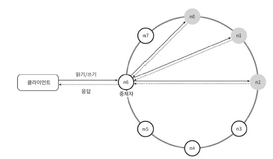
- 클라이언트는 get(key), put(key, value)와 통신한다.
- 중재자는 클라이언트에게 키-값 저장소에 대한 프록시 역할을 하는 노드다.
- 노드는 안정 해시의 해시 링 위에 분포한다.
- 노드를 자동으로 추가 또는 삭제할 수 있도록, 시스템은 완전히 분산된다.
- 데이터는 여러 노드에 다중화된다.
- 모든 노드가 같은 책임을 지므로, SPOF(Single Point of Failure)는 존재하지 않는다.
- 완전히 분산된 설계를 채택하였으므로, 모든 노드는 클라이언트 API, 장애 감지, 데이터 충돌 해소, 장애 복구 메커니즘, 다중화, 저장소 엔진 등.. 모든 기능을 지원해야 한다.
## 쓰기 경로
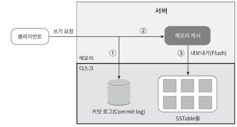
- 쓰기 요청이 특정 노드에 전달되면 일어나는 일
1. 쓰기 요청이 커밋 로그 파일에 기록된다.
2. 데이터가 메모리 캐시에 기록된다.
3. 메모리 캐시가 가득차거나 사전에 정의된 어떤 임계치에 도달하면, 데이터는 디스크에 있는 SSTable에 기록된다. SSTable은 Sorted-String Table의 약어로, <키, 값>의 순서쌍을 정렬된 리스트 형태로 관리하는 테이블이다.
## 읽기 경로
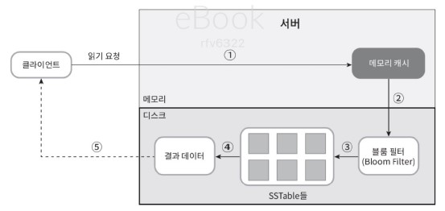
- 읽기 요청을 받은 노드는 데이터가 메모리 캐시에 있는지 살핀다. 있다면 해당 데이터를 클라이언트에게 그대로 반환한다. 
- 데이터가 메모리에 없는 경우에는 디스크에서 가져와야 한다. 이때 아래의 과정이 수행된다. 
- 디스크에서 데이터를 가져오기 위해서는 어느 SSTable에 찾는 키가 있는지 알아낼 효율적인 방법이 필요하고, 이를 위해 블룸 필터가 사용된다.
  1. 데이터가 메모리에 있는지 검사한다. 없으면 2로 간다.
  2. 데이터가 메모리에 없으므로 블룸 필터를 검사한다. 
  3. 블룸 필터를 통해 어떤 SSTable에 키가 보관되어 있는지 알아낸다. 
  4. SSTable에서 데이터를 가져온다.
  5. 해당 데이터를 클라이언트에게 반환한다.

# 요약
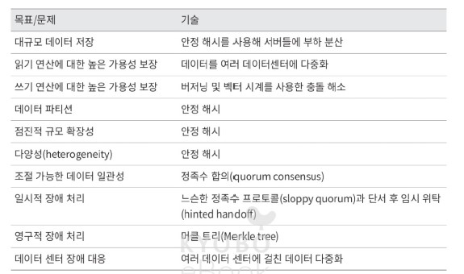