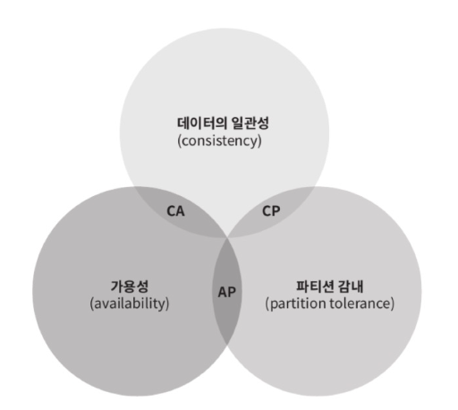
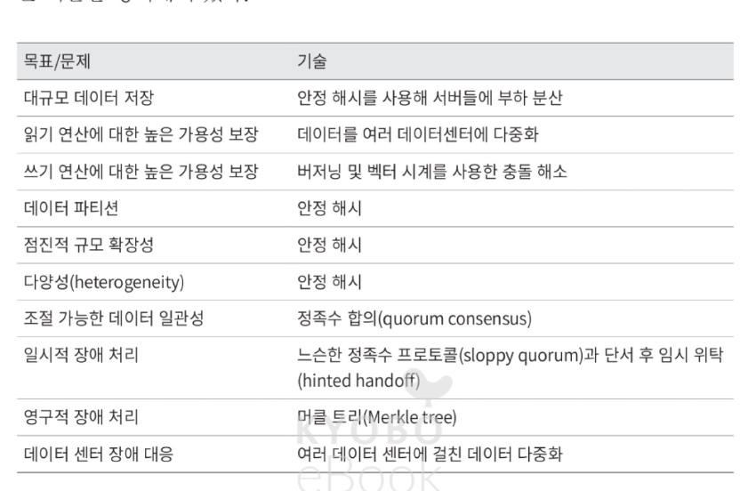

# 6장 키-값 저장소 설계
- 키- 값 저장소 (key-value store)는 키- 값 데이터베이스라고도 불리는 비 관계형 데이터베이스이다. 
- 키와 값 사이의 이런 연결 관계를 " 키값 " 쌍이라고 지칭한다
- 여기서의 값은 어떤 형태도 상관없다. 

## 문제 이해 및 설계 범위 확정
키-값 저장소 설계의 특성
- 키- 값 쌍의 크기는 10KB 이하이다
- 큰 데이터를 저장할 수 있어야 한다.
- 높은 가용성을 제공해야 한다. 따라서 - 시스템은 설사 장애가 있더라도 빨리 응답해야 한다.
- 높은 규모 확장성을 제공해야 한다. 따라서 트래픽 양에 따라 자동적으로
서버 증설 / 삭제가 이루어져야 한다.
- 데이터 일관성 수준은 조정이 가능해야 한다.
- 응답 지연시간이 짧아야 한다.

## 단일 서버 키- 값 저장소
- 빠른 속도 보장
- 모든 데이터를 메모리안에 두는 것이 불가능
    - 해결 : 데이터 압축, 자주 쓰이는 데이터만 메모리에 두기
- 단일 서버 부족 -> 분산 키-값 저장소

## 분산 키- 값 저장소
### CAP 정리
- 일관성, 가용성, 파티션 감내
라는 세 가지 요구사항을 동시에 만족하는 분산 시스템을 설계하는 것은 불가능 
        
- cp,ap,ca 시스템
- 분산 시스템은 반드시 파티션 문제를 감내할 수 있도록 설계되어야 한다 그러므로 실세계에 CA 시스템은 존재하지 않는다.

- 분산 키-값 저장소는 cap 정리를 따른다. 
- 분산 키- 값 저장소를 만들 때는 그 요구사항에 맞도록 CAP 정리를 적용해야 한다. 
    - 가용성, 일관성 -> 더 중요한게 다름
## 시스템 컴포넌트
### 데이터 파티션
- 안정해시를 따른다.
- 장점 : 규모 확장 자동화, 다양성
### 데이터 다중회
-  데이터를 N 개 서버에 비동기적으로 다중화
- 어떤 키를 해시 링 위에 배치한 후 , 그 지점으로부터 시계 방향으로 링을 순회하면서 만나는 첫 N 개 서버에 데이터 사본을 보관하는 것이다.
- 안정성을 담보하기 위해 데이터의 사본은
다른 센터의 서버에 보관하고 , 센터들은 고속 네트워크로 연결한다.

### 데이터 일관성
1. 정의
- N= 사본 개수.
- W= 쓰기 연산에 대한 정족수. 쓰기 연산이 성공한 것으로 간주되려면 적어
도 W 개의 서버로부터 쓰기 연산이 성공했다는 응답을 받아야 한다.
- R= 읽기 연산에 대한 정족수. 읽기 연산이 성공한 것으로 간주되려면 적어
도 R 개의 서버로부터 응답을 받아야 한다.
2. 작동과정
- R=1, W=N: 빠른 읽기 연산에 최적화된 시스템
- W=1, R=N: 빠른 쓰기 연산에 최적화된 시스템
- W+R>N: 강한 일관성이 보장됨 ( 보통 N=3, W=R=2)
- W+RSN: 강한 일관성이 보장되지 않음
3. 비일관성 해소 기법 : 데이터 비저닝
- 벡터 시계
- 만일 데이터 D를 서버 Si 에 기록하면 , 시스템은 아래 작업 가운데 하나를 수행하여야 한다.
    - ISi,vi 가 있으면 v 를 증가시킨다.
    - 그렇지 않으면 새 항목 Si, 1 를 만든다.
### 장애 감지
- 모든 노드 사이에 멀티캐스팅 (multicasting) 채널을 구축하는 것이 서버 장애를 감지
- 가십 프로토콜
    - 박동 카운터가 오랫동안 증가되지 않았음을 발견한 모든 노드는 해당 노드를 장애 노드로 표시
### 일시적 장애처리
- 임시 위탁 기법
    - 정족수 요구사항을 강제하는 대신 , 쓰기 연산을 수행할 W 개의 건강한 서버와 읽기 연산을 수행할 R 개의 건강한 서버를 해시 링에서 고른다. 
    - 이때 장애 상태인 서버는 무시한다

### 영구 장애처리
- 반- 엔트로피 프로토콜을 구현하여 사본들을 동기화
    - 루트 노드의 해시 값이 일치한다면 두 서버는 같은 데이터를 갖는 것이다.
    - 그 값이 다른 경우에는 왼쪽 자식 노드의 해시 값을 비교하고 , 그 다음으로 오른쪽 자식 노드의 해시 값을 비교한다.
- 쓰기 경로
    -  메모리 캐시가 가득차거나 사전에 정의된 어떤 임계치에 도달하면 데이터는 디스크에 있는 SSTable 이에 기록된다. SSTable 은 Sorted-String Table 의 약어로 , < 키 , 값 > 의 순서쌍을 정렬된 리스트 형태로 관리하는 테이블이다.
## 요약
- 분산 키값 저장소가 가져야 하는 기능과 그 기능 구현에 이용되는 기술
  
        