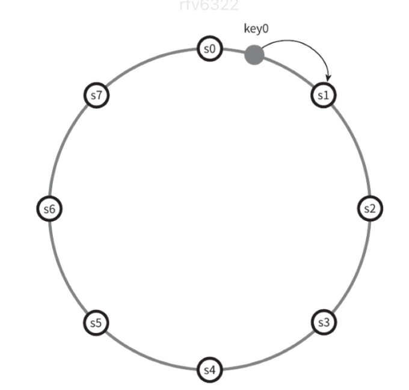
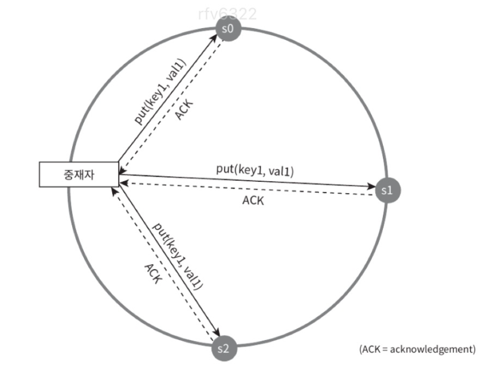

# 키-값 저장소 설계

> 키-값 저장소는 비 관계형 데이터베이스이다.
> 키는 유일해야 하며 키를 통해서만 접근할 수 있다.
> 성능상의 이유로, 키는 짧을수록 좋다.

## 문제 이해 및 설계 범위 확정

- 키-값 쌍의 크기는 10KB 이하
- 큰 데이터 저장 가능
- 높은 가용성
- 높은 규모 확장성
- 데이터 일관성 수준 조정 가능
- 응답 지연시간 짧게

## 단일 서버 키-값 저장소

> 키-값 쌍 전부 메모리에 해시 테이블로 저장

모든 데이터를 메모리 안에 두는 것이 불가능 할 수 있다. 이에 대한 개선책은

- 데이터 압축
- 자주 쓰이는 데이터만 메모리에 두고 나머지는 디스크에 저장

## 분산 키-값 저장소

### CAP 정리

> 데이터 일관성, 가용성, 파티션 감내라는 세 가지 요구사항을 만족하는 분산 시스템을 설계하는 것은 불가능하다는 정리

- 데이터 일관성: 어떤 노드에 속했냐에 관계없이 언제나 같은 데이터를 보게 되어야 한다.
- 가용성: 분산 시스템에 접속하는 클라이언트는 일부 노드에 장애가 발생하더라고 항상 응답을 받을 수 있어야 한다.
- 파티션 감내: 파티션은 두 노드 사이에 통신 장애가 발생하였음을 의미한다.파티션 감내는 네트워크에 파티션이 생기더라도 시스템은 계속 동작하여야 한다는 것을 뜻한다.

**CAP 정리는 이들 가운데 어떤 두 가지를 충족하려면 나머지 하나는 반드시 희생되어야 한다는 것을 의미**

- 분산 시스템은 반드시 파티션 문제를 감내할 수 있도록 설계되어야 한다. 그러므로 CA 시스템은 실세계에 존재하지 않는다.

### 실세계의 분산 시스

- CP 시스템: 은행권 시스템이 주로 선택. 항상 최신 정보를 출력해야 하므로 일관성을 선택.
- AP 시스템: 설사 낡은 데이터를 반환할 위험이 있더라도 계속 읽기 연산 허용

> 질문: AP 시스템을 주로 선택하는 회사는? CP 시스템은 은행권이라는데...

### 시스템 컴포넌트

- 데이터 파티션
- 데이터 다중화(replication)
- 일관성(consistency)
- 일관성 불일치 해소(inconsistency resolution)
- 장애 처리
- 시스템 아키텍처 다이어그램
- 쓰기 경로
- 읽기 경로

### 데이터 파티션

- 데이터를 작은 파티션들로 분할한 다음 여러 대 서버에 저장
- 안정 해시 사용

**장점**

- 규모 확장 자동화
- 다양성

### 데이터 다중화

- 데이터를 N개 서버에 비동기적으로 다중화
- 시계 방향으로 링을 순회하면서 만나는 첫 N개 서버에 데이터 사본 보

### 데이터 일관성

- 여러 노드에 다중화된 데이터는 적절히 동기화가 되어야 한다. 정족수 합의 프로토콜을 사용하면 읽기/쓰기 연산 모두에 일관성을 보장할 수 있다.

- N = 사본의 개수
- W = 쓰기 연산에 대한 정족수. W개의 서버 모두 쓰기 연산이 성공해야 쓰기 연산 성공.
- R = 읽기 연산에 대한 정족수. R개의 서버 모두 읽기 연산이 성공해야 읽기 연산 성공.

- 중재자는 클라이언트와 노드 사이의 프록시 역할
- R = 1, W = N: 빠른 읽기 연산에 최적화
- W = 1, R = N: 빠른 쓰기 연산에 최적화
- W + R > N: 강한 일관성이 보장
- W + R <= N: 강한 일관성이 보장되지 않음

**일관성 모델**

- 강한 일관성: 클라이언트는 절대로 낡은 데이터를 보지 못함
- 약한 일관성: 읽기 연산은 가장 최근에 갱신된 결과를 반환하지 못할 수 있음
- 최종 일관성: 약한 일관성의 한 형태로, 갱신 결과가 결국에는 모든 사본에 반영(동기화)되는 모델

**비 일관성 해소 기법: 데이터 버저닝**

- 버저닝: 데이터를 변경할 때마다 데이터의 새로운 버전을 만드는 것
- 벡터 시계: [서버, 버전]의 순서쌍을 데이터에 매단 것

**장애 감지**

- 모든 노드 사이에 멀티캐스팅 채널 구축

- 가십 프로토콜 같은 분산형 장애 감지 솔루션을 채택하는 편이 효율적

**일시적 장애 처리**

- 가용성 보장을 위해 엄격한 정족수 접근법 사용

### 시스템 아키텍처 다이어그램

## 요약

