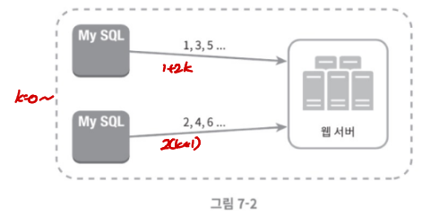

# [6주차] 7장_분산 시스템을 위한 유일 ID 생성기 설계_고동현

## 1. 문제 이해 및 설계 범위 확정

- **ID의 핵심 요구사항 정리**
    - 유일성 (Unique)
    - 정렬 가능 (Sortable), 되도록 시간 순서에 따라 정렬 가능해야 함
    - 64비트로 표현 가능해야 함
    - 초당 10,000개의 ID를 생성할 수 있어야 함

## 2. 개략적 설계안 제시 및 동의 구하기

### 다중 마스터 복제 (Multi-master replication)

데이터베이스의 `auto_increment` 기능을 사용한다. DB 서버 수를 늘려 초당 생성 가능 ID 수를 늘릴 수 있다. 



- 예시
- **설정:** 2개의 마스터 서버(A, B)가 있다고 가정합니다.
    - **서버 A 설정:** `auto_increment_offset = 1` (시작값), `auto_increment_increment = 2` (증가 폭)
    - 서버 A는 1, 3, 5, 7, ... 과 같은 **홀수 ID만 생성**
    - **서버 B 설정:** `auto_increment_offset = 2` (시작값), `auto_increment_increment = 2` (증가 폭)
        - 서버 B는 2, 4, 6, 8, ... 과 같은 **짝수 ID만 생성**
- **장점**: 구현이 간단합니다.
- **단점**:
    - 여러 데이터 센터에 걸쳐 규모를 늘리기 어렵다.
    - ID의 유일성은 보장되지만, 시간 흐름에 따라 커지도록 보장할 수 없다.
    - 서버를 추가하거나 삭제할 때 유연하게 동작하도록 만들기 어려움
        - 서버를 확장하면 `auto_increment` 값을 3으로 수정하고 offset을 새로 설정해야 한다.

### UUID (Universally Unique Identifier)

클라이언트 측에서 독립적으로 ID를 생성하는 방식으로 128비트 길이의 값을 사용


- **주요 버전**
    - **UUIDv1 (Timestamp):** DD-MM-YYYY 구조로 되어 있어 시간순 정렬이지만 ID값으로 쓰기 적합하지 않음. 1월 1일, 2월 1일, 3월 1일을 정렬하려해도 1일 1월, 1일 2월 순으로 일이 먼저 정렬된다.
        - `[time_low] - [time_mid] - [time_hi_and_version] - [clock_seq] - [node]`
    - **UUIDv4 (Random):** 122비트를 완전히 무작위적인 난수로 채워 가장 구현이 간단하고 널리 사용
    
    ```python
    import uuid
    uuid.uuid4() # UUID('9b1deb4d-3b7d-4bad-9bdd-2b0d7b3dcb6d')
    ```
    
    - **UUIDv7 (최신):** 트위터 스노플레이크(Twitter Snowflake)의 아이디어를 차용하여 v1과 v4의 장점만 합쳐, **시간순 정렬**과 **보안성** 얻음. **PK로 사용하기 적합하다.**
        - [https://uuidv7.org/](https://uuidv7.org/)
        - **`[Timestamp (48비트)]`** + `[Version (4비트)]` + `[Random (76비트)]`
- **장점**:
    - ID 생성이 단순하고 서버 간의 동기화가 필요 없다.
    - 각 서버가 알아서 ID를 생성하므로 규모 확장이 쉽다.
- **단점**:
    - ID가 128비트로 길다. (요구사항은 64비트)
    - ID를 시간순으로 정렬할 수 없다.
    - ID에 숫자가 아닌 값이 포함될 수 있다.

### 티켓 서버 (Ticket Server)

 `auto_increment` 기능이 있는 중앙 집중형 데이터베이스 서버(티켓 서버)를 하나만 사용하는 방식입니다. (예: 플리커(Flickr))


- **장점**:
    - 유일성이 보장되는 숫자 ID를 쉽게 만들 수 있다
    - 구현이 쉽고, 중소 규모 애플리케이션에 적합
- **단점**:
    - **SPOF (Single-Point-of-Failure)**: 티켓 서버에 장애가 발생하면 전체 시스템이 영향을 받는다

### 트위터 스노플레이크 (Twitter Snowflake) 접근법

ID를 여러 섹션으로 분할하여 생성하는 방식입니다.

- **64비트 ID의 구성**:
    
    
    
    - **사인(Sign) 비트**: 1비트. 음수와 양수를 구별하는 데 사용. 현재는 사용하지 않음.
    - **타임스탬프 (Timestamp)**: 41비트. 기원 시각(epoch) 이후로 몇 밀리초(ms)가 경과했는지를 나타냄.
    - **데이터센터 ID**: 5비트. 25=32개의 데이터센터를 지원.
    - **서버 ID**: 5비트. 데이터센터당 25=32개의 서버를 지원.
    - **일련번호 (Sequence number)**: 12비트. 각 서버에서 생성하는 ID에 붙는 번호. 1밀리초가 경과할 때마다 0으로 초기화됨. 212=4096개의 ID 생성 가능.

## 3. 상세 설계

- **타임스탬프 (Timestamp)**
    - 41비트로 표현할 수 있는 타임스탬프의 최댓값은 $2^{41}−1$ 밀리초
    - 이는 대략 **69년**에 해당하며, 69년이 지나면 오버플로(overflow)가 발생할 수 있어 기원 시각을 바꾸거나 ID 체계를 이전해야한다.
- **일련번호 (Sequence number)**
    - 12비트로 구성되며, 1밀리초 동안 하나의 서버는 4096개의 ID를 만들어 낼 수 있다.

## 4. 마무리

- **고려사항**:
    - **시계 동기화 (Clock Synchronization)**: ID 생성 서버들의 시간이 모두 같아야한다.
        - NTP(Network Time Protocol)는 이를 해결하는 가장 보편적인 수단