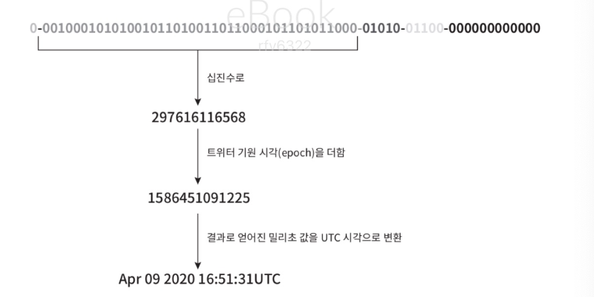

# ch7. 분산 시스템을 위한 유일 id 생성기 설계

## 챕터 개요
- 기존 : 기본키를 쓰면 되지 않을까? (auto_increment 속성이 설정된 관계형 데이터)
- 문제 : 분산환경에서는 1. 데이터 서버 한대로는 요구 감당 불가 2. 지연 시간을 낮추기가 어려움

## 1단계 문제 이해 및 설계 범위 확정

- 면접관한테 질문을 통해 요구사항 정확히 이해
- 면접 예시 요구사항
    -  ID 는 유일해야 한다
    - ID 는 숫자로만 구성되어야 한다.
    - ID 는 64 비트로 표현될 수 있는 값이어야 한다.
    - ID 는 발급 날짜에 따라 정렬 가능해야 한다.
    - 초당 10,000 개의 ID 를 만들 수 있어야 한다.
## 2단계 설계안 제시 및 동의 구하기
- 분산시스템에서 유일성이 보장 되는 id 만드는 방법
    - 다중 마스터 복제
    - UUID
    - 티켓 서버
    - 트워트 스노플레이크 접근법
    ### 다중 마스터 복제
    - auto_increment 기능 활용
    - id의 값을 구할 때 사용중인 데이터베이스의 서버수만큼 증가시킴
    - 장점 : 규모 확장성 문제를 어느 정도 해결 가능
    - 단점 : 1. 여러 데이터 센터에 걸쳐 규모 늘리기가 어려움 2. id 값이 시간 흐름에 따라 커지도록 보장 불가 3. 서버 추가 삭제 시 정상 동작 힘듦
    ### UUID
    - 컴퓨터 시스템에 저장되는 정보를 유일하개 식별하기 위한 128비트짜리 수를 보장
    - UUID의 중복 확률은 현저히 낮음
    - 장점 : UUID 생성 단순, 규모 확장 쉬움 
    - 단점 : 128비트로 요구사항에 위반, 시간순으로 정렬 불가, id에 숫자가 아닌 값이 포함될 수 있음
    ### 티켓 서버
    - 티켓 서버 : auto_inctement 기능을 갖춘 데이터서버
    - 티켓 서버를 중앙 집중형으로 하나만 사용
    - 장점 : 유일성 보장, 숫자로만 구성된 id, 구현쉬움
    - 단점 : spof로 서버에 장애가 발생하면 모든 시스템이 영향
    ### 트위터 스노플레이크 접근법
    - id 구조 
    - 사인 비트(1bit) : 부호
    - 타임 스탬프 (41bit) : 밀리초 경과 나타냄
    - 데이터센터 (5bit) 
    - 서버 id (5bit)
    - 일련번호 : id 생성마다 1씩 증가, 밀리초 경과할 때마다 0으로 초기화
- 요구사항에 가장 만족하는 방식은 트위터 스노플레이크 접근법
## 3단계 상세 설계
- 트위터 스노플레이크 접근법을 사용
- 데이터센터 id와 서버 id는 시스템이 시작할 때 결정, 운영중 변경 x (충돌 발생 가능성)
- 타임스탬프
    - 
    - 타임스탬프 -> utc 시각으로 변환 가능
    - 최대 대략 69년까지 가능
        - 기원 시각을 현재에 가깝게 맞춰서 오버플로 발생 시점 늦춤
    - 69년이 지나면
        - 기원 시각 변경
        - id 체계 다른 것으로 이전
- 일련번호
    - 12bit, 4096개의 값을 가질 수 있음
## 4단계 마무리
추가 논의 제안
- 시계 동기화 : 서버가 다른 시계를 사용할 경우 동기화 필요 
- 각 절의 길이 최적화 : 애플리케이션의 특성 반영한 id 구성요소 길이 변경 필요 (동시성이 낮고 수명이 길 경우 타임스탬프의 절 늘리기)
- 고가용성 : id 생성기는 필수 불가결