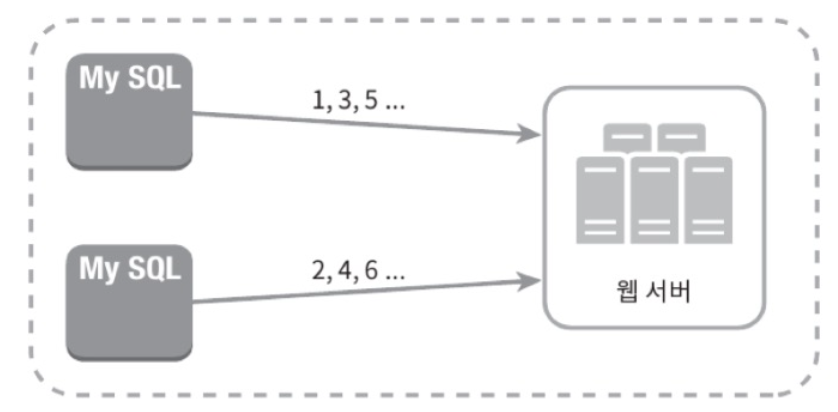
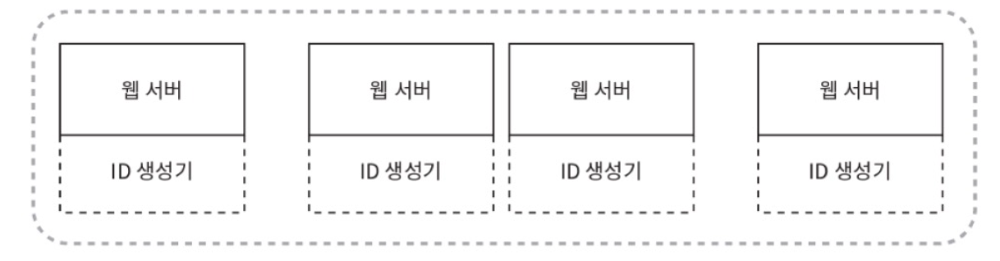
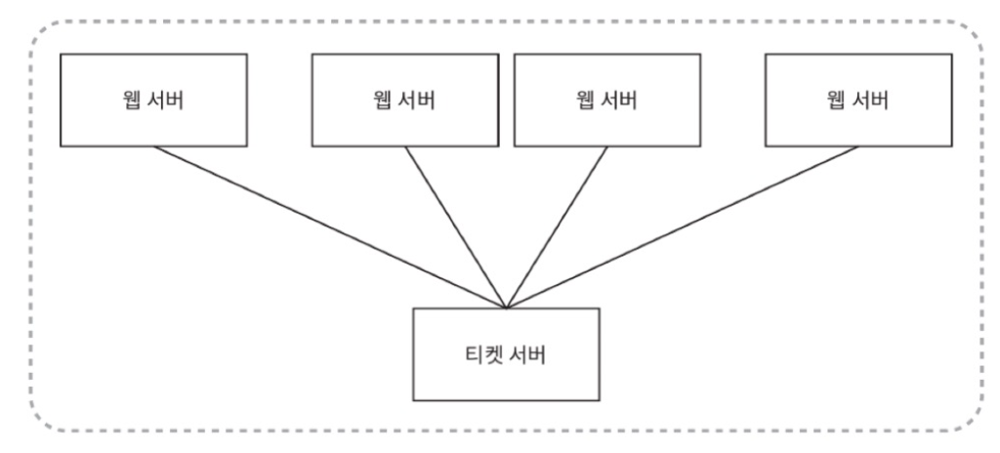
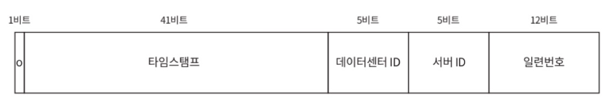
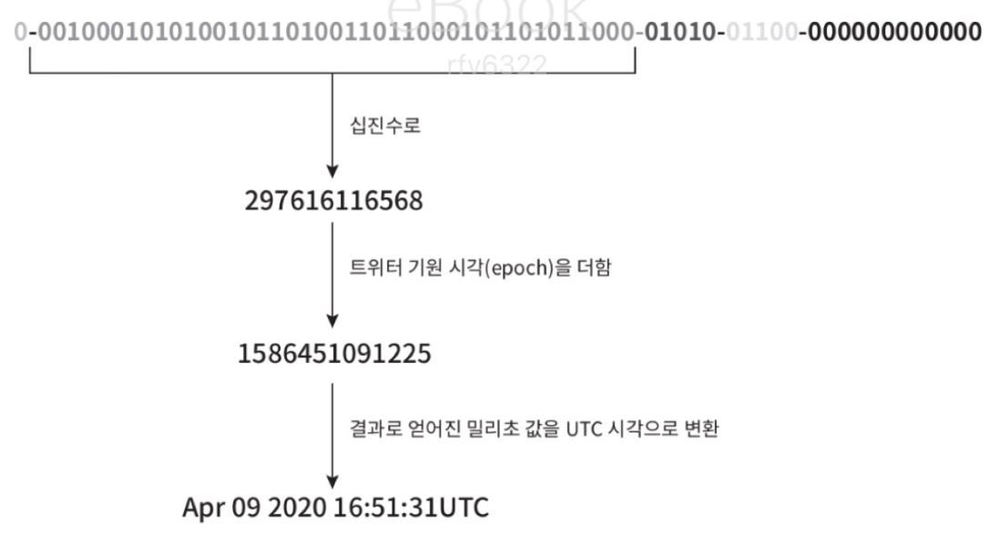

# 7장 분산 시스템을 위한 유일 ID 생성기 설계

## 1. 문제 이해 및 설계 범위 확정

분산 시스템 환경에서는 기존의 관계형 데이터베이스(RDB)의 `auto_increment` 속성을 사용하기 어렵다. 데이터베이스 서버 한 대로 요구를 감당하기 어렵고, 여러 서버를 사용할 경우 지연 시간을 낮추기 힘들기 때문이다.

### 🎯 요구 사항

면접관과의 질의응답을 통해 확정된 요구사항은 다음과 같다.

* **유일성:** ID는 반드시 유일해야 한다.
* **숫자:** ID는 숫자로만 구성되어야 한다.
* **크기:** ID는 64비트로 표현될 수 있는 값이어야 한다.
* **정렬성:** ID는 발급 날짜(시간)에 따라 정렬 가능해야 한다. (시간이 흐름에 따라 커지는 값이어야 함)
* **처리 규모:** 초당 10,000개의 ID를 생성할 수 있어야 한다.

---

## 2. 개략적 설계안 제시

유일 ID 생성을 위한 4가지 접근법을 비교한다.

### 1) 다중 마스터 복제 (Multi-master Replication)

* **동작 방식:**
    * 데이터베이스의 `auto_increment` 기능을 활용한다.
    * ID 값을 1씩 증가시키는 대신, 사용 중인 데이터베이스 서버의 수(k)만큼 증가시킨다.
    * (예: 서버 2대일 경우, 서버 A는 1, 3, 5... / 서버 B는 2, 4, 6... 을 생성)
* **장점:**
    * 데이터베이스 수를 늘리면 초당 생산 가능 ID 수도 늘릴 수 있어 규모 확장이 어느 정도 가능하다.
* **단점:**
    * 여러 데이터 센터에 걸쳐 규모를 늘리기 어렵다.
    * ID 값이 시간 흐름에 맞추어 커지는 것을 보장할 수 없다.
    * 서버를 추가하거나 삭제할 때 관리가 어렵다.

### 2) UUID (Universally Unique Identifier)

* **동작 방식:**
    * 정보를 유일하게 식별하기 위한 128비트짜리 수이다.
    * 각 웹 서버가 서버 간 조율 없이 독립적으로 ID를 생성한다.
* **장점:**
    * 생성이 단순하고 서버 간 동기화 이슈가 없다.
    * 각 서버가 알아서 ID를 만들므로 규모 확장이 쉽다.
* **단점:**
    * ID가 128비트로 길다 (요구사항은 64비트).
    * ID를 시간순으로 정렬할 수 없다.
    * ID에 숫자 아닌 값이 포함될 수 있다.

### 3) 티켓 서버 (Ticket Server)

- **동작 방식:**
    - `auto_increment` 기능을 갖춘 중앙 집중형 데이터베이스 서버(티켓 서버)를 하나만 사용한다.
    - 플리커(Flickr)에서 이 방식을 사용했다.
- **장점:**
    - 유일성이 보장되는 오직 숫자로만 구성된 ID를 쉽게 만들 수 있다.
    - 구현이 쉽고 중소 규모 애플리케이션에 적합하다.
- **단점:**
    - 티켓 서버가 **SPOF(Single-Point-of-Failure)**가 된다.
    - SPOF를 피하기 위해 서버를 여러 대 두면 데이터 동기화 문제가 발생할 것이다.

### 4) 트위터 스노플레이크 (Twitter Snowflake) 접근법

* 지금까지의 방법들은 모든 요구사항을 만족시키지 못했다.
* 트위터의 '스노플레이크(Snowflake)' 기법은 이 문제의 요구사항을 모두 만족시킬 수 있다.
* ID 구조를 여러 절(section)로 분할하는 '각개 격파(divide and conquer)' 전략을 사용한다.

---

## 3. 상세 설계: 트위터 스노플레이크

생성할 64비트 ID의 구조는 다음과 같다.

### 64비트 ID 구조 상세

- **사인 (Sign) 비트 (1비트):**
    - 현재는 사용하지 않지만 나중을 위해 유보해 둔다. (음수/양수 구별 등)
- **타임스탬프 (Timestamp) (41비트):**
    - 
    - 기원 시각(epoch) 이후 경과된 시간을 밀리초(ms) 단위로 나타낸다.
    - (예: 트위터 기원 시각 1288834974657 사용)
    - 이 값 덕분에 ID가 시간 순으로 정렬 가능하게 된다.
    - 41비트는 약 69년 동안 사용할 수 있다. 69년이 지나면 기원 시각을 바꾸거나 ID 체계를 이전해야 한다.
- **데이터센터 ID (5비트):**
    - 총 $2^5 = 32$개의 데이터센터를 지원할 수 있다.
- **서버 ID (5비트):**
    - 데이터센터당 $2^5 = 32$개의 서버를 사용할 수 있다.
    - (참고: 데이터센터 ID와 서버 ID는 시스템 시작 시 결정되며, 운영 중에는 바뀌지 않는 것이 좋다)
- **일련번호 (Sequence Number) (12비트):**
    - 같은 밀리초 동안 같은 서버에서 ID가 생성될 때마다 1씩 증가하는 카운터이다.
    - 1밀리초가 경과할 때마다 0으로 초기화된다.
    - 12비트는 1밀리초 동안 $2^{12} = 4096$개의 ID를 생성할 수 있음을 의미한다.

---

## 4. 마무리

### 결론

* 다중 마스터 복제, UUID, 티켓 서버, 스노플레이크 4가지 방법을 검토했다.
* **스노플레이크 접근법**을 최종 선택했으며, 이는 모든 요구사항을 만족시키면서도 분산 환경에서 규모 확장이 가능했기 때문이다.

### 추가 논의 사항

- **시계 동기화 (Clock Synchronization):**
    - 이 설계는 ID 생성 서버들이 모두 같은 시계를 사용한다고 가정한다.
    - 하지만 서버 간 시계가 맞지 않을 수 있다 (물리적 장비 분리, 멀티 코어 등).
    - **NTP(Network Time Protocol)**가 이 문제를 해결하는 보편적 수단이다.
- **각 절(section)의 길이 최적화:**
    - 애플리케이션의 특성에 따라 각 절의 비트 길이를 조절할 수 있다.
    - (예: 동시성이 낮고 수명이 길어야 하면, 일련번호 비트를 줄이고 타임스탬프 비트를 늘림)
- **고가용성 (High Availability):**
    - ID 생성기는 시스템의 필수 불가결한(mission-critical) 컴포넌트이므로 매우 높은 가용성을 제공해야 한다.
