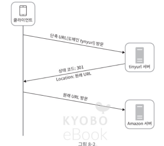

# [7주차] 8장_URL 단축기 설계_고동현

## 요구사항 정리

**기능 요구사항**

- 긴 URL을 입력하면 짧은 URL을 생성한다.
- 짧은 URL로 접속하면 원래 URL로 리디렉션한다.
- 단축 URL에는 숫자(0-9)와 영문자(a-z, A-Z)만 사용 가능하다.
- 삭제나 갱신은 고려하지 않는다.

**비기능 요구사항**

- 높은 가용성, 규모 확장성, 장애 감내

**개략적 추정**

- 쓰기 연산: 매일 1억 건 -> 초당 약 1,160건
- 읽기 연산: 읽기/쓰기 비율 10:1 가정 -> 초당 약 11,600건
- 10년 운영 시 총 3,650억 개의 레코드 보관 필요
- URL 평균 길이 100바이트 가정 -> 10년간 약 36.5TB 저장 공간 필요

---

## 개략적 설계

### API 설계

REST 스타일로 두 개의 엔드포인트를 둔다.

- `POST /api/v1/data/shorten` — 긴 URL을 받아서 단축 URL을 반환
- `GET /api/v1/shortUrl` — 단축 URL에 대응하는 원래 URL로 리디렉션

### 301 vs 302 리디렉션

- **301 Permanently Moved**: 브라우저가 응답을 캐시한다. 이후 같은 단축 URL 요청 시 서버를 거치지 않고 바로 원래 URL로 간다. **서버 부하를 줄이고 싶을 때 유리하다.**
- **302 Found**: 매번 단축 URL 서버를 거친다. 트래픽 분석(analytics)이 중요할 때는 이쪽이 낫다. 클릭 수나 발생 위치 같은 데이터를 수집할 수 있기 때문.

### URL 단축 흐름

해시 테이블에 `<단축 URL, 원래 URL>` 쌍을 저장한다고 가정하면, 긴 URL을 해시 함수에 넣어서 단축 URL을 만들고, 리디렉션 시에는 해시 테이블에서 원래 URL을 꺼내서 Location 헤더에 넣어 반환하면 된다.

---

## 상세 설계

### 데이터 모델

해시 테이블은 메모리 한계가 있으니, 관계형 데이터베이스에 저장하는 게 현실적이다. 테이블 구조는 단순하게 `id`, `shortURL`, `longURL` 세 개 컬럼이면 충분하다.

### 해시 값 길이 결정

사용 가능한 문자가 62개(0-9, a-z, A-Z)이므로, 3,650억 개 이상의 URL을 커버하려면 $62^n >= 365billion$을 만족하는 n을 찾아야 한다. n=7이면 약 3.5조 개를 만들 수 있으므로, hashValue 길이는 **7자리**로 결정

### 해시 함수 구현: 두 가지 접근법

**방법 1 — 해시 후 충돌 해소**

CRC32, MD5, SHA-1 같은 해시 함수를 써서 긴 URL을 해싱한 뒤, 결과에서 앞 7자리만 취한다. 문제는 충돌 가능성이 있다는 것. 충돌이 발생하면 원래 URL에 사전 정의된 문자열을 덧붙여서 다시 해싱하는 식으로 해소한다.

이 방식의 단점은 충돌이 날 때마다 DB 조회가 추가로 필요하다는 것. 블룸 필터를 쓰면 성능을 개선할 수 있다.

**방법 2 — base-62 변환**

유일한 ID를 먼저 생성하고, 그 ID를 62진법으로 변환해서 단축 URL을 만든다. 예를 들어 ID가 11157이면, 62로 나누어 가면서 나머지를 역순으로 읽으면 `2TX`가 된다.

### 두 방법 비교

| 항목 | 해시 후 충돌 해소 | base-62 변환 |
| --- | --- | --- |
| URL 길이 | 고정 (7자리) | 가변 (ID가 커지면 길어짐) |
| ID 생성기 | 불필요 | 필요 (유일성 보장) |
| 충돌 | 가능, 해소 전략 필요 | 원천적으로 불가능 |
| 보안 | 다음 URL 예측 불가 | ID가 순차 증가하면 예측 가능 (보안 이슈) |

### URL 단축 상세 흐름

1. 긴 URL을 입력받는다.
2. DB에 이미 존재하는지 확인한다.
3. 있으면 기존 단축 URL을 반환한다.
4. 없으면 유일한 ID를 생성한다.
5. ID를 base-62로 변환하여 단축 URL을 만든다.
6. ID, 단축 URL, 원래 URL을 DB에 저장하고 단축 URL을 반환한다.

### URL 리디렉션 상세 흐름

읽기가 쓰기보다 훨씬 많은 시스템이므로 캐시를 적극 활용한다.

1. 사용자가 단축 URL을 클릭한다.
2. 로드밸런서가 웹 서버로 요청을 전달한다.
3. 캐시에 있으면 바로 원래 URL을 반환한다.
4. 캐시에 없으면 DB에서 조회한다. DB에도 없으면 잘못된 URL.
5. DB에서 가져온 URL을 캐시에 넣고 사용자에게 반환한다.

---

## 추가 논의 포인트

설계를 마친 후 시간이 남으면 면접관과 이야기해볼 수 있는 주제들이다.

- **처리율 제한(Rate Limiter)**: 악의적인 대량 요청을 막기 위해 IP 기반 필터링 등을 적용할 수 있다.
- **웹 서버 규모 확장**: 무상태(stateless) 계층이므로 자유롭게 수평 확장 가능하다.
- **데이터베이스 규모 확장**: 다중화(replication)나 샤딩(sharding)으로 대응한다.
- **데이터 분석**: 어떤 링크가 얼마나, 언제 클릭되는지 추적하면 비즈니스 인사이트를 얻을 수 있다.
- **가용성, 데이터 일관성, 안정성**: 대규모 시스템 운영의 필수 속성들.

---

## 고민해볼 질문

**Q1. base-62 변환 방식에서 ID 생성기를 분산 환경에서 어떻게 구현할 것인가?**

단일 서버라면 auto-increment로 충분하지만, 서버가 여러 대일 때는 ID 충돌이 발생할 수 있다. Twitter의 Snowflake 같은 분산 ID 생성 알고리즘을 쓸 수도 있고, ID 범위를 서버별로 미리 할당하는 방법도 있다. 각 방식의 트레이드오프는 무엇이고, 우리 시스템의 쓰기 부하(초당 1,160건)에는 어떤 방식이 적합할까?

**Q2. 같은 긴 URL에 대해 항상 같은 단축 URL을 반환해야 할까?**

현재 설계에서는 DB에 이미 있으면 기존 단축 URL을 반환한다. 하지만 사용자마다 다른 단축 URL을 줘야 클릭 추적이 가능해진다. 반대로 같은 URL을 반환하면 저장 공간을 아낄 수 있다. 서비스의 핵심 가치가 분석(analytics)인지 단순 단축인지에 따라 설계가 달라지는데, 이 결정이 시스템 전체 아키텍처에 어떤 영향을 미칠까?

**Q3. 캐시 전략을 구체적으로 어떻게 설계할 것인가?**

읽기 비율이 10:1로 높으니 캐시가 핵심인데, 캐시 용량은 무한하지 않다. 어떤 eviction 정책(LRU, LFU 등)을 쓸 것인지, 캐시 워밍(warming)은 어떻게 할 것인지, 캐시 서버가 죽었을 때의 대응 전략은 무엇인지 고민해볼 필요가 있다. 특히 인기 URL과 비인기 URL의 접근 패턴 차이가 클 텐데, 이를 어떻게 반영할 수 있을까?