## 8. URL 단축키 설계

### 1단계. 문제 이해 및 설계 범위 확정

- 먼저 결정해야 하는 것
    - 단축키 동작
    - 트래픽 규모
    - 단축 URL의 길이
    - 단축 URL에 포함될 문자에 제한이 있는지
    - 단축 URL을 시스템에서 지우거나 갱신해야 하는지
  
-> URL 단축 + 리디렉션 + 높은 가용성과 규모 확장성, 장애 감내 요구

- 개락적 추정
  - 쓰기 연산 : 매일 1억 개의 단축 URL 생성
  - 초당 쓰기 연산 : 1억 / 24 / 3600 = 1160
  - 읽기 연산 : 읽기 연산과 쓰기 연산의 비율은 10:1 (읽기 연산은 초당 11,600회 발생)
  - URL 단축 서비스를 10년간 운영한다고 가정하면 1억 * 365 * 10 = 3650억 개의 레코드 보관해야 함
  - 축약 전 URL의 평균 길이는 100이라고 가정
  - 10년 동안 필요한 저장 용량은 3650억 * 100바이트 = 36.5TB

--- 

### 2단계. 개략적 설계안 제시 및 동의 구하기

### (1). API 엔드포인트

- URL 단축용 엔드포인트 : 새 단축 URL을 생성하고자 하는 클라이언트는 이 엔트포인트에 단축할 URL을 인자로 실어서 POST 요청을 보내야 한다. 
  - POST | /api/v1/data/shorten
    - 인자 : longUrl : longURLString
    - 반환 : 단축 URL
- URL 리디렉션용 엔드포인트 : 단축 URL에 대해서 HTTP 요청이 오면 원래 URL로 보내주기 위한 용도의 엔드포인트
  - GET | /api/v1/shortURL
    - 반환 : HTTP 리디렉션 목적지가 될 원래 URL

### (2). URL 리디렉션

- 단축 URL을 받은 서버는 그 URL을 원래의 URL로 바꿔서 301 응답의 Location 헤더에 넣어 반환
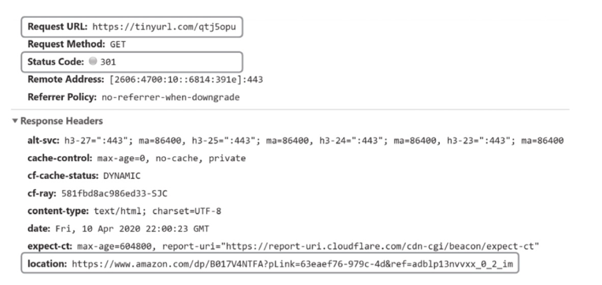

- 클라이언트와 서버 사이의 통신 절차
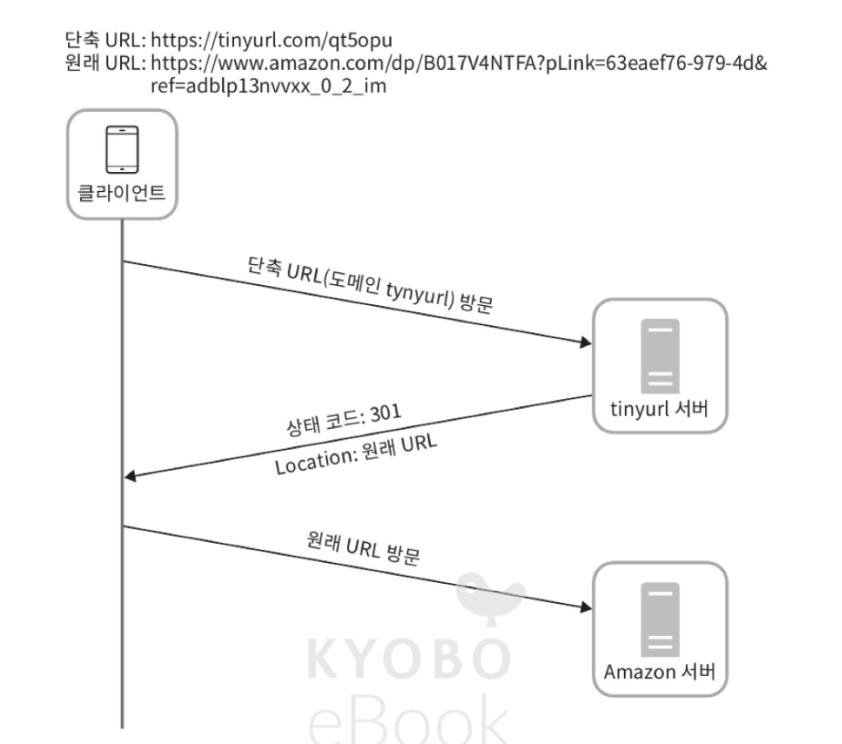
  - 301 Permanently Moved : 해당 URL에 대한 HTTP 요청의 처리 책임이 영구적으로 Location 헤더에 반환된 URL로 이전되었다는 응담. 영구적으로 이전되었으므로, 브라우저는 이 응답을 캐시함. 따라서 추후 같은 단축 URL로 요청을 보내면 브라우저는 캐시된 원래 URL로 요청을 보냄. 
  - 302 Found : 주어진 URL로의 요청이 일시적으로 헤더가 지정하는 URL에 의해 처리되어야 한다는 응답으로, 클라이언트의 응답은 언제나 단축 URL 서버에 먼저 보내진 뒤에 원래 URL로 리디렉션됨. 

  -> 서버 부하를 줄이기 위해서는 301 사용  
  ->  트래픽 분석이 중요한 경우 302 사용

- 리디렉션을 구현하는 가장 직관적인 방법은 해시테이블을 사용하는 것
- URL 리디렉션의 구현
  - 원래 URL : hashTable.get(단축URL)
  - 301 또는 302 응답 Location 헤더에 원래 URL을 넣은 후 전송

### (3). URL 단축

- 긴 URL을 해시 값으로 대응시킬 해시 함수 fx를 찾는 것이 가장 중요.  
  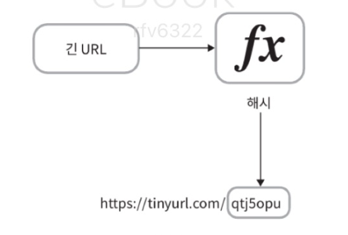

    - 입력으로 주어지는 긴 URL이 다른 값이면 해시 값도 달라야 함
    - 계산된 해시 값은 원래 입력으로 주어졌던 긴 URL로 복원될 수 있어야 함

--- 

### 3단계. 상세 설계

### (1). 데이터 모델 
- 모든 것을 해시 테이블에 두는 경우 -> 초기 전략으로는 괜찮지만 실제 시스템으로는 X (메모리는 유한하고 비싸기 때문)  
- <단축URL, 원래URL> 의 순서쌍을 관계형 데이터베이스에 저장하는 것을 권장  
  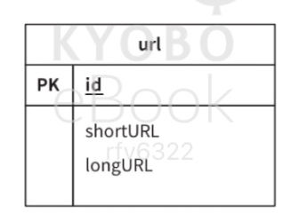

### (2). 해시 함수 

원래 URL을 단축 URL로 변환하는 데에 사용됨.  
+) 해시 함수가 계산하는 단축 URL 값을 hashValue라고 지칭. 

#### 1. 해시 값 길이

hashValue는 0-9, a-z, A-Z의 문자들로 구성됨. 따라서 사용할 수 있는 문자의 개수는 10+26+26 = 62개.  
hashValue의 길이를 정하기 위해서는 62^n>=3650억인 n의 최솟값읓 찾아야 함.

   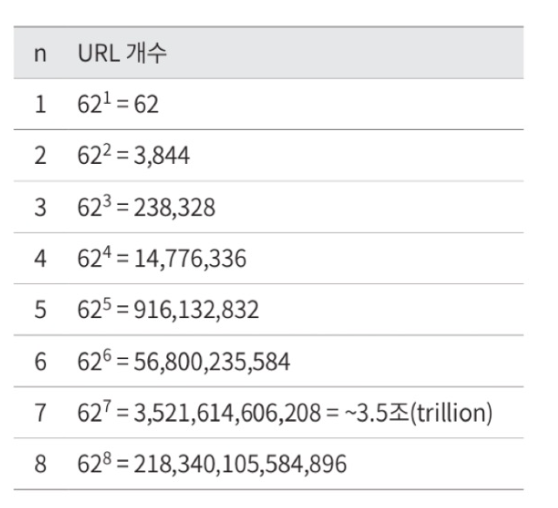

n이 7이면 3.5조 개의 URL 생성 가능.

#### 2. 해시 후 충돌 해소

해시 함수 구현 기술 중 하나.

- 잘 알려진 해시 함수를 이용해서 축약하면 다음과 같은 결과 발생.
  
- 가장 짧은 해시값도 7보다 긴 사태 발생.  
- 해시 값에서 처음 7개 글자만 사용해서 해결 -> ⚠️ 충돌 확률 높아짐.
  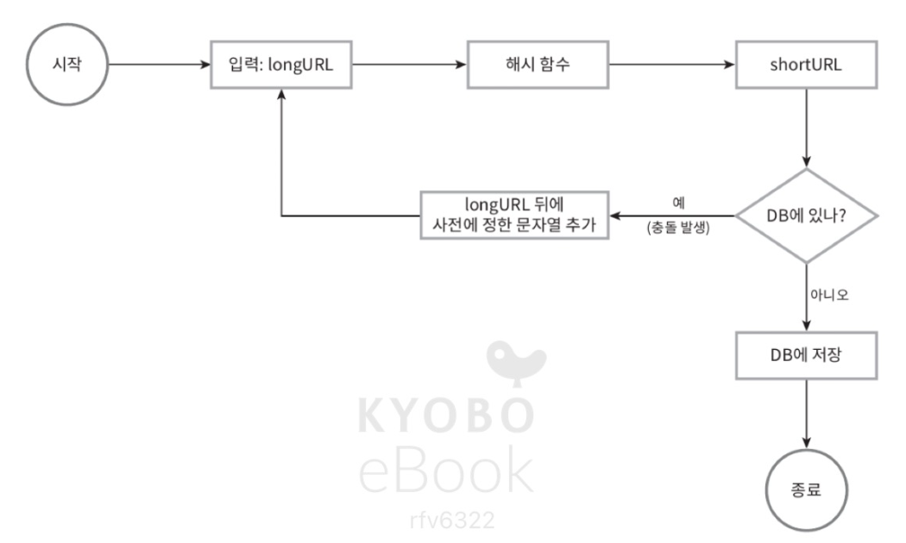

충돌은 해소할 수 있지만 단축 URL을 생성할 때마다 데이터베이스 질의를 한 번 이상 해야하므로 오버헤드가 큼.  
데이터베이스 대신 블룸 필터를 사용하는 쪽이 성능이 높아짐. 

#### 3. base-62 변환

역시 해시 함수 구현 기술.  
표현 방식이 다른 두 시스템이 같은 수를 공유해야 하는 경우에 유용.  
hashValue에 사용할 수 있는 문자 개수가 62개이기 때문에 62 변환.  

- 62 진법은 수를 표현하기 위해 총 62개의 문자를 사용. 
- 0~9는 0~9로, 10은 a로, 11은 b로, ... 36은 A로, 61은 Z로 대응시켜 표현.
- 11157을 변환하면 2TX가 됨.  
  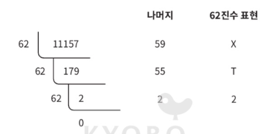
- 따라서 단축 URL은 URL/2TX

#### 4. 두 접근법 비교

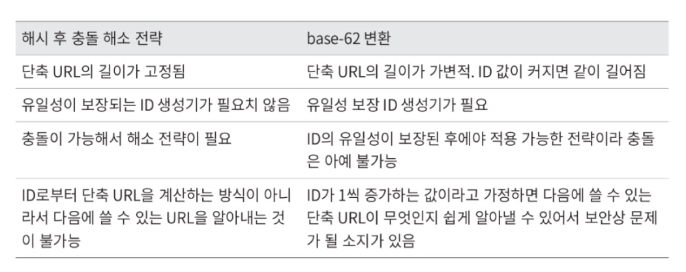

### (3). URL 단축키 상세 설계

base-62 변환, 즉 62진법 변환 기법을 사용해 설계하면 다음과 같이 정리할 수 있음.  
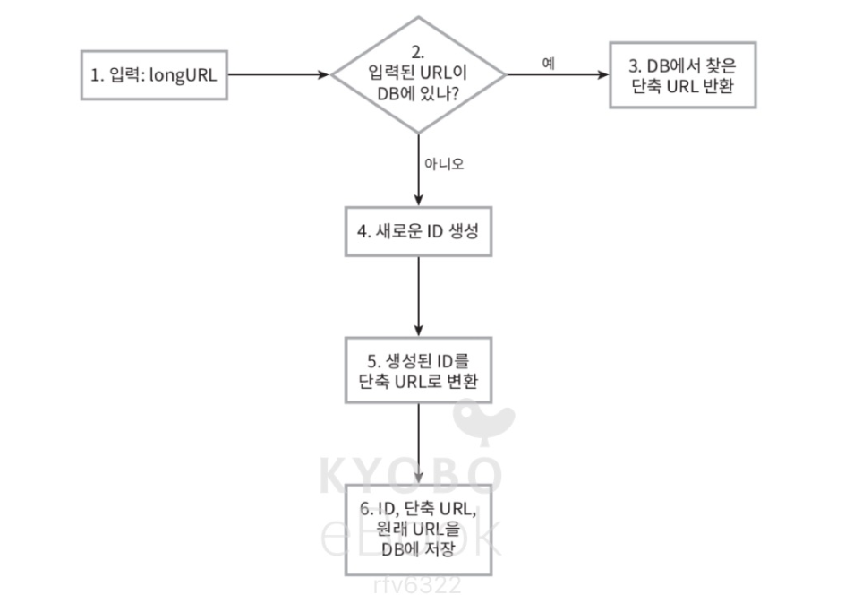

1. 입력으로 긴 URL을 받음
2. 데이터베이스에 해당 URL이 있는지 검사
3. 데이터베이스에 있다면 해당 단축 URL을 가져와서 클라이언트에게 반환
4. 데이터베이스에 없다면 새로 고유한 ID를 생성
5. 62진법 변환을 적용해 ID를 단축 URL로 변환
6. ID, 단축 URL, 원래 URL로 새 데이터베이스 레코드를 만든 후 단축 URL을 클라이언트에 전달

그 결과로 아래와 같은 데이터베이스 레코드가 생성됨.   
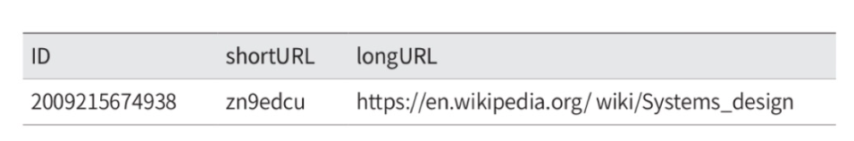

+) 이 때 사용하는 ID는 고유해야 하고, 전역적 유일성이 보장되어야 함 -> ID 생성기 구현에 대해서는 7장 참고. 

### (4). URL 리디렉션 상세 설계

URL 리디렉션의 매커니즘은 아래와 같음. 

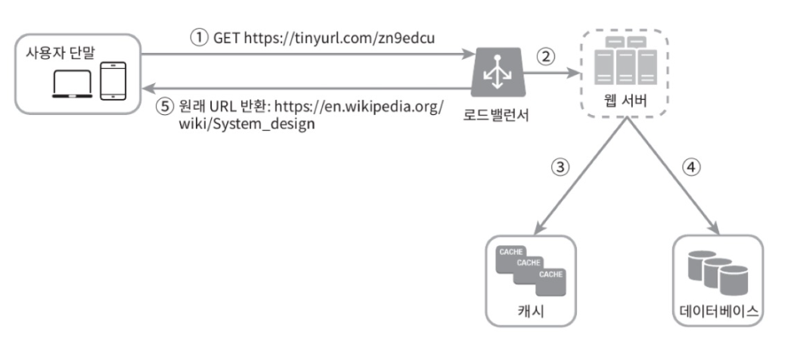

- 로드밸런서의 동작 흐름
  1. 사용자가 단축 URL 클릭
  2. 로드밸런서가 해당 클릭으로 발생한 요청을 웹 서버에 전달
  3. 단축 URL이 이미 캐시에 있는 경우 원래 URL을 바로 꺼내서 클라이언트에게 전달
  4. 캐시에 해당 단축 URL이 없는 경우 데이터베이스에서 읽어옴
  5. 데이터베이스에서 읽어온 URL을 캐시에 넣은 후 사용자에게 반환

---

### 4단계. 마무리

- 추가로 고민해볼 수 있는 사항
  - 처리율 제한 장치 
    - 엄청난 양의 URL 단축 요청이 밀려들 경우 무력화될 수 있음. 처리율 제한 장치를 둘 경우 IP 주소를 비롯한 필터링 규칙 설정 가능. 
  - 웹 서버 규모 확장
  - 데이터베이스 규모 확장 (다중화, 샤딩)
  - 데이터 분석 솔루션 
  - 가용성, 데이터 일관성, 안정성