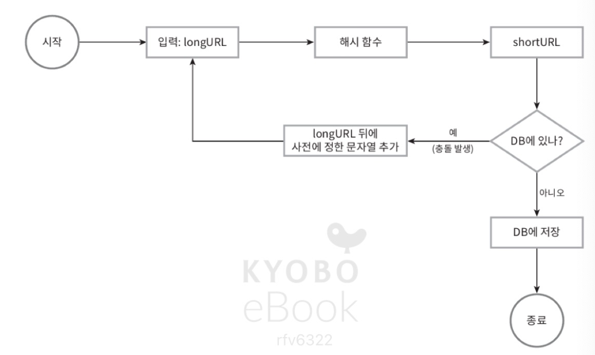
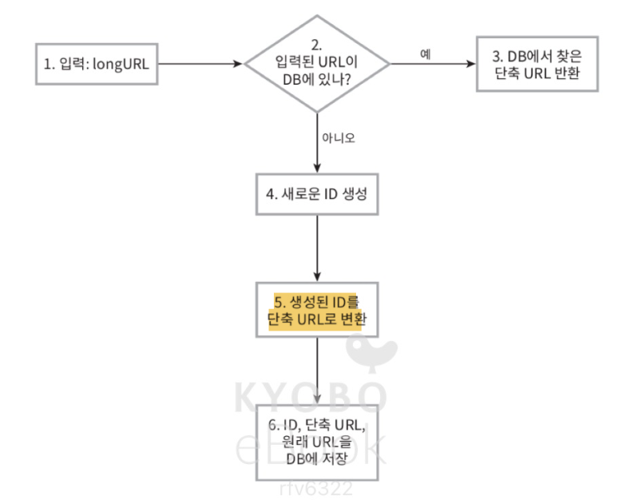

# ch8. url 단축기 설계

## 1단계 문제 이해 및 설계 범위 확정
- 시스템의 기본 기능
    - url 단축
    - url 리다이렉션
    - 높은 가용성과 규모 확장성, 그리고 장애 감내 요구
- 개략적 추정 (10년 운영 가정)
    - 초당 쓰기 연산 : 1160
    - 앍기 연산 : 11600 (읽기가 더 많은 서비스)
    - 레코드 보장 수 : 3650억
    - 저장 용량 : 3650 * 100(축약 전 url의 평균 길이)

## 2단계 개략적 설계안 제시 및 동의 구하기
### api 앤드포인트
- 필요한 앤드 포인트
    - url 단축용 앤드포인트 
        -  기존 url을 단축 url로 바꾸기 위한 post 요청

    - url 디리렉션용 앤드포인트 
        - 단축 url로 요청이 오면 기존 Url로 보내주기 위한 앤드포인트
### url 리디렉션
- 리디레션 동작 과정
    - 클라이언트 -> 단축 url로 요청
    - 응답의 헤더에 원래 url을 넣어 반환
- 리디렉션 응답의 차이
    - 301 permanently moved : 반환된 url로 완전히 이전, 단축 url에 보낼 때마다 캐시된 원래 url로 요청을 보내게됨
    - 302 found : 일시적으로 location 헤더가 지정하는 url에 의해 처리, 요청에 단축 url 서버를 거친 후 원래 url로 리디랙션
    - 유리한 상황
        - 서버 부하 줄이는 것이 중점 : 301 permanent moved
        - 트래픽 분석이 중요 : 302 found
### url 단축
- 해시 함수의 요구
    - url에 따라 해시 값이 달라야함 
    - 원래 입력으로 긴 url 복원 가능해야 함

## 3단계 상세 설계
### 데이터 모델
- 해시 테이블 : 메모리 유한, 고비용
- 관계형 데이터 베이스에 저장이 더 적절
    - <단축 Url, 원래 Url>
    - 컬럼 : id, short Url, long Url

### 해시 함수
- 해시 함수 : 원래 url -> 단축 URL
- 해시 값의 길이 
    - 3650억개의 url을 만들 수 있어야함 (개략적 추정)
    - hash Value : 사용할 수 있는 문자의 개수 : 62
    - hashValue : 7자리 일 때 충분한 값이 됨
- hash 함수 구현 기술
    - 해시 후 충돌 해소 방법
        - 
        - crc32, md5, sha-1와 같은 해시 함수 이용
            - 최소 해시값도 7보다 길다
        - 계산된 해시 값에서 처음 7개 글자 이용
        - 이미 있는 단축 Url일 경우 longurl 뒤에 사전에 정한 문자열 추가해서 다시 입력
    - base-62 변환
        - url id를 62진법으로 만들어서 url을 나타냄
        - id의 유일성 보장 후 사용
    - 장단점
        - 해시 후 충돌 해소 방법
            - 단점 : 한 번 이상 데이터 베이스 질의를 해야함 -> 오버헤드
                - 대체 ex : 블룸 필터
        - base-62 변환
            - 장점 : 표현 방식이 다른 두 시스템이 같은 수를 공유하여야 하는 경우 유용
        - 두 접근법 비교
            - 
### 상세 설계
- 처리 흐름 (base 62 바탕)
    - 
    1. 긴 url 받음
    2. 해당 url 있는지 검사
    3. 있다면 클라이언트에게 단축 url 반환
    4. 없다면 유일한 id 생성
    id
    5. id를 바탕으로 단축 url 생성 후 반환
- url 리디렉션 상세 설계
    - 
    -  《단축 URL, 원래 URL 〉의 쌍을 캐시에 저장하여 성능 향상
    - 로드밸런서 동작 흐름
        1. 사용자가 단축 url 클릭
        2. 요청을 웹서버에 전달
        3. 캐시에 있는 경우 url 바로 반환
        4. 캐시에 없을 경우 데이터 베이스에서 꺼냄

## 4단계 마무리
- 추가 논의 가능한 주제들
    - 처리율 제한 장치
    - 웹 서버의 규모 확장
    - 데이터 베이스의 규모 확장
    - 데이터 분석 솔류션
    - 가용성, 데이터 일관성, 안정성
    

    