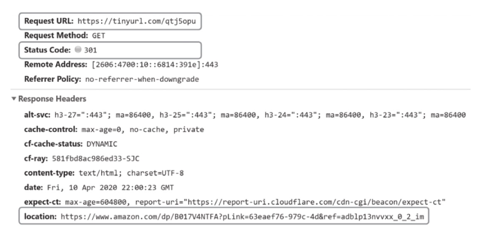
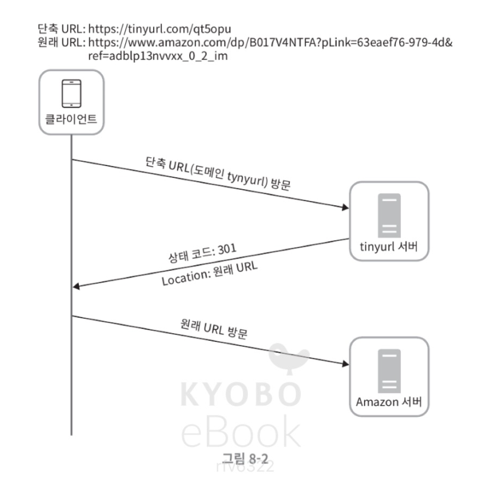
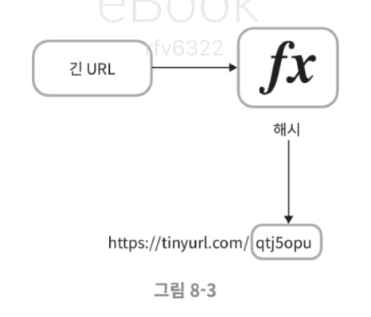
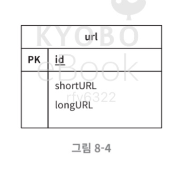
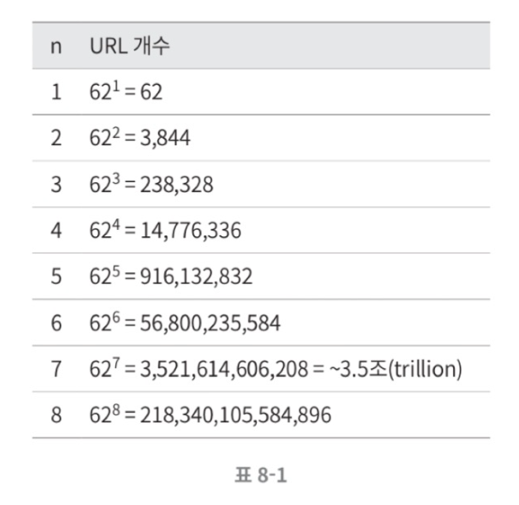
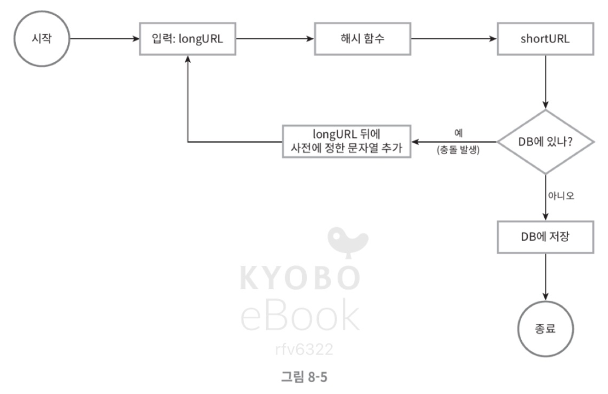
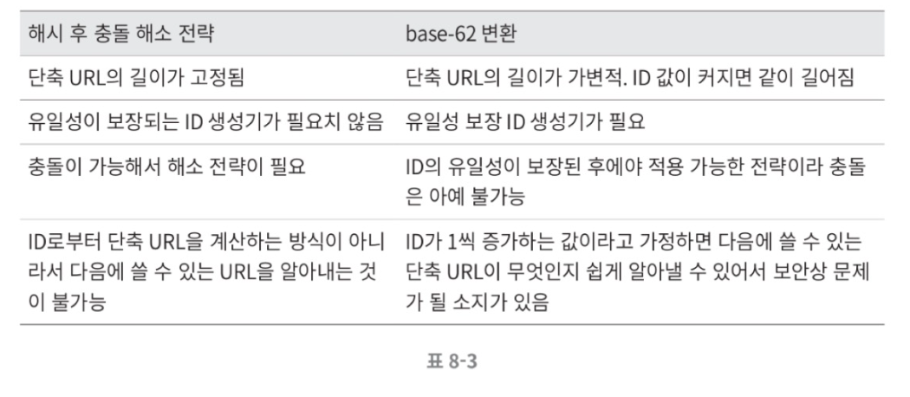
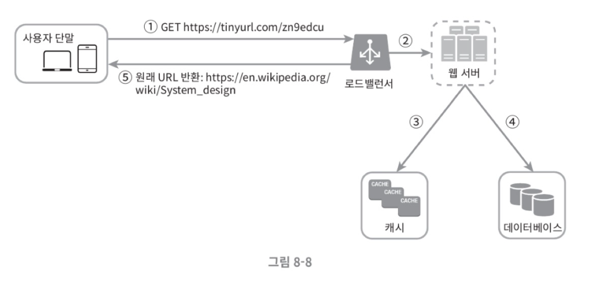

# URL 단축기 설계

- tiny url 같은 URL 단축기 설계 문제

## 1단계 문제 이해 및 설계 범위 확정

1. URL 단축
2. URL 리디렉션(redirection): 축약된 URL로 HTTP 요청이 오면 원래 URL로 안내
3. 높은 가용성과 규모 확장성, 그리고 감내가 요구됨

### 개략적 추정
- 쓰기 연산: 매일 1억 개의 단축 URL 생성
- 초당 쓰기 연산: 1억(100million)/24/3600=1160
- 읽기 연산: 읽기 연산과 쓰기 연산 비율은 10:1이라고 하자. 그 경우 읽기 연산은 초당 11,600회 발생한다(1160 X10= 11,600).
- URL 단축 서비스를 10년간 운영한다고 가정하면 1억(100million)x365x10=3650억(365billion) 개의 레코드를 보관해야 한다.
- 축약 전 URL의 평균 길이는 100이라고 하자.
- 따라서 10년 동안 필요한 저장 용량은 3650억(365billion)X100바이트=36.5TB이다.

## 2단계 개략 설계

- 기본적으로 두 개의 엔드포인트를 필요로 한다.

### API 엔드포인트

1. URL 단축용 엔드포인트
    - 새 단축 URL 생성 후 인자로 실어서 요청 보냄
    - POST /api/v1/data/shorten
    - 인자: {longUrl: longURLstring}
    - 반환: 단축 URL
2. URL 리디렉션용 엔드포인트
    - 단축 URL로 HTTP 요청이 오면 원래 URL로 리디렉션
    - GET /api/v1/shortUrl
    - 반환: HTTP 리디렉션 목적지가 될 원래 URL

### URL 리디렉션

- 301 Permanant Redirect
    - 해당 URL이 영구적으로 Location 헤더에 반환된 URL로 이전되었다는 의미
    - 서버 부하를 줄이는 것이 중요할 때 유리
- 302 Found
    - 주어진 URL로의 요청이 일시적으로 Location 헤더가 지정하는 URL에 의해 처리되어야 한다는 응답
    - 트래픽 분석이 중요할 때 유리

- URL 리디렉션 구현 방법
    - 원래 URL=hashTable.get(단축 URL)
    - 301 또는 302 응답 Location 헤더에 원래 URL을 넣은 후 전송

### URL 단축

- 해시 함수
    - 입력으로 주어지는 긴 URL 이 다른 값이면 해시 값도 달라야 함
    - 계산된 해시 값은 원래 입력으로 주어졌던 긴 URL로 복원될 수 있어야 함

## 3단계 상세 설계

### 데이터 모델

- <단축 URL, 원래 URL>의 순서쌍을 관계형 데이터베이스에 저장

### 해시 함수
- 편의상 해시 함수가 계산하는 단축 URL값을 hashValue라고 지칭
- 해시 값 길이

- 해시 함수 구현에 쓰이는 두가지 방법
    - 해시 후 충돌 해소
    - base62 변환
- 해시 후 충돌 해소
    - 긴 URL을 줄이기 위해 원래 URL을 7글자 문자열로 줄이는 해시 함수 필요 (CRC32, MD5, SHA-1)
    - 아래는 해시 함수를 이용한 축약 예시

    - 계산한 가장 짧은 해시값 조차도 7보다 길다면?
    

- base62 변환
    - 수의 표현 방식이 다른 두 시스템이 같은 수를 공유하여야 하는 경우 유용
    - hashValue에 사용할 수 있는 문자 개수가 62개이기 때문에 62진법 사용

- 두 접근법 비교

### URL 단축기 상세 설계

1. 입력으로 긴 URL을 받는다
2. 데이터베이스에 해당 URL이 있는지 검사한다
3. 데이터베이스에 있다면 해당 URL에 대한 단축 URL을 만든 적이 있는 것이다. 따라서 데이터베이스에서 해당 단축 URL을 가져와서 클라이언트에게 반환한다
4. 데이터베이스에 없는 경우에는 해당 URL은 새로 접수된 것이므로 유일한 ID를 생성한다. 이 ID는 데이터베이스의 기본 키로 사용된다.
5. 62진법 변환을 적용, ID를 단축 URL로 만든다.
6. ID, 단축 URL, 원래 URL로 새 데이터베이스 레코드를 만든 후 단축 URL을 클라이언트에 전달한다

### URL 리디렉션 상세 설계

- <단축 URL, 원래 URL>의 쌍을 캐시에 저장하여 성능을 높였다
- 로드밸런서의 동작 흐름
    1. 사용자가 단축 URL을 클릭
    2. 로드밸런서가 해당 클릭으로 발생한 요청을 웹 서버에 전달
    3. 단축 URL이 이미 캐시에 있는 경우에는 원래 URL을 바로 꺼내서 클라이언트에 전달
    4. 캐시에 해당 단축 URL이 없는 경우에는 데이터베이스에서 꺼낸다. 데이터베이스에 없다면 아마 사용자가 잘못된 단축 URL을 입력한 경우일 것이다.
    5. 데이터베이스에서 꺼낸 URL을 캐시에 넣은 후 사용자에게 반환한다.