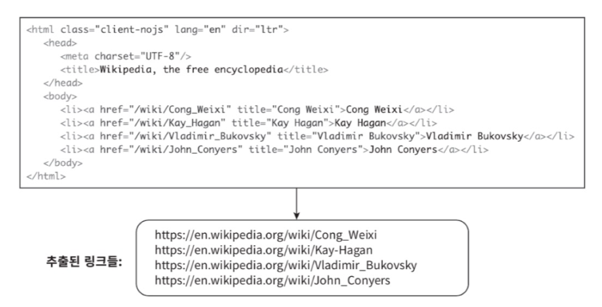
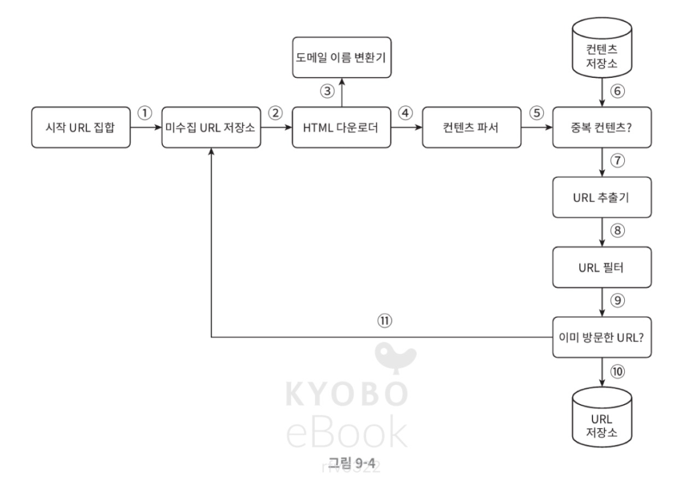
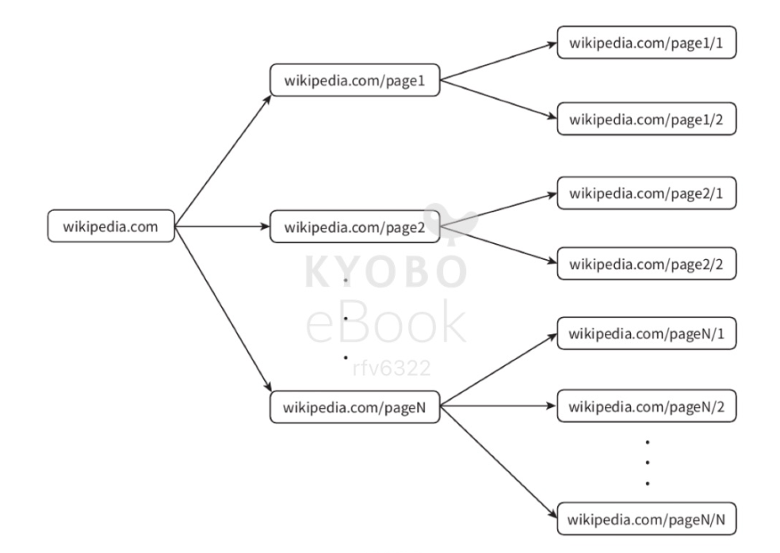
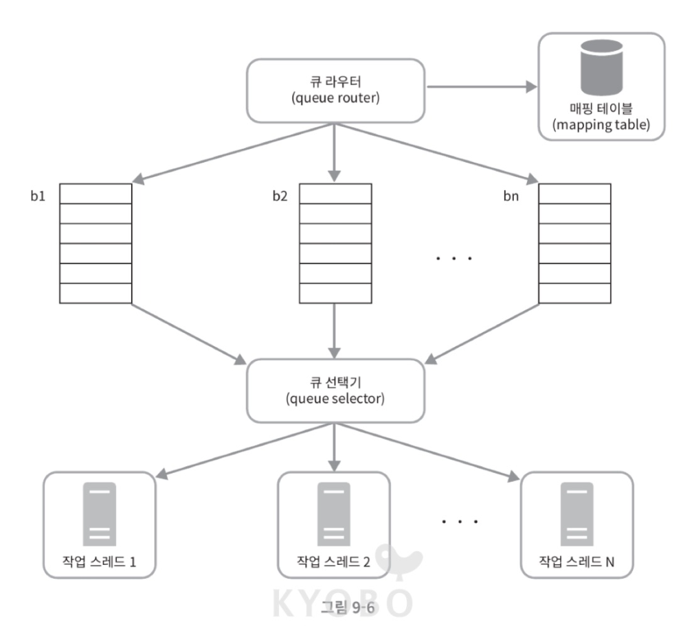
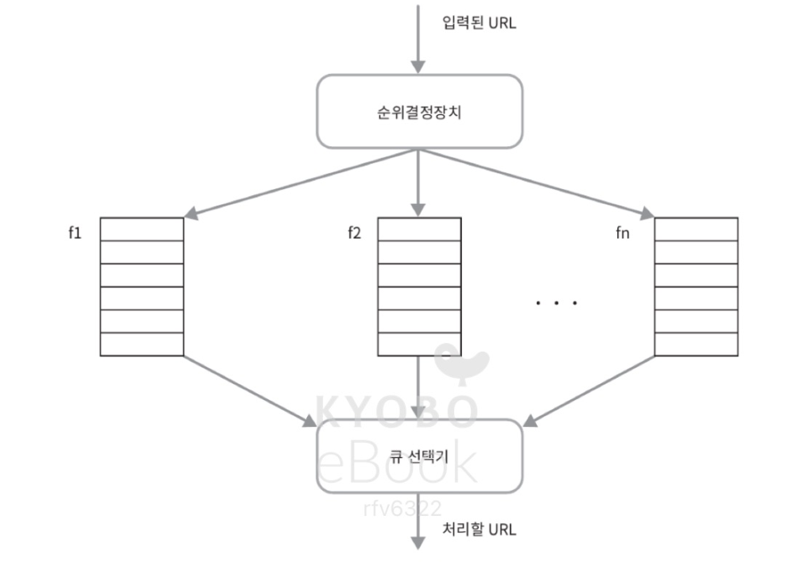
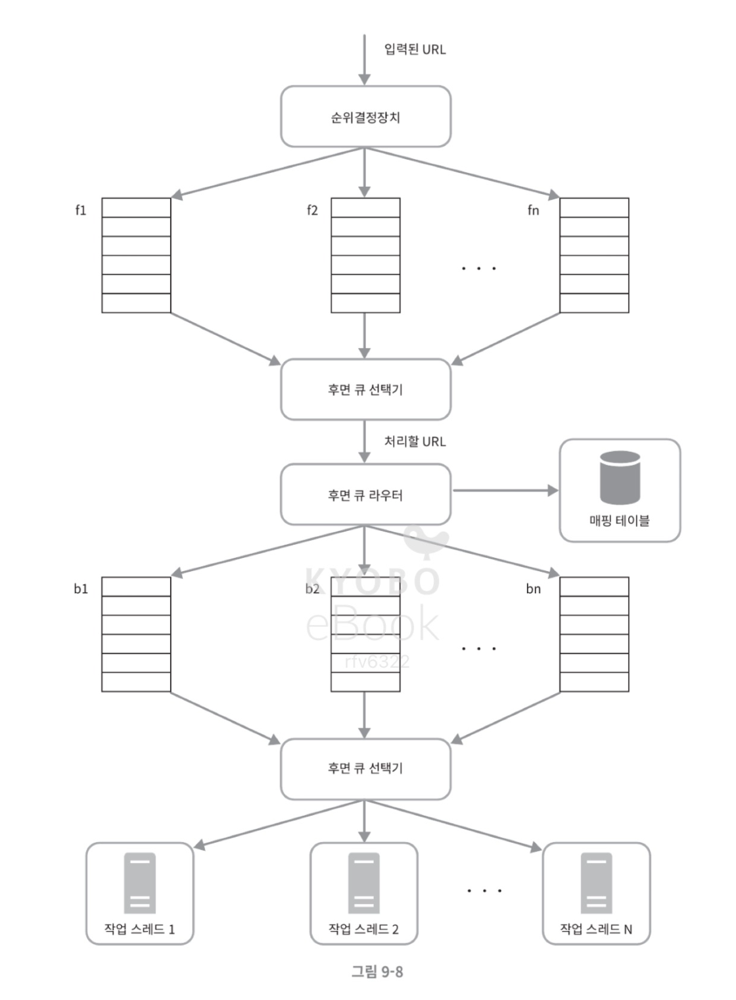
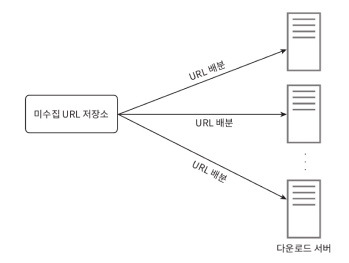
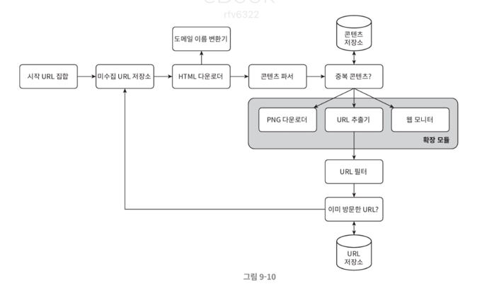

## 9. 웹 크롤러 설계

- 크롤러의 이용 예시
  - 검색 엔진 인덱싱 (웹 페이지를 모아 검색 엔진을 위한 로컬 인덱스를 만듦)
  - 웹 아카이빙
  - 웹 마이닝 (웹에 존재하는 대규모 데이터를 수집하고 분석해서 의미 있는 패턴이나 인사이트를 추출)
  - 웹 모니터링 

- 크롤링 = 페이지 수집
- 스크래핑 = 내용 추출

### 1단계. 문제 이해 및 설계 범위 확정

- 웹 크롤러의 기본 알고리즘
  1. URL 집합이 입력으로 주어지면, 해당 URL들이 가리키는 모든 웹 페이지를 다운로드 (그 URL의 HTML 문서 원본을 받아오는 것)
  2. 다운 받은 웹 페이지에서 URL을 추출
  3. 추출한 URL을 다운로드 할 URL 목록에 추가하고 위의 과정을 처음부터 반복
  
-> 조금 더 풀어서 설명해보면,
1. URL 큐(queue)에서 하나 꺼낸다
2. HTTP 요청을 보낸다
3. 응답 HTML을 저장한다
4. HTML에서 <a href> 링크를 파싱한다
5. 아직 방문 안 한 URL이면 큐에 추가
6. 반복

- 먼저 결정해야 하는 것
    - 주된 용도
    - 매달 얼마나 많은 웹 페이지를 수집할 건지
    - 저장 기간
    - 중복 데이터 처리 규칙  

- 주의할 점
  - 규모 확장성 (병행성을 활용하면 효과적임)
  - 안정성 (비정상적인 입력이나 환경에 잘 대응할 수 있어야 함)
  - 예절 (너무 많은 요청을 보내면 안 됨)
  - 확장성 (새로운 콘텐츠를 지원하기가 쉬워야 함)

- 개락적 추정
    - 매달 10억 개의 웹 페이지를 다운로드
    - QPS = 10억 / 30일 / 24시간 / 3600초 = 대략 400페이지/초
    - 최대 QPS = 2 x QPS = 800
    - 웹 페이지의 크기 평균은 500k라고 가정
    - 10억 페이지 x 500k = 500TB/월
    - 5년간 보관 = 500TB x 12개월 x 5년 = 30PB

--- 

### 2단계. 개략적 설계안 제시 및 동의 구하기

### (1). 시작 URL 집합

- 웹 크롤러가 크롤링을 시작하는 출발점
- 가능한 한 많은 링크를 탐색할 수 있도록 하는 URL을 고르는 것이 중요
- 일반적으로는 전체 URL 공간을 작은 부분집합으로 나누는 전략을 사용

### (2). 미수집 URL 저장소

- 크롤링 상태를 보통 다운로드할 URL / 다운로드된 URL 로 구분
  - 다운로드할 URL 저장소 == 미수집 URL 저장소
- FIFO 큐

### (3). HTML 다운로더
- 인터넷에서 웹 페이지를 다운로드 하는 컴포넌트

### (4). 도메인 이름 변환기
- URL에 대응되는 IP 주소를 알아냄

### (5). 콘텐츠 파서
- 웹 페이지를 다운로드하면 파싱, 검증 절차를 거쳐야 함 (크롤링 서버 안에 파서를 구현하면 크롤링 과정이 느려지므로, 별도로 분리)

### (6). 중복 콘텐츠인가? 
- 29% 가량의 웹 페이지 콘텐츠는 중복. 
- 효과적으로 중복인지를 알아내는 방법은 웹 페이지의 해시 값을 비교하는 것
  - 응답으로 받아온 html을 하나의 문자열 데이터라고 생각하고, 그 문자열에 대해 해시 함수를 적용하는 것. 
  - 두 페이지의 해시 값이 같을 경우 원본 문자열이 같다는 의미
  - 그런데 보통 광고 영역만 다르거나, 날짜, 댓글 수, 추적 코드만 다른 경우가 있음.   
    ➡️ 그래서 보통 본문 텍스트만 추출하는 등의 전처리를 하고 해시하거나 정규화 후 해시. 
  - 완전히 같은 건 해시로 처리할 수 있지만 90% 유사한 페이지는 일반 해시로 잡을 수 없음.   
    ➡️ SimHash : 문서 유사도 비교용 해시, 비슷한 문서는 비슷한 해시값을 생성. 
      - 문서를 단어로 쪼개고, 각 단어를 해시한 뒤, 벡터로 합산해서 최종 부호로 해시를 생성하는 방법.

### (7). 콘텐츠 저장소
- HTML 문서를 보관. 
- 데이터의 유형, 크기, 저장소 접근 빈도, 데이터의 유효 기간 등을 종합적으로 고려. 
- 자주 쓰이는 저장소
  - 원본 HTML 저장 : 객체 스토리지 (s3, google cloud storage)
  - 구조화된 데이터 저장 : RDB
  - 유연한 문서 저장 : NoSQL
  - 검색을 위한 저장 : Elastic search 같은 검색 엔진 전용

### (8). URL 추출기
- HTML 페이지를 파싱해서 링크를 골라내는 역할
- 상대 경로를 절대 경로로 변환  

### (9). URL 필터
- 특정한 콘텐츠 타입이나 파일 확장자를 갖는 URL, 접속 시 오류가 발생하는 URL, 접근 제외 목록에 포함된 URL을 크롤링 대상에서 배제. 

### (10). 이미 방문한 URL? 
- 같은 URL을 또 방문하면 낭비 + 무한루프 위험
- 블룸 필터, 해시 테이블로 이미 방문한 URL 재처리 방지
- 블룸 필터의 경우 가끔 false positive 발생 (방문 안 했는데 방문했다고 착각할 수 있음)
- 해시 테이블의 경우 정확하고 O(1)로 조회 가능하지만 메모리를 많이 사용해서 대규모 크롤러에는 적합하지 않음

### (11). URL 저장소
- 이미 방문한 URL을 저장

### (12). 웹 크롤러 작업 흐름

1. 시작 URL을 미수집 URL 저장소에 저장
2. HTML 다운로더는 미수집 URL 저장소에서 URL 목록을 가져옴
3. HTML 다운로더가 도메인 이름 변환기를 사용하여 URL의 IP 주소를 알아내고, 해당 IP 주소로 접속해서 웹 페이지를 다운 받음. 
4. 콘텐츠 파서는 다운된 HTML 페이지를 파싱해서 올바른 형식을 갖춘 페이지인지 검증
5. 파싱과 검증이 끝나면 중복된 콘텐츠인지 확인
6. 중복된 콘텐츠인지 확인하기 위해 해당 페이지가 이미 저장소에 있는지 확인 
   - 이미 있으면 버림
   - 없는 경우 저장소에 저장한 뒤, URL 추출기로 전달
7. URL 추출기는 해당 HTML 페이지에서 링크를 골라냄
8. 골라낸 링크를 URL 필터로 전달
9. 필터링이 끝나고 남은 URL만 중복 URL 판별 단계로 전달
10. 이미 처리한 URL인지 확인하기 위해 URL 저장소에 보관된 URL인지 확인, 이미 있으면 버림. 
11. 저장소에 없는 URL은 저장소에 저장하고 미수집 URL 저장소에도 전달

- 요약 : URL 하나 가져옴 → 페이지 다운 → 검사 → 저장 → 거기서 새 URL 뽑음 → 반복

--- 

### 3단계. 상세 설계

### (1). DFS? BFS?
- 웹 크롤러는 보통 BFS 사용. 깊이가 어느 정도인지 가늠하기 어렵기 떄문. 
- 두 가지 문제
  1. 한 페이지에서 나오는 링크의 상당수는 같은 서버로 되돌아감 -> 같은 호스트에 속한 많은 링크를 다운받다보면 그 서버는 과부하에 걸리게 됨 (예의 없는 크롤러!)
    
  2. 표준 BFS 알고리즘은 URL 간에 우선순위 없음. -> 페이지 순위, 트래픽의 양, 업데이트 빈도 등의 척도에 따라 처리 우선순위를 구별하는 것이 온당.

### (2). 미수집 URL 저장소
- 미수집 URL 저장소를 이용해서 위 문제를 해결

#### 1. 예의

- 동일 웹 사이트에 대해서는 한 번에 한 페이지만 요청, 같은 웹 사이트의 페이지를 다운 받는 태스크는 시간차를 두고 실행
  - 웹 사이트의 호스트명과 다운로드를 수행하는 작업 스레드 간의 관계를 유지. 
  - 각 다운로드 스레드가 별도 FIFO 큐를 가지고 있어서, 해당 큐에서 꺼낸 URL만 다운로드하면 됨.
    
  - 큐 라우터 : 같은 호스트에 속한 URL은 언제나 같은 큐로 가도록 함
  - 매핑 테이블 : 호스트 이름과 큐 사이의 관계를 보관
  - FIFO 큐 : 같은 호스트에 속한 URL은 언제나 같은 큐에 보관
  - 큐 선택기 : 큐들을 순회하면서 큐에서 URL을 꺼내고 해당 큐에서 나온 URL을 다운로드하도록 지정된 작업 스레드에 전달
  - 작업 스레드 : 전달된 URL을 다운로드하는 작업을 수행. 전달된 URL은 순차적으로 처리될 것이며, 작업들 사이에는 일정한 지연시간을 둘 수 있음.

#### 2. 우선순위

- 유용성에 따라 URL의 우선순위를 나눌 때는 pageRank, 트래픽 양, 갱신 빈도 등의 척도 사용 가능
- 순위 결정장치는 URL 우선순위를 정하는 컴포넌트
  
- 순위 결정장치 : URL을 입력으로 받아 우선순위를 계산
- 큐 : 우선순위 별로 큐가 하나씩 할당됨, 우선순위가 높으면 선택될 확률도 올라감
- 큐 선택기 : 임의 큐에서 처리할 URL을 꺼내는 역할을 담당. 순위가 높은 큐에서 더 자주 꺼냄

  

- 전면 큐 : 우선순위 결정 과정을 처리
- 후면 큐 : 크롤러가 예의 바르게 동작하도록 보증

#### 3. 신선도 

- 웹 페이지는 수시로 추가/삭제/변경됨
- 이미 다운로드한 콘텐츠라고 해도 주기적으로 재수집해야 함
- 웹 페이지의 변경 이력, 우선순위를 활용

#### 4. 미수집 URL 저장소를 위한 지속성 저장장치

- URL을 모두 메모리에 보관하는 것은 안정성, 규모 확장성 측면에서 바람직하지 않음. 
- 메모리 버퍼에 큐를 두어 주기적으로 디스크에 기록하는 형태의 절충안

### (3). HTML 다운로더

- HTTP 프로토콜을 통해 웹 페이지를 내려 받음

#### 1. Robots.txt
- 로봇 제외 프로토콜. 
- 파일 안에 크롤러가 수집해도 되는/수집하면 안 되는 페이지 목록이 들어있음. 해당 파일에 나열된 규칙을 먼저 확인해야 함. 
- Robots.txt 파일을 거푸 다운로드 하는 것을 피하기 위해, 주기적으로 다시 다운 받아 캐시에 보관

#### 2. 성능 최적화

1. 분산 크롤링 
- 크롤링 작업을 여러 서버에 분산
- 

2. 도메인 이름 변환 결과 캐시
- DNS 요청 처리에 10~200ms 소요됨
- DNS 조회 결과로 얻어진 도메인 이름과 IP 주소 사이의 관계를 캐시에 보관하고 크론 잡을 돌려 주기적으로 갱신하도록 해두면 성능 높아짐

3. 지역성
- 크롤링 작업을 지역별로 분산
- 크롤링 대상 서버와 지역적으로 가까우면 다운로드 시간이 줄어듦 

4. 짧은 타임아웃
- 일정 시간동안 서버 응답 X -> 다음 페이지로 넘어가기

#### 3. 안정성

1. 안정 해시 : 다운로더 서버들에 부하를 분산할 때 적용 가능
2. 크롤링 상태 및 수집 데이터 저장 : 지속적 저장장치에 기록하면 장애 발생 시에도 쉽게 복구 가능
3. 예외 처리
4. 데이터 검증

#### 4. 확장성
- 새로운 모듈을 끼워 넣음으로써 새로운 형태의 콘텐츠 지원 가능
 
- PNG 다운로더 : png 파일 다운로드하는 플러그인 모듈
- 웹 모니터 : 웹을 모니터링하여 저작권이나 상표권이 침해되는 일을 막는 모듈

#### 5. 문제 있는 콘텐츠 감지 및 회피

1. 중복 콘텐츠 : 해시나 체크섬 사용
2. 거미 덫 : 크롤러를 무한 루츠에 빠뜨리도록 설계한 웹 페이지. (URL의 최대 길이를 제한하면 회피 가능)
3. 데이터 노이즈 : 가치 없는 콘텐츠를 제외

---

### 4단계. 마무리

- 추가로 논의해보면 좋은 것
  - 서버 측 (동적) 랜더링
  - 원치 않는 페이지 필터링 (with 스팸 방지 컨포넌트)
  - 데이터베이스 다중화 및 샤딩
  - 수평적 규모 확장성
  - 가용성, 일관성, 안정성
  - 데이터 분석 솔루션