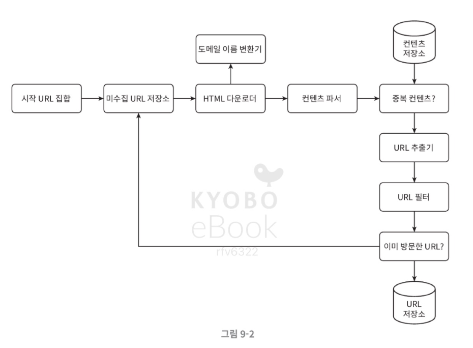

# ch9. 웹 크롤러 설계

### 웹 크롤러
 - 주된 목적 : 웹에 새로 올라오거나 갱신된 콘텐츠 찾기
- 이용 방식 :
    - 검색 엔진 인덱싱 : 로컬 인덱싱으로 만듦
    - 웹 아카이빙 : 나중에 사용할 목적으로 웹에서 정보를 모으는 절차
    - 웹 마이닝 : 웹에 존재하는 데이터를 분석하는 기술

## 1단계 문제 이해 및 설계 범위 확정
### 웹 크롤러의 기본 알고리즘
 1. url 집합이 입력으로 주어지면 url들이 가리키는 모든 웹 페이지를 다운로드
2. 다운 받은 웹 페이지에서 url들을 추출
3. 추출된 url들을 다운로드할 url 목록에 추가 후 과정을 반복
### 웹 크롤러에서 중요한 속성
- 규모 확정성 : 병행성을 활용하여 효과적으로 웹 크롤링
- 안정성 : 비정상적 입력이나 환경에 잘 대응
- 예절 : 짧은시간 동안 많은 요청을 보내서는 안 됨
- 확장성 : 새로운 형태의 콘텐츠를 지원하기 쉬워야 함
### 개략적 규모 추정
- 매달 10억 개의 웹 페이지를 다운로드
- QPS = 10억
- 최대 QPS = 2*QPS = 800
- 웹페이지의 크기 평균은 500K라고 가정
- 저장 용량 : 10억 페이지 * 500k * 12개월 * 5년 = 30PB

## 개략적 설계안 제시 및 동의 구하기

### 설계안의 각 단계
- 시작 url 집합 
    - 크롤링을 시작하는 출발점
    - 일반적인 경우 : 전체 url 공간을 작은 부분집합으로 나누는 전략
    - 주제별로 다른 시작 url을 사용
- 미수집 url 저장소
    1. 다운로드할 url
    2. 다운로드된 url
    - 나누어 관리, fifo 큐에 저장
- html 다운로더
    - 웹 페이지를 다운로드하는 컴포넌트
- 도메인 이름 변환기
    - url을 ip 주소로 변환하는 절차
- 콘텐츠 파서
    - 웹 페이지를 다운로드 하여 파싱과 검증 절차를 거침
    - 이상한 웹페이지를 걸러 저장 공간의 낭비 방지
- 중복 콘텐츠인가?
    - 시스템에 저장된 콘텐츠임을 점검
    - 간단한 방법 : 두 문서의 문자열로 보고 비교
- 콘텐츠 저장소 
    - html 문서를 보관하는 시스템
    - 저장할 데이터의 유형, 크기, 저장소 접근 빈도, 데이터의 유효 기간 등을 고려
    - 대부분의 콘텐츠는 디스크에 저장, 인기 있는 콘텐츠만 메모리에 저장
- url 추출기
    - html 페이지를 파싱하여 링크들을 골라내는 역할
- url 필터
    - 접근 제외 목록에 포함된 url등을 크롤링 대상에서 배제하는 역할
- 이미 방문한 url
    - 같은 url 여러 번 처리하는 일을 방지 -> 서버 부하 줄이고 시스템이 무한 루프에 빠지는 일을 방지
    - 블룸 필터나 해시 테이블로 구현
- url 저장소
    - 이미 방문한 url을 보관하는 저장소
### 웹 크롤러 작업 흐름
1. 시작 url들을 미수집 url 저장소에 저장
2. html 다운로더는 미수집 url 저장소에서 url 목록을 가지고 옴
3. html 다운로더는 url의 ip 주소로 변환하여 웹 페이지를 다운
4. 콘텐츠 파서를 통해 저장된 페이지 검증
5. 중복 컨텐츠인지 확인
6. 저장소에 없는 콘텐츠인 경우 url 추출기로 저장
7. 골라낸 링크를 url 필터로 전달
8. 남은 url만 중복 확인
9. 저장소에 없는 url을 미수집 url 저장소에도 전달

## 3단계 상세 설계
### DFS vs BFS
- DFS
    - 깊이 우선 탐색법
- BFS
    - 너비 우선 탐색법 (주로 이 방법 사용)
    - url간에 우선순위를 두지 않음
### 미수집 url 저장소
- 예의
    - 무례 : 너무 많은 요청을 보내는 것
    - 동일 웹 사이트에 대해서는 한 번에 한 페이지만 요청
    - 큐에 호스트랑 url을 저장 후 1대1 호출
- 우선 순위
    - 페이지랭크, 트래픽양, 갱신 빈도 등 다양한 척도를 사용
    - 순위 결정 장치 : url 우선순위를 정하는 컴포넌트
        - url을 입력으로 받아 우선순위를 계산
        - 전면 큐 : 우선순위 결정 과정을 처리
        - 후면 큐 : 크롤러가 예의 바르게 동작하도록 보증
- 신선도 
    - 다운로드한 페이지라 해도 주기적으로 재수집
- 미수집 url 저장소를 위한 지속성 저장 장치
    - 대부분의 url은 디스크에 두지만 io 비용을 줄이기 위해 메모리 버퍼에 큐를 두기
    - 버퍼에 있는 데이터는 주기적으로 디스크에 기록
- HTML 다운로더
    - http 프로토콜 통해 웹 페이지 다운로드
    - 로봇 제외 프로토콜
        - 웹 사이트가 크롤러와 소통하는 표준적 방법
    - 성능 최적화 기법
        - 분산 크롤링 : 각 서버는 여러 스레드를 돌려 다운로드 작업 처리
        - 도메인 이름 변환 결과 캐시 : 도메인 이름 변환시 동기적 특성으로 인한 지체 방지
        - 지역성 : 크롤릴 작업을 수행하는 서버를 지역별로 분산
        - 짧은 타임아웃 : 서버가 응답하지 않으면 다음 페이지로 넘어감
- 안정성
    - 안정 해시 
    - 크롤링 상태 및 수집 데이터 저장 : 장애 발생한 경우에도 쉽게 복구 가능
    - 예외 처리 : 예외에도 그 작업을 이어나갈 수 있음
    - 데이터 검증 : 시스템 오류를 방비
- 확장성
    - 새로운 형태 지원 가능하도록 설계
- 문제 있는 콘텐츠 감지 및 회피

## 4단계 마무리
- 추가 논의할 사항들
    - 서버 측 렌더링
    - 원치 않는 페이지 필터링
    - 데이터 베이스 다중화 및 샤딩
    - 수평적 규모 확장성
    - 가용성, 일관성, 안정성
    - 데이터 분석 솔루션 
