# 📢 알림 시스템 설계 — Study Notes

## 1. 알림 시스템이란?

사용자에게 중요한 정보를 비동기적으로 전달하는 시스템.

### 알림 유형

- **모바일 푸시 알림**: iOS (APNS), Android (FCM)
- **SMS 메시지**: Twilio, Nexmo 같은 제3자 서비스 이용
- **이메일**: Sendgrid, Mailchimp 이용

---

## 2. 설계 목표 (Requirements)

면접에서 먼저 요구사항을 명확히 해야 한다.

| 항목 | 내용 |
|------|------|
| 알림 유형 | 푸시, SMS, 이메일 |
| 실시간 여부 | Soft real-time (약간의 지연 허용) |
| 지원 단말 | iOS, Android, 랩톱/데스크톱 |
| 알림 생성자 | 클라이언트 앱 or 서버 측 스케줄링 |
| opt-out | 가능 (사용자가 수신 거부 설정 가능) |
| 처리 규모 | 모바일 푸시 1천만/일, SMS 1백만/일, 이메일 5백만/일 |

---

## 3. 알림 유형별 메커니즘

### 3.1 iOS 푸시 알림

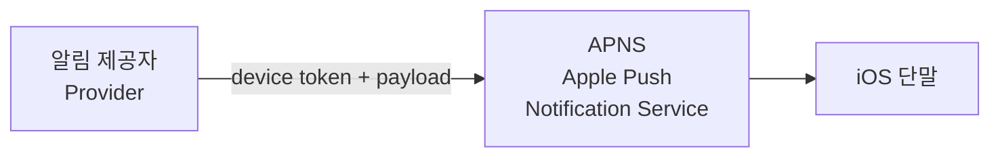

- **Provider**: 알림 요청 생성 주체
  - `device token`: 단말 고유 식별자
  - `payload`: JSON 형태의 알림 내용
- **APNS**: 애플이 운영하는 푸시 알림 서비스

### 3.2 Android 푸시 알림

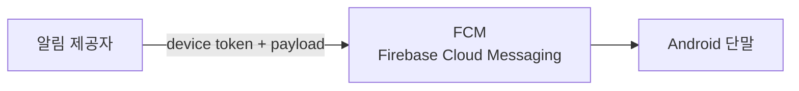

- iOS와 동일한 흐름, APNS 대신 **FCM** 사용
- FCM은 중국에서 사용 불가 → Jpush, PushY 등 대체 필요

### 3.3 SMS 메시지

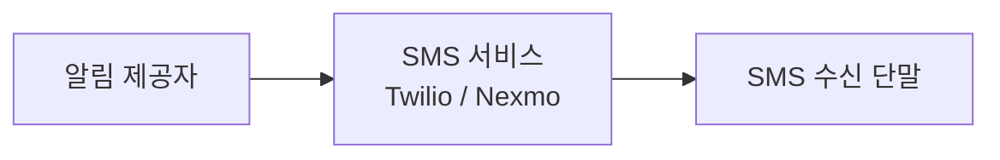

### 3.4 이메일

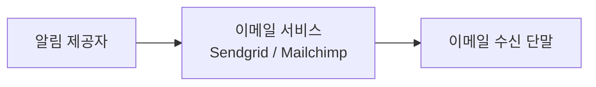

---

## 4. 연락처 정보 수집 절차

사용자가 앱 설치 or 계정 등록 시 수집.

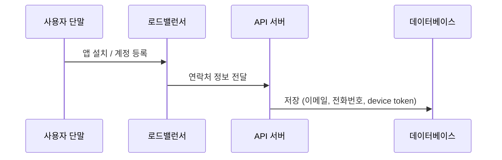

### DB 스키마

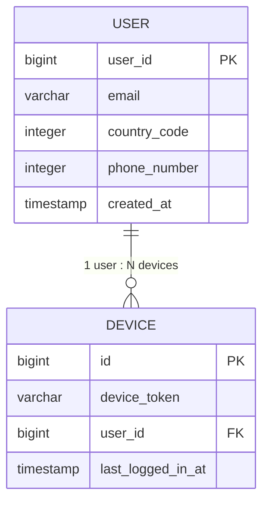

> 한 사용자가 여러 단말을 가질 수 있음 → 알림은 모든 단말에 전송

---

## 5. 알림 전송 설계

### 5.1 초안 (단일 서버)

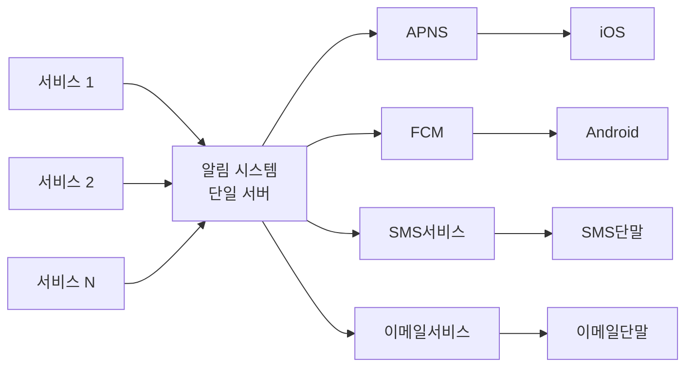

**문제점**

| 문제 | 설명 |
|------|------|
| SPOF | 서버 하나가 죽으면 전체 서비스 장애 |
| 규모 확장 불가 | DB/캐시를 개별 확장할 방법 없음 |
| 성능 병목 | 제3자 서비스 응답을 기다리며 자원 낭비 |

### 5.2 개선된 설계 (메시지 큐 도입)

개선 방향:
- DB와 캐시를 알림 서버에서 분리
- 알림 서버 다중화 + 자동 수평 확장
- 메시지 큐로 컴포넌트 간 강한 결합 제거

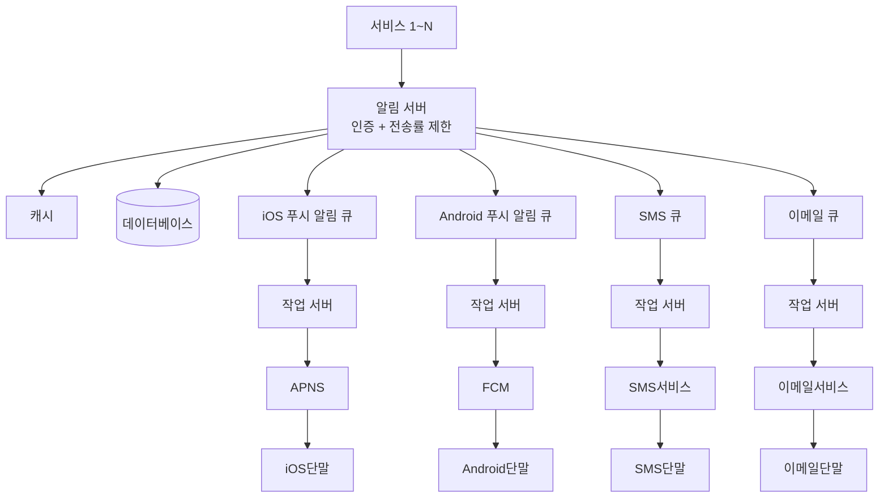

**알림 전송 흐름 (6단계)**

1. API 호출로 알림 서버에 알림 요청
2. 알림 서버가 캐시/DB에서 메타데이터 조회 (사용자 정보, 단말 토큰, 알림 설정)
3. 알림 서버가 해당 유형의 메시지 큐에 이벤트 삽입
4. 작업 서버가 큐에서 알림 이벤트 꺼냄
5. 작업 서버가 제3자 서비스로 알림 전송
6. 제3자 서비스가 사용자 단말로 알림 전달

---

## 6. 안정성 (Reliability)

### 6.1 데이터 손실 방지

> 알림은 지연되어도 되지만, **절대 사라지면 안 된다.**

- 알림 데이터를 DB에 보관
- 작업 서버가 알림 로그 DB에 기록
- 실패 시 재시도 메커니즘 적용

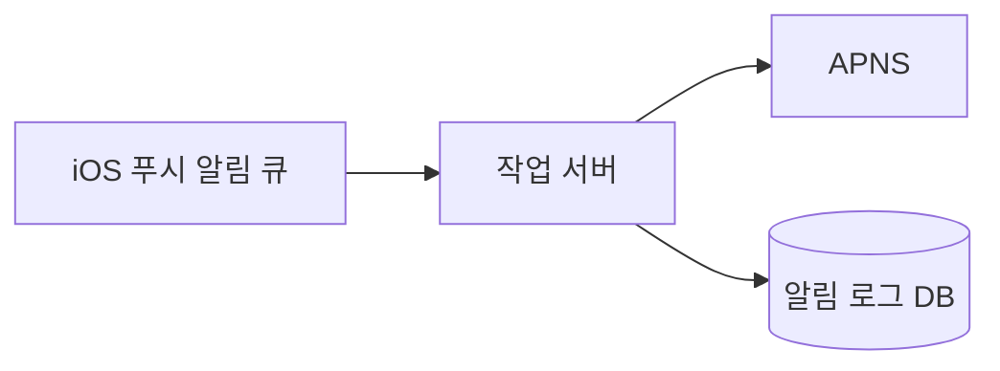

### 6.2 알림 중복 전송 방지

분산 시스템 특성상 **100% 중복 방지는 불가능**.

중복 최소화 방법:
- 보낼 알림 도착 시 **이벤트 ID** 확인
- 이미 본 이벤트 ID면 버림
- 새로운 이벤트면 알림 발송

---

## 7. 추가 컴포넌트 및 고려사항

### 7.1 알림 템플릿

- 대형 시스템은 하루 수백만 건 → 알림 형식은 대부분 유사
- 템플릿으로 파라미터, 스타일, 추적 링크만 조정하여 재사용
- 일관성 유지 + 오류 가능성 감소

```
본문: 여러분이 꿈꿔온 그 상품을 우리가 준비했습니다.
      [item_name]이 다시 입고되었습니다! [date]까지만 주문 가능합니다!
CTA:  지금 [item_name]을 주문 또는 예약하세요!
```

### 7.2 알림 설정 (opt-out 지원)

```
user_id  bigint   -- 사용자 ID
channel  varchar  -- 채널 (push/SMS/email)
opt_in   boolean  -- 수신 여부
```

> 알림 전송 전 반드시 해당 사용자의 opt-in 여부 확인

### 7.3 전송률 제한 (Rate Limiting)

- 사용자가 받을 수 있는 알림 빈도 제한
- 알림을 너무 많이 보내면 사용자가 **아예 알림을 꺼버릴 수 있음**

### 7.4 재시도 방법

- 제3자 서비스가 알림 전송 실패 시 → **재시도 전용 큐**에 삽입
- 동일 문제 반복 발생 시 → 개발자에게 alert

### 7.5 푸시 알림 보안

- `appKey` + `appSecret` 사용
- **인증된(authenticated) or 승인된(verified) 클라이언트만** 알림 API 사용 가능

### 7.6 큐 모니터링

- **큐에 쌓인 알림 수**가 핵심 메트릭
- 큐 크기가 너무 크면 → 작업 서버 증설 신호

### 7.7 이벤트 추적

알림 확인율, 클릭율, 실제 앱 사용 전환 추적 → analytics 서비스 통합 필요.

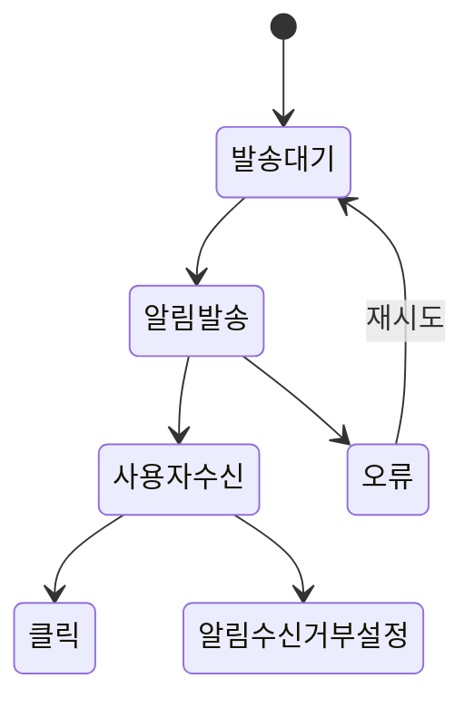

---

## 8. 최종 수정 설계안

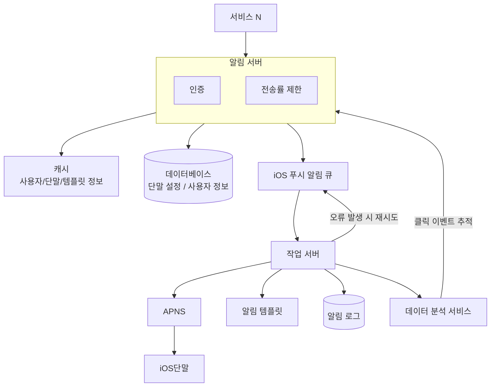

**초안 대비 추가된 컴포넌트**

| 추가 항목 | 설명 |
|-----------|------|
| 인증 + 전송률 제한 | 알림 서버에 추가 |
| 재시도 기능 | 실패 알림을 큐에 다시 넣고 재전송 |
| 알림 템플릿 | 알림 생성 단순화 + 일관성 유지 |
| 모니터링 + 이벤트 추적 | 시스템 상태 확인 + 개선 근거 확보 |

---

## 9. 핵심 설계 포인트 (Interview Key)

| 항목 | 내용 |
|------|------|
| 안정성 | 알림 로그 DB + 재시도 메커니즘 |
| 보안 | appKey + appSecret으로 인증된 클라이언트만 허용 |
| 중복 방지 | 이벤트 ID 기반 중복 감지 (100% 방지는 불가) |
| 확장성 | 메시지 큐로 컴포넌트 분리 + 작업 서버 수평 확장 |
| 사용자 설정 | opt-out 지원 → 알림 전송 전 설정 반드시 확인 |
| 모니터링 | 큐 크기 메트릭 + 이벤트 추적으로 시스템 개선 |

---

## 🧠 한 줄 핵심 요약

알림 시스템은 "메시지 큐로 결합을 끊고, 재시도 + 중복 체크로 안정성을 확보한 비동기 분산 전달 파이프라인"이다.
