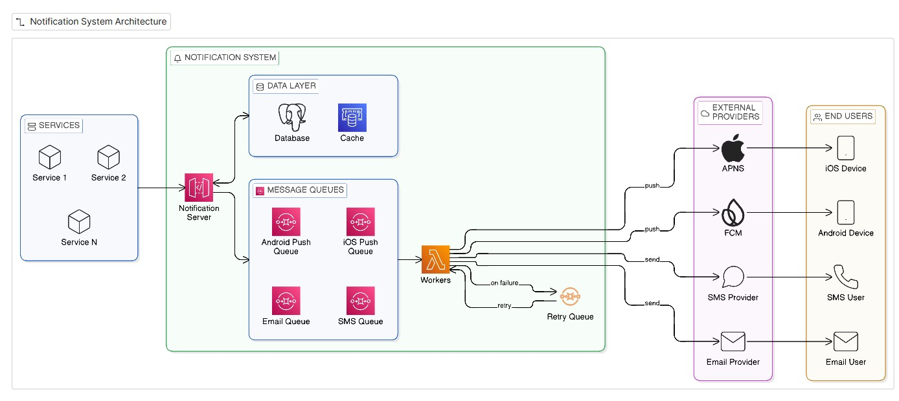

# 10. 알림 시스템 설계
- 종류
  - 모바일 푸시 알림
  - SMS 메시지
  - 이메일
### 1. 문제 이해 및 설계 범위 확정
면접 출제 시 요구 범위가 모호하기 때문에 질문을 통해 요구사항을 알아내야 함

- 요구 사항
  - 푸시 알림, SMS 메시지, 이메일을 지원하는 시스템
  - soft real-time 시스템: 알림은 가능한 빨리 전달되어야 하지만 시스템에 높은 부하가 걸렸을 때 약간의 지연은 무방
  - iOS 단말, 안드로이드 단말, 랩톱/데스크톱 지원
  - 알림 생성자: 클라이언트 애플리케이션 프로그램, 서버측 스케줄링
  - 사용자의 알림 설정: 알림을 받지 않도록(opt-out) 설정 가능
  - 하루에 천만 건의 모바일 푸시 알림, 백만 건의 SMS 메시지, 5백만 건의 이메일을 보낼 수 있어야 함
### 2. 개략적 설계안 제시 및 동의 구하기
- iOS 푸시 알림, 안드로이느 푸시 알림, SMS 메시지, 이메일을 지원하는 알림 시스템의 설계안을 살펴볼 것
- 알림 유형별 지원 방안
  - iOS 푸시 알림
    - 
    - 알림 제공자: 알림 요청(notification request)을 만들어 애플 푸시 알림 서비스(APNS)로 보내는 주체
      - 알림 요청을 만들기 위해 필요한 데이터
        - 단말 토큰(device token): 알림 요청을 보내는 데 필요한 고유 식별자
        - 페이로드(payload): 알림 내용을 담은 JSON 딕셔너리
          - 예시: 
        - APNS: 애플이 제공하는 원격 서비스로, 푸시 알림을 iOS 장치로 보내는 역할
        - iOS 단말(iOS device): 푸시 알림을 수신하는 사용자 단말
  - 안드로이드 푸시 알림
    - iOS와 비슷한 절차로 전송됨
    - APNS 대신 FCM(Firebase Cloud Messaging)을 사용한다는 점만 다름
    - 
  - SMS 메시지
    - 트윌리오(Twilio), 넥스모(Nexmo) 같은 제3 사업자의 서비스를 많이 이용
    - 대부분 상용 서비스라서 이용 요금이 필요함
    - 
  - 이메일
    - 대부분의 회사가 고유 이메일 서버를 구축할 역량을 갖고 있어도 상용 이메일 서비스를 이용함
    - 센드그리드(Sendgrid), 메일침프(Mailchimp) 등
    - 전송 성공률도 높고, 데이터 분석 서비스도 제공
    - 예: 
  - 알림 유형 전부를 한 시스템으로 묶은 예시
    - 
- 연락처 정보 수집 절차
  - 알림 전송을 위해서는 모바일 단말 토큰, 전화번호, 이메일 주소 등의 정보가 필요
  - 다음과 같이 사용자가 앱을 설치하거나 처음으로 계정 등록 시에 API 서버는 해당 사용자의 정보를 수집하여 데이터베이스에 저장
    - 
  - 데이터베이스에 연락처 정보를 저장할 테이블 구조
    - 
    - 이메일 주소와 전화번호는 user 테이블, 단말 토큰은 device 테이블에 저장
    - 한 사용자가 여러 단말을 가질 수 있고, 알림은 모든 단말에 전송되어야 함을 고려한 구조
- 알림 전송 및 수신 절차
  - 개략적 설계안 (초안)
    - 
    - 1부터 N까지의 서비스: 이 서비스 각각은 마이크로서비스(microservice)일수도 있고, 크론잡(cronjob)일 수도 있고, 분산 시스템 컴포넌트일 수도 있음
      - 예: 상사용자에게 납기일을 알리고자 하는 과금 서비스, 배송 알림을 보내려는 쇼핑몰 웹사이트 등
    - 알림 시스템(notification system): 알림 시스템은 알림 전송/수신 처리의 핵심
      - 1개 서버만 사용하는 시스템이라고 가정했을 때, 이 시스템은 서비스 1~N에 알림 전송을 위한 API를 제공해야하고, 제3자 서비스에 전달할 알림 페이로드를 만들어낼 수 있어야 함
    - 제 3자 서비스(thrid party service): 사용자에게 알림을 실제로 전달하는 역할
      - 확장성을 고려해서 통합해야함
        - 쉽게 새로운 서비스를 통합하거나 기존 서비스를 제거할 수 있어야 함
      - 어떤 서비스는 다른 시장에서는 사용할 수 없을 수도 있음을 고려해야 함
        - 예: FCM은 중국에서 사용할 수 없기 때문에, 중국 시장에서는 제이푸시(Jpush), 푸시와이(PushY) 같은 서비스를 이용해야 함
    - iOS, 안드로이드, SMS, 이메일 단말: 사용자는 자기 단말에서 알림을 수신
  - 위 설계에서의 문제점
    - SPOF: 알림 서비스에 서버가 하나밖에 없음 -> 이 서버에 장애 발생 시 전체 서비스 장애로 이어짐
    - 규모 확장성: 한 대 서비스로 푸시 알림에 관계된 모든 것을 처리 -> 데이터베이스나 캐시 등 중요 컴포넌트의 규모를 개별적으로 늘릴 방법이 없음
    - 성능 병목: 알림 처리 및 전송은 자원을 많이 필요로 하는 작업
      - 예: HTML 페이지를 만들고 제3자 서비스의 응답을 기다리는 일은 시간이 많이 걸릴 수 있는 작업
        - 따라서 모든 것을 한 서버로 처리하면 사용자 트래픽이 많이 몰리는 시간에는 시스템이 과부하 상태가 될 수 있다
  - 개략적 설계안 (개선된 버전)
    - 데이터베이스와 캐시를 알림 시스템의 주 서버에서 분리
    - 알림 서버 증설 및 자동으로 수평적 규모 확장이 이루어질 수 있도록 함
    - 메시지 큐를 이용해 시스템 컴포넌트 사이의 강한 결합을 끊음
    - 
    - 
      - 1부터 N까지의 서비스: 알림 시스템 서버의 API를 통해 알림을 보낼 서비스들
      - 알림 서버: 다음 기능을 제공
        - 알림 전송 API: 스팸 방지를 위해 보통 사내 서비스 또는 인증된 클라이언트만 이용 가능
        - 알림 검증: 이메일 주소, 전화번호 등에 대한 기본적 검증 수행
        - 데이터베이스 또는 캐시 질의: 알림에 포함시킬 데이터를 가져오는 기능
        - 알림 전송: 알림 데이터를 메시지 큐에 넣음. 본 설계안의 경우 하나 이상의 메시지 큐를 사용하므로 알림을 병렬적으로 처리할 수 있음
          - 이메일 형태의 알림을 보내는 데 사용하는 API 예제
            - 
      - 캐시: 사용자 정보, 단말 정보, 알림 템플릿 등을 캐시함
      - 데이터베이스: 사용자, 알림, 설정 등 다양한 정보 저장
      - 메시지 큐: 시스템 컴포넌트 간 의존성을 제거하기 위해 사용
        - 다량의 알림이 전송되어야 하는 경우를 대비한 버퍼 역할도 함
        - 본 설계안에서는 알림의 종류별로 별도 메시지 큐를 사용 -> 제3자 서비스 가운데 하나에 장애가 발생해도 다른 종류의 알림은 정상 동작
      - 작업 서버(workers): 메시지 큐에서 전송할 알림을 꺼내서 제3자 서비스로 전달하는 역할을 담당하는 서버
      - 제3자 서비스(third-party service)
      - iOS, 안드로이드, SMS, 이메일 단말
    - 실제 알림 전송
      1. API를 호출하여 알림 서버로 알림을 보냄
      2. 알림 서버는 사용자 정보, 단말 토큰, 알림 설정 같은 메타데이터를 캐시나 데이터베이스에서 가져옴
      3. 알림 서버는 전송할 알림에 맞는 이벤트를 만들어서 해당 이벤트를 위 한 큐에 넣음. 가령 iOS 푸시 알림 이벤트는 iOS 푸시 알림 큐에 넣어야 함
      4. 작업 서버는 메시지 큐에서 알림 이벤트를 꺼냄
      5. 작업 서버는 알림을 제3자 서비스로 보냄
      6. 제3자 서비스는 사용자 단말로 알림 전송
### 3. 상세 설계
- 안정성
  - 분산 환경에서 운영될 알림 시스템 설계 시에는 안정성 확보를 위한 몇가지를 고려해야 함
  - 데이터 손실 방지
    - 
    - 어떤 상황에서도 알림이 소실되면 안된다는 요구사항
    - 지연, 순서 틀림은 괜찮지만 사라지면 안됨
    - 이를 위해 알림 데이터를 데이터베이스에 보관하고 재시도 메커니즘을 구현해야 함
    - 예: 위 그림처럼 알림 로그 데이터베이스를 유지
  - 알림 중복 전송 방지
    - 같은 알림이 여러 번 반복되는 것을 완전히 막는 것은 불가능함
    - 대부분의 경우 알림은 딱 한번만 전송되겠지만, 분산 시스템 특성상 같은 알림이 중복되어 전송되기도 함
    - 빈도를 줄이려면 중복 탐지 메커니즘 도입, 오류 처리 필요
    - 중복 방지 로직 사례:
      - 보내야 할 알림이 도착하면 그 이벤트 ID를 검사하여 이전에 본 적 있는 이벤트인지 살핌. 
      - 중복된 이벤트라면 버리고, 그렇지 않으면 알림 발송
- 추가로 필요한 컴포넌트 및 고려사항: 
  - 알림 템플릿
    - 대형 알림 시스템이 처리하는 수백만 건의 알림 메시지들은 형식이 비슷함
    - 알림 템플릿은 이런 유사성을 고려하여, 알림 메시지의 모든 부분을 처음부터 다시 만들 필요 없도록 해줌
    - 인자(parameter)나 스타일, 추적 링크(tracking link)를 조정하기만 하면 사전에 지정한 형식에 맞춰 알람을 만들어내는 틀
    - 템플릿을 사용하면 전송될 알림들의 형식을 일관성 있게 유지할 수 있고, 오류 가능성, 알림 작성에 드는 시간을 줄일 수 있음
    - 예:
      - 
      - 
  - 알림 설정
    - 사용자가 너무 많은 알림을 받고 피로함을 느끼지 않도록, 웹/앱에서는 사용자가 알림 설정을 상세히 조정할 수 있도록 해야 함
    - 이 정보는 알림 설정 테이블에 보관됨
    - 필드
      - 
    - 위와 같은 설정을 도입한 후에는 특정 종류의 알림을 보내기 전에 해당 사용자가 해당 알림을 켜두었는지 확인 필요
  - 전송률 제한(rate limiting)
    - 사용자에게 너무 많은 알림을 보내지 않도록 하기 위해, 한 사용자가 받을 수 있는 알림의 빈도를 제한
    - 알림을 너무 많이 보내면 사용자가 알림 기능을 아예 꺼버릴 수도 있기 때문에 필요
  - 재시도 메커니즘(retry mechanism)
    - 제3자 서비스가 알림 전송에 실패하면 해당 알림을 재시도 전용 큐에 넣음
    - 같은 문제가 계속 발생하면 개발자에게 통지 (alert)
  - 푸시 알림과 보안(security)
    - iOS와 안드로이드 앱의 경우, 알림 전송 API는 appKey와 appSecret을 사용하여 보안을 유지함
    - 따라서 인증된(authenticated), 혹은 승인된(verified) 클라이언트만 해당 API를 사용하여 알림을 보낼 수 있음
  - 큐 모니터링 
    - 
    - 알림 시스템 모니터링 시 중요한 메트릭 하나는 큐에 쌓인 알림의 개수
    - 너무 크면 작업 서버들이 이벤트를 빠르게 처리하고 있지 못하다는 뜻 -> 작업 서버 증설
  - 이벤트 추적
    - 알림 확인율, 클릭율, 실제 앱 사용으로 이어지는 비율 같은 메트릭은 사용자 이해에 중요
    - 데이터 분석 서비스는 보통 이벤트 추적 기능도 제공
    - -> 알림 시스템을 만들면 데이터 분석 서비스와도 통합해야 함
    - 데이터 분석 서비스를 통해 추적하게 될 알림 시스템 이벤트 사례
      - 
- 개선된 설계안
  - 
  - 위 내용을 반영하여 수정한 설계안
  - 새롭게 추가된 컴포넌트
    - 알림 서버에 인증(authentication)과 전송률 제한(rate-limiting) 기능이 추가됨
    - 전송 실패에 대응하기 위한 재시도 기능이 추가됨. 전송에 실패한 알림은 다시 큐에 넣고 지정된 횟수만큼 재시도
    - 전송 템플릿을 사용하여 알림 생성 과정을 단순화하고 알림 내용의 일관성 유지
    - 모니터링과 추적 시스템을 추가하여 시스템 상태를 확인하고 추후 시스템을 개선하기 쉽도록 함
### 4. 마무리
- 알림 기능의 활용
  - 중요 정보를 계속 알려줌
  - 넷플릭스 신작 영화 출시 정보
  - 신규 상품에 대한 할인 쿠폰 이메일
  - 온라인 쇼핑 결제 확정 메시지 등
- 예제 설계
  - 규모 확장이 쉽고
  - 푸시 알림, SMS 메시지, 이메일 등 다양한 정보 전달 방식을 지원하는 알림 시스템
  - 시스템 컴포넌트 사이의 결합도를 낮추기 위해 메시지 큐를 적극적으로 사용
- 중심 주제
  - 안정성: 메시지 전송 실패율을 낮추기 위해 안정적인 재시도 메커니즘 도입
  - 보안: 인증된 클라이언트만이 알림을 보낼 수 있도록 appKey, appSecret 등의 메커니즘 이용
  - 이벤트 추적 및 모니터링: 알림이 만들어진 후 성공적으로 전송되기까지의 과정을 추적하고 시스템 상태를 모니터링하기 위해 알림 전송이 각 단계마다 이벤트 추적 및 모니터링할 수 있는 시스템 통합
  - 사용자 설정: 사용자가 알림 수신 설정을 조정할 수 있도록 함. 따라서 알림을 보내기 전 반드시 해당 설정을 확인하도록 시스템 설계를 변경
  - 전송률 제한: 사용자에게 알림을 보내는 빈도를 제한할 수 있도록 함
