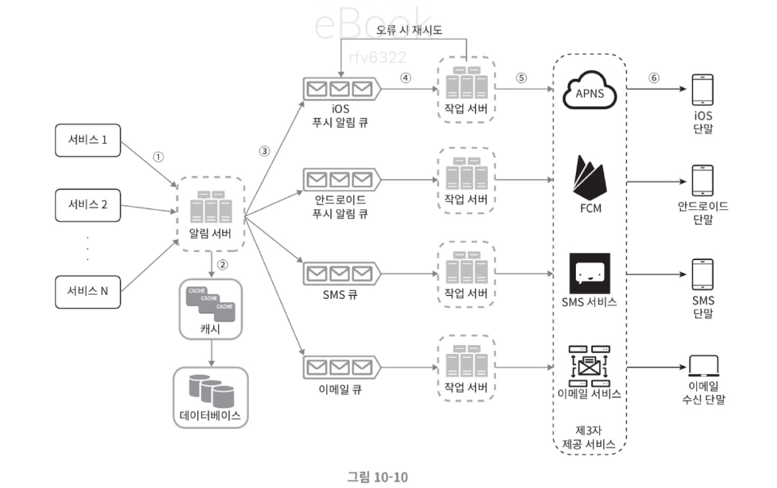
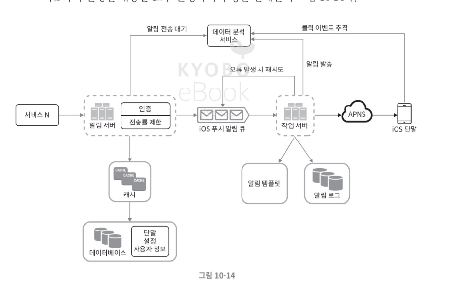

# 10장 알림 시스템 설계 요약

## 1. 문제 이해 및 설계 범위

알림 시스템(Notification System)은 사용자에게 중요한 정보를 전달하는 시스템이다.  
대표적인 알림 유형은 다음과 같다.

- 모바일 푸시 알림
- SMS 메시지
- 이메일

### 요구사항 예시

- iOS, Android, Web 지원
- 하루 수백만 건 이상의 알림 처리
- Soft real-time 전달
- 사용자 opt-out 설정 지원

---

# 2. 알림 유형별 전송 방식

## iOS Push Notification

구성 요소

- 알림 제공자 (Provider)
- APNS (Apple Push Notification Service)
- iOS 단말

동작 흐름

1. 서버가 Notification Request 생성
2. APNS로 요청 전송
3. APNS가 iOS 단말로 알림 전달

---

## Android Push Notification

구성 요소

- 알림 제공자
- FCM (Firebase Cloud Messaging)
- Android 단말

동작 흐름

1. 서버가 알림 요청 생성
2. FCM으로 전달
3. Android 단말로 전달

---

## SMS 알림

SMS 전송은 보통 외부 서비스(Third-party)를 사용한다.

대표 서비스

- Twilio
- Nexmo

구조

Server → SMS Service → User Phone

---

## 이메일 알림

대표 이메일 전송 서비스

- SendGrid
- MailChimp

구조

Server → Email Service → User Email Client

---

# 3. 연락처 정보 저장

알림 전송을 위해 사용자 연락처 정보가 필요하다.

### user table

| column       | 설명      |
| ------------ | --------- |
| user_id      | 사용자 ID |
| email        | 이메일    |
| phone_number | 전화번호  |
| created_at   | 생성일    |

### device table

| column            | 설명          |
| ----------------- | ------------- |
| id                | device id     |
| device_token      | push token    |
| user_id           | 사용자        |
| last_logged_in_at | 마지막 로그인 |

한 사용자가 여러 디바이스를 가질 수 있으므로 device 테이블을 분리한다.

---

# 4. 기본 알림 시스템 구조

구성 요소

- 서비스 서버 (Service 1~N)
- 알림 서버 (Notification Server)
- 제3자 서비스 (APNS, FCM, SMS, Email)
- 사용자 단말

### 기본 동작 흐름

1. 서비스가 알림 서버 API 호출
2. 알림 서버가 사용자 정보 조회
3. 알림 이벤트 생성
4. 메시지 큐에 저장
5. Worker가 큐에서 이벤트 처리
6. 제3자 서비스로 전송
7. 사용자 단말에서 알림 수신

---

# 5. 초기 설계의 문제점

## Single Point of Failure (SPOF)

알림 서버가 하나일 경우

- 서버 장애 발생 시 전체 알림 시스템 중단

---

## 확장성 문제

하나의 서버에서 모든 알림 처리 시

- 트래픽 증가 대응 어려움
- 병목 발생

---

# 6. 개선된 설계

개선 방향

- DB / Cache 분리
- 알림 서버 수평 확장
- 메시지 큐 도입

### 메시지 큐 역할

- 시스템 간 결합도 감소
- 비동기 처리
- 트래픽 버퍼링

큐 예시

- iOS Queue
- Android Queue
- SMS Queue
- Email Queue

---

# 7. 알림 처리 흐름

1. API 호출로 알림 생성
2. 사용자 정보 조회
3. 알림 이벤트 생성
4. 알림 유형별 큐에 저장
5. Worker가 큐에서 메시지 소비
6. 외부 서비스 호출
7. 사용자 단말 수신

---

# 8. 안정성 설계

## 데이터 손실 방지

알림 로그 데이터베이스 유지

notification_log

목적

- 알림 기록 저장
- 실패 시 재시도 가능
- 알림 추적 가능

---

## 중복 알림 방지

분산 시스템에서는 같은 알림이 중복 전송될 수 있다.

해결 방법

- event_id 기반 deduplication
- 이미 처리된 이벤트 필터링

---

# 9. 추가 고려 사항

## 알림 템플릿

알림 메시지 포맷 관리

예시

여러분이 좋아하던 상품이 재입고되었습니다.  
[item_name] 지금 주문하세요!

장점

- 메시지 생성 단순화
- 알림 형식 일관성 유지

---

## 사용자 알림 설정

| column  | 설명               |
| ------- | ------------------ |
| user_id | 사용자             |
| channel | push / sms / email |
| opt_in  | 수신 여부          |

알림 전송 전 사용자가 수신 허용 상태인지 확인해야 한다.

---

## Rate Limiting

사용자에게 과도한 알림 전송을 방지한다.

예

- 하루 최대 알림 수 제한
- 일정 시간당 전송 제한

---

## 재시도 메커니즘

전송 실패 시

- 메시지를 다시 큐에 저장
- 일정 횟수 재시도

---

## 보안

알림 API 보호

- appKey
- appSecret
- 인증된 클라이언트만 알림 전송 가능

---

## 모니터링

주요 모니터링 메트릭

- 큐 메시지 수
- 전송 성공률
- 처리 지연 시간

큐 길이가 길어지면 Worker를 확장한다.

---

## 이벤트 추적

분석 가능한 지표

- 알림 열람
- 클릭
- 전환율

Analytics 시스템과 연동 가능

---

# 10. 최종 아키텍처 핵심

최종 알림 시스템 구조

Service  
→ Notification Server  
→ Message Queue  
→ Worker  
→ Third Party Notification Service  
→ User Device

핵심 특징

- 확장성 (Scalability)
- 안정성 (Reliability)
- 비동기 처리
- 메시지 큐 기반 아키텍처
