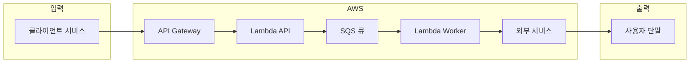
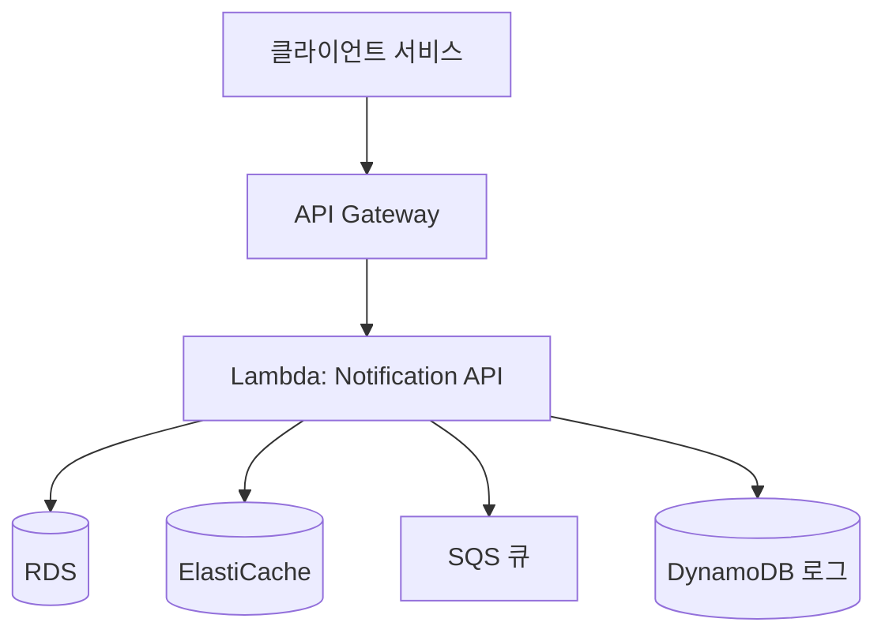
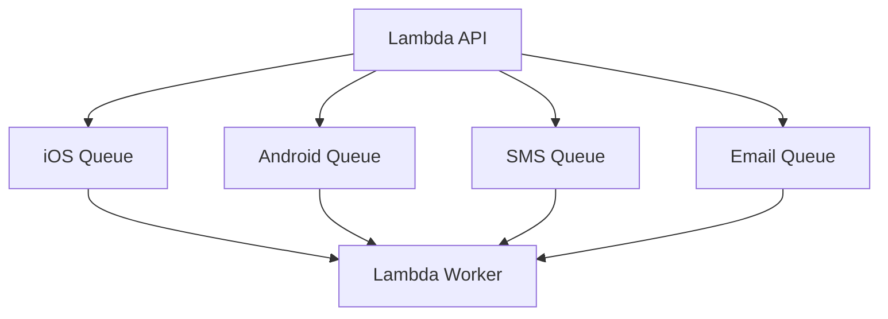
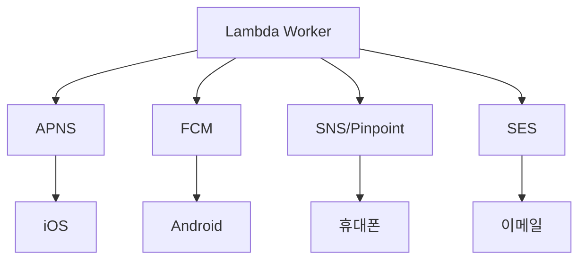
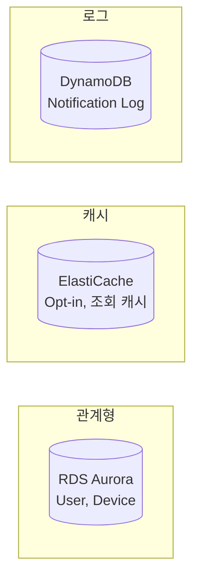
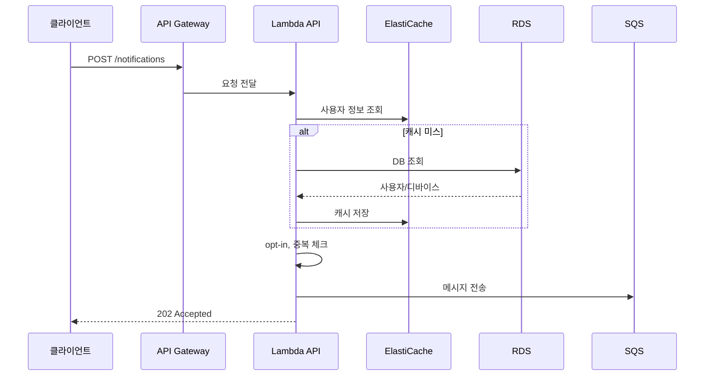
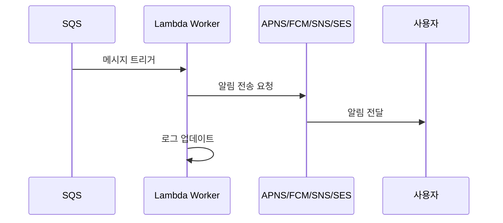

# AWS 기반 알림 시스템 아키텍처

10장 알림 시스템 설계를 AWS 리소스로 구현한 아키텍처 문서입니다.

---

## 1. 아키텍처 다이어그램

### 1.1 전체 흐름 개요

가장 단순한 요청-응답 흐름입니다.

---

### 1.2 API 레이어 (알림 생성)

클라이언트 요청이 들어와서 큐에 저장되기까지의 흐름입니다.

---

### 1.3 메시지 큐 구조

알림 유형별로 분리된 SQS 큐입니다.

---

### 1.4 Worker → 사용자 전달

큐에서 메시지를 꺼내 외부 서비스를 통해 사용자에게 전달하는 흐름입니다.

---

### 1.5 데이터 저장소

각 저장소의 역할입니다.

---

## 2. 컴포넌트별 AWS 매핑

### 2.1 API Gateway

| 역할 | AWS 서비스 | 설명 |
|------|-----------|------|
| API 엔드포인트 | **API Gateway** | REST API 또는 HTTP API로 알림 생성 요청 수신 |
| 인증 | API Gateway + Lambda Authorizer | appKey, appSecret 기반 인증 |

- 클라이언트 서비스가 알림 API를 호출하는 진입점
- Rate Limiting, Throttling 설정 가능
- API 키 또는 IAM 기반 접근 제어

---

### 2.2 Notification Server (알림 서버)

| 역할 | AWS 서비스 | 설명 |
|------|-----------|------|
| API 핸들러 | **AWS Lambda** | 서버리스 알림 API 처리 |
| 대안 | ECS Fargate / EKS | 컨테이너 기반 처리 (고부하 시) |

**Lambda 처리 흐름:**
1. API Gateway에서 요청 수신
2. 사용자 정보 조회 (RDS + ElastiCache)
3. opt-in 설정 확인 (ElastiCache)
4. 알림 이벤트 생성 및 event_id 기반 중복 체크
5. 알림 유형별 SQS 큐에 메시지 전송
6. DynamoDB에 notification_log 기록

---

### 2.3 데이터 저장소

| 데이터 | AWS 서비스 | 설명 |
|--------|-----------|------|
| User, Device | **Amazon RDS (Aurora)** | 관계형 데이터, 사용자/디바이스 정보 |
| Cache, Opt-in | **Amazon ElastiCache (Redis)** | 조회 성능, 사용자 알림 설정 캐싱 |
| Notification Log | **Amazon DynamoDB** | 알림 이력, 재시도, 추적용 |

**RDS 테이블 구조 (ch10.md 기반):**
- `user`: user_id, email, phone_number, created_at
- `device`: id, device_token, user_id, last_logged_in_at
- `notification_preference`: user_id, channel, opt_in

---

### 2.4 메시지 큐

| 알림 유형 | AWS 서비스 | 설명 |
|----------|-----------|------|
| iOS | **Amazon SQS** | iOS 알림 전용 큐 |
| Android | **Amazon SQS** | Android 알림 전용 큐 |
| SMS | **Amazon SQS** | SMS 전송 전용 큐 |
| Email | **Amazon SQS** | 이메일 전송 전용 큐 |

- SQS Standard 또는 FIFO (순서 보장 필요 시)
- Dead Letter Queue(DLQ) 설정으로 실패 메시지 격리
- Visibility Timeout으로 중복 처리 방지

---

### 2.5 Worker (알림 전송 처리)

| 역할 | AWS 서비스 | 설명 |
|------|-----------|------|
| 큐 소비 | **AWS Lambda** | SQS 이벤트 소스로 트리거 |
| 대안 | ECS Fargate | 장시간/대용량 처리 시 |

**Lambda Worker 동작:**
- SQS 메시지 수신 시 자동 트리거
- 알림 유형별로 외부 서비스 호출
- 전송 결과를 DynamoDB notification_log에 기록
- 실패 시 SQS 재시도 또는 DLQ로 이동

---

### 2.6 제3자 알림 서비스

| 알림 유형 | AWS/외부 서비스 | 설명 |
|----------|-----------------|------|
| iOS Push | **APNS** (Apple) | Lambda에서 HTTP/2 API 호출 |
| Android Push | **FCM** (Firebase) | Lambda에서 FCM API 호출 |
| SMS | **Amazon SNS** / **Pinpoint** | AWS 네이티브 SMS 또는 Twilio 연동 |
| Email | **Amazon SES** | 이메일 발송, 템플릿 지원 |

---

### 2.7 보안 및 비밀 관리

| 역할 | AWS 서비스 | 설명 |
|------|-----------|------|
| API 키, 인증서 | **AWS Secrets Manager** | APNS 인증서, FCM 키, appSecret 등 |
| 환경 변수 | Lambda 환경 변수 | 암호화된 설정 값 |

---

### 2.8 모니터링

| 지표 | AWS 서비스 | 설명 |
|------|-----------|------|
| 메트릭 | **CloudWatch** | Lambda 실행, SQS 큐 길이, 에러율 |
| 로그 | **CloudWatch Logs** | Lambda 로그, API Gateway 로그 |
| 알람 | **CloudWatch Alarms** | 큐 길이 임계치, 에러율 알림 |
| 대시보드 | **CloudWatch Dashboard** | 통합 모니터링 뷰 |

---

## 3. 데이터 흐름

### 3.1 알림 생성 (API 처리)

---

### 3.2 알림 전송 (Worker 처리)

---

## 4. 고가용성 및 확장성

| 요구사항 | AWS 구현 |
|----------|----------|
| **SPOF 제거** | Lambda, SQS, RDS Multi-AZ로 자동 분산 |
| **수평 확장** | Lambda 자동 스케일, SQS 기반 비동기 처리 |
| **트래픽 버퍼링** | SQS가 피크 트래픽 흡수 |
| **데이터 손실 방지** | SQS 메시지 보존, DynamoDB notification_log |
| **재시도** | SQS Visibility Timeout, Lambda 재시도 정책 |

---

## 5. 비용 최적화 포인트

- **Lambda**: 요청당 과금, 사용량에 따라 자동 스케일
- **SQS**: 월 100만 건 무료 요청
- **SES**: 62,000건/월 무료 (이메일 발송)
- **RDS Aurora Serverless**: 사용량 기반 스케일
- **ElastiCache**: 캐시 히트로 RDS 호출 감소

---

## 6. 참고

- 본 아키텍처는 `ch10.md`의 알림 시스템 설계를 AWS 서비스로 매핑한 것입니다.
- 실제 운영 시 VPC, 보안 그룹, IAM 권한 최소화 등 추가 보안 고려가 필요합니다.
