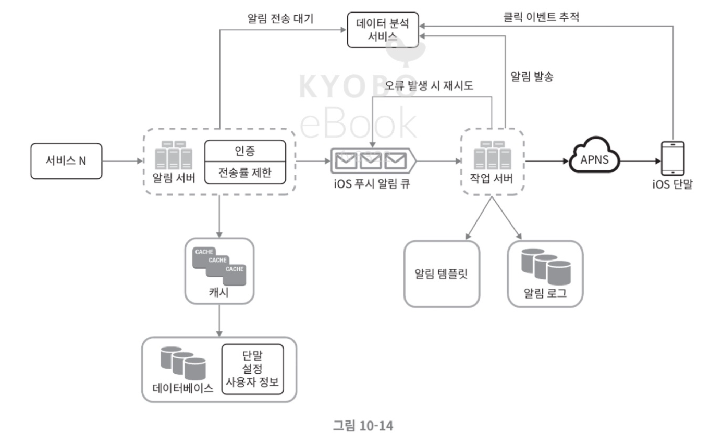
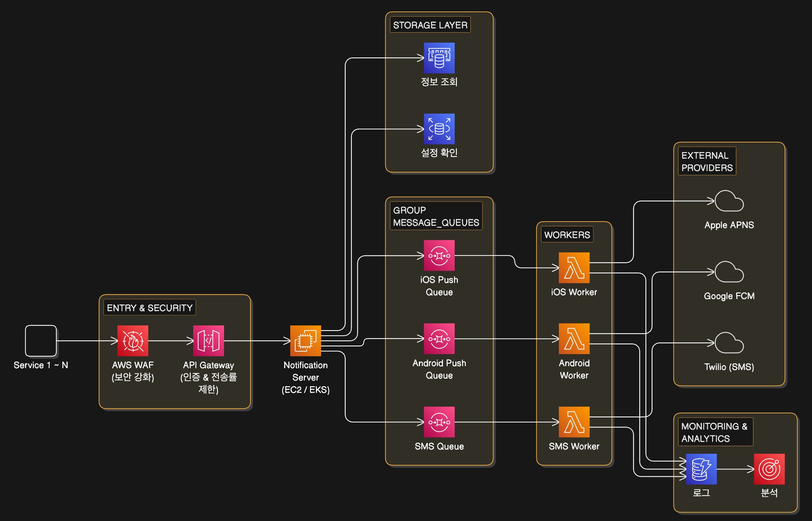

# 10장 알림 시스템 설계

## 1. 설계 범위 및 요구사항

* **알림 유형**: 푸시 알림(iOS/Android), SMS 메시지, 이메일 지원
* **응답 속도**: 연성 실시간(soft real-time). 약간의 지연은 허용되나 가능한 한 빨리 전달되어야 함
* **규모**: 하루 1,000만 건의 푸시, 100만 건의 SMS, 500만 건의 이메일 처리
* **기능**: 사용자의 알림 수신 거부(Opt-out) 및 멀티 단말 지원

## 2. 주요 컴포넌트 상세

* **알림 서버 (Notification Server)**: 인증, 전송률 제한(Rate Limiting), 알림 검증 및 큐에 이벤트 삽입 담당
* **캐시 & 데이터베이스**: 사용자 정보, 단말 토큰, 알림 설정 및 템플릿 저장
* **메시지 큐 (Message Queues)**: 시스템 간 의존성을 제거하고 다량의 알림을 버퍼링. 유형별로 큐를 분리하여 장애 격리
* **작업 서버 (Workers)**: 큐에서 이벤트를 꺼내 제3자 서비스(APNS, FCM 등)로 전달

## 3. 안정성 및 최적화

* **데이터 손실 방지**: 알림 로그(Notification Log) DB를 유지하여 재시도 메커니즘 구현
* **중복 전송 방지**: 이벤트 ID 검사를 통해 동일 알림의 중복 발송 최소화
* **알림 템플릿**: 메시지 형식의 일관성을 유지하고 생성 시간 단축
* **모니터링 & 추적**: 큐의 상태를 확인하여 작업 서버 증설 여부 판단 및 분석 서비스 통합

### 최종 수정된 설계안

### AWS 서비스

- 인증 & 전송률 제한: API Gateway + WAF
- 알림서버: Amazon EC2 / EKS
- 캐시: ElastiCache (Redis)
- 데이터베이스: Amazon RDS
- 메시지 큐: Amazon SQS
- 작업 서버(Worker): AWS Lambda
    - 알림이 없을 때는 비용이 전혀 발생하지 않아 EC2보다 경제적
    - 별도의 폴링 코드를 짤 필요가 없음
- 알림 로그/기록: DynamoDB
- 데이터 분석: Amazon Pinpoint