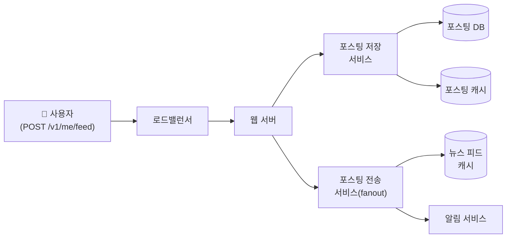
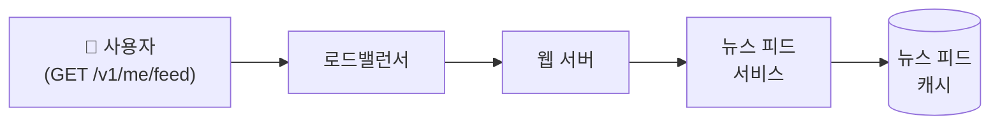
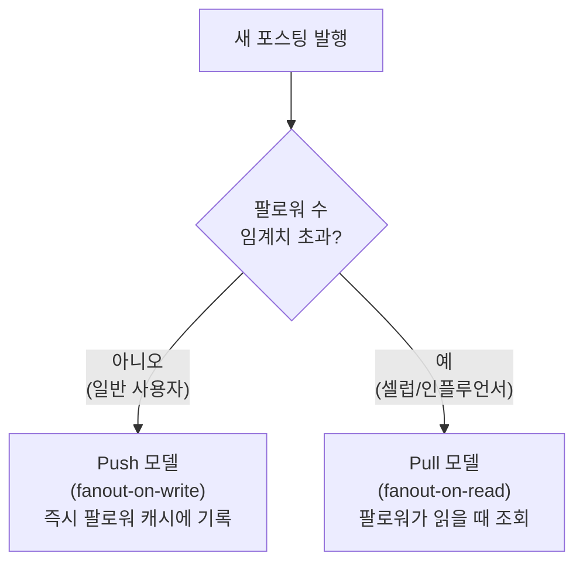
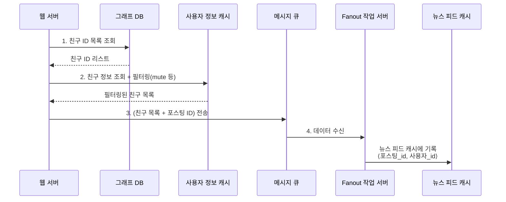
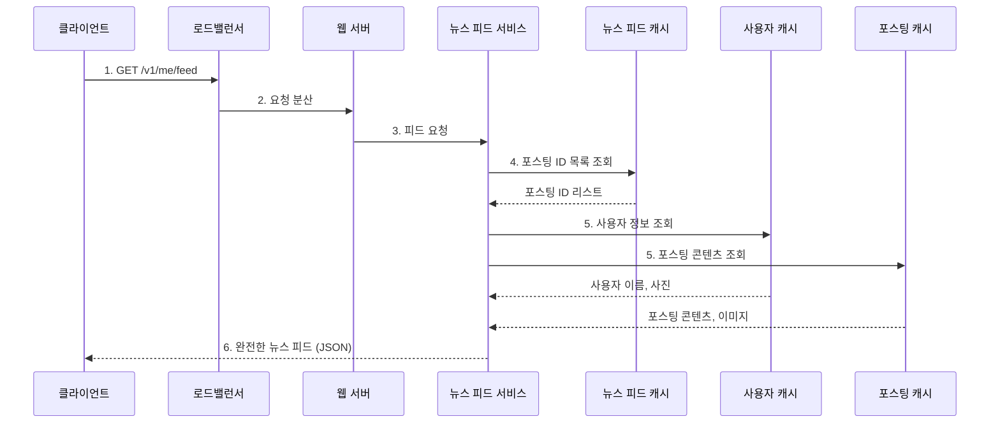
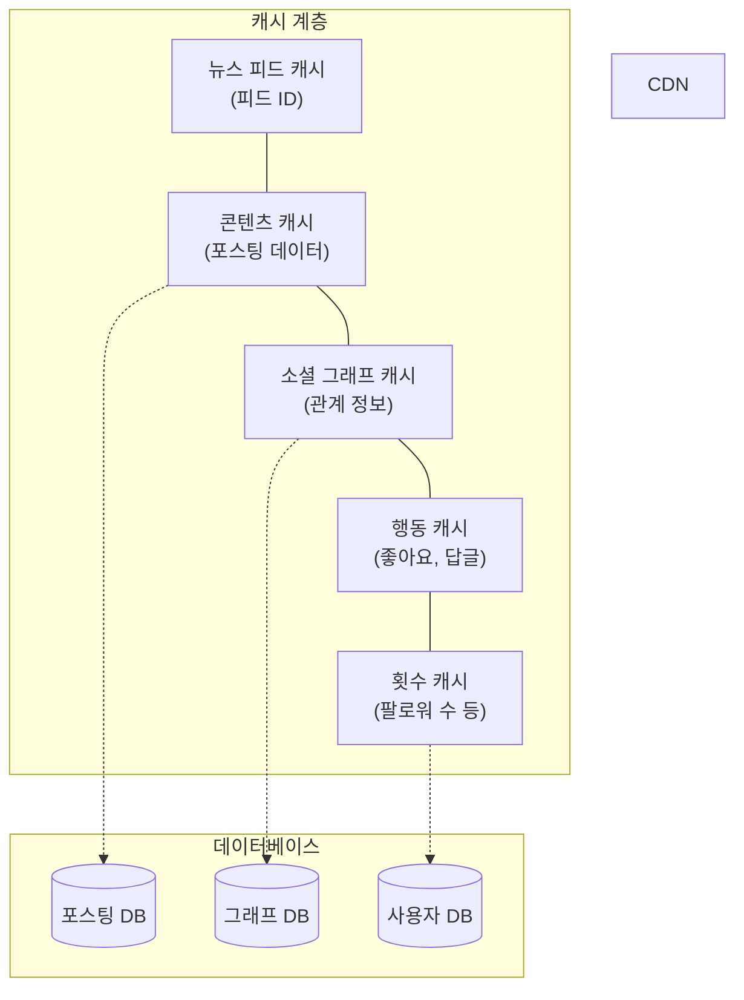

# 뉴스 피드 시스템 설계

## 목차
1. [뉴스 피드란?](#뉴스-피드란)
2. [1단계: 문제 이해 및 설계 범위 확정](#1단계-문제-이해-및-설계-범위-확정)
3. [2단계: 개략적 설계안 제시 및 동의 구하기](#2단계-개략적-설계안-제시-및-동의-구하기)
4. [3단계: 상세 설계](#3단계-상세-설계)
5. [4단계: 마무리](#4단계-마무리)

<br />
<br />

## 뉴스 피드란?

뉴스 피드(news feed)란 홈 페이지 중앙에 지속적으로 업데이트되는 스토리들로, 사용자 상태 정보 업데이트, 사진, 비디오, 링크, 앱 활동(app activity), 그리고 팔로우하는 사람들, 페이지, 그룹으로부터 나오는 '좋아요(likes)' 등을 포함한다.

> 비슷한 유형의 면접 문제: "페이스북 뉴스 피드 설계", "인스타그램 피드 설계", "트위터 타임라인 설계"

<br />
<br />

## 1단계: 문제 이해 및 설계 범위 확정

가장 먼저 해야 할 일은 면접관의 의도를 질문을 통해 알아내는 것이다. 최소한 어떤 기능을 지원해야 할지는 반드시 파악해야 한다.

### 질문과 답변 사례

| 질문 | 답변 |
|------|------|
| 모바일 앱을 위한 시스템인가? 아니면 웹? 둘 다? | 둘 다 지원해야 한다. |
| 중요한 기능으로는 어떤 것이 있을까요? | 사용자는 뉴스 피드 페이지에 새로운 스토리를 올릴 수 있어야 하고, 친구들이 올리는 스토리를 볼 수도 있어야 한다. |
| 뉴스 피드에는 어떤 순서로 스토리가 표시되어야 하나요? | 시간 흐름 역순(reverse chronological order)으로 표시된다고 가정한다. |
| 한 명의 사용자는 최대 몇 명의 친구를 가질 수 있습니까? | 5,000명 |
| 트래픽 규모는 어느 정도입니까? | 매일 천만 명이 방문한다고 가정한다(10million DAU). |
| 피드에 이미지나 비디오 스토리도 올라올 수 있습니까? | 스토리에는 이미지나 비디오 등의 미디어 파일이 포함될 수 있습니다. |

<br />
<br />

## 2단계: 개략적 설계안 제시 및 동의 구하기

설계안은 크게 두 가지 부분으로 나뉜다.

1. **피드 발행(feed publishing)**: 사용자가 스토리를 포스팅하면 해당 데이터를 캐시와 데이터베이스에 기록한다. 새 포스팅은 친구의 뉴스 피드에도 전송된다.
2. **뉴스 피드 생성(news feed building)**: 지면 관계상 뉴스 피드는 모든 친구의 포스팅을 시간 흐름 역순으로 모아서 만든다고 가정한다.

<br />

### 뉴스 피드 API

뉴스 피드 API는 클라이언트가 서버와 통신하기 위해 사용하는 수단이다. HTTP 프로토콜 기반이고, 상태 정보를 업데이트하거나, 뉴스 피드를 가져오거나, 친구를 추가하는 등의 다양한 작업을 수행하는 데 사용한다.

#### 피드 발행 API

새 스토리를 포스팅하기 위한 API이다. HTTP POST 형태로 요청을 보내면 된다.

```
POST /v1/me/feed
```

**인자:**
- **바디(body)**: 포스팅 내용에 해당한다.
- **Authorization 헤더**: API 호출을 인증하기 위해 사용한다.

#### 피드 읽기 API

뉴스 피드를 가져오는 API이다.

```
GET /v1/me/feed
```

**인자:**
- **Authorization 헤더**: API 호출을 인증하기 위해 사용한다.

<br />

### 피드 발행

피드 발행 시스템의 개략적 형태는 다음과 같다.

- **사용자**: 모바일 앱이나 브라우저에서 새 포스팅을 올리는 주체다. `POST /v1/me/feed` API를 사용한다.
- **로드밸런서(load balancer)**: 트래픽을 웹 서버들로 분산한다.
- **웹 서버**: HTTP 요청을 내부 서비스로 중계하는 역할을 담당한다.
- **포스팅 저장 서비스(post service)**: 새 포스팅을 데이터베이스와 캐시에 저장한다.
- **포스팅 전송 서비스(fanout service)**: 새 포스팅을 친구의 뉴스 피드에 푸시(push)한다. 뉴스 피드 데이터는 캐시에 보관하여 빠르게 읽어갈 수 있도록 한다.
- **알림 서비스(notification service)**: 친구들에게 새 포스팅이 올라왔음을 알리거나, 푸시 알림을 보내는 역할을 담당한다.



<br />

### 뉴스 피드 생성

사용자가 보는 뉴스 피드가 어떻게 만들어지는지 살펴보자.

- **사용자**: 뉴스 피드를 읽는 주체다. `GET /v1/me/feed` API를 사용한다.
- **로드밸런서**: 트래픽을 웹 서버들로 분산한다.
- **웹 서버**: 트래픽을 뉴스 피드 서비스로 보낸다.
- **뉴스 피드 서비스(news feed service)**: 캐시에서 뉴스 피드를 가져오는 서비스다.
- **뉴스 피드 캐시(news feed cache)**: 뉴스 피드를 렌더링할 때 필요한 피드 ID를 보관한다.



<br />
<br />

## 3단계: 상세 설계

### 피드 발행 흐름 상세 설계

#### 웹 서버

클라이언트와 통신할 뿐 아니라 **인증**이나 **처리율 제한** 등의 기능도 수행한다.
- 올바른 인증 토큰을 Authorization 헤더에 넣고 API를 호출하는 사용자만 포스팅을 할 수 있어야 한다.
- 스팸을 막고 유해한 콘텐츠가 자주 올라오는 것을 방지하기 위해 특정 기간 동안 한 사용자가 올릴 수 있는 포스팅의 수에 제한을 두어야 한다.

#### 포스팅 전송(fanout) 서비스

포스팅 전송, 즉 fanout은 **어떤 사용자의 새 포스팅을 그 사용자와 친구 관계에 있는 모든 사용자에게 전달하는 과정**이다. fanout 모델은 두 가지가 있다.

##### 1. 쓰기 시점에 fanout (fanout-on-write / push 모델)

새로운 포스팅을 기록하는 시점에 뉴스 피드를 갱신한다. 포스팅이 완료되면 바로 해당 사용자의 캐시에 해당 포스팅을 기록하는 것이다.

> 장점
- 뉴스 피드가 실시간으로 갱신되며, 친구 목록에 있는 사용자에게 즉시 전송된다.
- 새 포스팅이 기록되는 순간에 뉴스 피드가 이미 갱신되므로(pre-computed), **뉴스 피드를 읽는 데 드는 시간이 짧아진다.**

> 단점
- 친구가 많은 사용자의 경우 친구 목록을 가져오고, 그 목록에 있는 사용자 모두의 뉴스 피드를 갱신하는 데 많은 시간이 소요될 수 있다. **핫키(hotkey) 문제**라고 부른다.
- 서비스를 자주 이용하지 않는 사용자의 피드까지 갱신해야 하므로 컴퓨팅 자원이 낭비된다.

##### 2. 읽기 시점에 fanout (fanout-on-read / pull 모델)

피드를 읽어야 하는 시점에 뉴스 피드를 갱신한다. 요청 기반(on-demand) 모델이다. 사용자가 본인의 홈페이지나 타임라인을 로딩하는 시점에 새로운 포스팅을 가져오게 된다.

> 장점
- 비활성화된 사용자, 또는 서비스에 거의 로그인하지 않는 사용자의 경우에는 이 모델이 유리하다. 로그인하기 전까지는 컴퓨팅 자원을 소모하지 않으므로.
- 데이터를 친구 각각에게 푸시하는 작업이 필요 없으므로 핫키 문제도 생기지 않는다.

> 단점
- **뉴스 피드를 읽는 데 많은 시간이 소요될 수 있다.**

##### 하이브리드 모델

두 모델의 장점을 결합하는 방법이다.
- **대부분의 사용자**: push 모델을 사용하여 빠르게 뉴스 피드를 갱신한다.
- **팔로워가 아주 많은 사용자(셀럽 등)**: pull 모델을 사용하여, 해당 사용자의 포스팅은 팔로워가 피드를 읽을 때 가져가도록 한다. 이렇게 하면 핫키 문제를 방지할 수 있다.



<br />

#### fanout 서비스의 동작 흐름

1. 그래프 데이터베이스에서 친구 ID 목록을 가져온다.
2. 사용자 정보 캐시에서 친구들의 정보를 가져온다. 사용자 설정에 따라 친구 일부를 걸러낸다. (ex. 특정 친구를 mute한 경우, 해당 친구에게는 피드를 전송하지 않는다.)
3. 친구 목록과 새 스토리의 포스팅 ID를 메시지 큐에 넣는다.
4. fanout 작업 서버가 메시지 큐에서 데이터를 꺼내어 뉴스 피드 데이터를 뉴스 피드 캐시에 넣는다.
   - 뉴스 피드 캐시는 `<포스팅_id, 사용자_id>` 순서쌍을 보관하는 매핑 테이블이다.
   - 메모리 크기를 적정 수준으로 유지하기 위해 캐시 크기에 제한을 두어야 한다. 대부분의 사용자가 최신 스토리에만 관심이 있으므로 캐시 미스가 일어날 확률은 낮다.



<br />

### 피드 읽기 흐름 상세 설계

1. 사용자가 뉴스 피드를 읽으려는 요청을 보낸다.
2. 로드밸런서가 요청을 웹 서버 가운데 하나로 보낸다.
3. 웹 서버는 뉴스 피드 서비스를 호출하여 피드를 가져온다.
4. 뉴스 피드 서비스는 뉴스 피드 캐시에서 포스팅 ID 목록을 가져온다.
5. 뉴스 피드에 표시할 사용자 이름, 사용자 사진, 포스팅 콘텐츠, 이미지 등을 사용자 캐시와 포스팅 캐시에서 가져와 완전한 뉴스 피드를 만든다.
6. 생성된 뉴스 피드를 JSON 형태로 클라이언트에게 보낸다. 클라이언트는 해당 피드를 렌더링한다.



<br />

### 캐시 구조

캐시는 뉴스 피드 시스템의 핵심 컴포넌트이다. 5개 계층으로 나눌 수 있다.

| 계층 | 용도 |
|------|------|
| **뉴스 피드 캐시** | 뉴스 피드의 ID를 보관한다. |
| **콘텐츠 캐시** | 포스팅 데이터를 보관한다. 인기 콘텐츠는 따로 보관한다. |
| **소셜 그래프 캐시** | 사용자 간의 관계 정보를 보관한다. |
| **행동(action) 캐시** | 포스팅에 대한 좋아요, 답글 수 등의 정보를 보관한다. |
| **횟수(counter) 캐시** | 좋아요 횟수, 응답 수, 팔로워 수, 팔로잉 수 등의 정보를 보관한다. |



<br />
<br />

## 4단계: 마무리

이번 장에서는 뉴스 피드 시스템을 설계해 보았다. 설계안은 피드 발행과 뉴스 피드 읽기의 두 가지 흐름으로 나누어 살펴보았다.

면접관과 추가로 논의해볼 수 있는 주제들:

- **데이터베이스 규모 확장**
  - 수직적 규모 확장 vs 수평적 규모 확장
  - SQL vs NoSQL
  - 주-부(master-slave) 다중화
  - 복제본(replica)에 대한 읽기 연산
  - 일관성 모델
  - 데이터베이스 샤딩

- **그 외 논의해볼 주제들**
  - 웹 계층을 무상태(stateless)로 운영하기
  - 가능한 한 많은 데이터를 캐시할 방법
  - 여러 데이터 센터를 지원할 방법
  - 메시지 큐를 사용하여 컴포넌트 사이의 결합도 낮추기
  - 핵심 메트릭에 대한 모니터링 (ex. 트래픽이 몰리는 시간대의 QPS, 사용자가 뉴스 피드를 새로고침할 때의 지연시간 등)
