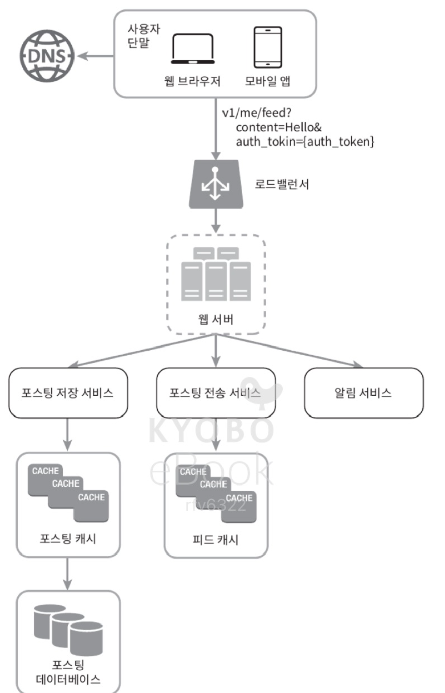
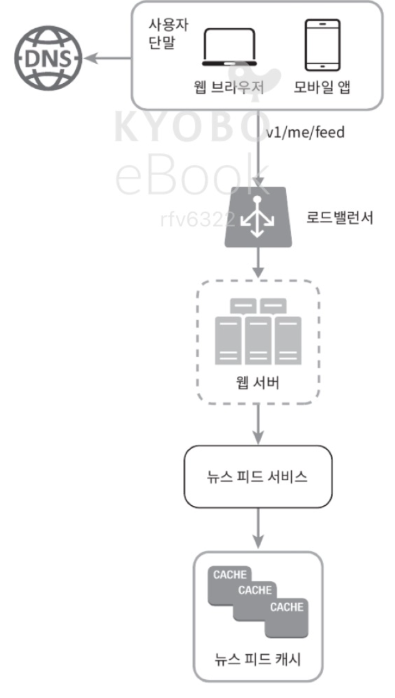
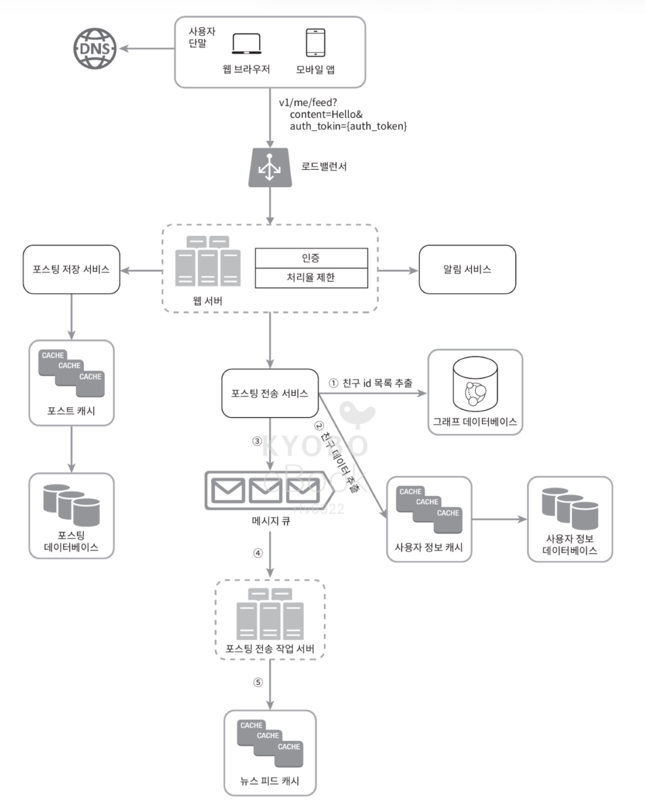
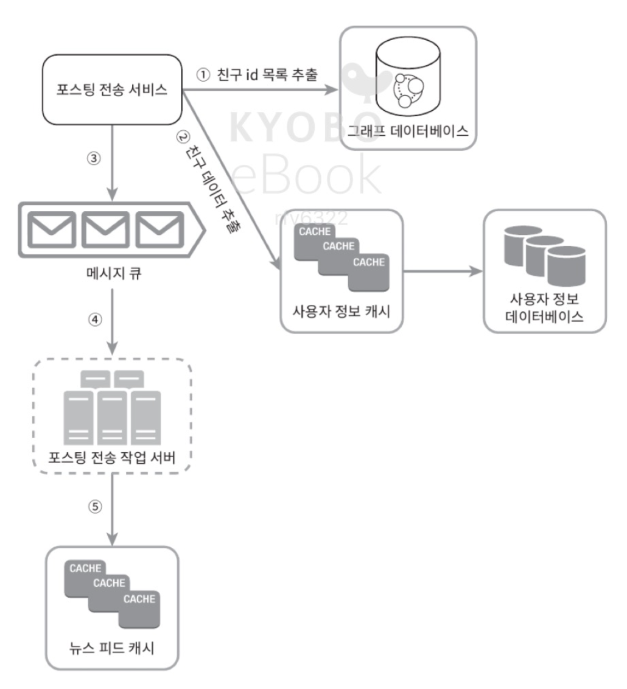
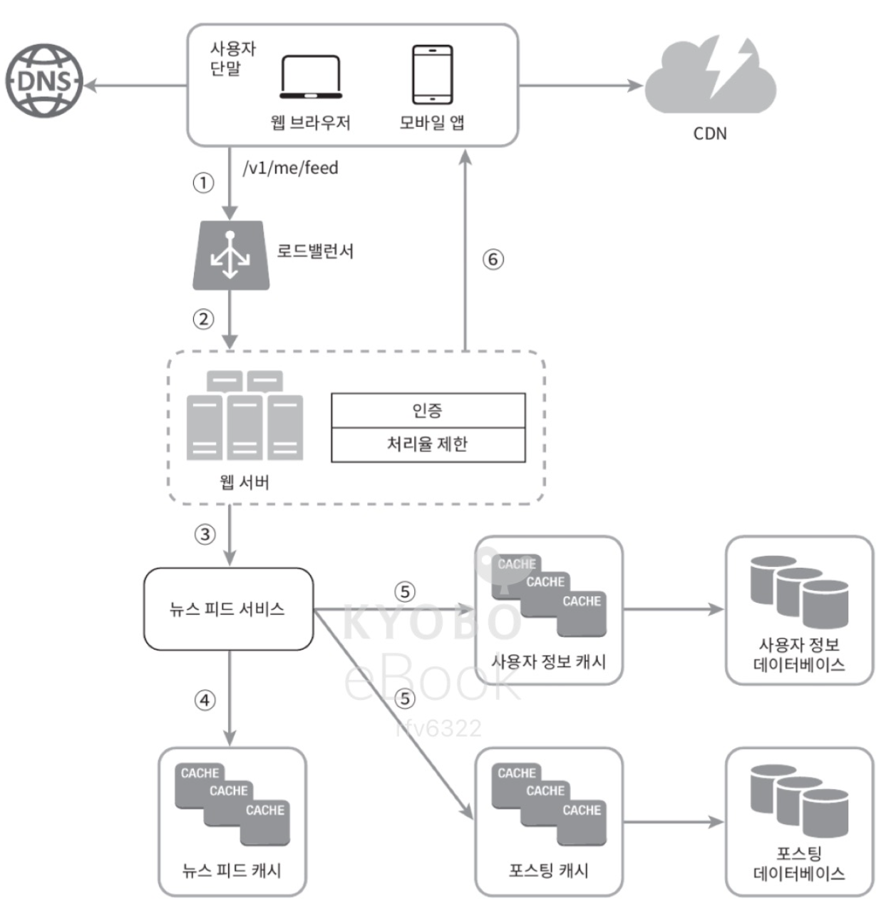
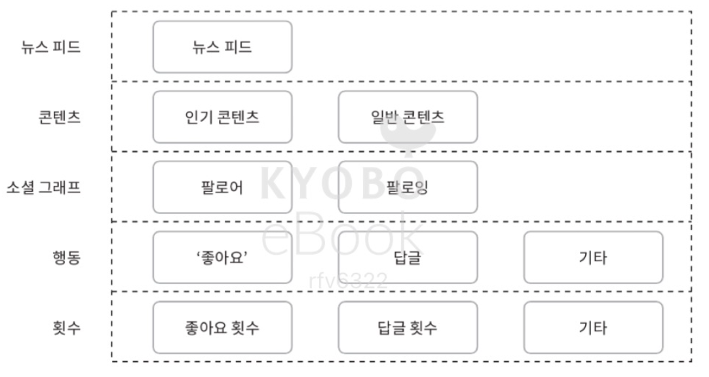

# 11. 뉴스 피드 시스템 설계
- 뉴스 피드란? 
    - 홈 페이지 중앙에 지속적으로 업데이트되는 스토리들로, 사용자 상태 정보 업데이트, 사진, 비디오, 링크, 앱 활동, 페이스북에서 팔로하는 사람들, 페이지, 좋아요 등을 포함 (페이스북)
    - 유사 유형 문제: 페이스북 뉴스 피드 설계, 인스타그램 피드 설계, 트위터 타임라인 설계 등
### 1. 문제 이해 및 설계 범위 확정
- 면접관과의 대화를 통해 파악한 요구사항
    - 모바일 앱, 웹 둘 다 지원해야 함
    - 기능: 
        - 뉴스 피드 페이지에 새로운 스토리 올리기
        - 친구들이 올리는 스토리 보기
    - 뉴스 피드에 스토리가 표시되는 순서: 
        1. 최신 포스트가 위에 오도록 -> 채택: 시간 흐름 역순
        2. 토픽 점수(topic score) 등의 기준
            - 예: 가까운 친구의 포스트는 좀 더 위에 배치
    - 한 명의 사용자는 최대 5000명의 친구를 가질 수 있음
    - 트래픽 규모: 매일 천만 명 방문
    - 이미지, 비디오 등의 미디어 파일이 스토리에 포함될 수 있음
### 2. 개략적 설계안 제시 및 동의 구하기
- 피드 발행 (feed publishing)
    - 사용자가 스토리를 포스팅 -> 해당 데이터를 캐시와 데이터베이스에 기록. 새 포스팅은 친구의 뉴스 피드에 전송됨
- 뉴스 피드 생성(news feed building)
    - 위 내용 상, 뉴스 피드는 모든 친구의 포스팅을 시간 흐름 역순으로 모아서 만든다고 가정
- 뉴스 피드 API
    - 클라이언트가 서버와 통신하기 위해 사용하는 수단
    - HTTP 프로토콜 기반
    - 상태 정보 업데이트, 뉴스 피드 가져오기, 친구 추가 등의 작업 수행에 사용됨
    - 피드 발행 API
        - 새 스토리 포스팅을 위한 API
        - HTTP POST 형태로 요청 전송
            - POST /v1/me/feed
            - 인자:
                - body: 포스팅 내용에 해당
                - Authorization 헤더: API 호출을 인증하기 위해 사용
    - 피드 읽기 API
        - 뉴스 피드를 가져오는 API
            - GET /v1/me/feed
            - 인자:
                - Authorization 헤더: API 호출을 인증하기 위해 사용
    - 피드 발행
        - 
        - 사용자: 모바일 앱이나 브라우저에서 새 포스팅을 올리는 주체. POST /v1/me/feed API를 사용
        - 로드밸런서: 트래픽을 웹 서버들로 분산
        - 웹 서버: HTTP 요청을 내부 서비스로 중계하는 역할 담당
        - 포스팅 저장 서비스(post service): 새 포스팅을 데이터베이스와 캐시에 저장
        - 포스팅 전송 서비스(fanout service): 새 포스팅을 친구의 뉴스 피드에 푸시. 뉴스 피트 데이터는 캐시에 보관하여 빠르게 읽어갈 수 있도록 함.
        - 알림 서비스(notification service): 친구들에게 새 포스팅이 올라왔음을 알리거나 푸시 알림을 보내는 역할
    - 뉴스 피드 생성
        - 
        - 사용자: 뉴스 피드를 읽는 주체. GET /v1/me/feed API 이용
        - 로드 밸런서: 트래픽을 웹 서버들로 분산
        - 웹 서버: 트래픽을 뉴스 피드 서비스로 보냄
        - 뉴스 피드 서비스: 캐시에서 뉴스 피드를 가져오는 서비스
        - 뉴스 피드 캐시: 뉴스 피드를 렌더링할 때 필요한 피드 ID를 보관
### 3. 상세 설계
- 피드 발행 흐름 상세 설계
  - 
  - 웹 서버
    - 클라이언트와 통신, 인증, 처리율 제한 기능 수행
    - 올바른 인증 토큰을 Authorization 헤더에 넣고 API를 호출하는 사용자만 포스팅 가능해야 함
    - 특정 기간 동안 한 사용자가 올릴 수 있는 포스팅 수에 제한 필요
      - 스팸, 유해한 콘텐츠 빈도를 위함
  - 포스팅 전송(팬아웃) 서비스
    - 어떤 사용자의 새 포스팅을 그 사용자와 친구 관계에 있는 모든 사용자에게 전달하는 과정
    - 쓰기 시점에 팬아웃(fanout-on-write) 모델 (= push 모델)
      - 새로운 포스팅 기록 시점에 뉴스 피드 갱신
      - 즉, 포스팅이 완료되면 바로 해당 사용자의 캐시에 해당 포스팅을 기록
      - 장점
        - 뉴스 피드가 실시간으로 갱신되며, 친구 목록에 있는 사용자에게 즉시 전송됨
        - 새 포스팅이 기록되는 순간에 뉴스 피드가 이미 갱신됨 (pre-computed) -> 뉴스 피드를 읽는 데 드는 시간이 짧아짐
      - 단점
        - 친구가 많은 사용자의 경우, 친구 목록을 가져오고 그 목록에 있는 사용자 모두의 뉴스 피드를 갱신하는 데 많은 시간이 소요될 수 있음 (핫키 문제)
        - 서비스를 자주 이용하지 않는 사용자의 피드까지 갱신해야 함 -> 컴퓨팅 자원 낭비
    - 읽기 시점에 팬아웃(fanout-on-read) 모델 (= pull 모델)
      - 피드를 읽어야 하는 시점에 뉴스 피드 갱신
      - 요청 기반(on-demand) 모델
      - 장점
        - 로그인하기 전까지는 어떤 컴퓨팅 자원도 소모하지 않기 때문에, 비활성화된 사용자, 서비스에 거의 로그인하지 않는 사용자의 경우 이 모델이 유리
        - 데이터를 친구 각각에 푸시하는 작업 필요 없음 -> 핫키 문제 발생 x
      - 단점
        - 뉴스 피드를 읽는 데 많은 시간 소요
    - 이번 설계안에서는 두 방법을 결합:
      - 대부분의 사용자에 대해서는 푸시 모델을 이용: 뉴스 피드를 빠르게 가져오는 것 중요하기 때문
      - 친구나 팔로워가 많은 사용자는 풀 모델을 이용: 팔로워가 해당 사용자의 포스팅을 필요할 때 가져가도록 함 -> 시스템 과부하 방지
      - 안정 해시(consistent hashing)를 통해 요청과 데이터를 보다 고르게 분산 -> 핫키 문제를 줄임
      - 팬 아웃 서비스 설계만 좀 자세히 봐보자 (동작 과정)
      - 
      1. 그래프 데이터베이스에서 친구 ID 목록을 가져옴
         1. 그래프 데이터베이스는 친구 관계, 친구 추천을 관리하기 적합
      2. 사용자 정보 캐시에서 친구들의 정보를 가져옴 -> 사용자 설정에 따라 친구 가운데 일부를 걸러냄
         1. 친구 중 누군가의 피드 업데이트를 무시하기로 설정했다면(mute), 친구 관계는 유지되지만, 그 사용자의 스토리는 나의 뉴스 피드에 보이지 않아야 함
            1. 새로 포스팅된 스토리가 일부 사용자에게만 공유되도록 설정된 경우에도 비슷한 일 발생
      3. 친구 목록과 새 스토리의 포스팅 ID를 메시지 큐에 넣음
      4. 팬아웃 작업 서버가 메시지 큐에서 데이터를 꺼내서 뉴스 피드 데이터를 뉴스 피드 캐시에 넣음
         - 뉴스 피드 캐시: <포스팅 ID, 사용자 ID> 순서쌍을 보관하는 매핑 테이블
         - 새로운 포스팅이 만들어질 때마다 뉴스 피드 캐시에 post_id, user_id라는 레코드가 추가됨
         - 메모리 요구량이 지나치게 늘어나지 않도록, 사용자 정보와 포스팅 정보 전부를 이 테이블에 저장하지는 않음
         - 메모리 크기를 적정 수준으로 유지하기 위해, 이 캐시 크기에 제한을 두며, 제한 값은 조정이 가능하도록 함
           - 어떤 사용자가 뉴스 피드에 올라온 수많은 스토리를 전부 훑어보는 일은 잘 일어나지 않음
           - 대부분의 사용자가 보려는 것은 최신 스토리
           - -> 캐시 미스가 일어날 확률이 낮음
- 피드 읽기 흐름 상세 설계
  - 
  - 이미지, 비디오 등 미디어 콘텐츠는 CDN에 저장하여 빨리 읽어갈 수 있도록 함
  - 클라이언트가 뉴스 피드를 읽어가는 과정
    1. 사용자가 뉴스 피드를 읽으려는 요청을 보냄 (/v1/me/feed)
    2. 로드밸런서가 요청을 웹 서버 가운데 하나로 보냄
    3. 웹 서버는 피드를 가져오기 위해 뉴스 피드 서비스를 호출
    4. 뉴스 피드 서비스는 뉴스 피드 캐시에서 포스팅 ID 목록을 가져옴
    5. 뉴스 피드에 표시할 사용자 이름, 사용자 사진, 포스팅 콘텐츠, 이미지 등을 사용자 캐시와 포스팅 캐시에서 가져와 완전한 뉴스 피드를 만듦
    6. 생성된 뉴스 피드를 JSON 형태로 클라이언트에게 보냄 -> 클라이언트가 해당 피드를 렌더링
  - 캐시 구조
    - 
    - 이 설계안에서는 캐시를 다섯 계층으로 나눔
      - 뉴스 피드: 뉴스 피드의 ID를 보관
      - 콘텐츠: 포스팅 데이터를 보관, 인기 콘텐츠는 따로 보관
      - 소셜 그래프: 사용자 간 관계 정보 보관
      - 행동(action): 포스팅에 대한 사용자의 행위에 관한 정보 보관. (좋아요, 답글 등)
      - 횟수(counter): 좋아요 횟수, 응답 수, 팔로워 수, 팔로잉 수 등의 정보 보관
### 4. 마무리
- 시스템 설계 시 회사마다의 제약, 요구조건을 고려해야 함
- 설계 진행, 기술 선택 시 그 배경에 어떤 타협적 결정(trade-off)이 있었는지 설명할 수 있어야 함
- 설계 이후 시간이 남는다면 규모 확장성 이슈를 논의하는 것도 좋음
- 데이터베이스 규모 확장
  - 수직적 규모 확장 vs 수평적 규모 확장
  - SQL vs NoSQL
  - 주-부(master-slave) 다중화
  - 복제본(replica)에 대한 읽기 연산
  - 일관성 모델(consistency model)
  - 데이터베이스 샤딩(sharding)
- 웹 계층(web tier)을 무상태로 운영하기
- 가능한 많은 데이터를 캐시할 방법
- 여러 데이터 센터를 지원할 방법
- 메시지 큐를 사용하여 컴포넌트 사이의 결합도 낮추기
- 핵심 메트릭(key metric)에 대한 모니터링
  - 예: 트래픽이 몰리는 시간대의 QPS(Queries per Second), 사용자가 뉴스 피드를 새로고침(refresh)할 때의 지연시간 등