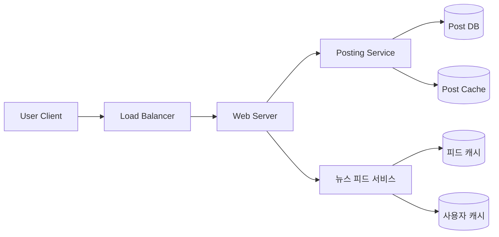
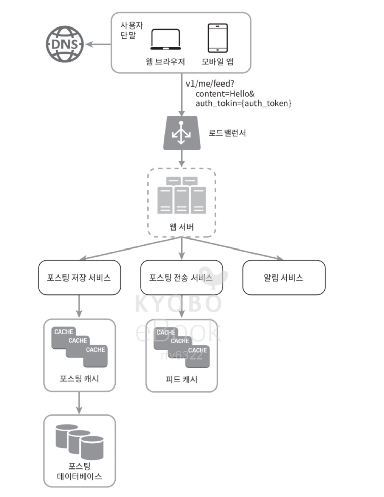
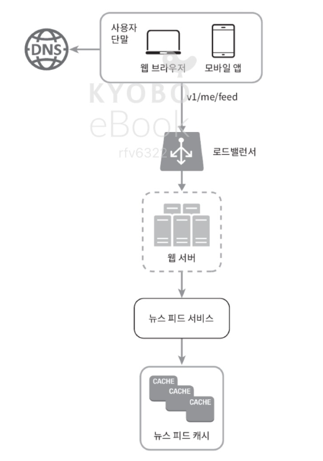
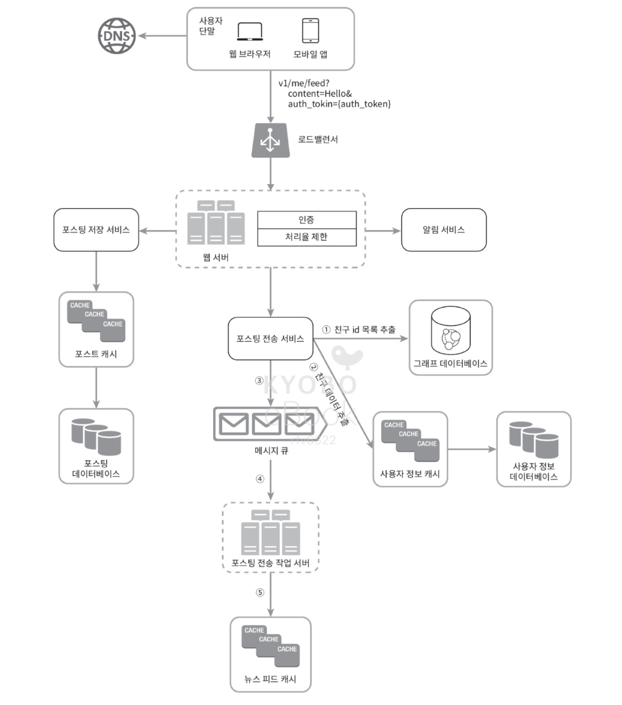
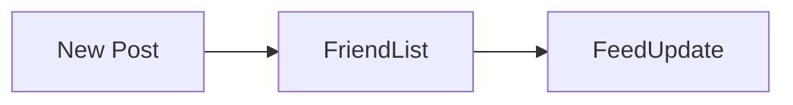
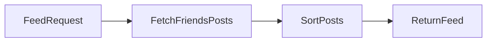
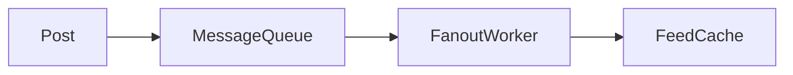
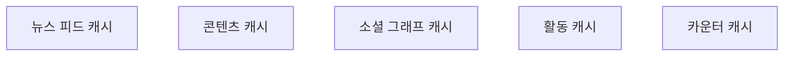

# 뉴스 피드 시스템 설계

뉴스 피드 시스템은 사용자의 홈 화면에 친구 또는 팔로우한 사용자의 게시물(스토리)을 보여주는 시스템이다.

## 대표 서비스 예시

- Facebook News Feed
- Instagram Feed
- Twitter Timeline

뉴스 피드는 일반적으로 다음 콘텐츠를 포함한다.

- 텍스트 게시물
- 이미지 / 비디오
- 링크
- 좋아요 / 댓글 등 활동 정보

---

# 1. 문제 이해 및 설계 범위

## 1.1 기본 요구사항

뉴스 피드 시스템은 다음 두 가지 핵심 기능을 제공해야 한다.

### 피드 발행 (게시물 작성)

사용자는 새로운 게시물을 작성할 수 있어야 한다.

지원 콘텐츠

- 텍스트
- 이미지
- 비디오

게시물이 생성되면 친구들의 뉴스 피드에 반영되어야 한다.

### 피드 조회

사용자는 자신의 뉴스 피드를 조회할 수 있어야 한다.

피드 정렬 방식

- Reverse Chronological Order (최신 게시물 우선)

---

## 1.2 시스템 규모 가정

설계를 위한 가정

| 항목         | 값     |
| ------------ | ------ |
| DAU          | 천만명 |
| 최대 친구 수 | 5000   |

---

# 2. 전체 아키텍처

뉴스 피드 시스템은 두 가지 주요 흐름으로 구성된다.

1. 피드 발행
2. 피드 조회

---

## 2.1 전체 시스템 구조



---

# 3. 피드 발행 (게시물 작성)

## API

```
POST /v1/me/feed
```

요청 데이터

| 필드          | 설명        |
| ------------- | ----------- |
| body          | 게시물 내용 |
| Authorization | 인증 토큰   |

---

## 게시물 작성 흐름



---

## 주요 컴포넌트

### Posting Service

새 게시물을 저장한다.

저장 위치

- Cache
- Database

---

### Fanout Service

새 게시물을 친구들의 뉴스 피드로 전달한다.

```
내 게시물 → 친구들의 피드
```

---

### Notification Service

친구들에게 알림을 전송한다.

예

- "OO님이 새로운 게시물을 올렸습니다."

---

# 4. 피드 조회

## API

```
GET /v1/me/feed
```

---

## 피드 조회 흐름



---

## 뉴스 피드 구성 과정

1. 사용자가 피드 조회 요청
2. 로드 밸런서 → 웹 서버
3. 웹 서버 → 뉴스 피드 서비스
4. 피드 캐시에서 게시물 ID 조회
5. 게시물 정보 조회
6. JSON 응답 반환

---

# 5. Fanout 전략


게시물을 친구들에게 전달하는 방식은 두 가지 모델이 있다.

---

## Fanout-on-write (Push 모델)

게시물이 생성되는 순간 친구들의 피드에 반영된다.



### 장점

- 피드 조회 속도 빠름
- 미리 계산된 피드 사용

### 단점

- 친구가 많으면 쓰기 비용 증가
- 비활성 사용자 피드도 업데이트됨

---

## Fanout-on-read (Pull 모델)

피드를 읽는 시점에 생성한다.



### 장점

- 쓰기 비용 감소
- 비활성 사용자 처리 효율적

### 단점

- 피드 조회 속도 느림
- 매번 계산 필요

---

## 실제 서비스 전략

대부분 서비스는 하이브리드 전략을 사용한다.

| 사용자 유형        | 전략            |
| ------------------ | --------------- |
| 일반 사용자        | Fanout-on-write |
| 팔로워 많은 사용자 | Fanout-on-read  |

---

# 6. 메시지 큐

Fanout 작업은 비동기 처리된다. 게시 직후 모든 친구 피드를 즉시 갱신하면 API 응답이 길어지므로, **큐에 작업을 넣고 Fanout 전용 워커가 뒷단에서 처리**하는 패턴이 흔하다.



## Fanout 비동기 처리 단계

1. **소셜 그래프 조회**  
   그래프 DB(또는 그래프에 특화된 저장소)에서 **친구 ID 목록**을 가져온다. 친구 관계·추천처럼 **관계 중심 데이터**를 다루기에 적합한 계층이다.

2. **사용자 정보·설정 반영**  
   **사용자 정보 캐시** 등에서 친구 메타를 읽은 뒤, **mute(피드에서 숨김)**, **일부 공개 범위** 같은 설정에 따라 Fanout 대상을 **걸러낸다**. 친구 관계는 유지되어도, mute한 상대의 새 스토리는 내 피드에 넣지 않는 식이다.

3. **큐에 메시지 적재**  
   확정된 **친구 목록**과 **새 포스팅 ID**를 **메시지 큐**에 넣는다. Posting API는 여기까지 하고 응답을 끝낼 수 있다.

4. **Fanout 워커와 피드 캐시**  
   Fanout 워커가 큐에서 꺼내 **뉴스 피드 캐시**를 갱신한다. 피드 캐시는 **`(포스팅 ID, 사용자 ID)` 순서쌍**을 쌓아 두는 **매핑**에 가깝게 보면 된다. 새 포스팅이 생길 때마다 “어떤 유저의 피드에 어떤 글이 올라왔는지”만 기록한다.

### 피드 캐시에 본문을 넣지 않는 이유

- **사용자 정보·포스팅 전체**를 피드 캐시에 넣으면 메모리가 지나치게 커진다. 그래서 **ID만** 두고, 조회 시점에 **포스트 캐시·유저 캐시** 등에서 이어 붙인다.
- 캐시 **크기 상한**을 두고 조정 가능하게 해 두면, 오래된 스토리는 잘라 낼 수 있다. 대부분 사용자는 **최신 스토리** 위주로 보기 때문에, 합리적인 상한을 두어도 **캐시 미스**는 드물게 설계할 수 있다.

장점

- 시스템 결합도 감소
- 트래픽 폭주 대응
- 확장성 향상

---

# 7. 캐시 구조

뉴스 피드 시스템은 캐시 중심 구조로 설계된다.



---

## 캐시 유형

| 캐시             | 역할                |
| ---------------- | ------------------- |
| 뉴스 피드 캐시   | 사용자 피드 저장    |
| 콘텐츠 캐시      | 게시물 데이터 저장  |
| 소셜 그래프 캐시 | 친구 관계 정보      |
| 활동 캐시        | 좋아요 / 댓글       |
| 카운터 캐시      | 좋아요 수 / 댓글 수 |

---

# 8. CDN

이미지와 비디오는 CDN에 저장한다.

장점

- 빠른 콘텐츠 전달
- 서버 부하 감소

---
