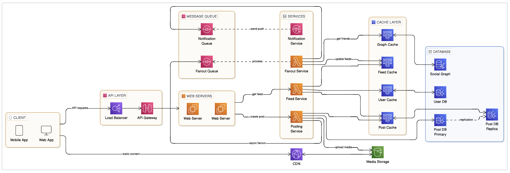

# 뉴스 피드 시스템 — AWS 아키텍처 설명

---

## 정적 경로만 따로 뺀 이유

모바일·웹 클라이언트가 썸네일·원본 영상을 받는 경로는 **CloudFront → S3** 로, 동적 API와 물리적으로 분리된다. 본문에서는 CDN의 일반적인 이점만 다루고, 도식은 **객체 저장(S3) + 엣지 캐시(CloudFront)** 조합으로 그려진 예시다. API 서버가 대용량 바이너리를 직접 스트리밍하지 않으면, 타임아웃·스케일 정책을 게시/피드 API에만 맞추기 쉽다.

---

## API Gateway가 끼어 드는 지점

**ELB 뒤에 API Gateway**를 두는 형태는, 인증·요청 변환·사용자별 스로틀을 웹 서버 앞단에서 묶기 위한 흔한 패턴이다. 이후 **EC2 웹 서버**가 **Posting / Feed** 등으로 라우팅하고, 도식의 **Lambda** 는 해당 비즈니스 로직을 **컴퓨트 단위**로 나눈 것으로 보면 된다(같은 역할을 ECS 등으로 대체해도 구조 설명은 동일).

---

## SQS 두 개가 의미하는 결합 분리

| 큐                     | 끊어 주는 것                                            |
| ---------------------- | ------------------------------------------------------- |
| **Fanout Queue**       | 게시 확정과, 친구·팔로워 **피드 캐시 갱신** 작업의 사이 |
| **Notification Queue** | 피드 데이터 반영과 **푸시·알림 발송** 파이프라인의 사이 |

한 큐로 합치면 구현은 단순해지지만, Fanout 지연이 푸시 SLA를 잡아먹거나 반대 현상이 날 수 있다. 도식은 **실패 도메인·튜닝 단위**를 나눈 형태로 읽으면 된다.

---

## Replica가 Post에만 강조된 이유

Post 저장소에 **Primary + Replica** 가 붙어 있는 것은, 피드 조회·백필이 읽기 위주일 때 **쓰기 마스터**를 보호하려는 전형적인 배치다. 소셜 그래프·유저 DB는 박스만 있고 Replica가 없을 수도 있으며, 읽기 패턴에 따라 추가한다.

---

## 도식상 세 가지 주요 동작 (요약)

1. **피드 발행(게시)**  
   Posting이 S3·Post DB(쓰기 Primary)·Post 캐시를 갱신한 뒤, Fanout은 **즉시 동기**로 끝내지 않고 큐에 넣어 API 응답 시간을 짧게 유지한다.

2. **피드 구성(Fanout)**  
   Fanout 워커가 Graph 캐시(필요 시 소셜 그래프 DB)로 친구를 찾아, 각자의 **Feed 캐시**를 갱신한다. “언제 미리 채울지” 같은 Pull/Push·하이브리드 논의는 본문 5절 표에 맡긴다.

3. **피드 조회**  
   Feed 서비스가 **Feed 캐시**를 중심으로 읽고, 본문·유저 정보는 Post/User 캐시와 **Replica** 등 읽기 경로를 섞어 쓴다.

---

## 캐시·DB

- **ElastiCache(그래프·피드·유저·포스트)**  
  핫 데이터를 모아 RDS 왕복을 줄인다.
- **RDS(Aurora 등)**  
  그래프·유저·포스트의 **영속 저장**; Post는 쓰기 **Primary**와 읽기 **Replica**를 도식에서 분리해 표시한다.
