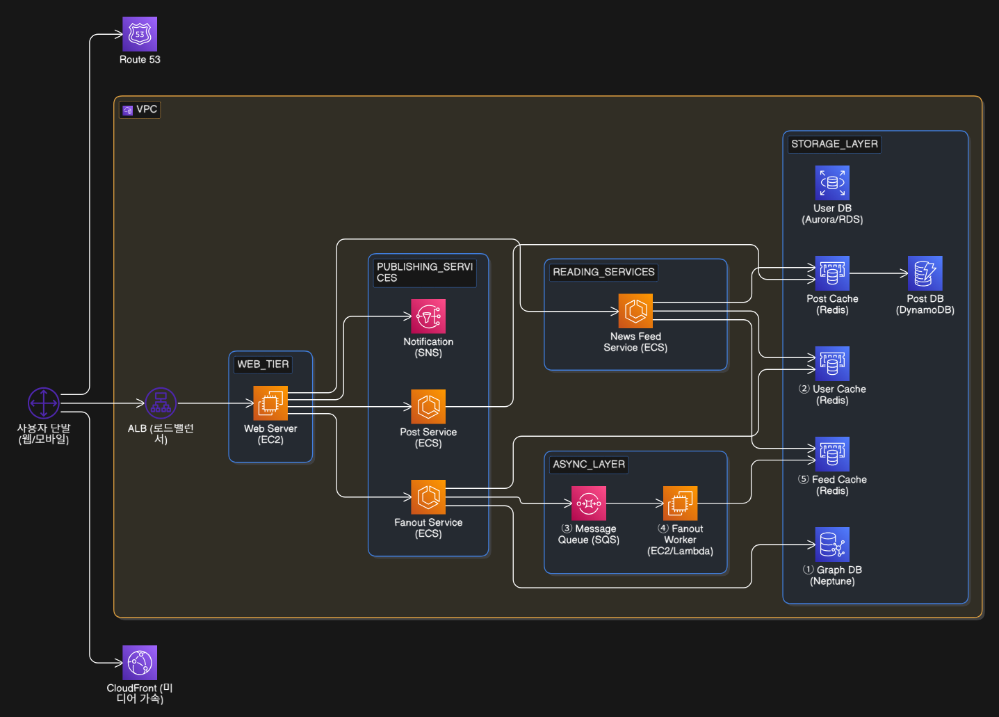

# 뉴스 피드 시스템 설계

## 1. 문제 이해 및 설계 범위 확정

### 요구사항 
- 플랫폼 지원: 모바일 앱과 웹 모두 지원
- 주요 기능: 사용자는 새로운 스토리를 올릴 수 있고, 친구들의 스토리를 볼 수 있어야 함
- 정렬 순서: 단순히 시간 흐름 역순으로 표시
- 미디어 지원: 이미지 및 비디오 등의 미디어 파일 포함 가능

### 시스템 규모
- 최대 친구 수: 인당 최대 5,000명
- 트래픽: 일일 활성 사용자(DAU) 1,000만 명

## 2. 개략적 설계안

### 주요 API

- 피드 발행 API
  - `POST /v1/me/feed`
  - 새 스토리를 포스팅하기 위한 API 
- 피드 읽기 API
  - `GET /v1/me/feed`
  - 뉴스 피드를 가져오는 API
- 모든 API 호출은 인증을 위해 Authorization 헤더를 포함

## 3. 상세 설계: 포스팅 전송(팬아웃) 서비스

### 팬아웃 모델 비교

- 쓰기 시점 팬아웃 (Push)
  - 포스팅 시점에 뉴스 피드 갱신
  - 실시간 갱신, 읽기 시간 단축
  - 친구가 많은 사용자(Hotkeys) 처리 부담 
- 읽기 시점 팬아웃 (Pull)
  - 피드 읽기 시점에 갱신 (On-demand)
  - 비활성 사용자 자원 절약, 핫키 문제 없음
  - 뉴스 피드 읽기 시간이 길어짐 
- 대부분의 사용자는 **push 모델**을 사용하되, 팔로워가 많은 유명인의 경우 **pull 모델**을 혼합하여 시스템 과부하를 방지

### 팬아웃 서비스 동작 순서 

1. 그래프 DB에서 친구 ID 목록을 가져옴
2. 사용자 설정을 확인하여 무시(mute)한 친구 등을 필터링
3. 친구 목록과 포스팅 ID를 메시지 큐에 투입.
4. 팬아웃 작업 서버가 데이터를 꺼내 뉴스 피드 캐시에 `<포스팅 ID, 사용자 ID>` 쌍을 저장

## 4. 캐시 구조 

- 뉴스 피드: 뉴스 피드의 ID 보관
- 콘텐츠: 포스팅 데이터 보관 (인기 콘텐츠는 별도 관리)
- 소셜 그래프: 사용자 간 관계 정보 보관
- 행동(Action): '좋아요', 답글 등의 정보 보관
- 횟수(Counter): 좋아요 수, 응답 수, 팔로워 수 등 보관

## 5. 마무리 및 확장성 논의 
- DB 규모 확장: 샤딩(Sharding), Master-Slave 복제
- 무상태 운영: 웹 계층을 무상태(Stateless)로 유지
- 모니터링: 트래픽 피크 시간대 QPS 및 새로고침 지연시간 확인

## 아키텍처 설계

- Amazon Route 53: 도메인 주소를 시스템 ip와 연결
- Amazon CloudFront: 이미지 및 비디오 등 미디어 콘텐츠 빠르게 전송
- Application Load Balancer: 트래픽을 분산
- Amazon EC2: 인증 및 처리율 제한 
- Amazon ECS: 뉴스 피드 및 포스팅 저장 서비스 
- Amazon SQS: 대량의 피드 전송 작업을 비동기 큐에 넣어 서버 부하 방지
- Amazon Neptune: 친구 관계 및 추천 관리에 적합한 그래프 데이터베이스 
- Amazon ElastiCache: 뉴스 피드 id 목록과 포스팅 콘텐츠를 캐싱
- Amazon DynamoDB: 방대한 양의 포스팅 데이터 저장
- Amazon RDS: 사용자 프로필과 같은 정형 데이터
- Amazon SNS: 포스팅 푸쉬 알림

