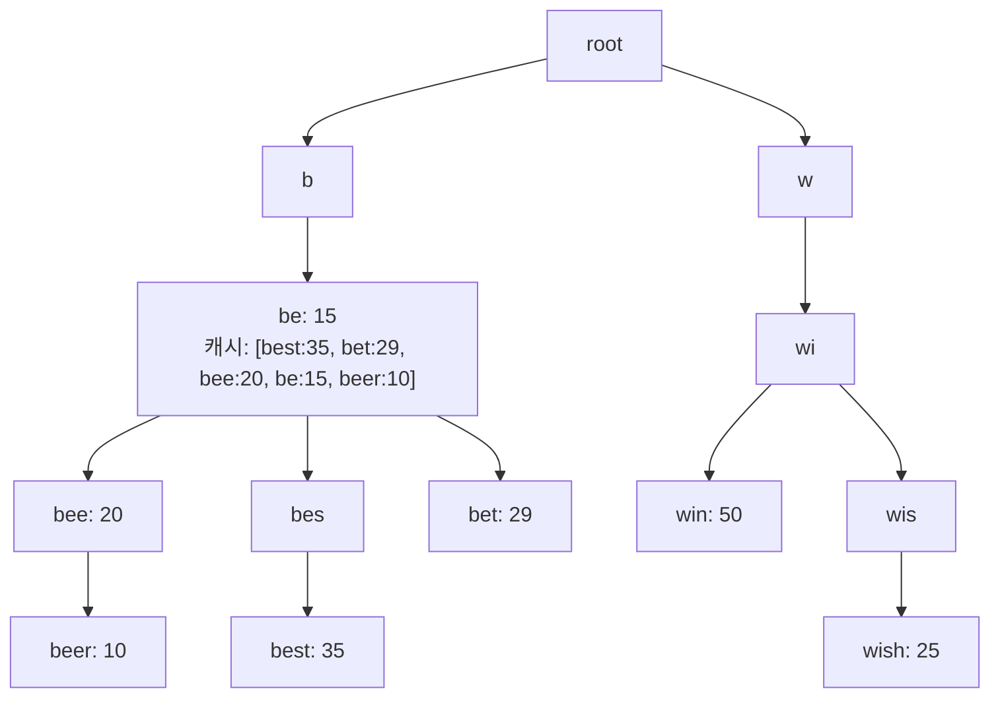
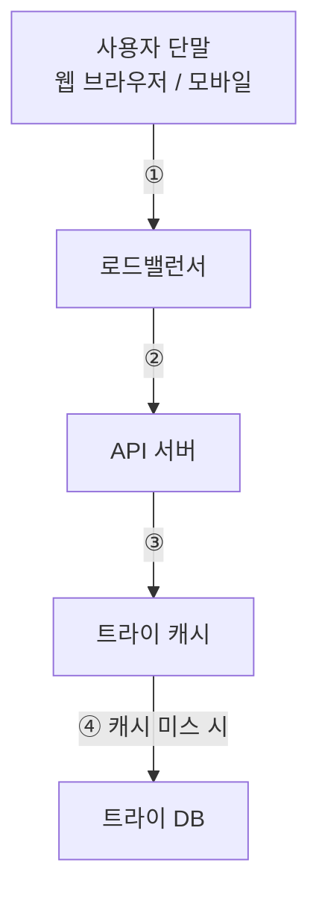
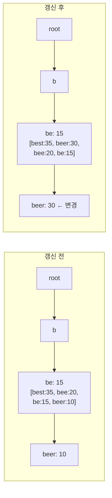

# 검색어 자동완성 시스템

## 1. 검색어 자동완성이란?

검색창에 단어를 입력하면 자동으로 완성된 검색어를 보여주는 기능.

별칭:

- autocomplete
- typeahead
- search-as-you-type
- incremental search

-----

## 2. 요구사항 정리

### 기능 요구사항

- 입력된 단어는 자동완성될 검색어의 **첫 부분** (prefix 매칭)
- **5개**의 인기 검색어 제안
- 인기 순위 기준: **검색 빈도(frequency)**
- 영어 소문자만 지원 (대문자·특수문자 없음)
- 맞춤법 검사 / 자동수정 없음

### 비기능 요구사항

- **빠른 응답**: 100ms 이내
- **연관성**: 입력 단어와 연관된 검색어
- **정렬**: 인기도 기반 ranking model
- **규모 확장성**: 대규모 트래픽 처리
- **고가용성**: 일부 장애 발생 시에도 동작

-----

## 3. 규모 추정

- DAU: **1천만 명 (10M)**
- 사용자 1명 = 매일 10건 검색
- 질의 당 평균 **20바이트** (ASCII, 4단어 × 5글자)
- 글자 입력 1번 = 백엔드 요청 1건 → 검색 1건당 **20 요청**
- QPS = 10M × 10 × 20 / 86400 ≈ **24,000 QPS**
- 최대 QPS = **48,000**
- 신규 데이터 = 질의의 20% → **매일 0.4GB 추가**

-----

## 4. 개략적 설계 (High-Level Design)

시스템은 두 서비스로 구성된다.

```
[사용자 입력]
     │
     ▼
데이터 수집 서비스 ──────→ 빈도 테이블 저장
     │
질의 서비스 ──────────────→ Top-k 인기 검색어 반환
```

### 4.1 데이터 수집 서비스 (Data Gathering Service)

- 사용자가 입력한 질의를 실시간으로 수집
- 빈도 테이블(frequency table)에 저장
  - 필드: `query`, `frequency`

### 4.2 질의 서비스 (Query Service)

- 주어진 prefix에 대해 Top-5 검색어 반환
- 초기 설계: SQL로 구현 가능

```sql
SELECT * FROM frequency_table
WHERE query LIKE `prefix%`
ORDER BY frequency DESC
LIMIT 5
```

> 데이터 양이 적을 때는 괜찮지만, 대규모에서는 DB 병목 발생 → 트라이(Trie)로 해결

-----

## 5. 트라이(Trie) 자료구조

검색어 자동완성의 핵심 컴포넌트.

### 5.1 기본 특성

- 트리 형태의 자료구조
- 루트 노드 = 빈 문자열
- 각 노드 = 문자(character) 1개, 최대 26개 자식
- 각 노드 = 하나의 단어 또는 prefix string 표현

### 5.2 용어 정의

|변수 |의미          |
|---|------------|
|`p`|prefix 길이   |
|`n`|트라이 내 노드 수  |
|`c`|주어진 노드의 자식 수|

### 5.3 기본 알고리즘 (Top-k 찾기)

1. prefix 노드 탐색 → `O(p)`
1. 해당 노드 하위 트리 탐색 → `O(c)`
1. 유효 노드 정렬 → `O(c log c)`

**전체 복잡도**: `O(p) + O(c) + O(c log c)`

> 최악의 경우 전체 트라이 탐색 필요 → 최적화 필요

-----

## 6. 트라이 최적화

### 최적화 1: 접두어 최대 길이 제한

- 사용자가 긴 검색어를 입력하는 경우가 거의 없음
- p값을 작은 상수(예: 50)로 제한
- prefix 노드 탐색: `O(p)` → `O(1)`

### 최적화 2: 노드에 인기 검색어 캐시

각 노드에 Top-k 검색어를 미리 저장.

```
예: "be" 노드에 캐시된 데이터
[best: 35, bet: 29, bee: 20, be: 15, beer: 10]
```



**두 최적화 적용 후 복잡도**: 모든 단계 `O(1)`

-----

## 7. 데이터 수집 서비스 (상세)

실시간 트라이 갱신은 비실용적:

- 매일 수천만 건의 질의 → 실시간 갱신 시 질의 서비스 저하
- 인기 검색어는 자주 바뀌지 않음 → 빈번한 갱신 불필요

### 7.1 아키텍처


### 7.2 각 컴포넌트

|컴포넌트          |역할                                  |
|--------------|------------------------------------|
|데이터 분석 서비스 로그 |원본 질의 데이터 보관, 추가만 가능, 인덱스 없음        |
|로그 취합 서버      |로그를 aggregation → 주기 설정 (본 설계: 주 1회)|
|취합된 데이터       |`query`, `time`, `frequency` 필드     |
|작업 서버 (Worker)|트라이 생성 및 트라이 DB 저장 (비동기)            |
|트라이 캐시        |분산 캐시, 메모리에 트라이 데이터 유지, 매주 갱신       |
|트라이 DB        |지속성 저장소                             |

### 7.3 트라이 DB 저장 방식

**옵션 1: 문서 저장소 (Document Store)**

- 트라이를 직렬화하여 저장
- MongoDB 등 활용

**옵션 2: 키-값 저장소 (Key-Value Store)**

- 모든 prefix → 해시 테이블 키
- 각 노드 데이터 → 해시 테이블 값

```
키(prefix)  │  값
────────────┼──────────────────────────────
b           │  [be:15, bee:20, beer:10, best:35]
be          │  [be:15, bee:20, beer:10, best:35]
bee         │  [bee:20, beer:10]
bes         │  [best:35]
beer        │  [beer:10]
best        │  [best:35]
```

-----

## 8. 질의 서비스 (상세)

### 8.1 아키텍처



흐름:

1. 검색 질의 → 로드밸런서
1. 로드밸런서 → API 서버
1. API 서버 → 트라이 캐시에서 Top-5 조회
1. 캐시 미스 시 → DB에서 가져와 캐시 채움

### 8.2 최적화

- **AJAX 요청**: 페이지 새로고침 없이 자동완성 목록 갱신
- **브라우저 캐싱**: 자동완성 결과를 브라우저에 캐싱
  - Google: `cache-control: private, max-age=3600`
- **데이터 샘플링**: N개 요청 중 1개만 로깅 (CPU/저장공간 절약)

-----

## 9. 트라이 연산

### 9.1 트라이 생성

- 작업 서버(Worker)가 담당
- 데이터 분석 서비스 로그 또는 취합 DB 사용

### 9.2 트라이 갱신 방법

**방법 1: 매주 1회 전체 교체** ← 본 설계 채택

- 새 트라이 생성 후 기존 트라이 대체

**방법 2: 노드 개별 갱신** (트라이가 작을 때 고려)

- 해당 노드 + 모든 상위 노드(ancestor) 동시 갱신 필요
- 상위 노드에도 인기 검색어 캐시가 저장되기 때문



### 9.3 검색어 삭제 (필터 계층)

혐오·폭력·성적으로 노골적인 질의어 제거 방법:


- 필터 규칙에 따라 자유롭게 검색 결과 변경 가능
- 물리적 DB 삭제는 다음 업데이트 사이클에 비동기 처리

-----

## 10. 저장소 규모 확장 (샤딩)

트라이가 단일 서버에 넣기엔 너무 클 경우.

### 방법: 첫 글자 기반 샤딩

```
서버 2대: a~m → 서버1, n~z → 서버2
서버 3대: a~i → 서버1, j~r → 서버2, s~z → 서버3
```

> 영어 알파벳 26자 → 최대 26대 서버로 1레벨 샤딩

### 문제: 데이터 불균형

- ‘c’로 시작하는 단어 >> ‘x’로 시작하는 단어
- 단순 알파벳 분할 시 서버 간 불균형

### 해결: 과거 질의 데이터 패턴 기반 샤딩

**샤드 관리자(Shard Map Manager)**:

- 어떤 검색어가 어느 서버에 저장되는지 관리
- 예: ‘s’로 시작하는 검색어 ≈ ‘u’~‘z’ 전체 합
  → ‘s’ 단독 샤드 1개 + ‘u’~‘z’ 통합 샤드 1개

-----

## 11. 면접 핵심 포인트

|항목       |내용                       |
|---------|-------------------------|
|핵심 자료구조  |Trie (접두어 트리)            |
|읽기 최적화   |각 노드에 Top-k 캐시 저장        |
|쓰기 최적화   |주기적 배치 갱신 (실시간 갱신 X)     |
|저장소      |트라이 DB + 분산 캐시           |
|응답속도     |브라우저 캐시 + AJAX           |
|확장성      |첫 글자 기반 + 사용 패턴 기반 샤딩    |
|유해 콘텐츠   |필터 계층(filter layer)      |
|데이터 파이프라인|로그 → 취합 → Worker → 트라이 DB|

-----

## 🧠 한 줄 핵심 요약

검색어 자동완성 = **“Trie 기반 prefix 매칭 + 노드별 Top-k 캐시 + 주기적 배치 업데이트”**