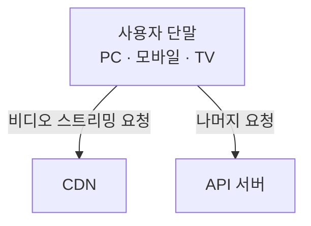
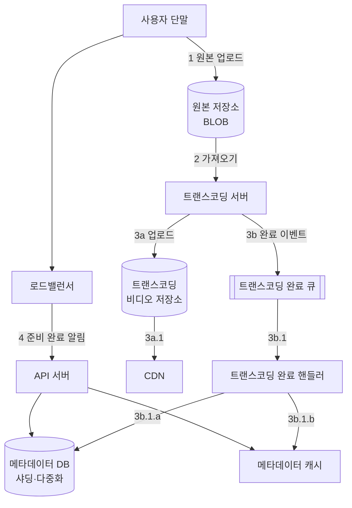
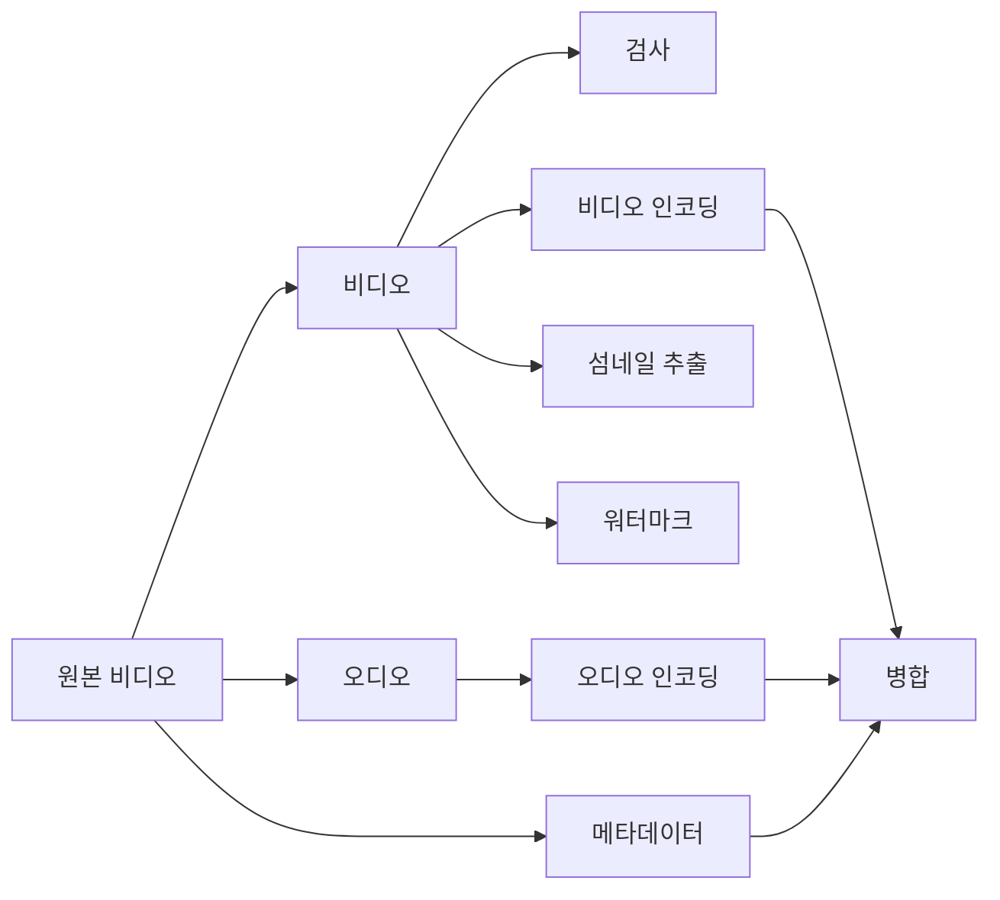
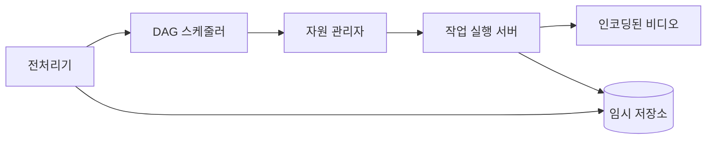
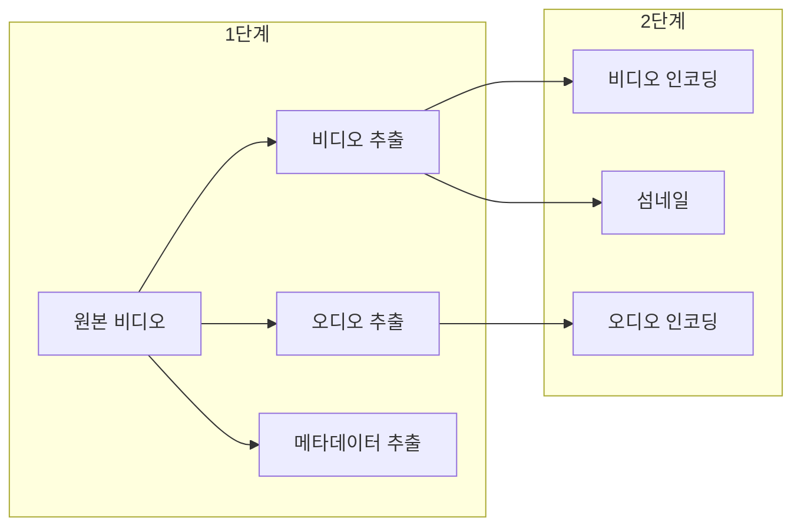
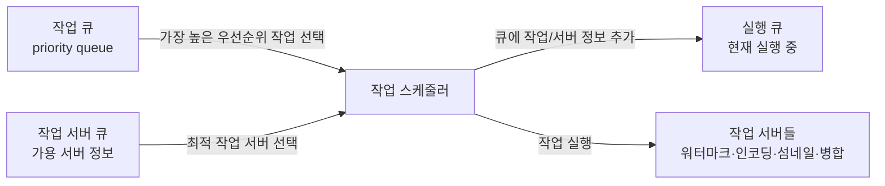

# 14장 유튜브 설계

## 1단계. 문제 이해 및 설계 범위 확정

- 가장 중요한 기능: **비디오 업로드 · 시청**
- 지원 클라이언트: 모바일 앱, 웹 브라우저, 스마트 TV
- DAU 5백만, 사용자당 평균 시청 시간 30분
- 다국어 지원, 모든 해상도 지원, 암호화 필요, 최대 **1GB** 업로드
- **클라우드 서비스 활용 OK** (모든 걸 바닥부터는 비현실적)

### 개략적 규모 추정

- DAU 5M, 사용자당 하루 5편 시청
- 10% 사용자가 하루 1편 업로드, 평균 300MB
- **일일 신규 저장 용량 = 5M × 10% × 300MB = 150TB**
- CloudFront 미국 기준 GB당 $0.02 → **일일 스트리밍 비용 = 5M × 5 × 0.3GB × $0.02 = $150,000**

CDN 비용이 엄청남 → 상세 설계 단계에서 최적화 필요.

---

## 2단계. 개략적 설계안

> 직접 구축하면 복잡 · 비용 ↑. Netflix는 AWS, Facebook은 Akamai CDN 사용. **CDN과 BLOB 저장소는 클라우드 서비스 활용**.

- **CDN**: 비디오 저장 · 스트리밍 담당
- **API 서버**: 스트리밍 외 모든 요청 (피드 추천, 업로드 URL 생성, 메타데이터 DB/캐시 갱신, 가입 등)

### 비디오 업로드 절차

두 프로세스가 **병렬**로 진행:

- **프로세스 a — 비디오 업로드**
  1. 비디오 → 원본 저장소
  2. 트랜스코딩 서버가 가져와 트랜스코딩 시작
  3. 완료 시 (a) 트랜스코딩 비디오 저장소 업로드 → CDN, (b) 완료 큐에 이벤트 → 핸들러가 메타 DB/캐시 갱신
  4. API 서버 → 단말에 스트리밍 준비 완료 알림

- **프로세스 b — 메타데이터 갱신** : 단말이 파일 이름·크기·포맷 등을 API 서버에 보내 메타 캐시/DB 업데이트.

#### 주요 컴포넌트

| 컴포넌트 | 역할 |
|---|---|
| 로드밸런서 | API 서버 간 요청 분산 |
| API 서버 | 비디오 스트리밍 외 모든 요청 처리 |
| 메타데이터 DB | 비디오 메타데이터 저장. 샤딩 + 다중화 |
| 메타데이터 캐시 | 비디오·사용자 객체 캐시 |
| 원본 저장소 | 원본(raw) 비디오용 BLOB |
| 트랜스코딩 서버 | 포맷(MPEG, HLS 등) 변환 |
| 트랜스코딩 비디오 저장소 | 트랜스코딩 결과 BLOB |
| CDN | 비디오 캐시. 재생 시 여기서 스트리밍 |
| 트랜스코딩 완료 큐 | 트랜스코딩 이벤트 메시지 큐 |
| 트랜스코딩 완료 핸들러 | 큐 소비자. 메타 DB/캐시 갱신 |

### 비디오 스트리밍 절차

- 스트리밍 프로토콜: MPEG-DASH, Apple HLS, MS Smooth Streaming, Adobe HDS
- 프로토콜마다 지원하는 인코딩·플레이어가 다름 → 용례에 맞게 선택
- **단말에 가장 가까운 CDN 엣지 서버**가 전송 → 전송지연 ↓

---

## 3단계. 상세 설계

### 비디오 트랜스코딩

왜 필요한가:

- 원본(raw) HD 60fps 비디오는 수백 GB → 저장 공간 ↑↑
- 단말·브라우저마다 지원 포맷이 다름 → 여러 포맷으로 인코딩 필요
- 네트워크 상황에 따라 고화질/저화질 동적 전환 필요

인코딩 포맷의 구성:

- **컨테이너** : 비디오·오디오·메타데이터를 담는 바구니 (.mp4, .mov, .avi 등)
- **코덱** : 화질 보존하며 파일 크기 축소용 압축/해제 알고리즘 (H.264, VP9, HEVC)

### 유향 비순환 그래프 (DAG) 모델

페이스북 스트리밍 비디오 엔진처럼, 각자 다른 처리 파이프라인 요구 (워터마크, 섬네일 커스텀, 화질 선호 등)를 유연하게 대응하기 위해 DAG 도입.

비디오 인코딩 결과물 예시: `360p.mp4` · `480p.mp4` · `720p.mp4` · `1080p.mp4` · `4k.mp4`

각 작업:
- **검사(inspection)**: 품질·손상 확인
- **비디오 인코딩**: 여러 해상도·코덱·비트레이트 조합으로 인코딩
- **섬네일**: 업로드 이미지 or 자동 추출
- **워터마크**: 식별 정보 오버레이

---

### 비디오 트랜스코딩 아키텍처

#### 전처리기 (preprocessor)

1. **비디오 분할** : 스트림을 GOP(Group of Pictures) 단위로 분할. GOP = 독립적으로 재생 가능한 프레임 그룹, 보통 몇 초. 오래된 단말이 GOP 분할을 지원 안 하면 전처리기가 대신 처리.
2. **DAG 생성** : 클라이언트 프로그래머가 작성한 설정 파일로부터 DAG 생성. 예: `download-input` → `transcode` 2-노드 DAG.
3. **데이터 캐시** : 분할된 비디오·메타데이터를 임시 저장소에 보관 → 인코딩 실패 시 재개.

#### DAG 스케줄러

DAG를 여러 **단계(stage)** 로 쪼개 자원 관리자의 작업 큐에 삽입.

#### 자원 관리자 (resource manager)

3개의 큐 + 작업 스케줄러로 구성:

동작 순서:
1. 작업 큐에서 최우선순위 작업 꺼냄
2. 실행할 작업 서버 선정
3. 작업 스케줄러가 작업 실행 지시
4. 실행 큐에 할당 정보 기록
5. 완료되면 실행 큐에서 제거

#### 작업 서버

DAG에 정의된 작업(워터마크, 인코딩, 섬네일, 병합 …)을 종류별로 구분해 관리.

#### 임시 저장소

데이터 유형·크기·이용 빈도·유효기간에 따라 선택.
- 메타데이터(빈번 참조 · 작음) → **메모리 캐시**
- 비디오·오디오 → **BLOB 저장소**
- 프로세싱 완료되면 삭제

#### 인코딩된 비디오

인코딩 파이프라인의 최종 결과물. `funny_720p.mp4` 같은 이름.

---

## 정리 요약

| 영역 | 핵심 포인트 |
|---|---|
| 구성 | 클라이언트 / CDN / API 서버 3파트. BLOB · CDN은 클라우드 활용 |
| 업로드 | 업로드 ∥ 메타데이터 갱신, 트랜스코딩 → 완료 큐 → 핸들러 → 메타 갱신 |
| 스트리밍 | CDN 엣지에서 직접 스트리밍, 프로토콜 선택이 핵심 (HLS/DASH) |
| 트랜스코딩 | DAG 모델로 유연성·병렬성 확보, 자원 관리자가 큐 3종으로 작업 배분 |
| 비용 | CDN이 가장 비쌈 → 최적화 필요 (이후 섹션에서 상세) |
