# 13. 검색어 자동완성 시스템
가장 많이 이용된 검색어 k개를 자동완성하여 출력하는 시스템 설계

### 1. 문제 이해 및 설계 범위 확정
- 문제 이해
  - 사용자가 입력하는 단어는 자동완성될 검색어의 첫 부분 일수도, 중간 부분이 될 수도 있다 -> 여기서는 첫 부분으로 한정
  - 5개의 자동완성 검색어가 표시되어야 함
  - 자동완성 검색어 5개를 고르는 기준은, 질의 빈도에 따라 정해지는 검색어 인기 순위가 기준
  - 맞춤법 검사 기능, 자동 수정 기능은 제공하지 않음
  - 질의는 영어로만 이루어짐 (다국어 지원을 고려해도 좋음)
  - 대문자, 특수 문자 처리는 고려하지 않고, 모든 질의는 영어 소문자로 이루어진다고 가정
  - 일간 능동 사용자(DAU) 기준으로 천만(10million) 명
- 요구사항
  - 빠른 응답 속도: 사용자가 검색어를 입력함에 따라 자동완성 검색어도 빨리 표시되어야 함 (페이스북: 시스템 응답속도 100밀리초 이내)
  - 연관성: 자동완성되어 출력되는 검색어는 사용자가 입력한 단어와 연관된 것이어야 함
  - 정렬: 시스템 계산 결과는 인기도 등의 순위 모델(ranking model)에 의해 정렬되어야 함
  - 규모 확장성: 많은 트래픽을 감당할 수 있도록 확장 가능
  - 고가용성: 시스템 일부에 장애 발생, 느려짐, 네트워크 문제가 생겨도 시스템은 계속 사용 가능해야 함
- 개략적 규모 추정
  - 일간 능동 사용자(DAU)는 천만 명으로 가정
  - 평균적으로 한 사용자는 매일 10건의 검색 수행 가정
  - 질의할 때마다 평균적으로 20바이트의 데이터를 입력한다 가정
    - 문자 인코딩 방법: ASCII 사용 가정 -> 1문자 = 1바이트
    - 질의문은 평균적으로 4개 단어, 각 단어는 평균적으로 다섯 글자
    - -> 질의당 평균 4 x 5 = 2바이트
  - 검색창에 글자를 입력할 때마다 클라 -> 검색어 자동완성 백엔드에 요청 보냄
    - -> 평균적으로 1회 검색당 20건의 요청이 백엔드로 전달됨
    - ex) dinner 검색: d, di, din, dinn, dinne, dinner이 순차적으로 백엔드에 전송됨
  - 대략 초당 24,000건의 질의(QPS)가 발생(= 10,000,000사용자 x 10질의/일x20자/24시간/3600초)
  - 최대 QPS=QPSx2=대략 48,000
  - 질의 가운데 20% 정도를 신규 검색어라고 가정 -> 0.4GB 정도의 신규 데이터가 매일 시스템에 추가됨 (10,000,000사용자x10질의/일x20자x20%)
### 2. 개략적 설계안 제시 및 동의 구하기
개략적으로, 시스템은 두 부분으로 나뉨
- 데이터 수집 서비스(data gathering service): 사용자가 입력한 질의를 실시간으로 수집하는 시스템
  - 데이터가 많은 애플리케이션에 실시간 시스템은 바람직하지는 않지만, 설계안의 출발점으로는 괜찮음 (추후 상세 설계에서 현실적인 안으로 교체)
  - 동작
    - 질의문과 사용빈도를 저장하는 빈도 데이블(frequency table)
      - 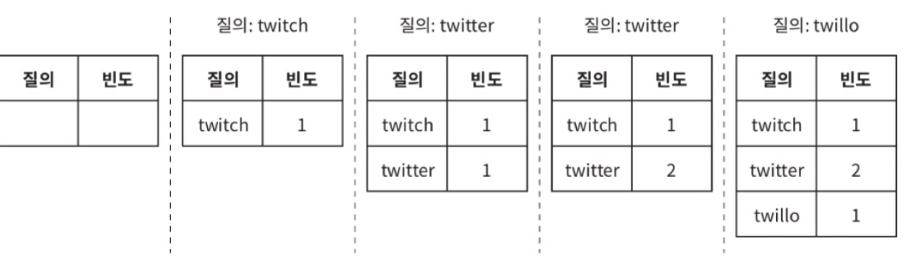
      - 처음 테이블은 비어 있는데, 사용자가 twitch, twitter, twitter, twillo를 순서대로 검색한 후의 상태
- 질의 서비스(query service): 주어진 질의에 다섯 개의 인기 검색어를 정렬해 내놓는 서비스
  - 빈도 테이블
    - 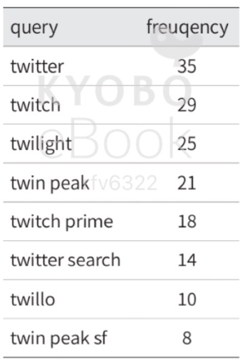
    - query: 질의문을 저장하는 필드
    - frequency: 질의문이 사용된 빈도를 저장하는 필드
    - 위 테이블의 상태에서, 사용자가 "tw"를 검색창에 입력하면 top5 자동완성 검색어가 twitter~twitch peak이 나와야 함 (top5: 빈도 테이블 수치로 계산)
    - 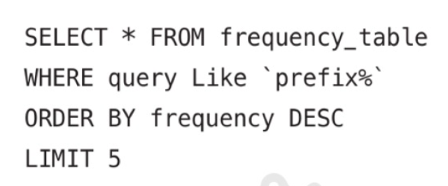
      - 가장 많이 사용된 5개 검색어(top 5)를 계산하는 SQL 질의문
    - 데이터 양이 적을 때는 괜찮지만, 데이터가 많아지면 데이터베이스가 병목이 될 수 있음 -> 상세 설계에서 해결
### 3. 상세 설계
- 위의 개략적 설계안(데이터 수집 서비스와 질의 서비스로 구성)은 최적화된 구성안은 아니지만 출발점으로는 괜찮은 안
- 다음과 같은 설계안으로 최적화 방안 논의
  - 트라이(trie) 자료구조
  - 데이터 수집 서비스
  - 질의 서비스
  - 규모 확장이 가능한 저장소
  - 트라이 연산
- 트라이 자료구조
  - 개략적 설계안의 저장소: 관계형 데이터베이스
    - 관계형 데이터베이스를 이용해 다섯개 쿼리를 골라내는 방안은 효율 x
  - 트라이(trie, 접두어 트리, prefix tree) 로 해결 (시스템의 핵심, 요구사항에 맞는 트라이 설계가 중요)
    - 문자열들을 간략하게 저장할 수 있는 자료구조
    - 문자열을 꺼내는 연산에 맞추어 설계된 자료구조
    - 트리 형태의 자료구조
    - 이 트리의 루트 노드는 빈 문자열을 나타냄
    - 각 노드는 글자(character) 하나를 저장하며, 26개(해당 글자 다음에 등장할 수 있는 모든 글자의 개수)의 자식 노드를 가질 수 있음
    - 각 트리 노드는 하나의 단어, 또는 접두어 문자열(prefix string)을 나타냄
      - 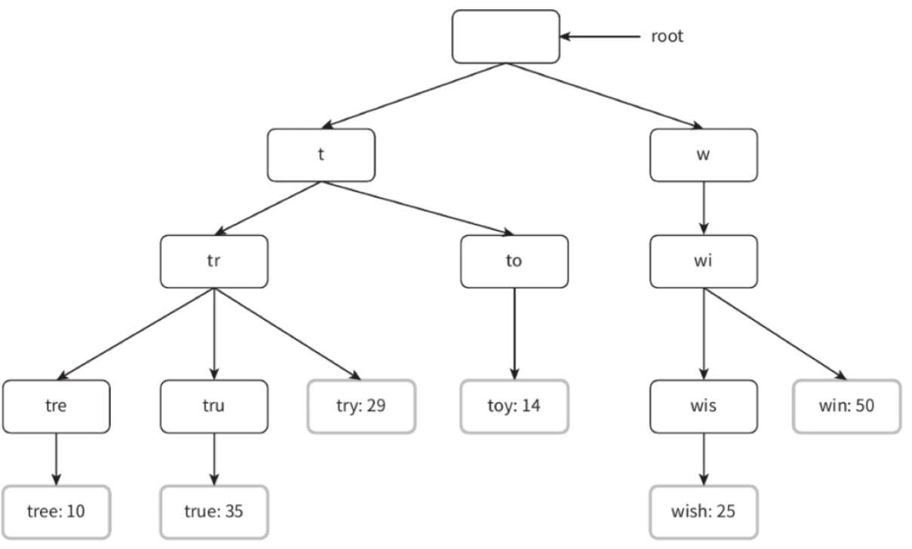
        - 기본 트라이 자료구조는 노드에 문자 저장
        - 위 그림은 각 노드에 단어의 빈도 정보까지 저장한 형태
  - 트라이로 검색어 자동완성을 구현하는 방법 (동작 방식)
    - 용어 
      - p: 접두어(prefix)의 길이
      - n: 트라이 안의 노드 개수
      - c: 주어진 노드의 자식 노드 개수
    - 가장 많이 사용된 질의어 k개 찾기
        1. 해당 접두어를 표현하는 노드 찾기. O(p)
        2. 해당 노드부터 시작하는 하위 트리 탐색하여 모든 유효 노드 찾음. 유효한 검색 문자열을 구성하는 노드가 유효 노드 O(c)
        3. 유효 노드를 정렬하여 가장 인기 있는 검색어 k개를 찾음 O(clogc)
      - 예제
      - 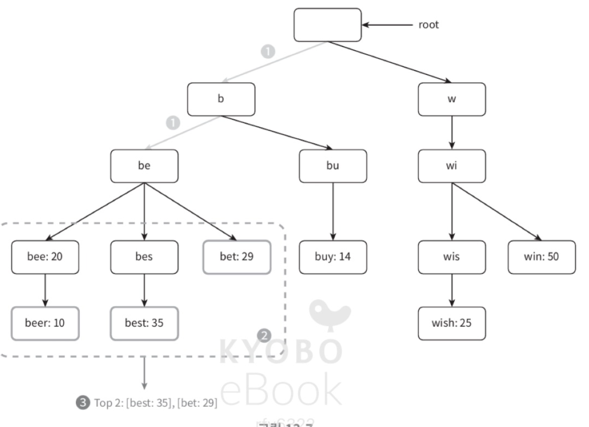
        1. 접두어 노드 "be"를 찾음
        2. 해당 노드부터 시작하는 하위 트리를 탐색하여 유효 노드를 찾음 [beer: 10], [best: 35], [bet:29]
        3. 유효 노드를 정렬하여 2개만 골라냄. [best: 35], [bet: 29]가 접두어(=검색어) "be"에 대해 검색된 2개의 인기 검색어
     - 위 알고리즘의 시간 복잡도: O(p) + O(c) + O(clogc)
     - 직관적 but 최악의 경우 k개 결과를 얻기 위해 전체 트라이 전부 검색하게 될 수도 있음
     - 해결
       1. 접두어의 최대 길이 제한
          - 사용자가 검색창에 긴 검색어를 입력하는 일은 거의 없으므로, p값을 작은 정수값(ex: 50)으로 가정해도 괜찮음.
          - "접두어 노드 찾는" 단계의 시간 복잡도가 O(p) -> O(1)로 바뀜
       2. 각 노드에 인기 검색어를 캐시
          - 각 노드에 k개의 인기 검색어를 저장해두면 전체 트라이를 검색하지 않아도 됨
          - k는 작은 값 (5~10개 정도의 자동완성 제안 표시하면 충분, 여기서는 5)
          - 각 노드에 인기 질의어를 캐시하면 "top5" 검색어 질의 시간 복잡도를 낮출 수 있음
          - 단점: 각 노드에 질의어를 저장할 공간이 많이 필요함
            - 빠른 응답속도가 중요할 때는 이정도 저장공간을 희생하기도 함
            - 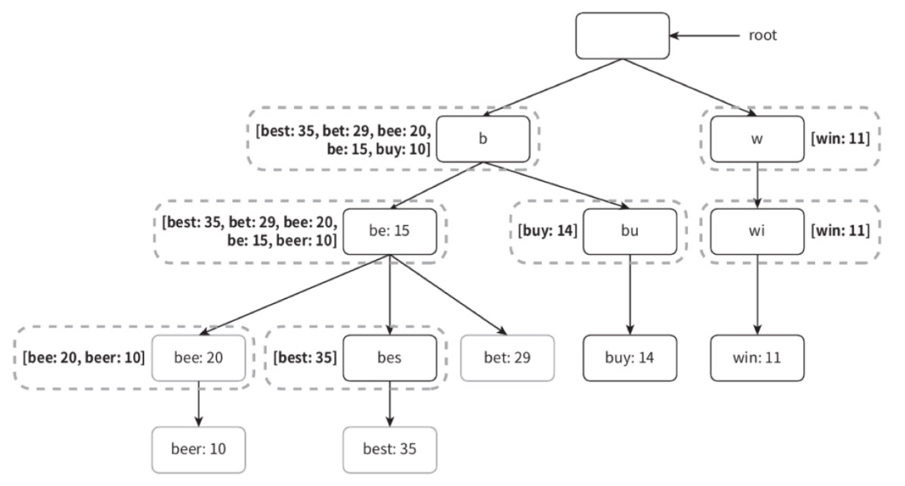
            - 각 노드에 인기가 높은 검색어를 캐시한 예시
     - 위의 최적화 기법 적용 시 시간복잡도 변화
       - 접두어 노드를 찾는 시간복잡도: O(1)
       - 최고 인기 검색어 5개를 찾는 질의의 시간 복잡도: O(1) (결과가 이미 캐시되어 있음)
       - 각 단계의 시간복잡도가 O(1)이 되어, 최고 인기 검색어 k개를 찾는 전체 알고리즘의 복잡도도 O(1)로 바뀜
- 데이터 수집 서비스
  - 위의 설계안: 사용자가 검색창에 뭔가를 타이핑 할 때마다 실시간으로 데이터 수정
  - 단점
    - 매일 수천만 건의 질의 입력, 그때마다 트라이 갱신: 질의 서비스가 느려짐
    - 트라이가 만들어진 이후에는, 인기 검색어는 자주 바뀌지 않기 때문에 트라이를 자주 갱신할 필요가 없음
  - 트위터 등 실시간 애플리케이션: 제안되는 검색어를 항상 신선하게 유지할 필요가 있지만
  - 구글 검색 등의 애플리케이션: 그렇게 자주 바꿔줄 이유가 없음
  - 각각의 경우에, 트라이를 만드는 데 쓰는 데이터는 데이터 분석 서비스나 로깅 서비스로부터 올 것이기 때문에 데이터 수집 서비스의 토대는 바뀌지 않음
  - 설계안
  - 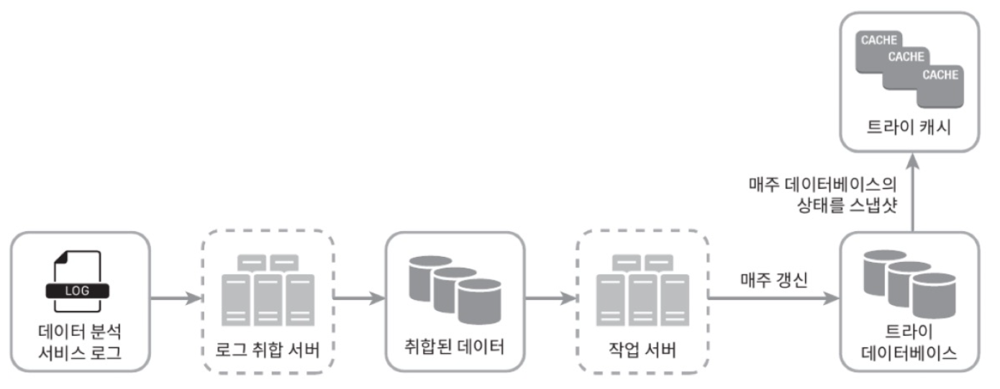
    - 데이터 분석 서비스 로그
      - 데이터 분석 서비스 로그에는 검색창에 입력된 질의에 관한 원본 데이터가 보관됨
      - 새로운 데이터 추가만 됨
      - 수정은 되지 않음
      - 로그 데이터에는 인덱스를 걸지 않음
      - 로그 파일 예제
        - 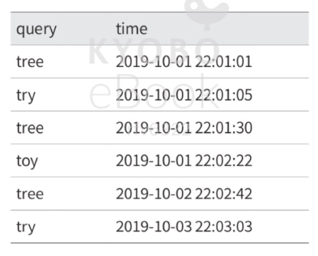
    - 로그 취합 서버
      - 데이터 분석 서비스로부터 나오는 로그는 양이 많고 데이터 형식이 제각각
      - 이 데이터들을 잘 취합하여 우리 시스템이 쉽게 소비할 수 있도록 해야 함
      - 데이터 취합 방식은 서비스의 용례에 따라 다를 수 있음
        - 트위터 등 실시간 애플리케이션: 데이터 취합 주기 짧음 (결과를 빨리 보여주는 것이 중요)
        - 대부분의 경우: 일주일에 한 번 정도로 로그를 취합해도 충분
        - -> 면접장에서 데이터 취합의 실시간성이 얼마나 중요한지 확인 필요 (이 설계안에서는 일주일 주기 채택)
    - 취합된 데이터
      - 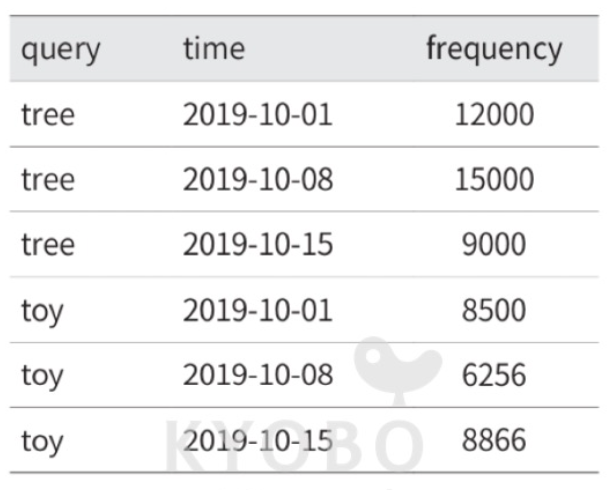
      - time 필드: 해당 주가 시작한 날짜
      - frequency 필드: 해당 질의가 해당 주에 사용된 횟수의 합
    - 작업 서버
      - 작업 서버(worker): 주기적으로 비동기적 작업(job)을 실행하는 서버 집합
      - 트라이 자료구조를 만들고 트라이 데이터베이스에 저장하는 역할 담당
    - 트라이 캐시
      - 분산 캐시 시스템
      - 트라이 데이터를 메모리에 유지하여 읽기 연산 성능을 높임
      - 매주 트라이 데이터베이스의 스냅샷을 떠서 갱신
    - 트라이 데이터베이스
      - 지속성 저장소
      - 트라이 데이터베이스로 사용할 수 있는 선택지
        1. 문서 저장소(document store): 새 트라이를 매주 만듦: 주기적으로 트라이를 직렬화하여 데이터베이스에 저장
           - 몽고디비 같은 문서 저장소를 이용하면 이런 데이터를 편하게 저장할 수 있음
        2. 키-값 저장소: 트라이는 아래 로직을 적용하면 해시 테이블 형태로 변환 가능
           - 트라이에 보관된 모든 접두어를 해시 테이블 키로 변환
           - 각 트라이 노드에 보관된 모든 데이터를 해시 테이블 값으로 변환
           - 예시
             - 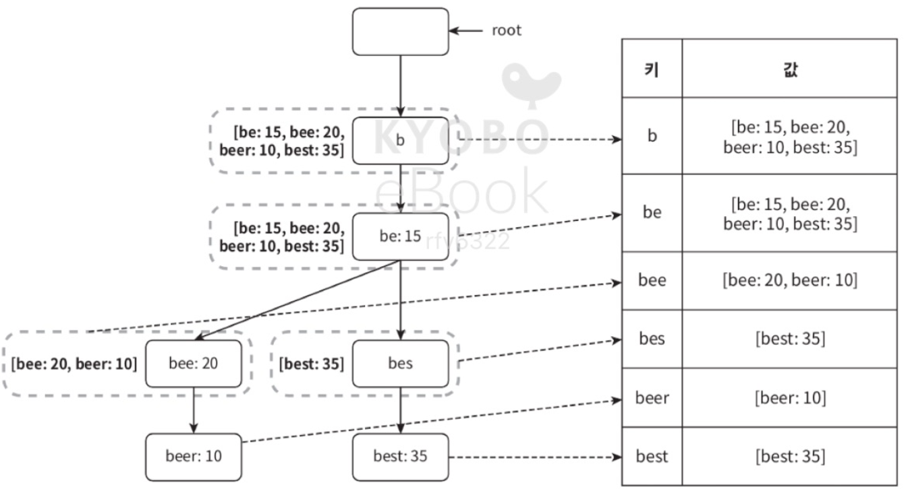
             - 각 트라이 노드는 하나의 <키, 값> 쌍으로 변환됨
             - 6장 "키-값 저장소 설계" 참고
    - 질의 서비스
      - 개략적 설계안에서의 질의 서비스는 데이터베이스를 이용하여 top5 검색어를 골라냄
      - 그 설계안의 비효율성을 개선한 새 설계안
      - 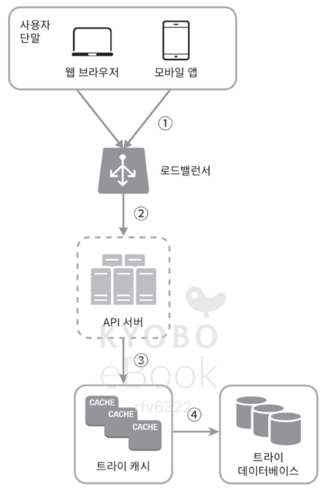
        1. 검색 질의가 로드밸런서로 전송됨
        2. 로드밸런서는 해당 질의를 API 서버로 보냄
        3. API 서버는 트라이 캐시에서 데이터를 가져와 해당 요청에 대한 자동완성 검색어 제안 응답 구성
        4. 데이터가 트라이 캐시에 없는 경우, 데이터를 데이터베이스에서 가져와 캐시에 채움 -> 다음에 같은 접두어에 대한 질의가 왔을 때 캐시에 보관된 데이터를 사용해 처리 가능
           - 캐시 미스는 캐시 서버의 메모리가 부족하거나 캐시 서버에 장애가 있어도 발생할 수 있음.
      - 질의 서비스는 아주 빨라야 함: 최적화 방안 
        - AJAX 요청(request): 웹 애플리케이션의 경우 브라우저는 보통 AJAX 요청을 보내, 자동완성된 검색어 목록을 가져옴
          - 장점: 요청을 보내고 받기 위해 페이지를 새로고침 할 필요가 없음
        - 브라우저 캐싱: 대부분 애플리케이션의 경우 자동완성 검색어 제안 결과는 짧은 시간 안에 자주 바뀌지 않음.
          - -> 제안된 검색어들을 브라우저 캐시에 넣어두면, 후속 질의 결과는 해당 캐시에서 바로 가져갈 수 있음
          - 구글 검색 엔진이 이런 캐시 메커니즘을 사용
            - 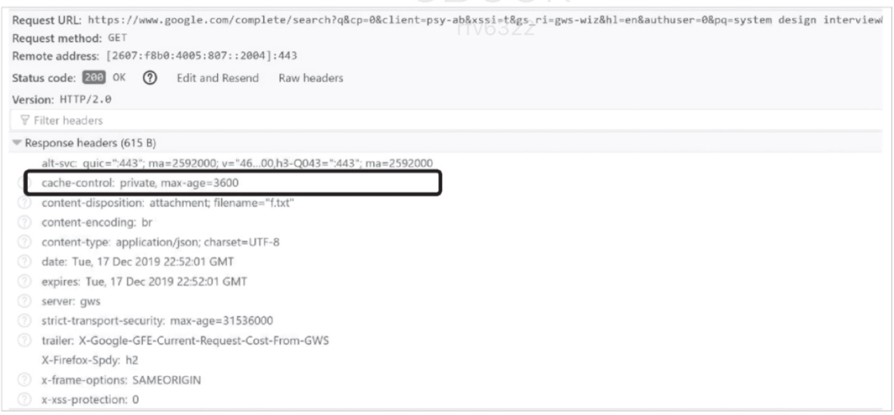
            - 구글 검색 엔진에 system design interview라고 입력했을 때의 응답 헤더
            - 구글은 제안된 검색어를 한 시간 동안 캐시해 둠
            - cache-control 헤더 값의 private: 해당 응답이 요청을 보낸 사용자의 캐시에만 보관될 수 있으며, 공용 캐시에 저장되어서는 안된다는 뜻
            - max-age = 3600: 해당 캐시 항목은 3600초, 즉 한 시간 동안만 유효하다는 뜻
        - 데이터 샘플링: 대규모 시스템의 경우, 모든 질의 결과를 로깅하도록 해 놓으면 CPU 자원과 저장 공간을 엄청나게 소진.
          - 이런 상황에서 데이터 샘플링이 유용: N개 요청 가운데 1개만 로깅하도록 함
      - 트라이 연산
        - 트라이 생성
          - 작업 서버가 담당
          - 데이터 분석 서비스의 로그, 데이터베이스로부터 취합된 데이터 이용
        - 트라이 갱신
          1. 매주 한 번 갱신: 새로운 트라이 생성 후 기존 트라이 대체
          2. 트라이의 각 노드를 개별적으로 갱신: 성능이 좋지 않음
             - 트라이가 작을 때는 고려해봄직함
             - 트라이 노드 갱신 시 그 모든 상위 노드도 갱신해야 함: 상위 노드에도 인기 검색어 질의 결과가 보관되기 때문
             - 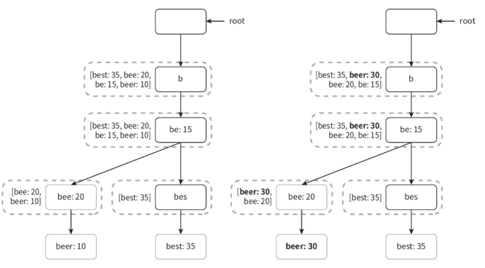
               - 왼쪽 트라이 상태에서, 검색어 'beer'의 이용 빈도를 10->30으로 갱신
               - 'beer'의 이용 빈도와 그 모든 상위 노드에 기록된 이용 빈도 수치도 모두 30으로 갱신됨
        - 검색어 삭제
          - 혐오성, 폭력적, 성적, 위험한 질의어를 자동완성 결과에서 제거
          - 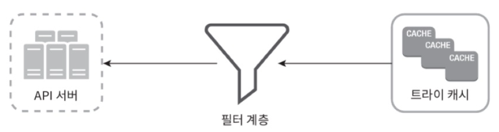
            - 위 그림처럼 트라이 캐시 앞에 필터 계층을 두고 부적절한 질의어가 반환되지 않도록 함
            - 필터 계층을 두면 필터 규칙에 따라 검색 결과를 자유롭게 변경 가능
            - 다음번 업데이트 사이클에 비동기적으로 데이터베이스에서 해당 검색어를 물리적으로 삭제 시행
      - 저장소 규모 확장
        - 트라이의 크기가 한 서버에 넣기엔 너무 큰 경우 대응: 규모 확장성 문제 해결
        - 영어만 지원: 첫 글자 기준으로 샤딩
          - 검색어를 보관하기 위해 두 대 서버가 필요하다면, a~m 글자로 시작하는 검색어 / 나머지를 각각의 서버에 저장
          - 세 대 서버 필요하다면, a~i / j~r / 나머지를 각각의 서버에 저장
        - 위 방법을 쓰는 경우 사용 가능한 서버는 최대 26대로 제한 (영어 알파벳 개수)
          - 이 이상으로 서버 대수를 늘리려면 계층적 샤딩 필요함
          - ex) 첫 번째 글자는 첫 번째 레벨의 샤딩에 사용 / 두 번째 글자는 두 번째 레벨의 샤딩에 사용
            - a로 시작하는 검색어를 네 대 서버에 나눠 보관: aa~ag / ah~an / ao~au / 나머지를 각각의 서버에 보관
        - 위 설계안의 문제: 데이터를 각 서버에 균등하게 배분하기 불가능
          - c로 시작하는 단어가 x로 시작하는 단어보다 많은 등..
        - 해결: 과거 질의 데이터의 패턴을 분석하여 샤딩
          - 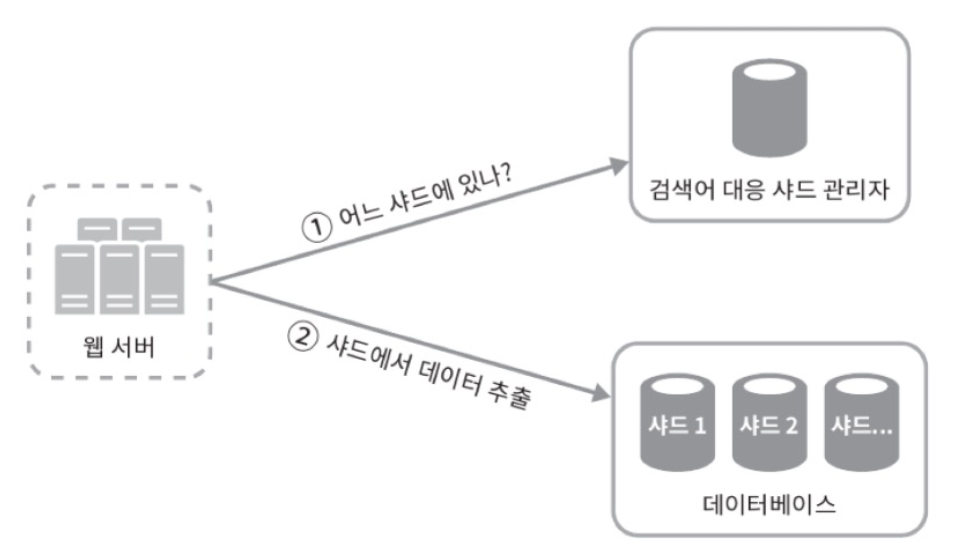
          - 검색어 대응 샤드 관리자(shard map manager): 어떤 검색어가 어느 저장소 서버에 저장되는지에 대한 정보 관리
          - 's'로 시작하는 검색어의 양이 u v w x y z로 시작하는 검색어를 모두 합친 것과 비슷하다면, s / uvwxyz를 위한 샤드로 각각 둬도 충분
### 4. 마무리
- 다국어 지원이 가능하도록 시스템 확장
  - 비영어권 국가에서 사용하는 언어 지원: 트라이에 유니코드 데이터 저장
    - 유니코드: 고금을 막론하고 세상에 존재하는 모든 문자 체계를 지원하는 표준 인코딩 시스템
- 국가별로 인기 검색어 순위가 다르다면
  - 국가별로 다른 트라이 사용
  - 트라이를 CDN에 저장하여 응답 속도를 높이는 방법도 고려 가능
- 실시간으로 변하는 검색어의 추이 반영
  - 현 설계안은 특정 검색어의 인기가 갑자기 높아지는 경우를 지원하기에 적합하지 않음.
    - 작업 서버가 매주 한 번만 돌도록 되어 있어, 시의 적절하게 트라이 갱신 불가
    - 설사 때맞춰 서버가 실행된다 해도, 트라이 구성에 너무 많은 시간이 수요됨
  - 실시간 검색어 자동완성 시스템 구축 아이디어
    - 샤딩을 통하여 작업 대상 데이터의 양을 줄인다?
    - 순위 모델(ranking model)를 바꾸어 최근 검색어에 보다 높은 가중치를 준다?
    - 데이터가 스트림 형태로 올 수 있다는 점, 즉 한번에 모든 데이터를 동시에 사용할 수 없을 가능성이 있다는 점 고려 필요
      - 데이터가 스트리밍 된다: 데이터가 지속적으로 생성된다
      - 스트림 프로세싱에는 특별한 종류의 시스템 필요   
        - 아파치 하둡 맵리듀스
        - 아파치 스파크 스트리밍
        - 아파치 스톰
        - 아파치 카프카 등