# 13장 검색어 자동완성 시스템 설계

구글이나 아마존 검색창에 단어를 입력할 때 자동으로 검색어가 완성되어 표시되는 기능을 **검색어 자동완성** 이라 부른다. 

이번 장에서는 가장 많이 이용된 검색어 k개를 자동완성하여 출력하는 시스템을 설계해 보도록 하겠다.

---

# 1. 문제 이해 및 설계 범위

## 1.1 면접 Q&A로 확정한 요구사항

| 구분 | 내용 |
| --- | --- |
| 매칭 기준 | 입력한 단어의 **첫 부분(prefix)** 으로 한정 |
| 출력 개수 | 5개의 자동완성 검색어 |
| 결정 기준 | 질의 빈도에 따른 인기 순위 |
| 지원 언어 | 영어 (시간이 남으면 다국어 고려) |
| 특수 문자 | 소문자 영어만 지원한다고 가정 |
| 규모 | 일간 능동 사용자(DAU) 기준 천만 명 |

## 1.2 기능 및 비기능 요구사항
- **빠른 응답 속도**: 시스템 응답 속도는 **100밀리초 이내**여야 시스템 이용이 불편하지 않다.
- **연관성**: 입력한 단어와 연관된 것이어야 한다.
- **정렬**: 인기도 등의 순위 모델에 의해 정렬되어야 한다.
- **규모 확장성 & 고가용성**: 많은 트래픽을 감당하고 시스템 장애 시에도 사용 가능해야 한다.

## 1.3 개략적 규모 추정
- **QPS (Query Per Second)**: 1,000만 명 $\times$ 10건 검색/일 $\times$ 20자 / 24시간 / 3600초 = **약 24,000건**.
- **최대 QPS**: 약 48,000건.
- **저장 공간**: 매일 약 **0.4GB**의 신규 데이터 추가(신규 검색어 20% 가정).

---

# 2. 개략적 설계안

시스템은 크게 두 서비스로 나뉜다.

## 2.1 데이터 수집 서비스 (Data Gathering Service)
사용자가 입력한 질의를 실시간으로 수집한다. 질의문과 빈도를 저장하는 **빈도 테이블(Frequency Table)** 을 업데이트하는 방식이다.

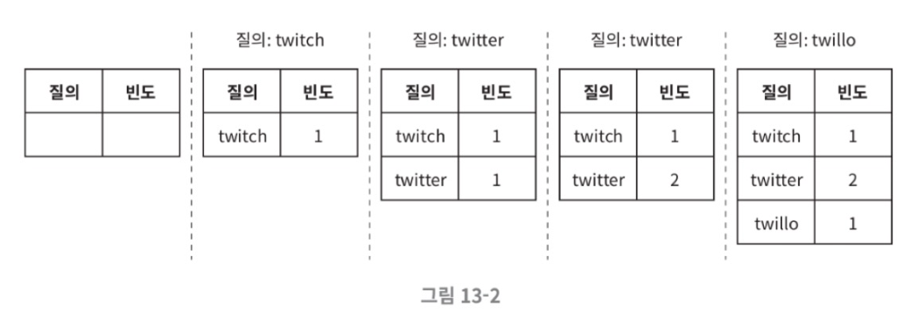

## 2.2 질의 서비스 (Query Service)

위와 같은 빈도 테이블에서 주어진 질의에 인기 검색어 5개를 정렬해 반환한다. 

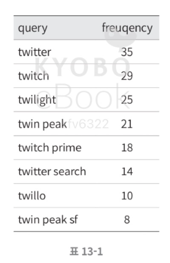

데이터 양이 적을 때는 관계형 DB에서 아래와 같은 SQL로 처리가 가능하다.

```sql
SELECT * FROM frequency_table
WHERE query LIKE 'prefix%'
ORDER BY frequency DESC
LIMIT 5;
```

---

# 3. 트라이(Trie) 자료구조

관계형 DB를 사용하는 방식은 데이터가 많아지면 병목이 발생하므로 **트라이(trie, 접두어 트리)** 자료구조를 핵심으로 사용한다.

- **특징**: 루트 노드는 빈 문자열이며, 각 노드는 글자 하나를 저장하고 단어 또는 접두어를 나타낸다.
- **기본 알고리즘 복잡도**: $O(p) + O(c) + O(c \log c)$.
    - $p$: 접두어 길이 / $c$: 자식 노드 개수.

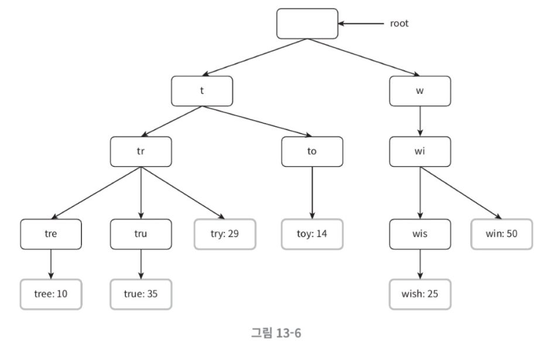
- 위 그림은 'tree', 'try', 'true', 'toy' 'wish', 'win' 이 저장된 트라이이다. 
- 빈도 테이블에 있는 빈도 정보도 트라이 노드에 저장되어 있다.

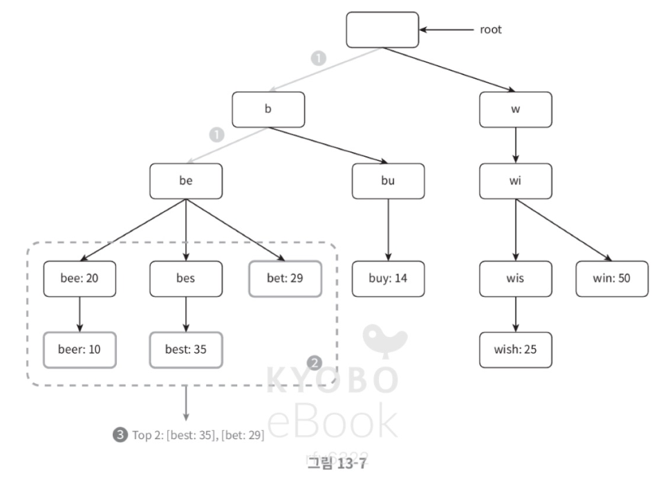
- 위 그림은 `k=2` 이고 사용자가 검색창에 'be'를 입력했다고 하자.
1. 접두어 노드 'be'를 찾는다.
2. 해당 노드부터 시작하는 하위 트리를 탐색하여 모든 유효 노드를 찾는다. (bear, best, bet)
3. 유효 노드를 정렬하여 2개만 골라낸다. (best, bet)

> 하지만 이 알고리즘은 최악의 경우에 k개의 결과를 얻으려고 전체 트라이를 다 검색해야 하는 일이 생길 수 있다.

## 3.1 성능 최적화 방안
1. **접두어 최대 길이 제한**: 사용자가 긴 검색어를 입력하는 일은 드물므로 $p$값을 작은 상숫값(예: 50)으로 제한하여 접두어 노드 탐색을 $O(1)$로 낮춘다.
2. **노드에 인기 검색어 캐시**: 각 노드에 'top 5' 검색어를 미리 저장해두면 하위 트리를 전체 검색할 필요 없이 즉시 결과를 반환하여 시간 복잡도를 $O(1)$로 개선할 수 있다.
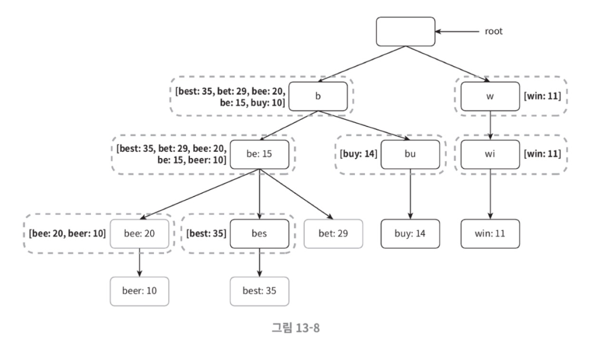

---

# 4. 상세 설계 — 데이터 수집 서비스

매번 실시간으로 트라이를 갱신하면 성능이 저하되므로 주기적인 업데이트 방식을 채택한다.

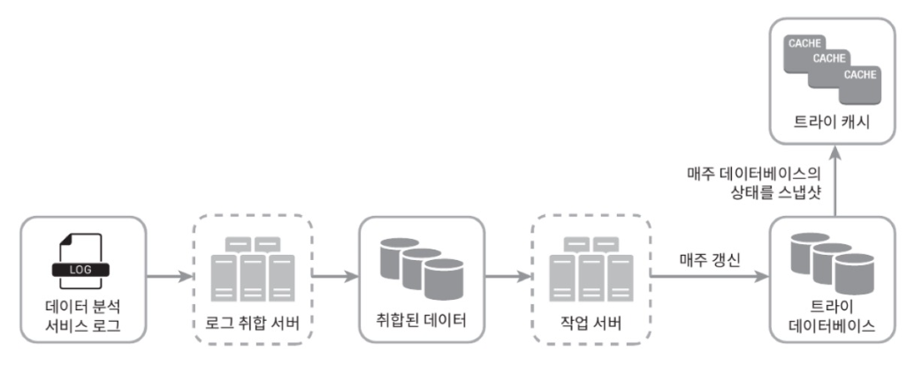
위 그림은 데이터 분석 서비스의 수정된 설계안이다. 각 컴포넌트를 살펴보면 다음과 같다.

1. **데이터 분석 서비스 로그**: 검색 질의의 원본 데이터를 보관한다.
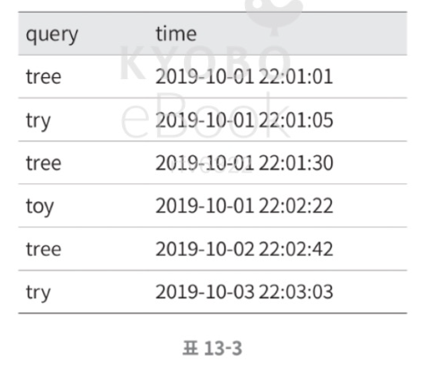
2. **로그 취합 서버**: 로그 양이 엄청나므로 시스템이 소비하기 쉽게 일주일 단위 등으로 데이터를 취합한다.
3. **취합된 데이터**: 
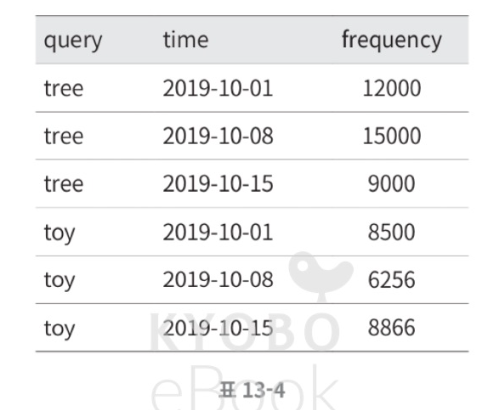
4. **작업 서버**: 주기적으로 비동기 작업을 실행해 트라이 자료구조를 만들고 DB에 저장한다.
5. **트라이 DB**: 매주 스냅샷을 찍어 데이터를 저장한다. MongoDB 같은 **문서 저장소** 나 트라이를 해시 테이블로 변환하여 **키-값 저장소** 에 보관할 수 있다. 다음 그림은 트라이를 해시 테이블로 어떻게 대응시킬 수 있는지 보여준다.
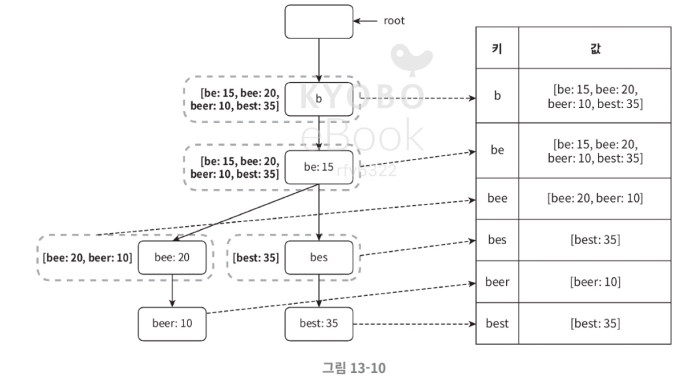
6. **트라이 캐시**: 분산 캐시 시스템으로 읽기 성능을 높이며 매주 갱신한다.

---

# 5. 상세 설계 — 질의 서비스

다음 설계안은 비효율성을 개선한 설계안이다.

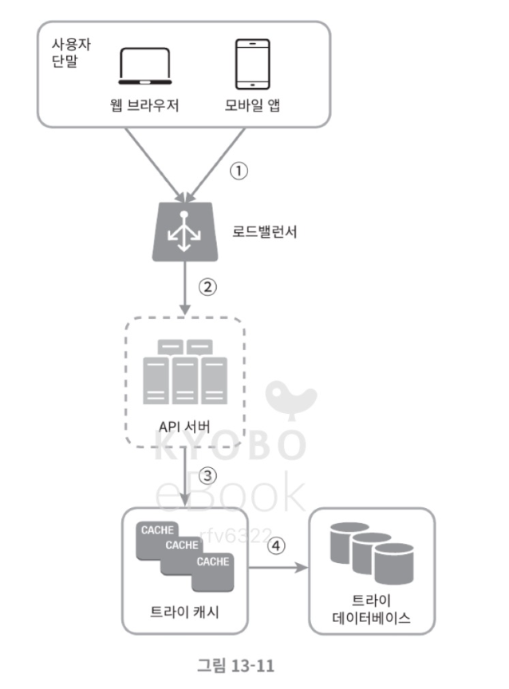

1. **로드밸런서**: 검색 질의를 받아 API 서버로 전달한다.
2. **API 서버**: 트라이 캐시에서 데이터를 가져온다.
3. **캐시 미스**: 캐시에 데이터가 없으면 DB에서 가져와 캐시를 채운다.
4. **브라우저 캐싱**: 검색 결과 응답 헤더에 `cache-control: private, max-age=3600` 등을 설정하여 브라우저가 결과를 한 시간 동안 캐시하게 함으로써 서버 부하를 줄인다.

---

# 6. 트라이 연산 및 확장

- **트라이 생성**:
    - 트라이 생성은 작업 서버가 담당하며, 데이터 분석 서비스의 로그나 데이터베이스로부터 취합된 데이터를 이용한다.
- **트라이 갱신**: 두 가지 방법이 있다.
    1. 매주 한 번 갱신 
    2. 트라이의 각 노드를 개별적으로 갱신하는 방법 (상위 노드의 빈도도 같이 갱신되기 때문에 비효율적이라 채택x)
    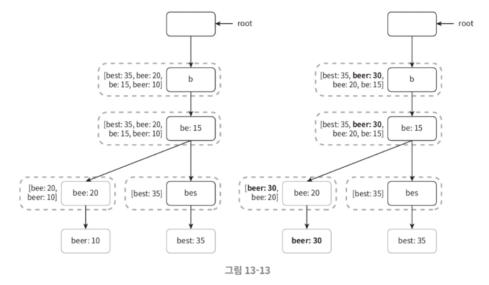
    

## 6.1 검색어 삭제
위험하거나 부적절한 질의어는 자동완성 결과에서 제거해야 한다. **트라이 캐시 앞에 필터 계층(Filter Layer)** 을 두어 부적절한 결과가 반환되지 않게 하고, DB에서는 다음 업데이트 때 비동기적으로 삭제한다.

## 6.2 저장소 규모 확장 (Sharding)
트라이가 너무 커져서 한 서버에 담기 어려울 때 사용한다.
- **단순 샤딩**: 첫 글자 기준(a~m, n~z)으로 나누면 데이터가 불균등하게 배분되는 문제가 있다.
- **개선된 샤딩**: **검색어 대응 샤드 관리자(Shard Map Manager)** 를 두어 과거 질의 데이터 패턴을 분석하고 부하를 균등하게 분산시킨다.
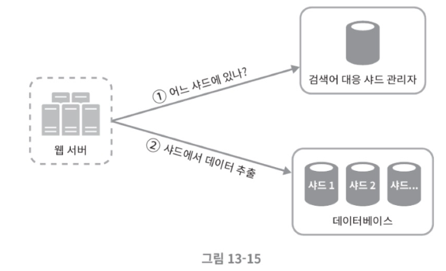

---

# 7. 4단계 마무리

## 7.1 추가 논의 주제
| 주제 | 내용 |
| --- | --- |
| 다국어 지원 | 트라이에 **유니코드(Unicode)** 데이터를 저장하여 모든 문자 체계 지원 |
| 국가별 순위 | 국가별로 다른 트라이를 사용하거나 **CDN** 에 저장하여 응답 속도 향상 |
| 실시간 추이 | 갑작스러운 인기 검색어 반영을 위해 **스트림 프로세싱**(Kafka, Spark Streaming 등) 도입 필요 |

## 7.2 요약
- 자동완성 시스템의 핵심은 **트라이 자료구조** 와 **캐싱** 을 통한 $O(1)$ 조회 성능 확보에 있다.
- 실시간 갱신보다는 **로그 취합 및 배치 작업** 을 통한 주기적인 트라이 업데이트가 효율적이다.
- 대규모 시스템에서는 **브라우저 캐싱** 과 **샤딩** 을 통해 확장성을 보강해야 한다.

## 7.3 아키텍처 설계

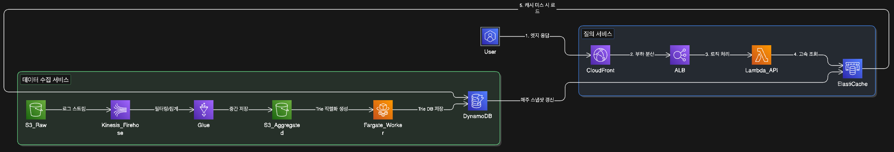

### 데이터 수집 서비스 (Batch Processing).

| 단계 | 컴포넌트 | AWS 서비스 | 설명 |
| :--- | :--- | :--- | :--- |
| **로그 생성** | 데이터 분석 서비스 로그 | **Amazon S3 / CloudWatch Logs** | 검색어 원본 데이터를 저장하는 데이터 레이크 역할을 수행. |
| **로그 취합** | 로그 취합 서버 | **AWS Glue / Amazon Kinesis Firehose** | 대량의 로그를 필터링하고 일정 주기(예: 매주)로 집계(Aggregation). |
| **데이터 저장** | 취합된 데이터 | **Amazon S3** | 분석이 완료된 빈도 데이터를 중간 저장소에 보관. |
| **트라이 생성** | 작업 서버 (Worker) | **AWS Lambda / Amazon ECS (Fargate)** | 취합된 데이터를 바탕으로 트라이 자료구조를 직렬화하여 생성작업량이 많을 경우 Fargate가 적합. |
| **영구 저장소** | 트라이 데이터베이스 | **Amazon DynamoDB / DocumentDB** | 직렬화된 트라이 데이터나 <키, 값> 쌍을 영구 저장. |

---

### 질의 서비스 (Real-time Service)

| 단계 | 컴포넌트 | AWS 서비스 | 설명 |
| :--- | :--- | :--- | :--- |
| **사용자 단말** | 웹 브라우저 / 앱 | **Amazon CloudFront** | 정적 리소스 캐싱 및 엣지 로케이션에서의 빠른 응답을 지원 |
| **트래픽 분산** | 로드밸런서 | **Application Load Balancer (ALB)** | 들어오는 API 요청을 백엔드로 분산 |
| **요청 처리** | API 서버 | **AWS Lambda / Amazon ECS** | 비즈니스 로직을 수행하며 캐시와 통신. 서버리스인 Lambda를 쓰면 비용 효율적. |
| **고속 조회** | 트라이 캐시 | **Amazon ElastiCache (Redis)** | 메모리 내에서 트라이 데이터를 유지하여 100ms 이내의 빠른 응답을 보장. |
| **원본 조회** | 트라이 데이터베이스 | **Amazon DynamoDB** | 캐시 미스 발생 시 원본 데이터를 가져와 캐시를 채움. |


### 종합 아키텍처 흐름 요약

> **분석 흐름**: 사용자 로그 $\rightarrow$ **Kinesis** $\rightarrow$ **S3** $\rightarrow$ **Glue/Lambda** (취합) $\rightarrow$ **DynamoDB** (Trie DB 저장)
>
> **질의 흐름**: 사용자 $\rightarrow$ **ALB** $\rightarrow$ **Lambda** (API) $\rightarrow$ **ElastiCache** (조회) $\rightarrow$ **결과 반환**
