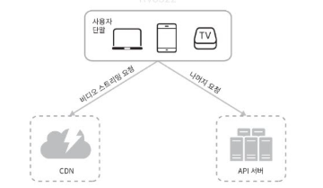

# [13주차] 14장_유튜브 설계

- **유튜브 통계 2020 vs 2026**
    
    
    | 지표 | 2020년 (책) | 2026년 (현재) | 변화 |
    | --- | --- | --- | --- |
    | 월간 활성 사용자 (MAU) | 20억 | 27~28.5억 | +35~40% |
    | 일간 활성 사용자 (DAU) | — | 1.22억 | 신규 공개 |
    | 일일 비디오 조회 | 50억 | ~50억 (+ 10억 시간) | 유사 |
    | 광고 수익 | 150억 달러 (2019) | 403억 달러 (2025) | 약 2.7배 |
    | 전체 수익 | — | 623억 달러 (2025, 디즈니 초과) | — |
    | 미국 이용률 | 성인 73% | 일일 62% | 데일리 기준으로 전환 |
    | 창작자 수 | 5천만 | 수백만 규모 파트너 프로그램 | 수익화 구조 고도화 |
    | 지원 언어 | 80개 | 100개국 이상 (쇼츠 기준) | 확대 |
    | 최대 시장 | 미국 | **인도 (5억 명)** | 주도권 이동 |
    | 쇼츠(Shorts) | 존재하지 않음 | 하루 2,000억 회 조회, MAU 20억 | **신규 카테고리** |
    | 프리미엄 구독자 | — | 1.25억 | 구독 모델 정착 |

## 1단계: 문제 이해 및 설계 범위 확정

### 📌 주요 요구사항 및 시스템 특성

- **핵심 기능:** 빠른 비디오 업로드, 원활한 비디오 재생, 재생 품질 선택 기능.
- **지원 단말:** 모바일 앱, 웹 브라우저, 스마트 TV.
- **비용 및 성능:** 인프라 비용(특히 CDN 비용)을 낮추고, 높은 가용성과 규모 확장성을 보장해야 함.
- **규모 추정:**
    1. 일간 능동 사용자(DAU) 5백만 명
    2. 사용자당 하루 평균 5개 비디오 시청 → 30분 정도
    3. 10%의 사용자가 하루 1개 비디오 업로드 가정
    4. 비디오를 모두 CDN으로 서비스할 경우 막대한 비용이 발생하므로 최적화가 필수적입니다.

---

## 2단계: 개략적 설계안 제시 및 동의 구하기

**시스템 설계 면접은 모든 것을 밑바닥 부터는 만들 필요 없음. → 주어진 시간내 적절한 기술을 골라 설계를 마치는 것이 무엇보다 중요하다.**

개략적인 시스템 컴포넌트 구성

- 단말 Client : 컴퓨터, 핸드폰, 스마트 티비를 통해 유튜브 시청 가능
- CDN : **비디오는 CDN에 저장**해서 재생버튼을 트리거로 스티리밍
- API 서버 : 비디오 스트리밍을 제외한 모든 요청은 API 서버가 처리. (피드 추천, 비디오URL 생성 등)

### 1. 비디오 업로드 절차 → 2프로세스가 동시에 진행

### 프로세스 A: 비디오 업로드

1. 단말 → 원본 저장소에 비디오 업로드
2. 트랜스코딩 서버가 원본을 가져와 변환 시작
3. 트랜스코딩 완료 후 두 절차 병렬 실행
    - **3a.** 변환된 비디오 → 트랜스코딩 저장소 → **3a.1.** CDN 배포
    - **3b.** 완료 이벤트 → 큐 → **3b.1.** 핸들러가 이벤트 소비 → **3b.1.a/b.** DB·캐시 갱신
4. API 서버가 단말에 "스트리밍 준비 완료" 알림

### 프로세스 B: 메타데이터 갱신 (A와 동시)

- 단말 → API 서버 (파일명, 크기, 포맷 전송)
- API 서버 → 메타데이터 캐시 + DB 업데이트

### 설계 포인트

1. **비동기 디커플링** — SQS로 트랜스코딩과 메타데이터 갱신을 분리 → 한쪽 지연이 전체 플로우를 막지 않음
2. **다중 병렬 처리** — 업로드/메타데이터 갱신이 병렬, 트랜스코딩 후에도 스토리지 저장과 이벤트 발행이 병렬
3. **관리형 서비스 위주** — 직접 운영할 대상이 API 서버 정도로 최소화되어 운영 부담 낮음
4. **캐시 + DB 이중화** — ElastiCache로 메타데이터 조회 성능 확보, RDS는 샤딩으로 쓰기 확장성 확보

### 2. 비디오 스트리밍 절차

| 방식 | 동작 | 재생 시점 |
| --- | --- | --- |
| 다운로드 | 파일 전체를 단말에 내려받음 | 다운로드 완료 후 |
| **스트리밍** | 원격지로부터 비디오 스트림을 지속 전송 | **즉시** (버튼 클릭 시) |

### 스트리밍 프로토콜

비디오 스트리밍을 위한 표준화된 통신 방법. 프로토콜마다 **지원 인코딩과 플레이어가 다르므로** 서비스 용례에 맞게 선택해야 한다.

| 프로토콜 | 제공사 | 정식 명칭 |
| --- | --- | --- |
| **MPEG-DASH** | MPEG | Dynamic Adaptive Streaming over HTTP |
| **HLS** | Apple | HTTP Live Streaming |
| **Microsoft Smooth Streaming** | Microsoft | - |
| **Adobe HDS** | Adobe | HTTP Dynamic Streaming |

### 스트리밍 흐름

비디오는 **CDN에서 바로 스트리밍**된다. 사용자 단말에 가장 가까운 CDN 엣지 서버(edge server)가 비디오 전송을 담당하므로 전송 지연이 매우 낮다.

- 엣지 서버에 콘텐츠가 있으면 즉시 응답 (캐시 히트)
- 없으면 오리진(원본 서버)에서 가져와 캐싱 (캐시 미스, 드묾)

### 설계 포인트

1. **엣지 서빙이 핵심** — 지리적으로 단말에 가까운 엣지에서 응답 → 저지연
2. **캐시 히트율이 성능을 결정** — 업로드 경로의 3a.1 단계(CDN 사전 배포)가 스트리밍 성능의 기반이 됨
3. **프로토콜 선택은 단말 종류에 의존** — iOS는 HLS, 대부분 웹은 DASH. 서비스가 둘 다 지원하려면 이중 패키징 필요
4. **비용 구조** — S3 → CloudFront 전송은 무료, CloudFront → 사용자 전송만 과금. 엣지 캐시 히트가 높을수록 오리진 비용 절감

### 업로드 아키텍처와의 대비

| 구분 | 업로드 | 스트리밍 |
| --- | --- | --- |
| 컴포넌트 수 | 많음 (10+) | 적음 (3) |
| 핵심 패턴 | 비동기 디커플링 (SQS) | 엣지 캐싱 |
| 병목 지점 | 트랜스코딩 처리량 | 캐시 히트율 / 대역폭 |
| 트래픽 패턴 | 쓰기 중심, 대용량 | 읽기 중심, 초고빈도 |

---

### 1. 비디오 트랜스코딩

원본 비디오(raw video)는 그대로 저장하기엔 너무 크고(HD 60fps 기준 수백 GB), 단말·브라우저마다 지원 포맷이 다르며, 네트워크 상황에 따라 화질을 동적으로 조절(Adaptive Bitrate)해야 하므로 **다중 해상도·다중 포맷 인코딩이 필수**.

인코딩 포맷은 크게 두 부분으로 구성됨:

- **컨테이너(container)**: 비디오·오디오·메타데이터를 담는 바구니. `.avi`, `.mov`, `.mp4` 같은 확장자가 이에 해당
- **코덱(codec)**: 화질은 보존하면서 파일 크기를 줄이는 압축/압축 해제 알고리즘. `H.264`, `VP9`, `HEVC`가 대표적

### 2. 유향 비순환 그래프(DAG) 모델 도입

창작자마다 원하는 비디오 처리 파이프라인이 다르므로(워터마크 넣기, 커스텀 썸네일, 선호 화질 등), Facebook의 스트리밍 비디오 엔진이 채택한 **DAG(Directed Acyclic Graph)** 프로그래밍 모델을 도입하여 작업을 단계별로 배열하고 **순차·병렬 실행**을 유연하게 조합.

원본 비디오는 **비디오 / 오디오 / 메타데이터** 세 갈래로 분기되며, 비디오 쪽 작업에는 다음이 포함됨:

- **검사(inspection)**: 손상 여부·품질 확인
- **비디오 인코딩**: 360p / 480p / 720p / 1080p / 4k 등 다중 해상도·코덱·비트레이트 조합 생성
- **섬네일(thumbnail)**: 업로드된 이미지 또는 자동 추출 이미지로 섬네일 생성
- **워터마크(watermark)**: 소유자 식별 정보를 오버레이 형태로 추가
- 최종적으로 오디오·비디오를 **병합(merge)**

### 3. 비디오 트랜스코딩 아키텍처 (5개 컴포넌트)

전체 파이프라인: `전처리기 → DAG 스케줄러 → 자원 관리자 → 작업 실행 서버 → 인코딩된 비디오` (+ 모든 단계가 **임시 저장소** 공유)

- **전처리기(preprocessor)**: 세 가지 역할
    1. 비디오를 **GOP(Group of Pictures)** 단위로 분할 — GOP는 몇 초 분량의 독립 재생 가능한 프레임 묶음. 구형 단말이 GOP 분할을 지원하지 않으면 전처리기가 대신 수행
    2. 클라이언트 설정 파일로부터 DAG 생성
    3. 분할된 GOP와 메타데이터를 임시 저장소에 캐싱 → 인코딩 실패 시 재개 가능
- **DAG 스케줄러**: DAG 그래프를 여러 단계(stage)로 분할한 뒤 각 작업을 자원 관리자의 **작업 큐**에 투입
- **자원 관리자(resource manager)**: 세 개의 큐와 작업 스케줄러로 구성
    - **작업 큐(task queue)**: 실행 대기 중인 작업이 담긴 우선순위 큐
    - **작업 서버 큐(worker queue)**: 가용 상태의 작업 서버 정보를 담은 우선순위 큐
    - **실행 큐(running queue)**: 현재 실행 중인 작업·서버 매핑 정보
    - **작업 스케줄러**: 최적의 작업/서버 조합을 골라 실행 지시
- **작업 실행 서버(task worker)**: 작업 종류별로 전용 풀을 운영 — 워터마크 풀 / 인코딩 풀 / 섬네일 풀 / 병합 풀
- **임시 저장소(temporary storage)**: 데이터 특성에 맞춰 저장소를 구분
    - 메타데이터 (자주 참조, 작음) → **메모리 캐시**
    - 비디오·오디오 원본 (큼) → **BLOB 저장소**
    - 파이프라인 완료 시 데이터 삭제

### 4. 시스템 최적화 기법 (속도 / 안전성 / 비용)

### 4-1. 속도 최적화

- **GOP 단위 병렬 업로드**: 비디오 전체를 한 번에 올리지 않고 GOP 경계로 분할하여 병렬 업로드. 일부가 실패해도 해당 GOP만 재시도하면 되어 전체 재업로드 불필요
- **지역별 업로드 센터 운영**: 단말에서 가까운 지역(북미 / 아시아 / 유럽 / 남미)에 업로드 센터를 분산 배치. 본 설계안에서는 **CDN을 업로드 센터로 활용**
- **모든 절차를 병렬화 (메시지 큐 도입)**: 다운로드 → 인코딩 → 업로드 → CDN 파이프라인을 메시지 큐로 연결. 이전 모듈의 완료를 기다릴 필요 없이 이벤트 단위로 병렬 처리 가능 → 모듈 간 결합도 감소

### 4-2. 안전성 최적화

- **미리 사인된 업로드 URL(Pre-signed URL): 허가된 사용자만 허가된 위치에 업로드할 수 있도록 제한**
    1. 클라이언트가 API 서버에 `POST /upload` 요청
    2. API 서버가 pre-signed URL을 반환
    3. 클라이언트가 해당 URL이 가리키는 위치(S3)에 직접 업로드
    - AWS S3 용어이며, Azure BLOB Storage에서는 Shared Access Signature(SAS)로 부름
- **비디오 저작권 보호 3가지 선택지**:
    - **DRM 시스템**: Apple FairPlay / Google Widevine / Microsoft PlayReady가 대표적
    - **AES 암호화**: 저장 시 암호화 → 재생 시에만 복호화 → 허가된 사용자만 시청 가능
    - **워터마크**: 소유자 정보(회사 로고, 이름 등)를 이미지 오버레이로 표시

### 4-3. 비용 최적화 (롱테일 분포 활용)

유튜브의 조회수는 **롱테일(long-tail) 분포**를 따름 — 극소수의 인기 비디오가 대부분의 트래픽을 차지하고, 나머지는 거의 재생되지 않음. 이를 활용해:

- **인기 비디오만 CDN으로 서빙**: 나머지 비디오는 자체 비디오 서버에서 직접 재생하도록 분리
- **비인기 비디오는 지연 인코딩**: 모든 해상도를 미리 만들지 않고, 실제 요청이 들어올 때만 인코딩
- **지역 한정 인기 비디오는 해당 지역에만**: 특정 지역에서만 인기 있는 비디오는 다른 지역 CDN에 복제하지 않음
- **자체 CDN 구축 + ISP 제휴**: 대규모 스트리밍 사업자라면 Comcast / AT&T / Verizon 같은 ISP와 직접 제휴해 사용자 경험 향상 + 인터넷 사용 비용 절감 (단, 초대형 프로젝트

### 5. 오류 처리

- **회복 가능 오류(recoverable error)**: 일시적 네트워크 단절, 특정 세그먼트 트랜스코딩 실패 등 → **재시도(retry)**. 반복 실패 시 적절한 에러 코드 반환
- **회복 불가능 오류(non-recoverable error)**: 비디오 포맷 손상 등 → 즉시 작업 중단 + 클라이언트에 에러 코드 반환

### 컴포넌트별 장애 대응

| 컴포넌트 | 대응 방식 |
| --- | --- |
| 업로드 | 몇 회 재시도 |
| 비디오 분할 | 구형 클라이언트면 서버가 대신 분할 처리 |
| 트랜스코딩 | 재시도 |
| 전처리기 | DAG 그래프를 재생성 |
| DAG 스케줄러 | 작업을 다시 스케줄링 |
| 자원 관리자 큐 | 사본(replica) 이용 |
| 작업 서버 | 다른 서버에서 해당 작업 재시도 |
| API 서버 | 무상태 서버이므로 신규 요청을 다른 노드로 우회 |
| 메타데이터 캐시 | 다중화되어 다른 노드에서 조회, 장애 캐시는 교체 |
| 메타데이터 DB 주 서버 장애 | 부 서버 중 하나를 주 서버로 승격 |
| 메타데이터 DB 부 서버 장애 | 다른 부 서버로 읽기 연산 처리, 죽은 서버는 신규 교체 |

---

## 핵심 키워드 요약 (면접 빈출)

| 키워드 | 한 줄 설명 |
| --- | --- |
| GOP (Group of Pictures) | 독립 재생 가능한 프레임 묶음, 병렬 업로드의 단위 |
| DAG (Directed Acyclic Graph) | 비디오 처리 작업을 유연하게 조합하는 프로그래밍 모델 |
| Adaptive Bitrate | 네트워크 상황에 따라 화질 동적 조절 |
| Pre-signed URL | 허가된 사용자의 허가된 위치 업로드 보장 |
| 롱테일 분포 | 조회수 집중 현상을 이용한 비용 최적화의 근거 |
| 메시지 큐 | 모듈 간 결합도를 낮추고 병렬성을 극대화 |
| 무상태(Stateless) | API 서버 수평 확장의 전제 조건 |
| 다중화 + 샤딩 | DB 규모 확장의 표준 조합 |