# 14. 유튜브 설계
> 유튜브, 넷플릭스, 훌루 등 비디오 플랫폼 설계 문제에도 적용 가능
- 유튜브 통계
  - 월간 능동 사용자 수: 20억
  - 매일 재생되는 비디오 수: 50억
  - 미국 성인 중 73%가 유튜브 이용
  - 5천만 명의 창작자
  - 유튜브 광고 수입은 2019년 기준으로 150억 달러이며, 이는 2018년 대비 36%가 증가한 수치
  - 모바일 인터넷 트래픽 중 37%를 유튜브가 점유
  - 80개 언어로 이용 가능
### 1. 문제 이해 및 설계 범위 확정
- 유튜브의 기능들
  - 댓글 기능
  - 비디오 공유
  - 좋아요 버튼
  - 재생목록에 저장
  - 채널 구독
- 이 모든걸 면접 시간 내 설계하는 것은 불가능하므로, 질문을 통해 설계 범위를 좁히기
  - 가장 중요한 기능: 비디오 업로드, 시청
  - 모바일 앱, 웹 브라우저, 스마트 TV 클라이언트 지원
  - 일간 능동 사용자 수: 5백만(5million)
  - 사용자가 이 제품에 평균 소비하는 시간: 30분
  - 다국어 지원: 가능
  - 비디오 해상도: 현존 비디오 종류, 해상도 대부분 지원
  - 암호화 필요
  - 비디오 파일 크기 제한: 1GB
  - 아마존, 구글, 마이크로소프트의 클라우드 서비스 활용 가능
- 이 설계안의 기능 초점
  - 빠른 비디오 업로드
  - 원활환 비디오 재생
  - 재생 품질 선택 가능
  - 낮은 인프라 비용
  - 높은 가용성, 규모 확장성, 안정성
  - 지원 클라이언트: 모바일 앱, 웹브라우저, 스마트TV
- 개략적 규모 추정
  - 일간 능동 사용자 수: 5백만(5million)
  - 한 사용자는 하루에 평균 5개의 비디오를 시청
  - 10% 사용자가 하루에 1비디오 업로드
  - 비디오 평균 크기는 300MB
  - 비디오 저장을 위해 매일 새로 요구되는 저장 용량 = 5백만 x 10% x 300MB = 150TB
  - CDN 비용
    - 클라우드 CDN을 통해 비디오를 서비스할 경우, CDN에서 나가는 데이터의 양에 따라 과금함.
    - 아마존의 CloudFront를 CDN 솔루션으로 사용할 경우, 10GB당 $0.02요금 발생(100% 트래픽이 미국에서 발생한다 가정)
      - 여기서는 문제를 단순화하기 위해 비디오 스트리밍 비용만 계산
    - 매일 발생하는 요금: 5백만 x 5비디오 x 0.3GB x $0.02 = $150,000
    - -> CDN을 통해 비디오 서비스 시 비용이 엄청남
      - 비용 절감: 상세 설계
### 2. 개략적 설계안 제시 및 동의 구하기
- 이 설계안에서는 CDN과 BLOB 스토리지의 경우 기존 클라우드 서비스 활용
- 전부 직접 만들지 않는 이유
  - 시스템 설계 면접은, 모든 것을 처음부터 만드는 것과는 관계 없음.
  - 주어진 시간 안에 적절한 기술을 골라 설계를 마치는 것이, 기술 각각이 어떻게 동작하는지 상세히 설명하는 것보다 중요함
    - 예: 비디오를 저장하기 위해 BLOB 저장소를 쓸 것이라면 그 사실만 언급해도 됨. BLOB 저장소를 어떻게 구현할 지 상세 설계를 제시하는 것은 지나침
  - 규모 확장이 쉬운 BLOB 저장소나 CDN을 만드는 것은 복잡하고 비용이 많이 듦
    - 넷플릭스도 아마존의 클라우드 서비스를 사용하고
    - 페이스북은 아카마이의 CDN을 이용
- 개략적 설계안
- 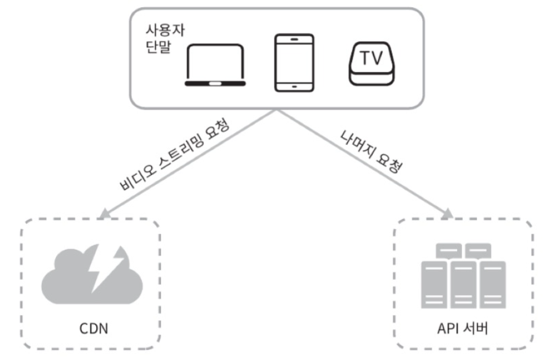
  - 단말(client): 컴퓨터, 모바일 폰, 스마트TV를 통해 유튜브 시청 가능
  - CDN: 비디오는 CDN에 저장함. 재생 버튼을 누르면 CDN으로부터 스트리밍이 이루어짐
  - API 서버: 비디오 스트리밍을 제외한 모든 요청은 API 서버가 처리
    - 피드 추천
    - 비디오 업로드 URL 생성
    - 메타데이터 데이터베이스와 캐시 갱신
    - 사용자 가입 등
- 비디오 업로드/스트리밍 절차 개략적 설계
- 비디오 업로드 절차
  - 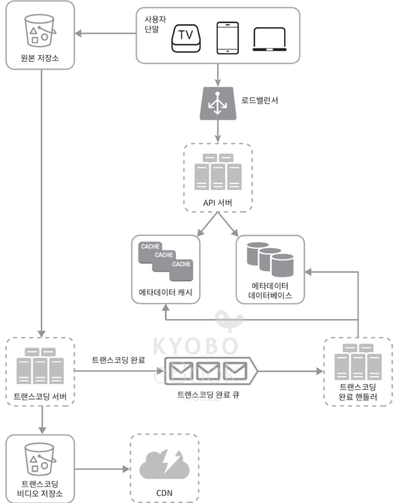
  - 개략적 구성안
    - 사용자: 컴퓨터, 모바일 폰, 스마트TV를 통해 유튜브를 시청하는 이용자
    - 로드밸런서: API 서버 각각으로 고르고 요청 분산
    - API 서버: 비디오 스트리밍을 제외한 다른 모든 요청 처리
    - 메타데이터 데이터베이스(metadata db): 비디오의 메타데이터 보관
      - 샤딩, 다중화를 적용하여 성능 및 가용성 요구사항 충족
    - 메타데이터 캐시: 성능을 높이기 위해 비디오 메타데이터와 사용자객체(user object)를 캐시
    - 원본 저장소(original storage): 원본 비디오를 보관할 대형 이진 파일 저장소(BLOB, Binary Large Object storage) 시스템
      - '이진 데이터를 하나의 개체로 보관하는 데이터베이스 관리 시스템'
    - 트랜스코딩 서버(transcoding server)
      - 비디오 트랜스코딩(비디오 인코딩) - 비디오의 포맷(MPEG, HLS 등)을 변환하는 절차
      - 단말, 대역폭 요구사항에 맞는 최적의 비디오 스트림을 제공하기 위해 필요
    - 트랜스코딩 비디오 저장소(transcoded storage): 트랜스코딩이 완료된 비디오를 저장하는 BLOB 저장소
    - CDN: 비디오 캐시. 사용자가 재생 버튼을 누르면, 비디오 스트리밍은 CDN을 통해 이루어짐
    - 트랜스코딩 완료 큐(completion queue): 비디오 트랜스코딩 완료 이벤트를 보관할 메시지 큐
    - 트랜트코딩 완료 핸들러(completion handler): 트랜스코딩 완료 큐에서 이벤트 데이터를 꺼내, 메타데이터 캐시와 데이터베이스를 갱신할 작업 서버들
  - 비디오 업로드 처리
    - a. 비디오 업로드
    - b. 비디오 메타데이터 갱신 (메타데이터에는 비디오 URL, 크기, 해상도, 포맷, 사용자 정보 포함)
    - 의 두 프로세스가 병렬적으로 수행됨
    - a. 비디오 업로드 프로세스 절차
      - 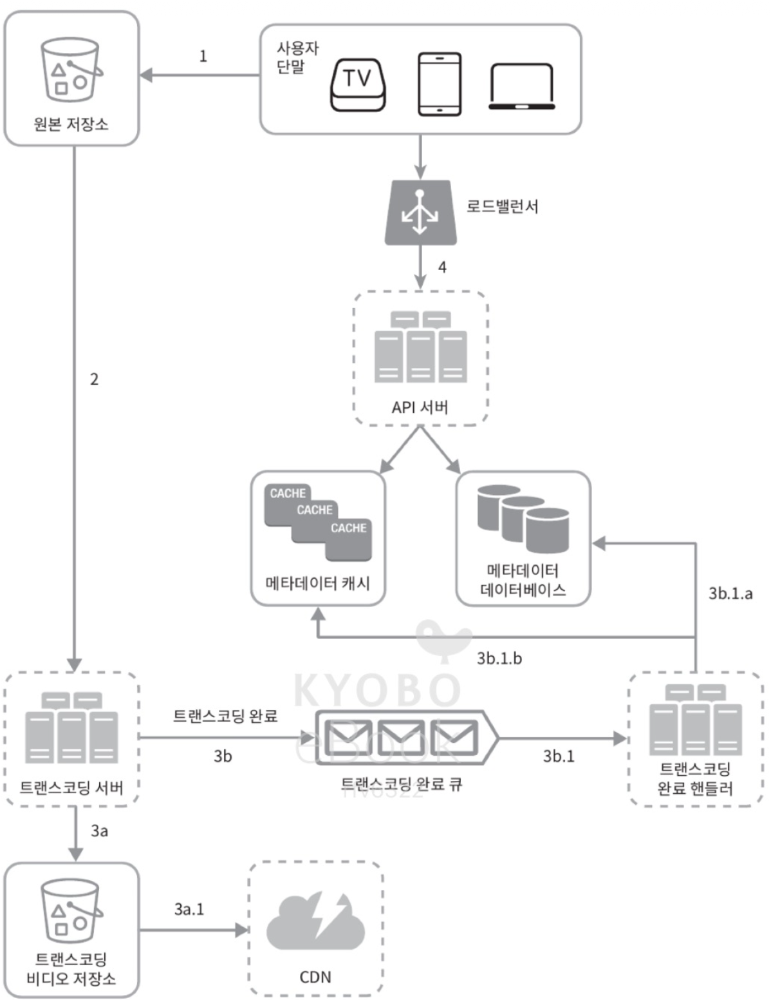
      1. 비디오를 원본 저장소에 업로드
      2. 트랜스코딩 서버는 원본 저장소에서 해당 비디오를 가져와 트랜스코딩을 시작
      3. 트랜스코딩 완료 시, 아래 두 절차가 병렬적으로 수행됨
         3a. 완료된 비디오를 트랜스코딩 비디오 저장소로 업로드
         3b. 트랜스코딩 완료 이벤트를 트랜스코딩 완료 큐에 넣음
            3a.1. 트랜스코딩이 끝난 비디오를 CDN에 올림
            3b.1. 완료 핸들러가 이벤트 데이터를 큐에서 꺼냄
            3a.1.a, 3b.1.b. 완료 핸들러가 메타데이터 데이터베이스와 캐시 갱신
      4. API 서버가 단말에게 비디오 업로드가 끝나서 스트리밍 준비가 되었음을 알림
    - b. 메타데이터 갱신 프로세스
      - 
      - 원본저장소에 파일이 업로드되는 동안, 단말은 병렬적으로 비디오 메타데이터 갱신 요청을 API 서버에 보냄
      - 이 요청에 포함된 메타데이터: 파일 이름, 크기, 포맷 등의 정보 포함
      - API 서버는 이 정보로 메타데이터 캐시와 이벤트를 업데이트
      - 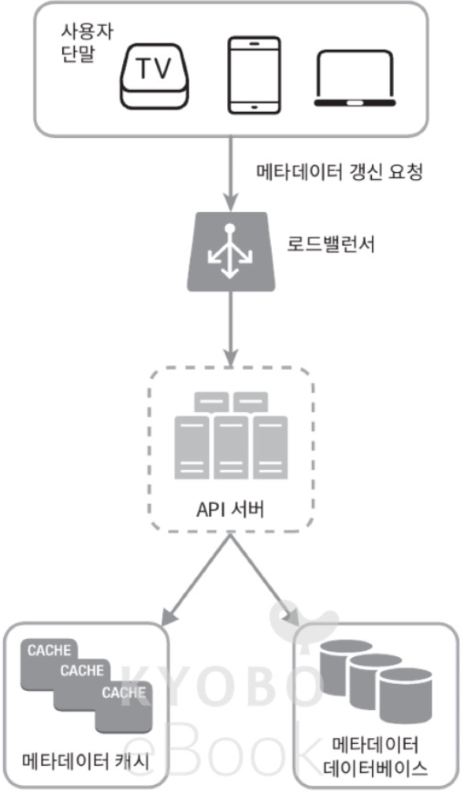
- 비디오 스트리밍 절차
  - 유튜브에서 비디오 재생버튼을 누르면 스트리밍 바로 시작됨 (비디오 다운로드가 완료돼야 영상을 볼 수 있는 등의 불편함은 없음)
    - 다운로드: 비디오를 단말로 내려받는 것
    - 스트리밍: 나의 장치가 원격지의 비디오로부터 지속적으로 비디오 스트림을 전송받아 영상을 재생하는 것
  - 스트리밍 프로토콜
    - 비디오 스트리밍을 위해 데이터를 전송할 때 쓰이는 표준화된 동신 방법
      - MPEG-DASH 
        - MPEG: Moving Picture Experts Group
        - DASH: Dynamic Adaptive Streaming over HTTP
      - 애플 HLS
        - HLS: HTTP Live Streaming
      - 마이크로소프트 스무드 스트리밍(Microsoft Smooth Streaming)
      - 어도비 HTTP 동적 스트리밍(Adobe HTTP Dynamic Streaming, HDS)
    - 각 프로토콜의 동작 원리를 정확하게 이해하거나 이름을 외울 핑료는 없음
      - 프로토콜마다 지원하는 비디오 인코딩이 다르고, 플레이어도 다름
      - 비디오 스트리밍 서비스 설계 시, 서비스의 용례에 맞는 프로토콜을 잘 골라야 함
    - 비디오는 CDN에서 바로 스트리밍됨
      - 사용자의 단말에 가장 가까운 CDN 에지 서버(edge server)가 비디오 전송을 담당할 것
      - -> 전송 지연은 아주 낮음
      - 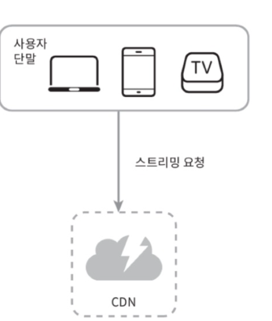
### 3. 상세 설계
> 지금까지 살펴본 비디오 업로드, 스트리밍을 최적화 방안, 상세 설계, 오류 처리 메커니즘 등 소개
- 비디오 트랜스코딩
  - 비디오 녹화 시 단말(전화나 카메라)은 해당 비디오를 특정 포맷으로 저장
  - 이 비디오가 다른 단말에서도 순조롭게 재생되려면, 다른 단말과 호환되는 bitrate와 포맷으로 저장되어야 함
    - 비트레이트: 비디오를 구성하는 비트가 얼마나 빨리 처리되어야 하는지를 나타내는 단위
      - 비트레이트가 높은 비디오는 일반적으로 고화질 비디오
      - 비트레이트가 높은 비디오 스트림을 정상 재생하려면 보다 높은 성능의 컴퓨팅 파워 필요, 인터넷 회선 속도도 빨라야 함
  - 비디오 트랜스코딩이 중요한 이유
    - 가공되지 않은 원본 비디오(raw video)는 저장 공간을 많이 차지함.
      - 예: 초당 60프레임으로 녹화된 HD 비디오는 수백 GB의 저장공간을 차지하게 될 수 있음
    - 상당수의 단말과 브라우저는 특정 종류의 비디오 포맷만 지원. 
      - 따라서 호환성 문제 해결을 위해서는 하나의 비디오를 여러 포맷으로 인코딩해두어야 함
    - 사용자에게 끊김 없는 고화질 비디오 재생을 보장하려면, 네트워크 대역폭이 충분하지 않은 사용자에게는 저화질 비디오를, 대역폭이 충분한 사용자에게는 고화질 비디오를 보내야 함
    - 모바일 단말의 경우 네트워크 상황이 수시로 달라질 수 있음
      - 비디오가 끊김 없이 재생되도록 하기 위해서, 비디오 화질 자동/수동 변경을 제공해야 함
  - 인코딩 포맷은 다양하나, 대부분은 다음 두 부분으로 구성됨
    - 컨테이너: 비디오 파일, 오디오, 메타데이터를 담는 바구니 같은 것
      - 컨테이너 포맷은 .avi, .mov, .mp4 같은 파일 확장자를 보면 알 수 있음
    - codec: 비디오 화질은 보존하면서 파일 크기를 줄일 목적으로 고안된 압축 및 압축 해제 알고리즘
      - 가장 많이 사용되는 비디오 코덱: H, 264, VP9, HEVC 등
  - 유향 비순환 그래프(DAG) 모델
    - 비디오 트랜스코딩: 컴퓨팅 자원, 시간 많이 소모
    - 콘텐츠 창작자는 자기만의 비디오 프로세싱 요구사항을 갖고 있음
      - 예: 비디오 위에 워터마크 표시, 섬네일 이미지 직접 제작, 고화질/저화질 비디오 요구 등
    - 각기 다른 유형의 비디오 프로세싱 파이프라인 지원 + 처리 과정의 병렬성을 높이기 위해, 적절한 수준의 추상화를 도입 -> 클라이언트 프로그래머로 하여금 실행할 작업을 직접 정의할 수 있도록 해야 함
      - 예: 페이스북의 스트리밍 비디오 엔진: 유향 비순환 그래프(DAG: Directed Acylic Graph)프로그래밍 모델 도입
        - 작업을 단계별로 배열할 수 있도록 함
        - 작업들이 순차적 또는 병렬적으로 실행될 수 있도록 함
      - 이 설계안에서도 위와 유사한 DAG 모델을 도입하여 유연성과 병렬성 제공
        - 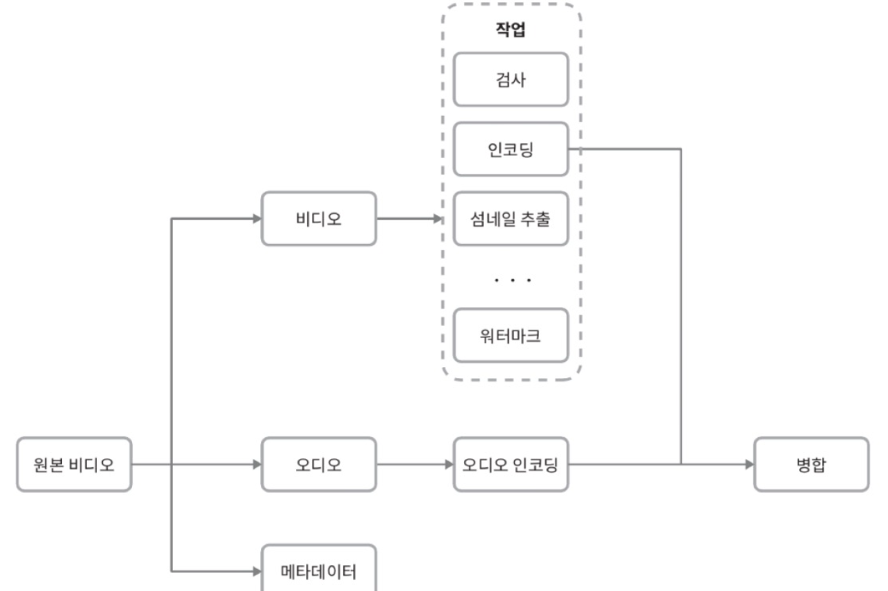
        - 이 설계안에서 채택한 DAG 모델
        - 원본 비디오를 비디오, 오디오, 메타데이터의 세 부분으로 나누어 처리
        - 비디오 부분에 적용되는 작업
          - 검사(inspection): 좋은 품질의 비디오인지, 손상은 없는지 확인하는 작업
          - 비디오 인코딩(video encoding): 비디오를 다양한 해상도, 코덱, 비트레이트 조합으로 인코딩하는 작업
            - 비디오 인코딩 결과물 사례
            - 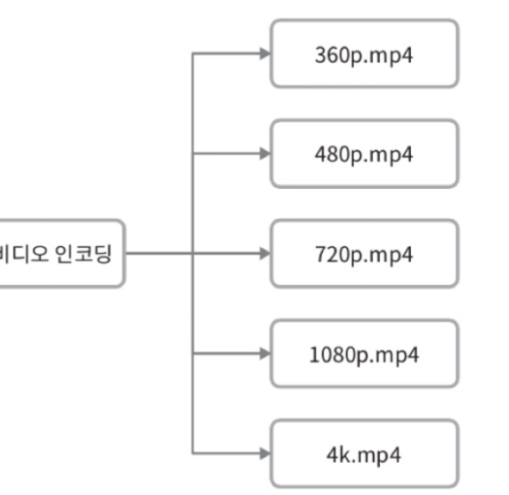
          - thumbnail: 사용자가 업로드한 이미지나 비디오에서 자동 추출된 이미지로 섬네일을 만드는 작업
          - 워터마크: 비디오에 대한 식별정보를 이미지 위에 오버레이 형태로 띄워 표시하는 작업
  - 비디오 트랜스코딩 아키텍처
  - 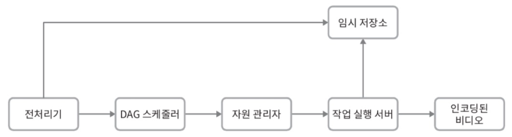
    - 전처리기(preprocessor), DAG 스케줄러, 자원 관리자(resource manager), 작업 실행 서버(resource worker), 임시 저장소(temporary storage)의 다섯 주요 컴포넌트로 구성됨.
    - 이 아키텍처 동작 결과로 인코딩된 비디오가 만들어짐
    - 전처리기 역할
      1. 비디오 분할(video splitting): 비디오 스트림을 GOP(Group of Pictures)라는 단위로 쪼갬.
        - GOP는 특정 순서로 배열된 frame 그룹
        - 하나의 GOP는 독립적으로 재생 가능, 길이는 보통 몇 초 정도
        - 오래된 단말이나 브라우저는 GOP 단위의 비디오 분할을 지원하지 않음
          - 그런 단말은 전처리기가 비디오 분할을 대신함
      2. DAG 생성: 클라이언트 프로그래머가 작성한 설정 파일에 따라 DAG를 만들어냄
        - 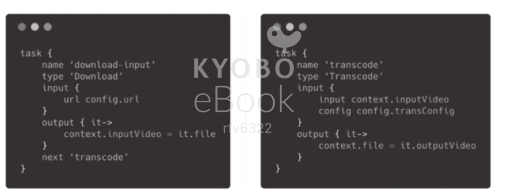
        - 
        - 위의 설정파일로부터 생성된 DAG의 사례 (노드 2개와 1개 연결선으로 구성된 DAG 사례)
      3. 데이터 캐시: 전처리기는 분할된 비디오의 캐시이기도 함
         - 안정성을 높이기 위해 전처리기는 GOP와 메타데이터를 임시저장소(temporary storage)에 보관함
         - 비디오 인코딩 실패 시, 시스템은 이렇게 보관된 데이터를 활용해 인코딩 재개
    - DAG 스케줄러
      - DAG 그래프를 몇 개 단계(stage)로 분할한 다음에 그 각각을 자원 관리자의 작업 큐에 집어 넣음
      - 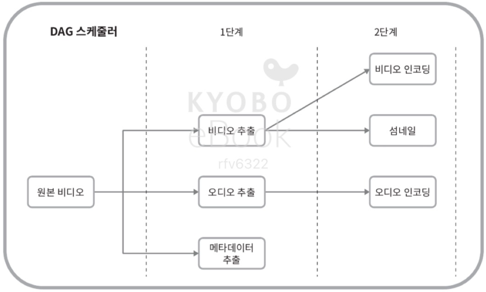
      - DAG 스케줄러 동작 사례
        - 하나의 DAG 그래프를 2개 작업 단계로 쪼갠 사례
        - 첫 단계: 비디오, 오디오, 메타데이터 분리
        - 두번째 단계: 해당 비디오 파일 인코딩 및 섬네일 추추르 오디오 파일 인코딩
    - 자원 관리자
      - 자원 배분을 효과적으로 수행
      - 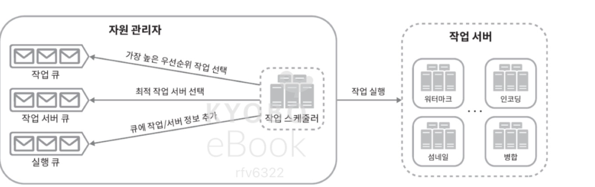
      - 세 개의 큐와 작업 스케줄러로 구성됨
        - 작업 큐: 실행할 작업이 보관되어 있는 우선순위 큐
        - 작업 서버 큐: 작업 서버의 가용 상태 정보가 보관되어 있는 우선순위 큐
        - 실행 큐: 현재 실행 중인 작업 및 작업 서버 정보가 보관되어 있는 큐
        - 작업 스케줄러: 최적의 작업/서버 조합을 골라, 해당 작업 서버가 작업을 수행하도록 지시하는 역할
      - 작업 관리자 동작 과정
        - 작업 관리자는 작업 큐에서 가장 높은 우선순위의 작업을 꺼냄
        - 작업 관리자는 해당 작업을 실행하기 적합한 작업 서버를 고름
        - 작업 스케줄러는 해당 작업 서버에게 작업 실행 지시
        - 작업 스케줄러는 해당 작업이 어떤 서버에게 할당되었는지에 대한 정보를 실행 큐에 넣음
        - 작업 스케줄러는 작업 완료 시 해당 작업을 실행 큐에서 제거
    - 작업 서버
      - DAG에 정의된 작업 수행
      - 작업 종류에 따라 작업 서버도 구분하여 관리
      - 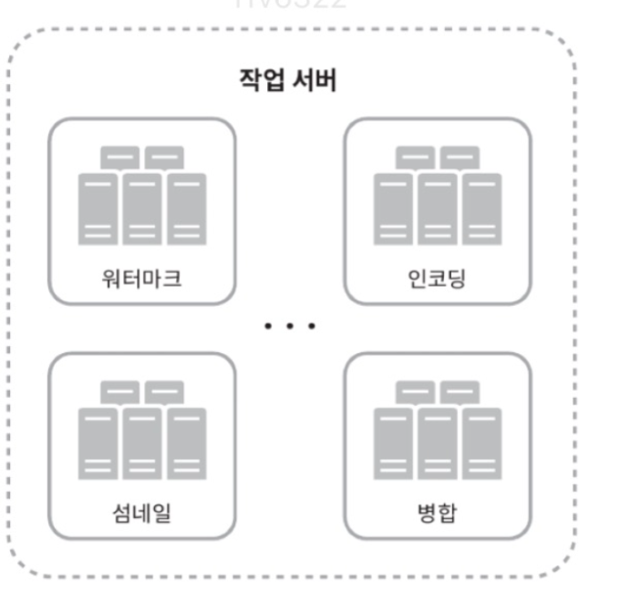
    - 임시 저장소
      - 여러 저장소 시스템 활용 가능
      - 어떤 시스템 선택: 저장할 데이터 유형, 크기, 이용 빈도, 데이터 유효기간 등에 따라 달라짐
      - 예: 메타데이터는 작업 서버가 빈번히 참조하는 정보, 크기도 작음
        - -> 메모리에 캐시해두면 좋음
      - 예: 비디오/오디오 데이터는 BLOB 저장소에 두는 것이 바람직
      - 임시 저장소에 보관한 데이터는 비디오 프로세싱 완료 시 삭제
    - 인코딩된 비디오
      - 인코딩 파이프라인의 최종 결과물
      - funny_720p.mp4같은 이름을 가짐
- 시스템 최적화
  - 속도, 안전성, 비용 측면에서 시스템 최적화
  - 속도 최적화: 비디오 병렬 업로드
    - 비디오 전부를 한 번의 업로드로 올리는 것은 비효율적
    - 하나의 비디오는 아래와 같이 작은 GOP들로 분할 가능
      - 
    - 이렇게 분할한 GOP를 병렬 업로드하면, 일부가 실패해도 빠르게 업로드 재개 가능
    - 따라서 비디오를 GOP 경계에 맞춰 분할하는 작업을 단말이 수행하면 아래와 같이 업로드 속도를 높일 수 있음
      - 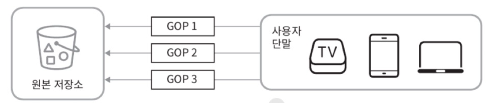
  - 속도 최적화: 업로드 센터를 사용자 근거리에 지정
    - 업로드 센터를 여러 곳에 두어 업로드 속도 개선
    - 미국 거주자는 비디오를 북미 지역 업로드 센터로 보내도록 하고, 중국 사용자는 아시아 업로드 센터로 보내도록 함
    - 이 설계안은 CDN을 업로드 센터로 이용
  - 속도 최적화: 모든 절차를 병렬화
    - 낮은 응답 지연 달성: 느슨하게 결합된 시스템을 만들어 병렬성을 높이기
    - 위의 설계안을 변경해야 함
    - 비디오를 원본 저장소 -> CDN으로 옮기는 절차 
      - 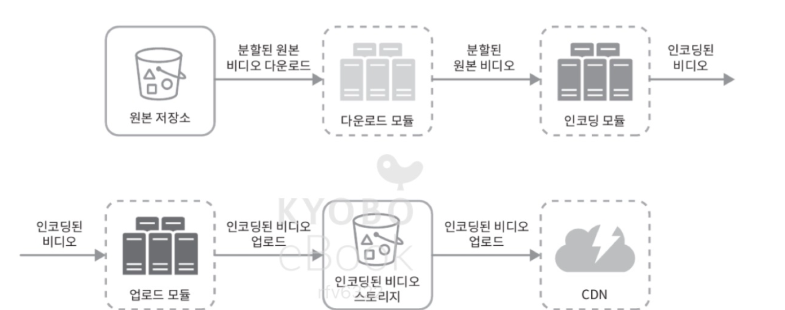
    - 위 시스템의 결합도를 낮추기 위해, 아래와 깉이 메시지 큐 도입
      - 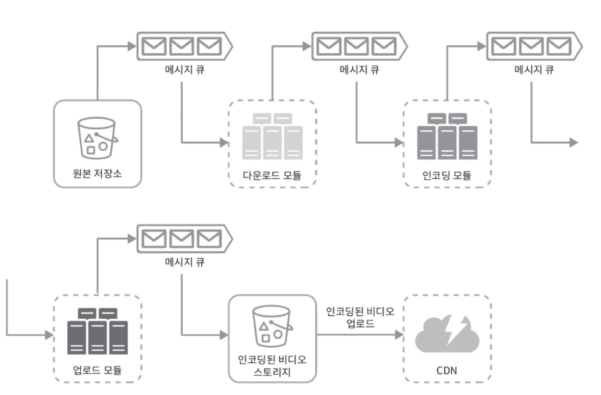
    - 메시지 큐가 시스템 결합도를 낮추는 예시
      - 메시지 큐 도입 전, 인코딩 모듈은 다운로드 모듈의 작업이 끝나기를 기다렸어야 함
      - 메시지 큐 도입 이후, 인코딩 모듈은 다운로드 모듈의 작업이 끝나기를 더 이상 기다릴 필요 x
      - 메시지 큐에 보관된 이벤트 각각을 인코딩 모듈이 병렬적으로 처리 가능
  - 안정성 최적화: 미리 사인된 업로드 URL
    - 허가받은 사용자만이 올바른 저장소에 비디오를 업로드할 수 있게 하기 위해, 미리 사인된(pre-signed) 업로드 URL 이용
      - 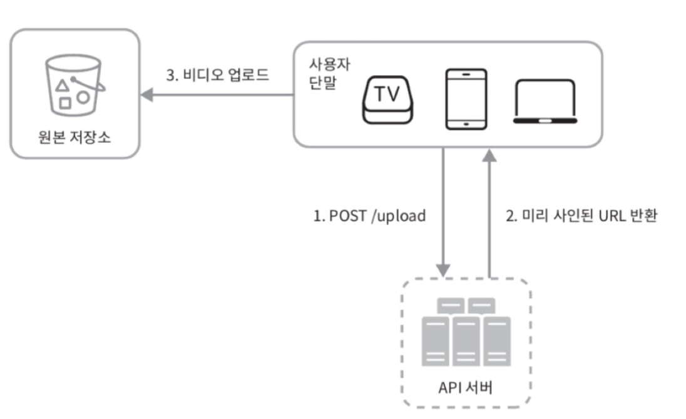
    - 업로드 절차 다음과 같이 변경
      1. 클라이언트는 HTTP 서버에 POST 요청을 하여 미리 사인된 URL을 받음
         - 해당 URL이 가리키는 객체에 대한 접근이 이미 주어져 있는 상태
         - 'presigned url'이라는 용어는 아마존 s3에서 쓰이는 용어로, 다른 클라우드 업체는 다른 이름을 사용할 수도 있음
         - 마이크로소프트 azure가 제공하는 BLOB 저장소는 같은 기능을 "접근 공유 시그니처(Shared Access Singature)"라고 부름
      2. API 서버는 미리 사인된 URL을 돌려줌
      3. 클라이언트는 해당 URL이 가리키는 위치에 비디오 업로드
  - 안전성 최적화: 비디오 보호
    - 많은 콘텐츠 제작자가 비디오 원본을 도난당하는 것을 우려하여 인터넷에 비디오를 업로드하는 것을 주저함
    - 비디오 저작권 보고 방법
      - 디지털 저작권 관리(DRM: Digital Rights Management) 시스템 도입
        - 애플의 페어플레이(FairPlay)
        - 구글의 와이드바인(Widevine)
        - 마이크로소프트의 플레이레디(PlayReady)
      - AES 암호화(encryption)
        - 비디오를 암호화하고 접근 권한을 설정
        - 암호화된 비디오는 재생 시에만 복화함
        - 허락된 사용자만 암호화된 비디오를 시청할 수 있다
      - 워터마크(watermark)
        - 비디오 위에 소유자 정보를 포함하는 이미지 오버레이를 올리는 것
        - 회사 로고나 이름 등을 이 용도에 사용
  - 비용 최적화
    - CDN은 이 시스템의 핵심 부분이지만 비쌈
    - 데이터 크기가 클수록 비쌈
    - 유튜브의 비디오 스트리밍은 롱테일 분포를 따름
      - 인기있는 비디오는 빈번히 재생되고, 나머지는 거의 보는 사람이 없음
    - 이를 반영하여 최적화 시도
      1. 인기 비디오는 CDN을 통해 재생, 다른 비디오는 비디오 서버를 통해 재생
         - 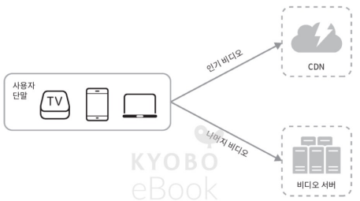
      2. 인기가 별로 없는 비디오는 인코딩 할 필요가 없을 수 있음: 짧은 비디오라면 필요할 때 인코딩하여 재생할 수 있음
      3. 어떤 비디오는 특정 지역에서만 인기가 높음: 이런 비디오는 다른 지역에 옮길 필요가 없음
      4. CDN을 직접 구축하고 인터넷 서비스 제공자(ISP: Internet Service Provider)와 제휴
         - CDN을 직접 구축하는 것은 초대형 프로젝트임 (대규모 스트리밍 사업자는 이렇게 해야할 수도 있음)
         - ISP로는 컴캐스트, AT&T, 버라이즌 등이 있다
         - ISP는 전세계 어디나 있으며 사용자와 가까움
         - 이들과 제휴하면 사용자 경험 향상, 인터넷 사용 비용 절감 가능
  - 모든 최적화는 콘텐츠 인기도, 이용 패턴, 비디오 크기 등의 데이터에 근거한 것
  - 최적화를 시도하기 전에 시청 패턴을 분석하는 것 중요함
- 오류 처리
  - 장애를 잘 감내하는 시스템을 만들려면, 오류를 우아하게 처리하고 빠르게 회복해야 함
  - 시스템 오류 종류
    - 회복 가능 오류
      - 특정 비디오 세그먼트를 트랜스코딩하다가 실패하는 등의 오류는 회복 가능한 오류
      - 일반적으로, 이런 오류는 몇 번 재시도하면 해결됨
      - 계속해서 실패하고 복구가 어렵다고 판단되면, 클라이언트에게 적절한 오류 코드를 반환해야 함
    - 회복 불가능 오류
      - 비디오 포맷이 잘못되는 등의 회복 불가능한 오류가 발견되면, 시스템은 해당 비디오에 대한 작업을 중단하고 클라이언트에게 적절한 오류 코드를 반환해야 함
  - 시스템 컴포넌트 각각에 발생할 수 있는 오류에 대한 전형적 해결 방법
    - 업로드 오류: 몇 회 재시도
    - 비디오 분할 오류: 낡은 버전의 클라이언트가 GOP 경계에 따라 비디오를 분할하지 못하는 경우라면, 전체 비디오를 서버로 전송하고 서버가 해당 비디오 분할을 처리하도록 함
    - 트랜스코딩 오류: 재시도
    - 전처리 오류: DAG 그래프 재생성
    - DAG 스케줄러 오류: 작업을 다시 스케줄링
    - 자원 관리자 큐에 장애 발생: 사본(replica)를 이용
    - 작업 서버 장애: 다른 서버에서 해당 작업 재시도
    - API 서버 장애: API 서버는 무상태 서버이므로, 신규 요청은 다른 API 서버로 우회될 것
    - 메타데이터 캐시 서버 장애: 데이터는 다중화되어 있으므로 다른 노드에서 데이터를 여전히 가져올 수 있을 것임. 장애가 난 캐시 서버는 새로운 것으로 교체
    - 메타데이터 데이터베이스 서버 장애:
      - 주 서버가 죽었다면 부 서버 가운데 하나를 주 서버로 교체
      - 부 서버가 죽었다면 다른 부 서버를 통해 읽기 연산을 처리하고, 죽은 서버는 새것으로 교체
### 4. 마무리
- 추가 논의 사항
  - API 계층의 규모 확장성 확보 방안: API 서버는 무상태 서버이므로 수평적 규모 확장이 가능하다는 사실 언급
  - 데이터베이스 계층의 규모 확장성 확보 방안: 데이터베이스의 다중화와 샤딩 방법 언급
  - 라이브 스트리밍: 비디오를 실시간으로 녹화하고 방송하는 절차
    - 이 설계안은 라이브 스트리밍 용 설계안은 아니지만, 라이브 스트리밍 시스템과 비-라이브 스트리밍 시스템 간 비슷한 점도 많음
    - 비디오 업로드, 인코딩, 스트리밍이 모두 필요하다는 점에서 같음
    - 차이
      - 라이브 스트리밍의 경우, 응답 지연이 좀 더 낮아야 함. -> 스트리밍 프로토콜 선정에 유의해야 함
      - 라이브 스트리밍의 경우, 병렬화 필요성은 떨어짐: 작은 단위의 데이터를 실시간으로 빨리 처리해야 하기 때문
      - 라이브 스트리밍의 경우, 오류 처리 방안이 달라짐: 너무 많은 시간이 걸리는 방안은 사용하기 어려움
  - 비디오 삭제(takedown): 저작권을 위반한 비디오, 선정적 비디오, 불법적 행위에 관계된 비디오는 내려야 함
    - 내릴 비디오는 업로드 과정에서 식별해낼 수도 있고
    - 사용자의 신고 절차를 통해 판별할 수도 있음