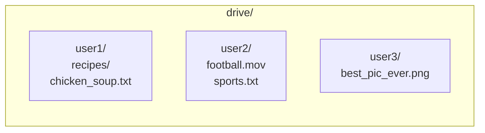
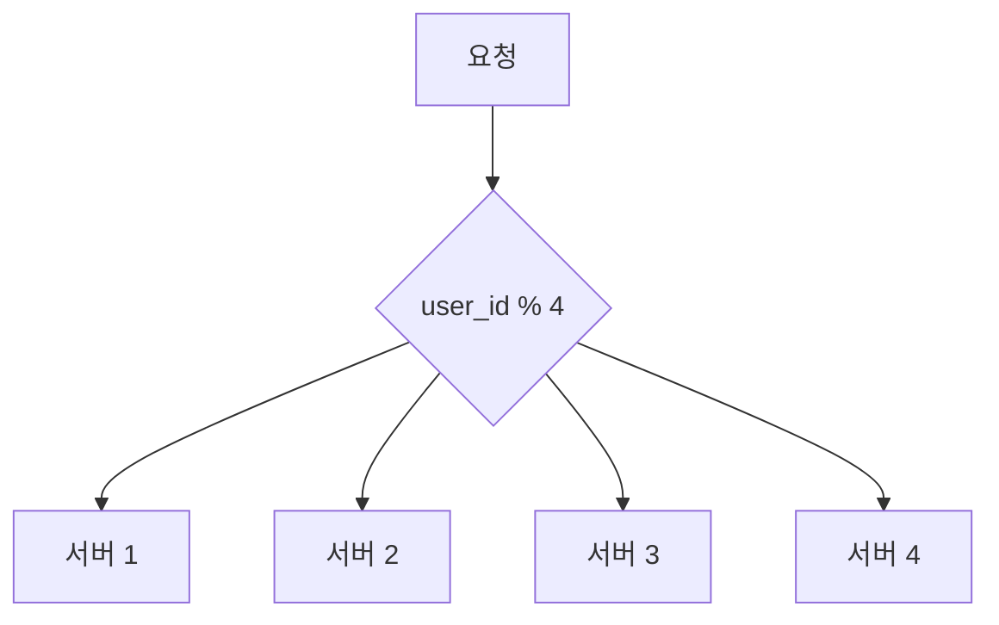
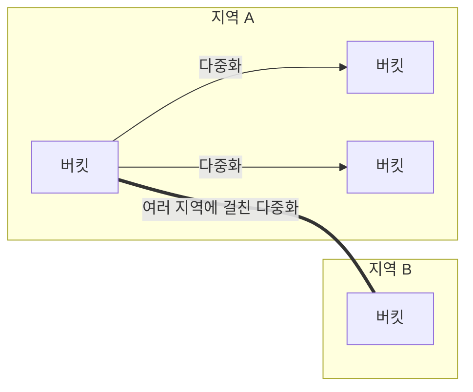
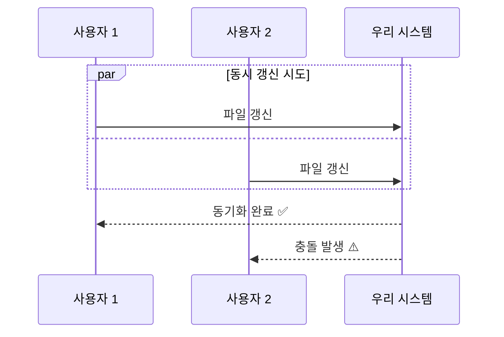
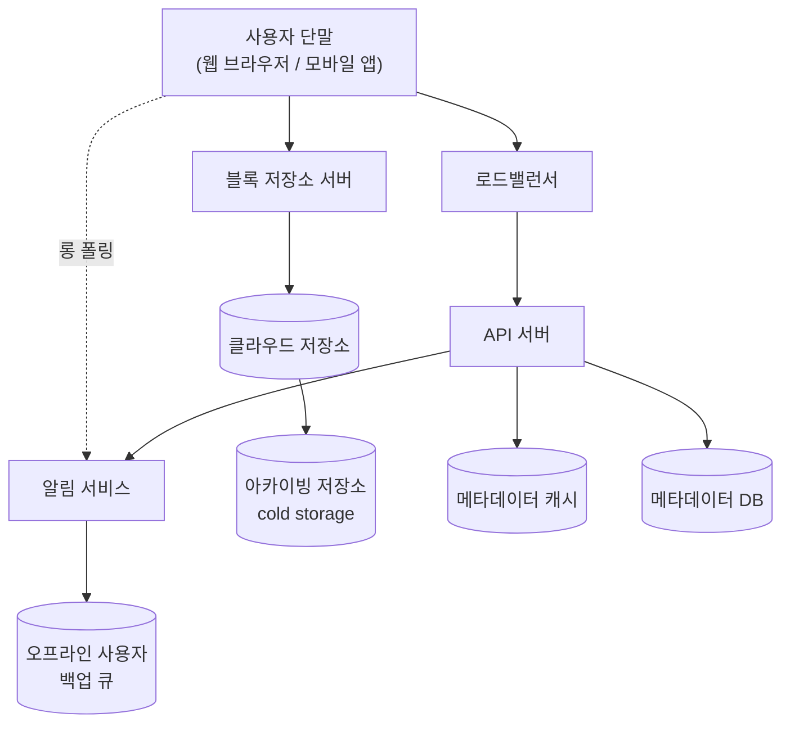
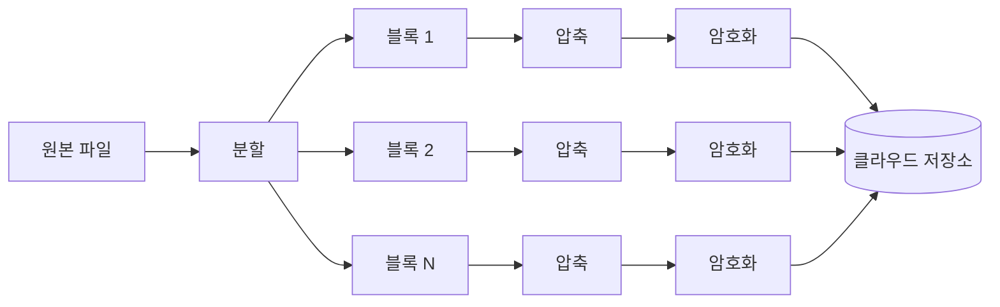
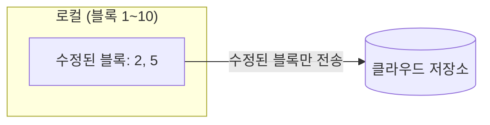
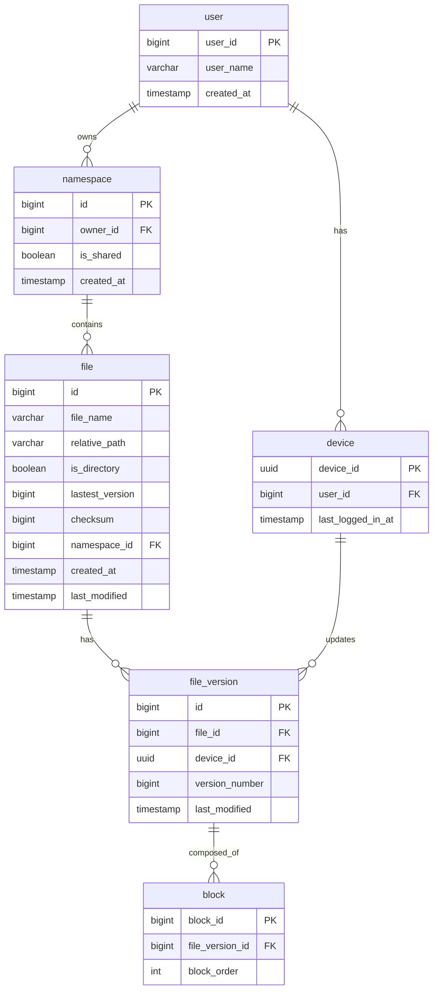
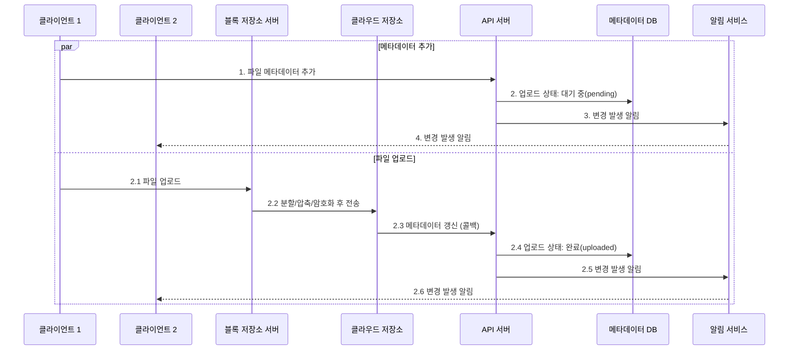
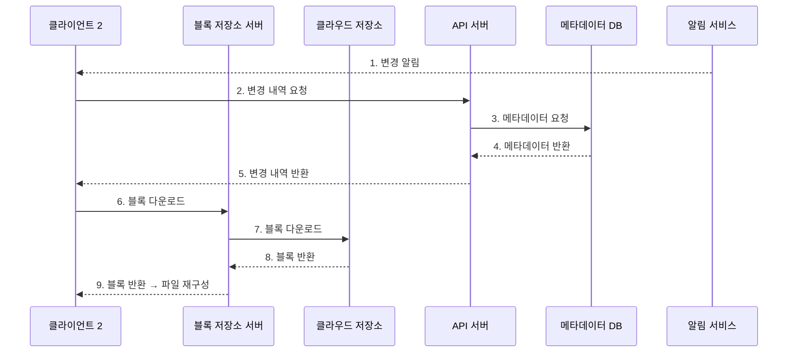

# 구글 드라이브 설계

## 목차
1. [구글 드라이브란?](#구글-드라이브란)
2. [1단계: 문제 이해 및 설계 범위 확정](#1단계-문제-이해-및-설계-범위-확정)
3. [2단계: 개략적 설계안 제시 및 동의 구하기](#2단계-개략적-설계안-제시-및-동의-구하기)
4. [3단계: 상세 설계](#3단계-상세-설계)
5. [4단계: 마무리](#4단계-마무리)

<br />
<br />

## 구글 드라이브란?

구글 드라이브는 **파일 저장 및 동기화 서비스**로, 문서·사진·비디오·기타 파일을 클라우드에 보관할 수 있도록 한다. 컴퓨터, 스마트폰, 태블릿 등 어떤 단말에서도 이용 가능해야 하며, 보관된 파일은 친구·가족·동료와 손쉽게 공유할 수 있어야 한다.

> 비슷한 유형의 면접 문제: "드롭박스 설계", "원드라이브 설계", "아이클라우드 설계"

<br />
<br />

## 1단계: 문제 이해 및 설계 범위 확정

구글 드라이브를 설계하는 것은 큰 프로젝트이므로, 질문을 통해 설계 범위를 좁혀야 한다.

### 질문과 답변 사례

| 질문 | 답변 |
|------|------|
| 가장 중요하게 지원해야 할 기능들은? | 파일 업로드/다운로드, 파일 동기화, 알림(notification) |
| 모바일 앱과 웹 앱 둘 다 지원해야 하나요? | 둘 다 지원해야 한다. |
| 파일을 암호화해야 할까요? | 네. |
| 파일 크기 제한이 있나요? | 10GB 제한 |
| 사용자는 얼마나 되나요? | DAU 기준 천만(10M) 명 |

<br />

### 설계할 기능

- **파일 추가**: 가장 쉬운 방법은 파일을 구글 드라이브 안으로 떨구는(drag-and-drop) 방식
- **파일 다운로드**
- **여러 단말에 파일 동기화**: 한 단말에서 추가하면 다른 단말에도 자동 동기화
- **파일 갱신 이력 조회(revision history)**
- **파일 공유**
- **파일이 편집/삭제/공유되었을 때 알림 표시**

> 제외 범위: 구글 문서(Google doc) 같은 동시 편집 협업 기능은 다루지 않는다.

<br />

### 비기능적 요구사항

| 항목 | 내용 |
|------|------|
| **안정성** | 데이터 손실은 절대 발생해서는 안 된다. |
| **빠른 동기화 속도** | 동기화에 시간이 너무 걸리면 사용자가 이탈한다. |
| **네트워크 대역폭** | 모바일 데이터 사용 시를 고려해 대역폭 사용량을 최소화해야 한다. |
| **규모 확장성** | 아주 많은 양의 트래픽도 처리 가능해야 한다. |
| **높은 가용성** | 일부 서버 장애·지연·네트워크 단절 시에도 사용 가능해야 한다. |

<br />

### 개략적 추정치

- 가입 사용자 5천만(50M) 명, DAU 천만(10M) 명
- 모든 사용자에게 **10GB의 무료 저장공간** 할당
- 매일 각 사용자가 평균 **2개의 파일**을 업로드, 평균 크기 **500KB**
- 읽기:쓰기 비율 = **1:1**
- **필요 저장공간 총량** = 5천만 × 10GB = **500PB**
- **업로드 API QPS** = 1천만 × 2 / 86,400초 ≈ **240**
- **최대 QPS** = QPS × 2 = **480**

<br />
<br />

## 2단계: 개략적 설계안 제시 및 동의 구하기

이번에는 다이어그램부터 시작하지 않고, **단일 서버에서 출발해 점진적으로 천만 사용자 시스템으로 발전**시키는 접근을 취한다.

### 단일 서버 시작점

먼저 한 대의 서버 구성으로 시작한다.

- **웹 서버**: 파일 업로드/다운로드 처리 (Apache)
- **데이터베이스**: 사용자/로그인/파일 메타데이터 보관 (MySQL)
- **저장소**: `drive/` 디렉터리 (1TB 사용)

`drive/` 디렉터리 안에는 사용자별 **네임스페이스(namespace)** 라 불리는 하위 디렉터리를 둔다. 각 파일과 폴더는 (네임스페이스 + 상대 경로) 조합으로 유일하게 식별된다.



<br />

### API 설계

기본적으로 **세 가지 API**가 필요하다. 모든 API는 사용자 인증을 요구하며 HTTPS(SSL)를 사용한다.

#### 1. 파일 업로드 API

두 가지 종류의 업로드를 지원한다.

| 종류 | 설명 |
|------|------|
| **단순 업로드** | 파일 크기가 작을 때 사용 |
| **이어 올리기(resumable upload)** | 파일이 크고 네트워크 문제로 중단될 가능성이 클 때 사용 |

```
https://api.example.com/files/upload?uploadType=resumable
```

이어 올리기 절차:
1. 이어 올리기 URL을 받기 위한 최초 요청 전송
2. 데이터를 업로드하고 업로드 상태 모니터링
3. 업로드 장애 발생 시 장애 발생 시점부터 업로드 재시작

#### 2. 파일 다운로드 API

```
https://api.example.com/files/download
```

```json
{ "path": "/recipes/soup/best_soup.txt" }
```

#### 3. 파일 갱신 히스토리 API

```
https://api.example.com/files/list_revisions
```

```json
{ "path": "/recipes/soup/best_soup.txt", "limit": 20 }
```

<br />

### 단일 서버의 한계 극복

업로드되는 파일이 많아지면 결국 파일 시스템이 가득 찬다. 가장 먼저 떠오르는 해결책은 **샤딩(sharding)** 으로, `user_id` 기준으로 여러 서버에 데이터를 나누어 저장하는 것이다.



샤딩만으로는 데이터 손실 우려가 남는다. 따라서 **아마존 S3**를 저장소로 채택한다.
- S3는 다중화를 지원하고, 같은 지역(region) 내 다중화 또는 여러 지역에 걸친 다중화 모두 가능하다.
- 가용성 보장과 데이터 손실 방지를 위해 **여러 지역에 걸친 다중화**를 적용한다.



<br />

### 추가 개선 항목

| 항목 | 개선 내용 |
|------|----------|
| **로드밸런서** | 트래픽을 고르게 분산하고 장애 서버를 자동으로 우회 |
| **웹 서버** | 로드밸런서 뒤에 다수 배치하여 트래픽 폭증에 대응 |
| **메타데이터 DB** | 파일 저장소에서 분리하여 SPOF 회피, 다중화·샤딩 적용 |
| **파일 저장소** | S3 사용, 두 개 이상의 지역에 다중화 |

<br />

### 동기화 충돌

대형 저장소 시스템에서는 **두 명 이상의 사용자가 같은 파일·폴더를 동시에 업데이트**할 때 충돌이 발생할 수 있다.

> 충돌 해소 전략: **먼저 처리되는 변경은 성공**으로 보고, **나중에 처리되는 변경은 충돌**로 표시한다.



충돌이 발생하면 시스템에는 같은 파일의 두 가지 버전이 존재한다. 사용자는 두 파일을 **합치거나 하나를 다른 파일로 대체**하는 결정을 내려야 한다.

```
SystemDesignInterview
SystemDesignInterview_user 2_conflicted_copy_2019-05-01
```

<br />

### 개략적 설계안 (전체 컴포넌트)



| 컴포넌트 | 역할 |
|---------|------|
| **사용자 단말** | 웹 브라우저, 모바일 앱 등 클라이언트 |
| **블록 저장소 서버** | 파일을 블록으로 쪼개 클라우드 저장소에 업로드. 각 블록에 고유 해시값 할당 |
| **클라우드 저장소** | 파일이 블록 단위로 보관됨 (S3) |
| **아카이빙 저장소** | 오랫동안 사용되지 않은 비활성 데이터 보관 (cold storage) |
| **로드밸런서** | API 서버에 요청을 고르게 분산 |
| **API 서버** | 파일 업로드 외 거의 모든 것 담당 (인증, 프로필 관리, 메타데이터 갱신) |
| **메타데이터 DB** | 사용자/파일/블록/버전 메타데이터 관리 (실제 파일은 클라우드에) |
| **메타데이터 캐시** | 자주 쓰이는 메타데이터를 캐싱하여 성능 향상 |
| **알림 서비스** | 발생/구독 프로토콜 기반. 파일 추가/편집/삭제 이벤트를 클라이언트에 알림 |
| **오프라인 사용자 백업 큐** | 클라이언트가 오프라인일 때 알림을 큐에 저장 후 재접속 시 동기화 |

<br />
<br />

## 3단계: 상세 설계

### 블록 저장소 서버

큰 파일을 매번 통째로 보내면 네트워크 대역폭을 많이 잡아먹는다. 이를 최적화하는 두 가지 방법이 있다.

| 최적화 | 설명 |
|--------|------|
| **델타 동기화(delta sync)** | 파일이 수정되면 전체 파일 대신 수정된 블록만 동기화 |
| **압축(compression)** | 블록 단위로 압축. 파일 유형별로 압축 알고리즘 선택 (텍스트는 gzip/bzip2, 이미지·비디오는 다른 알고리즘) |

블록 저장소 서버는 다음 작업을 처리한다.
- 클라이언트가 보낸 파일을 **블록 단위로 분할** (드롭박스 사례 참고, 한 블록 최대 4MB)
- 각 블록에 **압축 알고리즘 적용**
- **암호화** 후 저장소 시스템으로 전송
- 전체 파일이 아닌 **수정된 블록만 전송**



**델타 동기화 예시**: 블록 2와 블록 5만 수정된 경우, 이 두 블록만 클라우드 저장소에 업로드한다.



<br />

### 높은 일관성 요구사항

이 시스템은 **강한 일관성(strong consistency)** 모델을 기본으로 지원해야 한다. 같은 파일이 단말이나 사용자에 따라 다르게 보이는 것은 허용할 수 없다.

메모리 캐시는 보통 최종 일관성(eventual consistency)을 지원하므로, 강한 일관성을 달성하려면:
- 캐시에 보관된 사본과 DB 원본이 **일치**해야 한다.
- DB 원본에 변경이 발생하면 캐시 사본을 **무효화**한다.

> 관계형 DB는 **ACID**를 보장하므로 강한 일관성이 쉽다. NoSQL은 동기화 로직을 직접 구현해야 하므로, **관계형 DB 채택**.

<br />

### 메타데이터 데이터베이스 스키마



| 테이블 | 설명 |
|--------|------|
| **user** | 이름·이메일·프로필 등 사용자 기본 정보 |
| **device** | 단말 정보. `push_id`는 모바일 푸시 알림용. 한 사용자가 여러 단말 보유 가능 |
| **namespace** | 사용자의 루트 디렉터리 정보 |
| **file** | 파일의 최신 정보 |
| **file_version** | 파일 갱신 이력. **읽기 전용** (이력 훼손 방지) |
| **block** | 파일 블록 정보. 블록을 올바른 순서로 조합하면 파일 복원 가능 |

<br />

### 업로드 절차

사용자가 파일을 업로드하면 두 개의 요청이 **병렬로** 전송된다.



<br />

### 다운로드 절차

파일이 새로 추가/편집되면 다운로드가 자동으로 시작된다. 클라이언트가 변경 사실을 감지하는 두 가지 방법:

- **온라인 상태**: 알림 서비스가 클라이언트 A에게 변경 발생을 알린다 → 새 버전을 끌어간다.
- **오프라인 상태**: 데이터를 캐시에 보관 → 접속 중으로 바뀌면 새 버전 가져간다.



<br />

### 알림 서비스

파일 일관성을 유지하기 위해, 클라이언트는 로컬 파일 수정을 감지하는 순간 다른 클라이언트에 그 사실을 알려 충돌 가능성을 줄여야 한다.

| 방식 | 설명 |
|------|------|
| **롱 폴링(long polling)** | 드롭박스가 채택. 클라이언트는 알림 서버와 연결을 유지하다가 변경 감지 시 연결을 끊고 재요청 |
| **웹소켓(WebSocket)** | 지속적 양방향 통신 채널 |

> **본 설계에서는 롱 폴링 채택.**
> - 채팅과 달리 이 시스템은 양방향 통신이 필요하지 않음 (서버 → 클라이언트 단방향)
> - 알림 빈도가 낮고, 알림 시 보낼 데이터 양도 적음 → 웹소켓이 과함

롱 폴링 동작:
1. 클라이언트가 알림 서버와 롱 폴링 연결 유지
2. 특정 파일에 변경 감지 → 연결 끊음
3. 클라이언트는 메타데이터 서버와 연결해 최신 내역 다운로드
4. 다운로드 완료 또는 타임아웃 도달 시 → **즉시 새 요청을 보내 롱 폴링 연결 복원**

<br />

### 저장소 공간 절약

파일 갱신 이력 보존 + 안정성 보장을 위해 여러 버전을 여러 데이터센터에 보관해야 한다. 이대로면 저장 용량이 너무 빨리 소진되므로 다음 방법을 적용한다.

| 방법 | 설명 |
|------|------|
| **중복 제거(de-dupe)** | 중복된 파일 블록을 계정 차원에서 제거. 해시 값을 비교하여 판단 |
| **지능적 백업 전략 - 한도 설정** | 보관할 버전 개수 상한 설정. 상한 도달 시 가장 오래된 버전 폐기 |
| **지능적 백업 전략 - 중요 버전만 보관** | 자주 바뀌는 파일은 모든 버전이 아닌 중요한 버전만 선별 보관 |
| **아카이빙 저장소 활용** | 자주 쓰이지 않는 데이터는 cold storage(예: S3 Glacier)로 이동. 비용 훨씬 저렴 |

<br />

### 장애 처리

대규모 시스템에서 장애는 피할 수 없으므로 설계 시 반드시 고려해야 한다.

| 장애 유형 | 대응 방안 |
|----------|----------|
| **로드밸런서 장애** | 부(secondary) 로드밸런서가 활성화. heartbeat로 상태 모니터링 |
| **블록 저장소 서버 장애** | 다른 서버가 미완료/대기 작업 인계 |
| **클라우드 저장소 장애** | S3 버킷 다중화 → 다른 지역에서 가져옴 |
| **API 서버 장애** | API 서버는 무상태. 로드밸런서가 장애 서버로 트래픽 보내지 않아 격리 |
| **메타데이터 캐시 장애** | 캐시 다중화 → 다른 노드에서 데이터 가져옴 |
| **메타데이터 DB - 주(primary) 장애** | 부 서버 중 하나를 주로 승격, 새 부 서버 추가 |
| **메타데이터 DB - 부(secondary) 장애** | 다른 부 서버가 읽기 처리, 장애 서버는 새 것으로 교체 |
| **알림 서비스 장애** | 한 대 서버가 100만+ 롱 폴링 연결 관리. 장애 시 연결 재수립 필요 (느릴 수 있음) |
| **오프라인 사용자 백업 큐 장애** | 큐 다중화. 장애 시 클라이언트들이 백업 큐로 구독 관계 재설정 |

<br />
<br />

## 4단계: 마무리

이번 장에서는 **높은 수준의 일관성, 낮은 네트워크 지연, 빠른 동기화**가 요구되는 구글 드라이브 시스템을 설계했다. 설계안은 크게 두 부분으로 구성된다.

1. **파일 메타데이터 관리** 부분
2. **파일 동기화 처리** 부분

알림 서비스는 두 부분과 병존하는 또 하나의 중요 컴포넌트로, 롱 폴링을 사용하여 클라이언트가 파일 상태를 최신으로 유지할 수 있도록 한다.

<br />

### 다른 선택지 논의

#### 블록 저장소 서버를 거치지 않고 클라우드 저장소에 직접 업로드?

**장점**
- 파일 전송이 클라우드 저장소로 직접 이루어지므로 업로드 시간이 빨라짐

**단점**
- 분할/압축/암호화 로직을 클라이언트에 두어야 하므로 **플랫폼별로 따로 구현해야 함** (iOS, 안드로이드, 웹 등)
- **클라이언트가 해킹당할 가능성** → 암호화 로직을 클라이언트 안에 두는 것은 부적절

#### 접속 상태 관리 로직을 별도 서비스로 분리

알림 서비스에서 접속 상태 관리 로직을 분리해 별도 서비스로 옮기면, 다른 서비스에서도 쉽게 활용 가능하다.

<br />

> 면접에서 중요한 것은 **어떤 결정과 기술 선택을 했는지, 그 이면의 사고 과정을 설명할 수 있는 것**이다. 시간이 남으면 다른 선택지를 함께 논의해보면 좋다.
