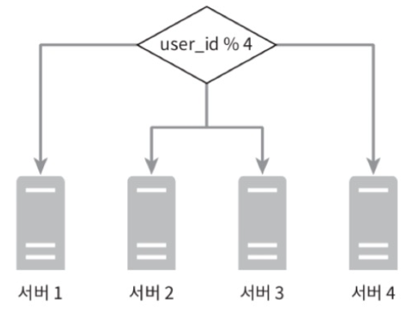
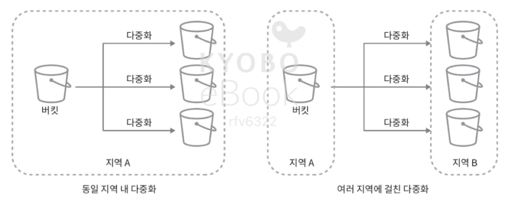
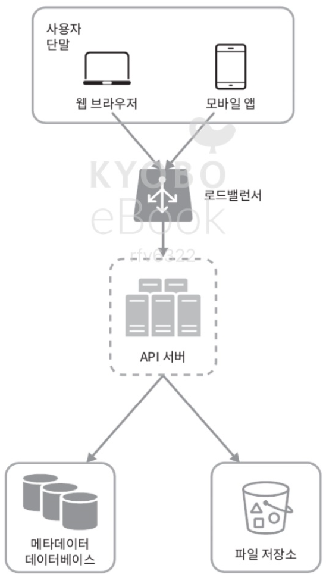
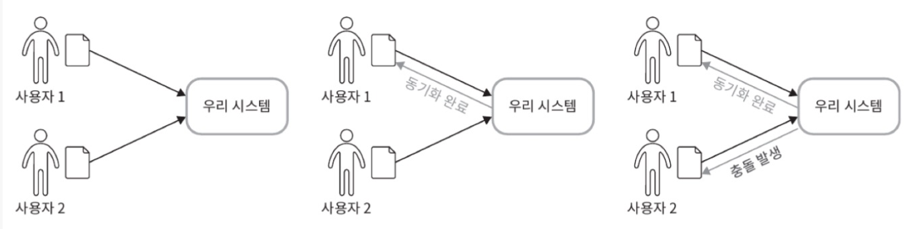
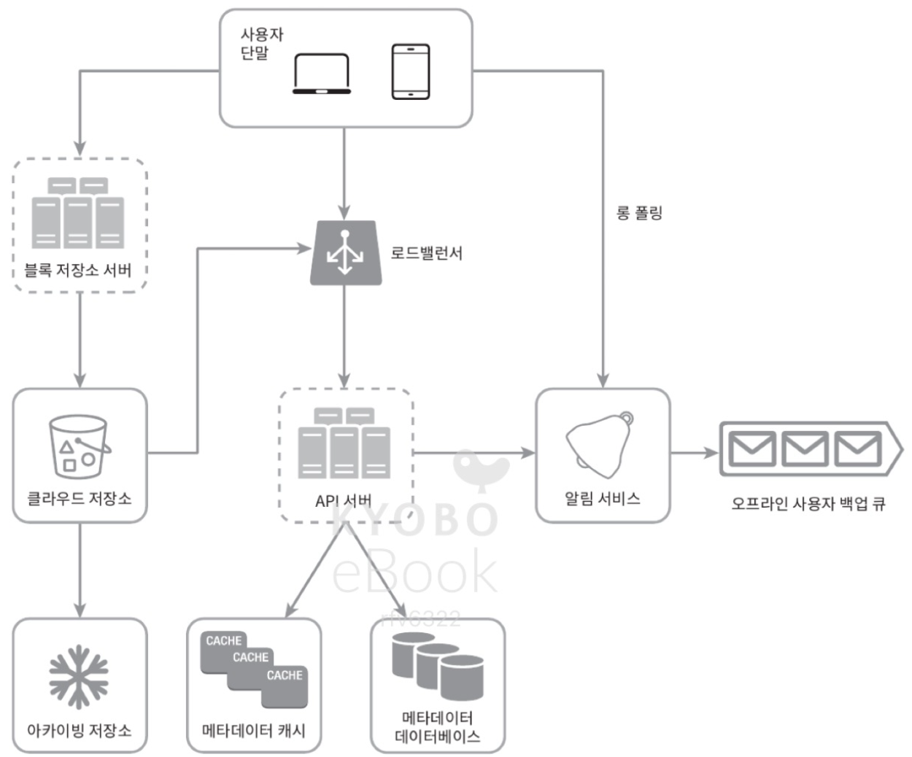
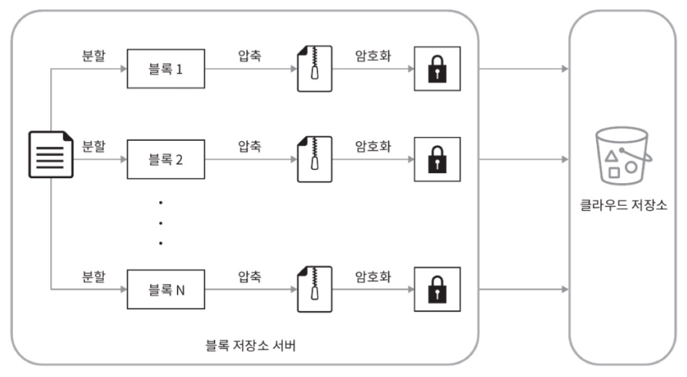
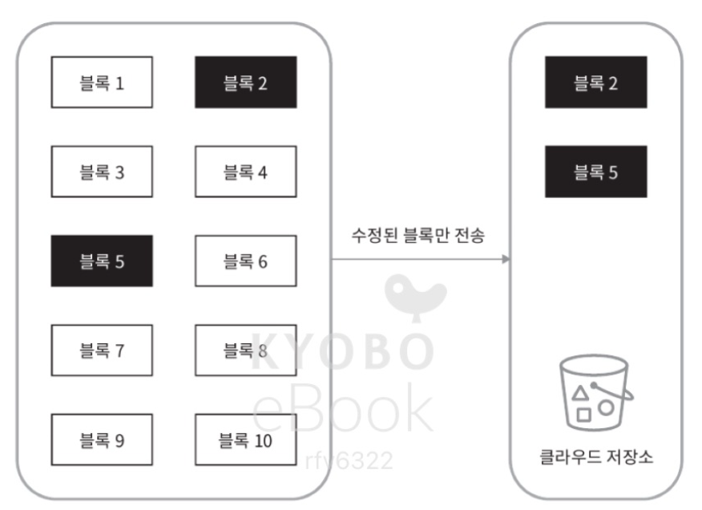
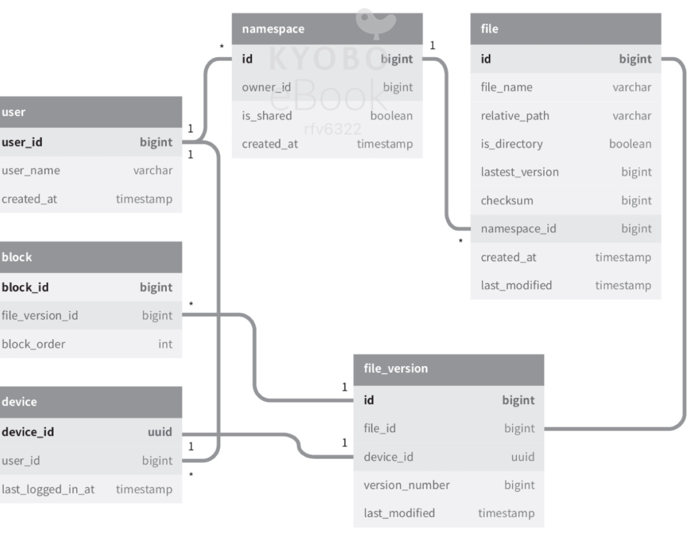
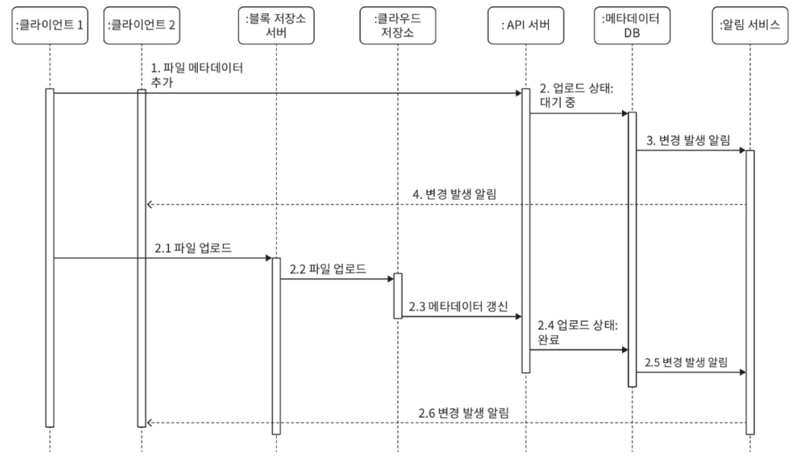
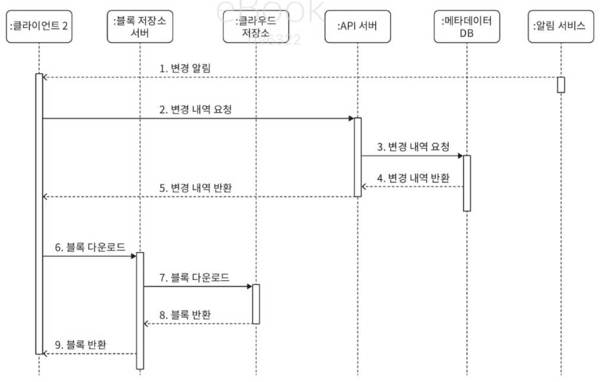

# 15. 구글 드라이브 설계
- 구글 드라이브 서비스
  - 파일 저장 및 동기화 서비스
  - 문서, 사진, 비디오, 기타 파일을 클라우드에 보관할 수 있도록 함
  - 해당 파일은 컴퓨터, 스마트폰, 태블릿 등 어떤 단말에서도 손쉽게 공유 가능해야 함

### 1. 문제 이해 및 설계 범위 확정
- 설계 범위 좁히기
  - 주요 기능: 파일 업로드/다운로드, 파일 동기화, 알림
  - 모바일 앱, 웹 앱 둘 다 지원
  - 파일 암호화 필요
  - 파일 크기 제한: 10GB
  - 일간 능동 사용자(DAU): 기준 천만명
- 설계할 기능
  - 파일 추가
    - 파일을 구글 드라이브 안으로 drag-and-drop 방식
  - 파일 다운로드
  - 여러 단말에 파일 동기화
    - 한 단말에서 파일을 추가하면, 다른 단말에도 자동으로 동기화 되어야 함
  - 파일 갱신 이력 조회 (revision history)
  - 파일 공유
  - 파일이 편집, 삭제, 새롭게 공유되었을 때 알림 표시
  > 구글 문서 편집 및 협업 기능은 논의하지 않을 것 (동시 편집 기능)
- 비기능적 요구사항
  - 안정성: 데이터 손실이 발생해서는 안됨
  - 빠른 동기화 속도: 파일 동기화 시간이 오래 걸려서는 안됨
  - 네트워크 대역폭: 네트워크 대역폭을 불필요하게 많이 소모해서는 안됨. (특히, 모바일 데이터 플랜)
  - 규모 확장성: 아주 많은 양의 트래픽을 처리 가능해야 함
  - 높은 가용성: 일부 서버에 장애가 발생하거나, 느려지거나, 네트워크 일부가 끊겨도 시스템은 계속 사용 가능해야 함
- 개략적 추정치
  - 가입 사용자는 오천만 명이고 천만 명의 DAU 사용자가 있다고 가정
  - 모든 사용자에게 10GB의 무료 저장공간 할당
  - 매일 각 사용자가 평균 2개의 파일을 업로드한다고 가정. 각 파일의 평균 크기는 500KB
  - 읽기:쓰기 비율은 1:1
  - 필요한 저장공간 총량=5천만 사용자x10GB=500Petabyte
  - 업로드 API QPS=1천만 사용자 x 2회 업로드 / 24시간 / 3600초 = 약 240
  - 최대 QPS=QPSx2=480
### 2. 개략적 설계안 제시 및 동의 구하기
- 모든 것을 담은 한 대 서버에서 출발해 점진적으로 천만 사용자 지원이 가능한 시스템으로 발전시켜 나가기
  - 파일을 올리고 다운로드하는 과정을 처리할 웹 서버
  - 사용자 데이터, 로그인 정보, 파일 정보 등의 메타데이터를 보관할 데이터베이스
  - 파일을 저장할 저장소 시스템, 파일 저장을 위해 1TB의 공간을 사용할 것
- 몇 시간 정도 들여 아파치 웹 서버를 설치하고, MySQL 데이터베이스를 깔고, 업로드되는 파일을 저장할 drive/ 디렉터리를 준비
  - drive/ 디렉터리 안에는 namespace라 불리는 하위 디렉터리들을 둠
  - 각 namespace에는 특정 사용자가 올린 파일이 보관됨
    - 파일들은 원래 파일과 같은 이름을 가짐
    - 각 파일과 폴더는 상대 경로를 네임스페이스 이름과 결합하여 유일하게 식별해 낼 수 있음
- API
  - 파일 업로드 API
    - 두 가지 종류의 업로드 지원
      - 단순 업로드: 파일 크기가 작을 때 사용
      - 이어 올리기(resumable upload): 파일 사이즈가 크고 네트워크 문제로 업로드가 중단될 가능성이 높다고 생각되면 사용
        - 이어 올리기 API
        - https://api.example.com/files/upload?uploadType=resumable
        - 인자
          - uploadType=resumable
          - data: 업로드할 로컬 파일
        - 이어 올리기 절차
          - 이어 올리기 URL을 받기 위한 최초 요청 전송
          - 데이터를 업로드하고 업로드 상태 모니터링
          - 업로드에 장애 발생 시 장애 발생 시점부터 업로드 재시작
  - 다운로드 API
    - https://api.example.com/files/download
      - 인자
        - path: 다운로드할 파일의 경로
        - 예: { "path": "/recipes/soup/best_soup.txt" }
  - 파일 갱신 히스토리 제공 API
    - https://api.exmpla.com/files/list_revisions
      - 인자
        - path: 갱신 히스토리를 가져올 파일의 경로
        - limit: 히스토리 길이의 최대치
        - 예: { "path": "/recipes/soup/best_soup.txt", "limit": 20 }
  - 위 모든 API는 사용자 인증을 필요로 하고 HTTPS 프로토콜을 사용해야 함
  - SSL(Secure Socket Layer)를 지원하는 프로토콜을 이용: 클라이언트와 백엔드 서버가 주고받는 데이터를 보호하기 위함
- 한 대 서버 제약 극복
  - 업로드 되는 파일이 많아져, 파일 시스템에 10MB의 여유공간밖에 남지 않았다고 가정
    - 사용자는 더 이상 파일을 올릴 수 없게 되므로, 긴급히 문제를 해결해야 함
    - 데이터를 샤딩하여 여러 서버에 나누어 저장
    - user_id를 기준으로 샤딩한 예제
      - 
  - 서버에 장애가 생기면 데이터를 잃는 문제를 극복하기 위해 아마존 S3 도입
    - 업계 최고 수준의 규모 확장성, 가용성, 보안, 성능을 제공하는 객체 저장소 서비스
    - S3는 다중화 지원
      - 같은 지역 안에서 다중화를 할 수도 있고
      - 여러 지역에 걸쳐 다중화를 할 수도 있음
      - AWS 서비스 지역은 아마존 AWS가 데이터 센터를 운영하는 지리적 영역
      - 데이터 다중화는 같은 지역 안에서만 할 수도 있고 여러 지역에 걸쳐 할 수도 있음
        - 여러 지역에 걸쳐 다중화하면 데이터 손실을 막고 가용성을 최대한 보장할 수 있으므로, 그 방법을 채택
        - S3 버킷: 파일 시스템의 폴더 같은 것
        - 
  - 개선 사항
    - 로드밸런서: 네트워크 트래픽을 분산하기 위해 로드밸런서 사용
      - 트래픽을 고르게 분산할 수 있고
      - 특정 웹 서버에 장애가 발생하면 자동으로 해당 서버를 우회해 줌
    - 웹 서버: 로드밸런서를 추가하면 더 많은 웹 서버를 손쉽게 추가할 수 있음
      - 트래픽이 폭증해도 쉽게 대응 가능
    - 메타데이터 데이터베이스: 데이터베이스를 파일 저장 서버에서 분리하여 SPOF(Single Point of Failure)를 회피
      - 다중화 및 샤딩 정책을 적용하여 가용성과 규모 확장성 요구사항에 대응
    - 파일 저장소: S3를 파일 저장소로 사용하고, 가용성과 데이터 무손실을 보장하기 위해 두 개 이상의 지역에 데이터 다중화
  - 모든 부분 개선된 구성안
    - 웹 서버, 메타데이터 데이터베이스, 파일 저장소가 한 대 서버에서 여러 서버로 분산 완료
    - 
  - 동기화 충돌
    - 구글 드라이브 같은 대형 저장소 시스템의 경우, 동기화 충돌이 발생할 수 있음
    - 두 명 이상의 사용자가 같은 파일이나 폴더를 동시에 업데이트 하려고 하는 경우
    - 충돌 해소
      - 먼저 처리되는 변경은 성공한 것으로 보고, 나중에 처리되는 변경은 충돌이 발생한 것으로 표시
      - 
      - 사용자 1, 2는 같은 파일을 동시에 갱신하려 함
      - 이 시스템은 사용자 1의 파일을 먼저 처리함 
      - -> 사용자 1의 파일 갱신 시도는 정상적으로 처리되지만
      - 사용자 2에 대해서는 동기화 충돌 오류 발생
      - 오류 해결
        - 오류 발생 시점에, 이 시스템에는 같은 파일의 두 가지 버전이 존재
        - 사용자 2가 가지고 있는 로컬 사본 & 서버에 있는 최신 버전
        - 이 상황에서, 사용자는 두 파일을 하나로 합칠지, 둘 중 하나를 다른 파일로 대체할지를 결정해야 함
- 개략적 설계안
- 
  - 사용자 단말: 사용자가 이용하는 웹브라우저나 모바일 앱 등의 클라이언트
  - 블록 저장소 서버(block server): 파일 블록을 클라우드 저장소에 업로드하는 서버
    - 블록 수준 저장소(block-level storage)라고도 함
    - 클라우드 환경에서 데이터 파일을 저장하는 기술
    - 파일을 여러 블록으로 나누어 저장하며, 각 블록에는 고유한 해시값이 할당됨
    - 해시값은 메타데이터 데이터베이스에 저장됨
    - 각 블록은 독립적인 객체로 취급되며, 클라우드 저장소 시스템(여기서는 S3)에 보관됨
    - 파일을 재구성하려면 블록들을 원래 순서대로 합쳐야 함
    - 예시 설계안이ㅡ 경우, 한 블록은 드롭박스의 사례를 참고하여 최대 4MB로 정함
  - 클라우드 저장소: 파일은 블록 단위로 나누어져 클라우드 저장소에 보관됨'
  - 아카이빙 저장소(cold storage): 오랫동안 사용되지 않은 비활성 데이터를 저장하기 위한 컴퓨터 시스템
  - 로드밸런서: 요청을 모든 API 서버에 고르게 분산하는 역할
  - API 서버: 파일 업로드 외에 거의 모든 것을 담당하는 서버
    - 사용자 인증, 사용자 프로필 관리, 파일 메타데이터 갱신 등에 사용됨
  - 메타데이터 데이터베이스: 사용자, 파일, 블록, 버전 등의 메타데이터 정보 관리
    - 실제 파일은 클라우드에 보관하며, 이 데이터베이스에는 오직 메타 데이터만 둠
  - 메타데이터 캐시: 성능을 높이기 위해 자주 쓰이는 메타데이터는 캐시함
  - 알림 서비스: 특정 이벤트가 발생했음을 클라이언트에게 알리는데 쓰이는 발생/구독 프로토콜 기반 시스템
    - 예시 설계안의 경우에는 클라이언트에게 파일이 추가되었거나, 편집되었거나, 삭제되었음을 알려, 파일의 최신 상태를 확인하도록 쓰임
  - 오프라인 사용자 백업 큐: 클라이언트가 접속 중이 아니라서 파일의 최신 상태를 확인할 수 없을 때, 해당 정보를 이 큐에 두어 나중에 클라이언트가 접속했을 때 동기화될 수 있도록 함
### 3. 상세 설계
- 블록 저장소 서버
  - 정기적으로 갱신되는 큰 파일들은 업데이트가 일어날 때마다 전체 파일을 서버로 보내면 네트워크 대역폭을 많이 잡아먹음
  - 최적화 방법
    - 델타 동기화: 파일이 수정되면 전체 파일 대신 수정이 일어난 블록만 동기화
    - 압축: 블록 단위로 압축해 두면 데이터 크기를 많이 줄일 수 있음
      - 압축 알고리즘은 파일 유형에 따라 정함
      - 텍스트 파일 압축 시 gzip, bzip2를 사용하고, 이비지나 비디오를 압축할 때는 다른 압축 알고리즘을 사용하는 등
  - 이 시스템에서 블록 저장소 서버는 파일 업로드에 관계된 힘든 일을 처리하는 컴포넌트
    - 클라이언트가 보낸 파일을 블록 단위로 나눠야 함
    - 각 블록에 압축 알고리즘을 적용해야 함
    - 암호화 해야 함
    - 전체 파일을 저장소 시스템으로 보내는 대신 수정된 블록만 전송해야 함
  - 새 파일이 추가되었을 때 블록 저장소 서버가 동작하는 방식
    - 
    - 주어진 파일들을 작은 블록 단위로 분할
    - 각 블록 압축
    - 클라우드 저장소로 보내기 전에 암호화
    - 클라우드 저장소로 보냄
  - 델타 동기화 전략 동작 방식
    - 
    - 검정색 블록 2, 5는 수정된 블록임
    - 갱신된 부분만 동기화해야 하므로, 두 블록만 클라우드 저장소에 업로드하면 됨
    - 블록 저장소 서버에 델타 동기화 전략과 압축 알고리즘을 도입함: 네트워크 대역폭 사용량 절감 가능
- 높은 일관성 요구사항
  - 이 시스템은 강한 일관성(strong consistency) 모델을 기본으로 지원해야 함
  - 즉, 같은 파일이 단말이나 사용자에 따라 다르게 보이는 것은 허용할 수 없음
  - 메타데이터 캐시와 ㅇ데이터베이스 계층에도 같은 원칙이 적용돼야 함
  - 메모리 캐시는 보통 최종 일관성(eventual consistency) 모델을 지원함
  - -> 강한 일관성을 달성하려면 다음 사항을 보장해야 함
    - 캐시에 보관된 사본과 데이터베이스에 있는 원본이 일치
    - 데이터베이스에 보관된 원본에 변경 발생 시, 캐시에 있는 사본 무효화
  - 관계형 데이터베이스는 ACID(Atomicty, Consistency, Isolation, Durability)를 보장 -> 강한 일관성을 보장하기 쉬움
  - NoSQL 데이터베이스는 이를 기본으로 지원하지 않아, 동기화 로직 안에 프로그램해 넣어야 함
  - 본 설계안에서는 ACID를 기본 지원하는 관계형 데이터베이스를 채택하여, 높은 일관성 요구사항에 대응
- 메타데이터 데이터베이스
  - 
  - 이 데이터베이스 스키마 설계안
  - user: 이름, 이메일, 프로필 사진 등 사용자에 관계된 기본 정보들 보관됨
  - device: 단말 정보가 보관됨
    - push_id는 모바일 푸시 알림을 보내고 받기 위한 것
    - 한 사용자가 여러 대의 단말을 가질 수 있음에 유의
  - namespace: 사용자의 루트 디렉터리 정보가 보관됨
  - file: 파일의 최신 정보가 보관된
  - file_version: 파일의 갱신 이력이 보관됨
    - 이 테이블에 보관되는 레코드는 전부 읽기 전용
    - 갱신 이력이 훼손되는 것을 막기 위한 조치
  - block: 파일 블록에 대한 정보를 보관하는 테이블
    - 특정 버전의 파일은 파일 블록을 올바른 순서로 조합하기만 하면 복원 가능
- 업로드 절차
  - 
  - 두 개 요청이 병렬적으로 전송된 상황을 보여줌 (모두 클라이언트 1이 보낸 것)
    - 첫 번째 요청은 파일 메타데이터 추가를 위한 것
    - 두 번째 요청은 파일을 클라우드 저장소로 업로드하기 위한 것
  - 파일 메타데이터 추가
    1. 클라이언트 1이 새 파일의 메타데이터를 추가하기 위한 요청 전송
    2. 새 파일의 메타데이터를 데이터베이스에 저장하고 업로드 상태를 대기중(pending)으로 변경
    3. 새 파일이 추가되었음을 알림 서비스에 통지
    4. 알림 서비스는 관련된 클라이언트(클라이언트 2)에게 파일이 업로드되고 있음을 알림
  - 파일을 클라우드 저장소에 업로드
    2.1 클라이언트 1이 파일을 블록 저장소 서버에 업로드
    2.2 블록 저장소 서버는 파일을 블록 단위로 쪼갠 다음, 압축하고 암호화한 다음 클라우드 저장소에 전송
    2.3 업로드가 끝나면 클라우드 스토리지는 완료 콜백을 호출. 이 콜백 호출은 API 서버로 전송됨
    2.4 메타데이터 DB에 기록된 해당 파일의 상태를 완료(uploaded)로 변경
    2.5 알림 서비스에 파일 업로드가 끝났음을 통지
    2.6 알림 서비스는 관련된 클라이언트(클라이언트 2)에게 파일 업로드가 끝났음을 알림
    파일 수정 시에도 흐름이 비슷함
- 다운로드 절차
  - 파일 다운로드는 파일이 새로 추가되거나 편집되면 자동으로 시작됨
  - 클라이언트는 다른 클라이언트가 파일을 편집하거나 추가했다는 사실을 어떻게 감지할 것인가?
    - 클라이언트 A가 접속 중이고 다른 클라이언트가 파일을 변경하면, 알림 서비스가 클라이언트 A에게 변경이 발생했으니 새 버전을 끌어가야 한다고 알림
    - 클라이언트 A가 네트워크에 연결된 상태가 아닐 경우에는, 데이터는 캐시에 보관될 것
      - 해당 클라이언트의 상태가 접속 중으로 바뀌면, 해당 클라이언트는 새 버전을 가져갈 것
  - 어떤 파일이 변경되었음을 감지한 클라이언트는, 우선 API 서버를 통해 메타데이터를 새로 가져가야 하고, 그 다음에 블록들을 다운받아 파일을 재구성해야 함
  - 
    1. 알림 서비스가 클라이언트 2에게 누군가 파일을 변경했음을 알림
    2. 알림을 확인한 클라이언트 2는 새로운 메타데이터를 요청
    3. API 서버는 메타데이터 데이터베이스에게 새 메타데이터 요청
    4. API 서버에게 새 메타데이터가 반환됨
    5. 클라이언트 2에게 새 메타데이터가 반환됨
    6. 클라이언트 2에게 새 메타데이터를 받는 즉시 블록 다운로드 요청 전송
    7. 블록 저장소 서버는 클라우드 저장소에서 블록 다운로드
    8. 클라우드 저장소는 블록 서버에 요청된 블록 반환
    9. 블록 저장소 서버는 클라이언트에게 요청된 블록 반환. 클라이언트 2는 전송된 블록을 사용하여 파일 재구성
- 알림 서비스
  - 파일의 일관성을 유지하기 위해, 클라이언트는 로컬에서 파일이 수정되었음을 감지하는 순간 다른 클라이언트에 그 사실을 알려, 충돌 가능성을 줄여야 함
  - 알림 서비스는 그 목적으로 이용됨
  - 알림 서비스는 이벤트 데이터를 클라이언트들로 보내는 서비스
  - 다음 두 가지의 선택지가 있음
    - 롱 폴링. 드롭박스가 이 방식을 채택
    - 웹소켓. 클라이언트와 서버 사이에 지속적인 통신 채널 제공. -> 양방향 통신 가능
  - 이 설계안에서는 롱 폴링 사용, 사유는
    - 채팅 서비스와 달리, 본 시스템은 알림 서비스와 양방향 통신이 필요하지 않음
    - 서버는 파일이 변경된 사실을 클라이언트에게 알려주어야 하지만, 반대 방향의 통신은 요구되지 않음
    - 웹소켓은 실시간 양방향 통신이 요구되는 채팅 같은 응용에 적합한. 구글 드라이브의 경우 알림을 보낼 일은 그렇게 자주 발생하지 않으며, 알림을 보내야 하는 경우에도 단시간에 많은 양의 데이터를 보낼 일은 없다.
    - 롱 폴링 방안을 쓰게 되면, 각 클라이언트는 알림 서버와 롱 폴링용 연결을 유지하다가, 특정 파일에 대한 변경을 감지하면 해당 연결을 끊음
      - 이때 클라이언트는 반드시 메타데이터 서버와 연결해 파일의 최신 내역을 다운로드해야 함
      - 해당 다운로드 작업이 끝났거나, 연결 타임아웃 시간에 도달한 경우에는 즉시 새 요청을 보내어 롱 폴링 연결을 복원하고 유지해야 함
- 저장소 공간 절약
  - 파일 갱신 이력을 보존하고 안정성을 보장하기 위해서는 파일의 여러 버전을 여러 데이터센터에 보관해야 함
  - 모든 버전을 자주 백업하면, 저장용량이 너무 빨리 소진될 가능성이 있음
  - 비용 절감
    - 중복 제거: 중복된 파일 블록을 계정 차원에서 제거
      - 두 블록이 같은 블록인지는 해시 값을 비교하여 판단
    - 지능적 백업 전략 도입
      - 한도 설정: 보관해야 하는 파일 버전 개수에 상한을 둠. 상한에 도달하면 가장 오래된 버전은 버림
      - 중요한 버전만 보관: 어떤 파일은 아주 자주 바뀜.
        - 예: 편집 중인 문서가 업데이트 될 때마다 새로운 버전으로 관리한다면, 짧은 시간 동안 불필요한 버전과 사본이 만들어질 수 있음
        - 그 가운데 중요한 것만 골라내야 함
      - 자주 쓰이지 않는 데이터는 아카이빙 저장소(cold storage)로 옮김
        - 몇 달 혹은 수년간 이용되지 않는 데이터가 이에 해당함
        - 아마존 S3 글래시어 같은 아카이빙 저장소 이용료는 S3보다 훨씬 저렴
- 장애 처리
  - 로드밸런서 장애: 로드밸런서에 장애가 발생할 경우, 부 로드밸런서가 활성화되어 트래픽을 이어받아야 함
    - 로드밸런서 끼리는 보통 박동 신호를 주기적으로 보내 상태를 보니터링 함
    - 일정 시간 동안 박동 신호에 응답하지 않은 로드밸런서는 장애가 발생한 것으로 간주
  - 블록 저장소 서버 장애: 블록 저장소 서버에 장애가 발생했아면, 다른 서버가 미완료 상태 또는 대기 상태인 작업을 이어받아야 함
  - 클라우드 저장소 장애: S3 버킷은 여러 지역에 다중화할 수 있으므로, 한 지역에서 장애가 발생했아면 다른 지역에서 파일을 가져오면 됨
  - API 서버 장애: API 서버들은 무상태 서버
    - 로드밸런스는 API 서버에 장애가 발생하면 트래픽을 해당 서버로 보내지 않음으로써 장애 서버를 격리
  - 메타데이터 캐시 장애: 메타데이터 캐시 서버 다중화
    - 한 노드에 장애가 생겨도 다른 노드에서 데이터를 가져올 수 있음
    - 장애가 발생한 서버는 새 서버로 교체
  - 메타데이터 데이터베이스 자앵
    - 주 데이터베이스 서버 장애: 부 데이터베이스 서버 가운데 하나를 주 데이터베이스 서버로 바꾸고, 부 데이터베이스 서버를 새로 하나 추가
    - 부 데이터베이스 서버 장애: 다른 부 데이터베이스 서버가 읽기 연산을 처리하도록 하고, 그동안 장애 서버는 새 것으로 교체
  - 알림 서비스 장애: 접속 중인 모든 사용자는 알림 서버와 롱 폴링 연결을 하나씩 유지
    - 알림 서비스가, 많은 사용자와의 연결을 유지 및 관리 필요
    - 2012년 드롭박스 행사의 발표 자료에 따르면, 한 대의 드롭박스 알림 서비스 서버가 관리하는 연결의 수는 1백만 개가 넘음
    - 따라서 한 대 서버에 장애 발생 시 백만 명 이사으이 사용자가 롱 폴링 연결을 다시 만들어야 함.   
    - 한 대 서버로 백만 개 이상의 접속을 유지하는 것은 가능하지만, 동시에 백만 개 접속을 '시작'하는 것은 불가능 하기에, 롱 폴링 연결 복구는 상대적으로 느릴 수 있음
  - 오프라인 사용자 백업 큐 장애: 큐 다중화 핑료
    - 큐에 장애 발생 시, 구독 중인 클라이언트들은 백업 큐로 구독 관계를 재설정해야 함
### 4. 마무리
- 구글 드라이브 시스템 설계
  - 높은 수준의 일관성
  - 낮은 네트워크 지연
  - 빠른 동기화
  - 가 요구됨
- 본 설계안
  - 파일의 메타데이터를 관리하는 부분
  - 파일 동기화를 처리하는 부분
  - 알림 서비스
    - 롱 폴링을 사용하여 클라이언트로 하여금 파일의 상태를 최신으로 유지할 수 있도록 함
- 또 어떤 선택지가 있었는가?
  - 블록 저장소 서버를 거치지 않고 파일을 클라우드 저장소에 직접 업로드한다면?
    - 장점: 파일 전송을 클라우드 저장소로 직접 하면 되니까, 업로드 시간이 빨라질 수 있음
    - 단점:
      - 분할, 압축, 암호화 로직을 클라이언트에 두어야 하므로, 플랫폼별로 따로 구현해야 함(ios, 안드로읻, 웹 등)
        - 이 설계안에서는 이 모두를 블록 저장소 서버에 모아놨음
      - 클라이언트가 해킹 당할 가능성이 있으므로, 암호화 로직을 클라이언트 안에 두는 것이 적절하지 않음
  - 접속 상태를 관리하는 로직을 별도 서비스로 옮기는 것
    - 관련 로직을 알림 서비스에서 분리해 내면, 다른 서비스에서도 쉽게 활용 가능