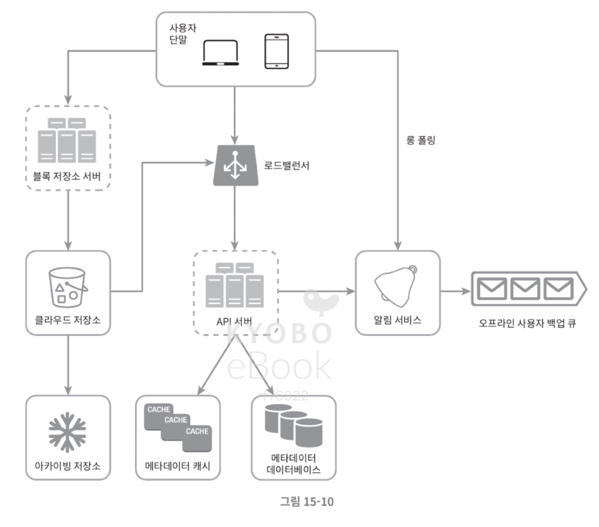
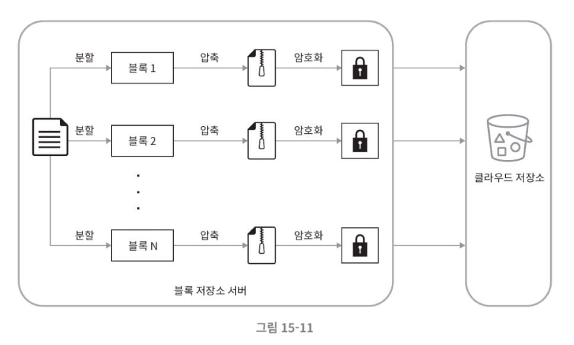
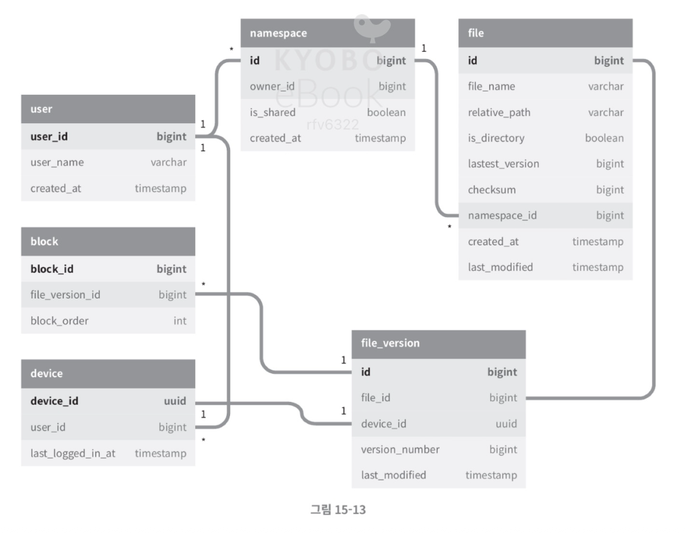
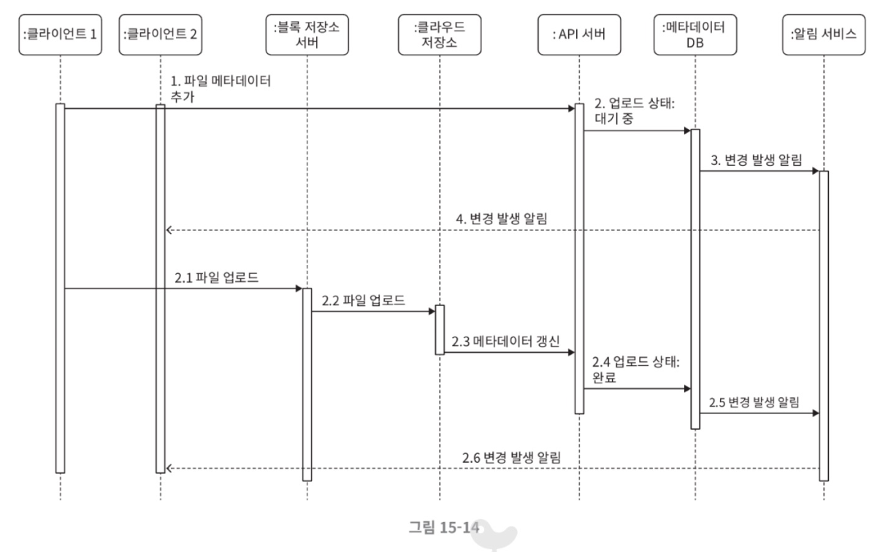
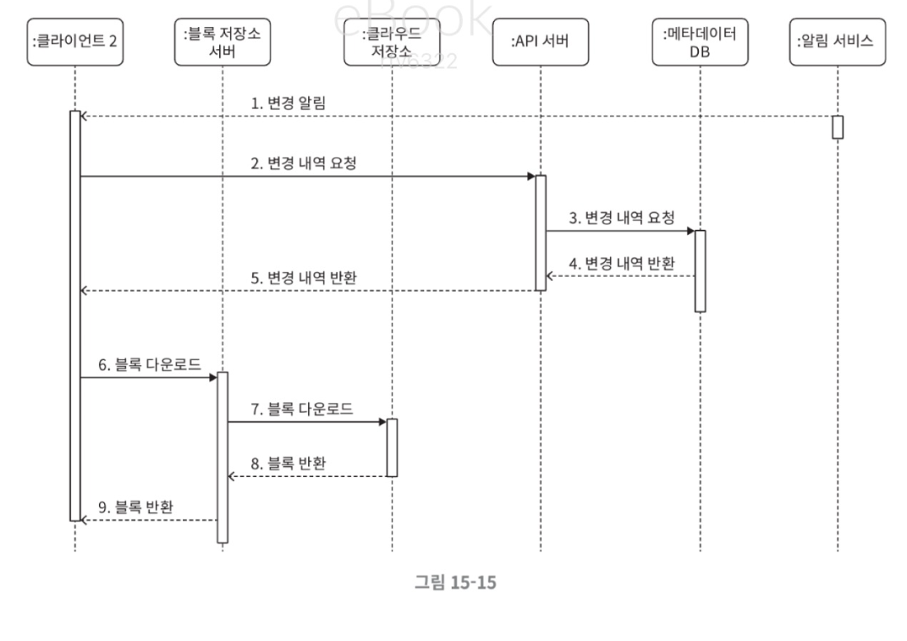

# 15장 구글 드라이브 설계

구글 드라이브와 같은 클라우드 저장소 서비스는 파일 저장, 동기화, 공유가 핵심인 시스템이다. 이번 장에서는 천만 명의 DAU를 수용할 수 있는 안정적이고 효율적인 구글 드라이브 시스템을 설계해 보겠다.

---

# 1. 문제 이해 및 설계 범위

## 1.1 요구사항 확정
| 구분 | 내용 |
| --- | --- |
| **핵심 기능** | 파일 업로드/다운로드, 파일 동기화, 알림(Notification) |
| **지원 클라이언트** | 모바일 앱, 웹 브라우저 |
| **일간 능동 사용자(DAU)** | 1,000만 명 |
| **파일 제한** | 최대 파일 크기 **10GB**, 파일 암호화 필수 |
| **주요 품질** | 데이터 무손실(안정성), 빠른 동기화 속도, 네트워크 대역폭 효율성 |

## 1.2 개략적 규모 추정
*   **가입 사용자**: 5,000만 명
*   **무료 저장 공간**: 사용자당 **10GB**
*   **필요 저장 공간 총량**: $$5,000만 \times 10\text{GB} = 500\text{PB}$$
*   **업로드 API QPS**: 약 240 (최대 480)

---

# 2. 개략적 설계안

시스템은 한 대의 서버에서 시작하여, 점진적으로 메타데이터 데이터베이스와 파일 저장소(S3)를 분리하는 방향으로 확장한다.

## 2.1 주요 컴포넌트
*   **블록 저장소 서버**: 파일을 여러 블록으로 나누어 클라우드 저장소에 업로드한다. 드롭박스 사례를 참고하여 블록 크기는 최대 **4MB**로 설정한다.

*   **메타데이터 DB/캐시**: 사용자, 파일, 블록, 버전 정보를 관리하며 성능을 위해 자주 쓰이는 데이터는 캐싱한다.

*   **알림 서비스**: 파일 변경 시 클라이언트에 실시간으로 알려 동기화를 유도한다(롱 폴링 방식 활용).
*   **아카이빙 저장소**: 사용되지 않는 데이터를 저렴하게 보관하는 Cold Storage(S3 Glacier 등)이다.

---

# 3. 상세 설계 — 효율성 및 일관성

## 3.1 블록 저장소 서버의 최적화
큰 파일이 수정될 때마다 전체를 다시 올리는 것은 비효율적이다. 이를 해결하기 위해 두 가지 전략을 사용한다:
*   **델타 동기화(Delta Sync)**: 수정된 블록만 골라 전송한다.
*   **압축 및 암호화**: 블록 단위로 압축(텍스트는 gzip 등) 후 암호화하여 보안과 대역폭을 동시에 챙긴다.

## 3.2 높은 일관성 유지
파일이 단말마다 다르게 보이면 안 되므로 **강한 일관성(Strong Consistency)** 이 필요하다.
*   **RDBMS 채택**: ACID를 지원하는 관계형 데이터베이스를 사용하여 메타데이터의 일관성을 보장한다.
*   **캐시 무효화**: DB의 원본이 변경되면 캐시 사본을 즉시 무효화한다.

---

# 4. 동기화 및 알림 절차

## 4.1 업로드 및 다운로드 흐름
1.  **업로드**: 파일 메타데이터 전송과 파일 블록 업로드가 병렬로 수행된다. 업로드 완료 후 알림 서비스가 다른 단말에 변경을 통지한다.

2.  **다운로드**: 알림을 받은 클라이언트는 API 서버에서 새 메타데이터를 먼저 가져온 뒤, 필요한 블록들만 블록 서버에서 다운로드하여 파일을 재구성한다.

## 4.2 알림 서비스 (롱 폴링)
웹소켓 대신 **롱 폴링(Long Polling)** 을 선택한다. 구글 드라이브는 채팅처럼 양방향 실시간 통신이 빈번하지 않고, 알림 빈도가 상대적으로 낮기 때문이다.

---

# 5. 저장 공간 절약 및 장애 처리

## 5.1 비용 최적화 전략
*   **중복 제거(De-duplication)**: 해시 값을 비교하여 계정 차원에서 중복 블록을 제거한다.
*   **지능적 백업**: 버전 상한을 두거나(Limit), 의미 있는 편집본만 보관한다.

## 5.2 장애 대응
*   **로드밸런서/API 서버**: 다중화 및 무상태(Stateless) 설계로 장애 시 자동 우회한다.
*   **S3 저장소**: 여러 지역(Region)에 데이터를 복제하여 지역적 장애에도 데이터 손실을 막는다.
*   **알림 서버**: 백만 개 이상의 연결을 관리하므로, 장애 복구 시 백만 명의 사용자가 동시에 재연결을 시도하지 않도록 주의가 필요하다.

---

# 6. 마무리

이번 설계의 핵심은 **메타데이터 관리**와 **파일 동기화**의 분리이다. 블록 단위 처리와 델타 동기화를 통해 네트워크 효율을 극대화하고, S3와 RDBMS를 조합하여 대규모 데이터의 가용성과 일관성을 확보했다.